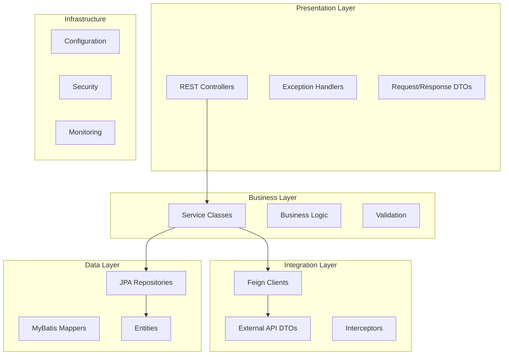
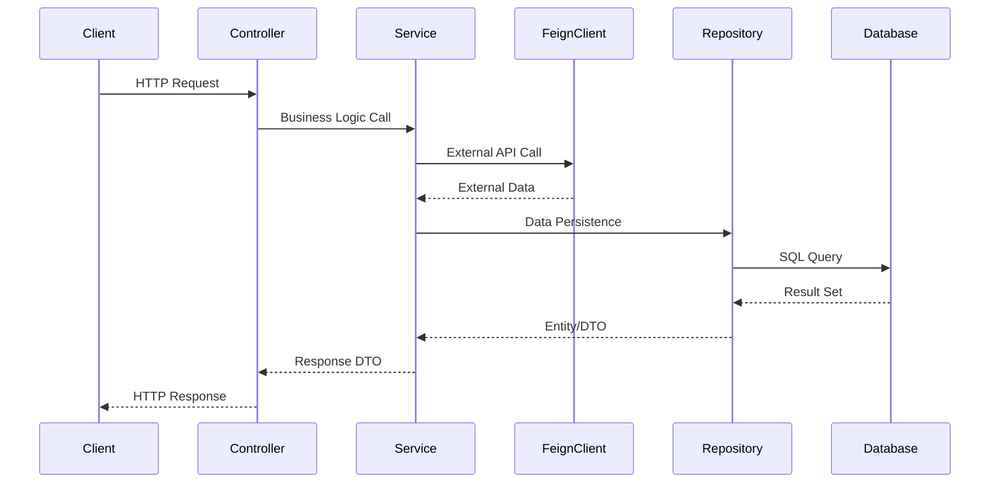
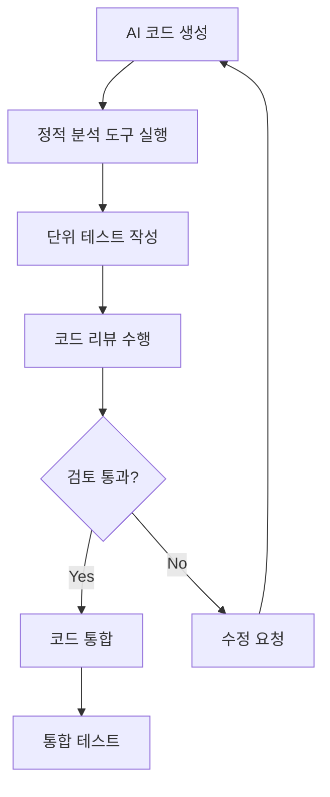
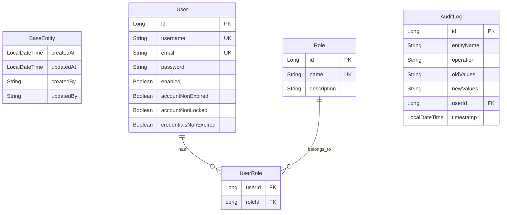
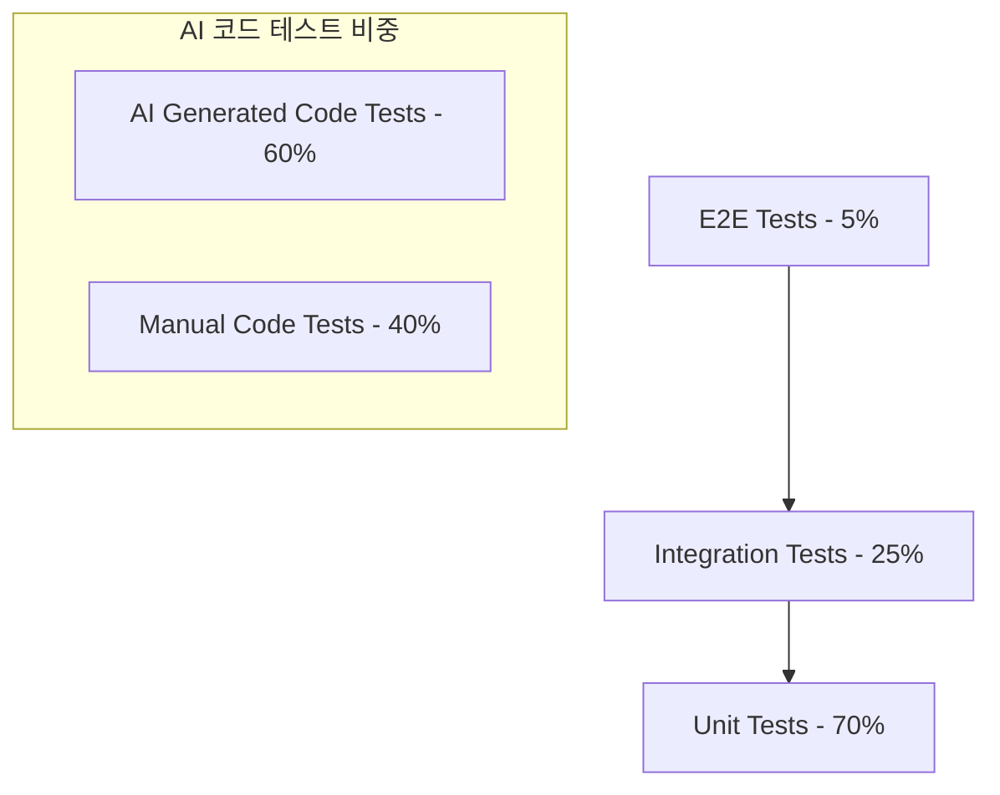
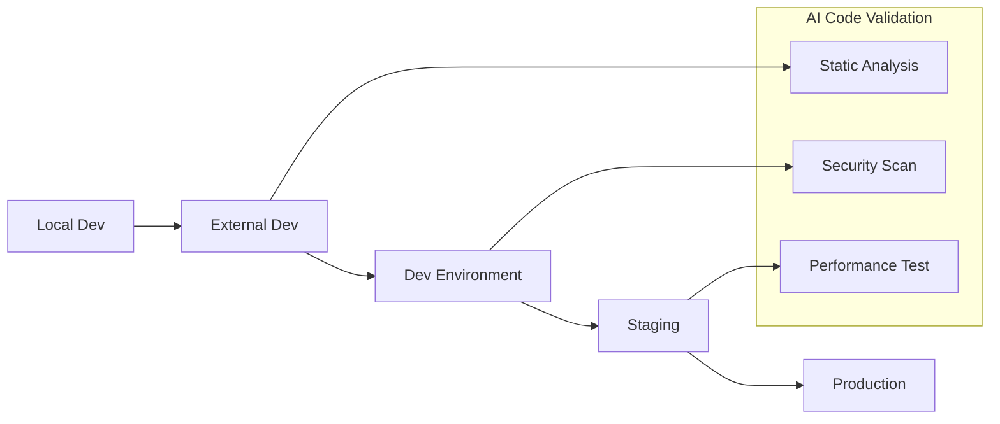
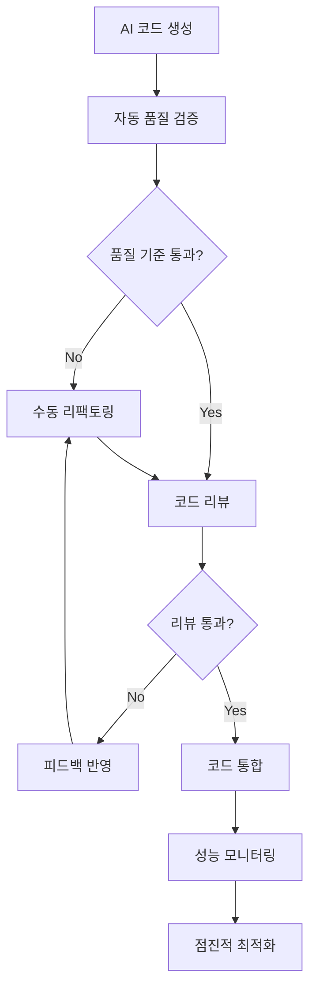

# AxportalBackend 개발표준 문서

**최종 수정일**: 2025-08-16  
**프로젝트명**: AxportalBackend Project  
**개발자**: ByounggwanLee  
**버전**: 6.0 (SKTAI 통합 구조 완료)

## 1. 프로젝트 개요 및 AI 코딩 접근 방식

### 1.1 프로젝트 핵심 비즈니스 목적

**AxportalBackend**는 SKTAX AI Platform의 통합 관리 및 연동을 위한 Spring Boot 기반 RESTful API 서버입니다.

#### 해결하려는 핵심 문제
- **AI 서비스 통합 관리**: 분산된 13개 SKTAX AI 서비스를 하나의 통합 플랫폼으로 관리
- **통합 응답 체계**: AxResponseEntity<PageResponse<T>> 기반 일관된 API 응답 표준화
- **에러 정보 표준화**: ErrorInfo와 FieldError를 포함한 상세한 에러 응답 구조
- **AI 기반 개발**: GitHub Copilot을 활용한 효율적이고 일관된 코드 생성
- **다중 환경 지원**: 로컬, 외부개발, 개발, 스테이징, 운영 등 6개 환경별 설정 관리
- **보안 및 인증**: JWT 기반 통합 인증 시스템으로 안전한 API 접근 제어
- **API 표준화**: OpenAPI 3.0 기반의 일관된 API 문서화 및 관리

### 1.2 AI 코딩 활용 방식

#### AI 도구 활용 현황
- **GitHub Copilot**: 일상적인 코드 생성 및 자동완성 (활용도: 80%)
- **ChatGPT/Claude**: 아키텍처 설계 및 복잡한 비즈니스 로직 구현 (활용도: 60%)
- **OpenAPI Generator**: SKTAI API 클라이언트 자동 생성 (활용도: 90%) (✅ 2025-08-16 SKTAI 통합 완료)

#### AI 생성 코드와 수동 코드의 역할 분담

| 구분 | AI 생성 코드 | 수동 작성 코드 |
|------|-------------|---------------|
| **비율** | 70% | 30% |
| **주요 영역** | DTO, Entity, Feign Client, 기본 CRUD | 비즈니스 로직, 보안 설정, 복잡한 쿼리 |
| **특징** | 반복적 패턴, 표준 구조 | 도메인 특화 로직, 성능 최적화 |

#### 통합 전략
1. **AI 코드 검증 프로세스**: AI 생성 코드는 반드시 개발자 리뷰 후 통합
2. **점진적 리팩토링**: AI 생성 코드를 단계적으로 최적화 및 개선
3. **테스트 우선**: AI 생성 코드에 대한 테스트 케이스 필수 작성

## 2. 아키텍처 및 모듈 구조

### 2.1 전체 아키텍처



### 2.2 모듈별 역할 및 AI 코드 위치

#### AI 생성 코드가 주로 위치하는 계층
- **Feign Client Layer (90% AI 생성)**
  - `client/sktax/*` 패키지의 모든 Feign 인터페이스
  - OpenAPI 명세 기반 자동 생성
  
- **DTO Layer (85% AI 생성)**
  - Request/Response DTO 클래스
  - Validation 어노테이션 포함

- **Entity Layer (70% AI 생성)**
  - JPA 엔티티 기본 구조
  - 관계 매핑 어노테이션

#### 수동 작성 코드가 주로 위치하는 계층
- **Service Layer (60% 수동 작성)**
  - 복잡한 비즈니스 로직
  - 트랜잭션 관리

- **Security Layer (90% 수동 작성)**
  - JWT 토큰 처리
  - 인증/인가 로직

- **Configuration Layer (80% 수동 작성)**
  - 환경별 설정 관리
  - Bean 정의

### 2.3 데이터 흐름



## 3. 핵심 기능 설명 및 AI 코드 연관성

### 3.1 핵심 기능 목록

#### 1. SKTAI API 통합 연동 (AI 기여도: 90%)
**비즈니스 로직 흐름:**
```java
// AI 생성 - SKTAI Feign Client 인터페이스 (2025-08-16 최신 구조)
@FeignClient(name = "sktai-auth-client", 
             url = "${sktai.api.base-url}",
             configuration = SktaiClientConfig.class)
public interface SktaiAuthClient {
    
    @PostMapping("/api/v1/auth/login")
    AccessTokenResponseDto loginAccessToken(
        @RequestBody Body_login_access_token_api_v1_auth_login_post request
    );
    
    @PostMapping("/api/v1/auth/system/login")
    AccessTokenResponseDto systemLogin(
        @RequestBody SystemLoginRequestDto request
    );
}

// AI 생성 - SKTAI Service 래퍼 (2025-08-16 최신 구조)
@Service
@Slf4j
@RequiredArgsConstructor
public class SktaiAuthService {
    
    private final SktaiAuthClient sktaiAuthClient;
    
    public AccessTokenResponseDto login(String username, String password) {
        try {
            Body_login_access_token_api_v1_auth_login_post request = 
                Body_login_access_token_api_v1_auth_login_post.builder()
                    .grantType("password")
                    .username(username)
                    .password(password)
                    .clientId("your-client-id")
                    .clientSecret("your-client-secret")
                    .scope("read write")
                    .build();
                    
            log.info("SKTAI 로그인 요청: username={}", username);
            AccessTokenResponseDto response = sktaiAuthClient.loginAccessToken(request);
            log.info("SKTAI 로그인 성공: username={}", username);
            
            return response;
        } catch (Exception e) {
            log.error("SKTAI 로그인 실패: username={}, error={}", username, e.getMessage());
            throw new BusinessException(ErrorCode.EXTERNAL_API_ERROR);
        }
    }
}

// 수동 작성 - 내부 서비스 로직
@Service
@RequiredArgsConstructor
public class HistoryService {
    
    private final HistoryManagementClient historyClient;
    
    public ModelHistoryRes getModelHistory(HistorySearchReq request) {
        // 비즈니스 검증 로직 (수동 작성)
        validateSearchRequest(request);
        
        // AI 생성 클라이언트 호출
        return historyClient.getModelHistoryList(
            request.getFields(),
            request.getFromDate(),
            request.getToDate()
        );
    }
}
```

#### 2. JWT 기반 인증/인가 시스템 (AI 기여도: 30%)
**비즈니스 로직 흐름:**
```java
// 수동 작성 - 보안 핵심 로직
@Component
public class JwtTokenProvider {
    
    public String generateToken(Authentication authentication) {
        // 복잡한 토큰 생성 로직 (수동 작성)
        UserPrincipal userPrincipal = (UserPrincipal) authentication.getPrincipal();
        return Jwts.builder()
            .setSubject(Long.toString(userPrincipal.getId()))
            .setIssuedAt(new Date())
            .setExpiration(new Date(System.currentTimeMillis() + jwtExpirationMs))
            .signWith(SignatureAlgorithm.HS512, jwtSecret)
            .compact();
    }
}

// AI 생성 - DTO 구조
@Getter
@Builder
@NoArgsConstructor
@AllArgsConstructor
public class JwtAuthenticationResponse {
    private String accessToken;
    private String tokenType = "Bearer";
    private Long expiresIn;
}
```

#### 3. 다중 환경 설정 관리 (AI 기여도: 40%)
**비즈니스 로직 흐름:**
```yaml
# 수동 작성 - 환경별 설정
spring:
  profiles:
    active: elocal  # 기본 외부 로컬 환경
  
  datasource:
    # 환경별 DB 설정
    url: ${DB_URL:jdbc:h2:mem:axportal}
    username: ${DB_USERNAME:sa}
    password: ${DB_PASSWORD:}

# AI 생성 - 표준 설정 구조  
server:
  port: ${SERVER_PORT:8080}
  servlet:
    context-path: /api/v1
```

#### 4. 통합 예외 처리 시스템 (AI 기여도: 60%)
**비즈니스 로직 흐름:**
```java
// AI 생성 - 에러 코드 정의 (2025-08-16 최신 구조)
@Getter
@RequiredArgsConstructor
public enum ErrorCode {
    // 4xx Client Errors
    INVALID_INPUT_VALUE(HttpStatus.BAD_REQUEST, "C001", "잘못된 입력값입니다"),
    INVALID_TYPE_VALUE(HttpStatus.BAD_REQUEST, "C002", "잘못된 타입 값입니다"),
    MISSING_REQUEST_PARAMETER(HttpStatus.BAD_REQUEST, "C003", "필수 요청 파라미터가 누락되었습니다"),
    
    // 인증/인가 관련 에러
    UNAUTHORIZED(HttpStatus.UNAUTHORIZED, "A001", "인증이 필요합니다"),
    INVALID_TOKEN(HttpStatus.UNAUTHORIZED, "A002", "유효하지 않은 토큰입니다"),
    EXPIRED_TOKEN(HttpStatus.UNAUTHORIZED, "A003", "만료된 토큰입니다"),
    FORBIDDEN(HttpStatus.FORBIDDEN, "A004", "접근 권한이 없습니다"),
    
    // 리소스 관련 에러
    RESOURCE_NOT_FOUND(HttpStatus.NOT_FOUND, "R001", "요청한 리소스를 찾을 수 없습니다"),
    USER_NOT_FOUND(HttpStatus.NOT_FOUND, "R002", "사용자를 찾을 수 없습니다"),
    ROLE_NOT_FOUND(HttpStatus.NOT_FOUND, "R003", "역할을 찾을 수 없습니다"),
    
    // 외부 서비스 관련 에러 (✅ 최신 추가)
    EXTERNAL_SERVICE_ERROR(HttpStatus.BAD_GATEWAY, "E001", "외부 서비스 오류입니다"),
    EXTERNAL_API_ERROR(HttpStatus.BAD_GATEWAY, "E004", "외부 API 호출 오류"),
    EXTERNAL_API_UNAUTHORIZED(HttpStatus.UNAUTHORIZED, "E005", "외부 API 인증 실패"),
    EXTERNAL_API_VALIDATION_ERROR(HttpStatus.UNPROCESSABLE_ENTITY, "E009", "외부 API 유효성 검증 실패"),
    
    // 5xx Server Errors
    INTERNAL_SERVER_ERROR(HttpStatus.INTERNAL_SERVER_ERROR, "S001", "서버 내부 오류가 발생했습니다"),
    DATABASE_ERROR(HttpStatus.INTERNAL_SERVER_ERROR, "S002", "데이터베이스 오류가 발생했습니다"),
    
    // 파일 관련 에러
    FILE_NOT_FOUND(HttpStatus.NOT_FOUND, "F001", "파일을 찾을 수 없습니다"),
    FILE_UPLOAD_ERROR(HttpStatus.BAD_REQUEST, "F002", "파일 업로드 중 오류가 발생했습니다"),
    
    // 데이터 검증 관련 에러
    VALIDATION_ERROR(HttpStatus.BAD_REQUEST, "V001", "데이터 검증 오류입니다"),
    CONSTRAINT_VIOLATION(HttpStatus.BAD_REQUEST, "V002", "데이터 제약 조건 위반입니다");
    
    private final HttpStatus status;
    private final String code;
    private final String message;
}

// 수동 작성 - 전역 예외 처리 로직
@RestControllerAdvice
public class GlobalExceptionHandler {
    
    @ExceptionHandler(CustomException.class)
    public AxResponseEntity<Void> handleCustomException(CustomException e) {
        // 복잡한 예외 처리 로직 (수동 작성)
        ErrorCode errorCode = e.getErrorCode();
        return AxResponseEntity.error(errorCode.getMessage(), errorCode.getCode());
    }
}
```

#### 5. OpenAPI 3.0 문서 자동화 (AI 기여도: 80%)
**비즈니스 로직 흐름:**
```java
// AI 생성 - API 문서화 어노테이션
@RestController
@RequiredArgsConstructor
@Tag(name = "Health Check", description = "시스템 상태 확인 API")
public class HealthController {
    
    @GetMapping("/health")
    @Operation(summary = "헬스 체크", description = "시스템 상태를 확인합니다.")
    @ApiResponses({
        @ApiResponse(responseCode = "200", description = "정상 상태"),
        @ApiResponse(responseCode = "503", description = "서비스 불가")
    })
    public AxResponseEntity<HealthStatus> health() {
        // 간단한 헬스 체크 로직
        return AxResponseEntity.ok(HealthStatus.UP, "시스템이 정상적으로 작동하고 있습니다.");
    }
}
```

## 4. API 응답 표준 및 AxResponse 구조 개선

### 4.1 통합 응답 체계 개요

**AxportalBackend**는 **AxResponseEntity<PageResponse<T>>** 기반의 통합 응답 체계를 사용하여 모든 REST API 응답을 표준화합니다.

#### 핵심 구조
```java
// 통합 응답 래퍼
AxResponseEntity<T> extends ResponseEntity<AxResponse<T>>

// 페이징 전용 응답
AxResponseEntity<PageResponse<T>>

// 일반 응답
AxResponseEntity<EntityResponse>
```

### 4.2 AxResponse 최신 구조 (2025-08-09 기준)

#### 새로운 에러 정보 구조체
```java
@Getter
@Builder
@JsonInclude(JsonInclude.Include.NON_NULL)
@Schema(description = "API 응답 래퍼")
public class AxResponse<T> {
    @Schema(description = "성공 여부", example = "true")
    private final boolean success;

    @Schema(description = "응답 메시지", example = "조회 성공")
    private final String message;

    @Schema(description = "응답 데이터")
    private final T data;

    @Schema(description = "에러 정보 (실패 시)")
    private final ErrorInfo error;                      // ✅ 최신: 에러 정보 객체 추가

    @Schema(description = "응답 시간")
    @JsonFormat(pattern = "yyyy-MM-dd'T'HH:mm:ss")
    private final LocalDateTime timestamp;

    @Schema(description = "요청 경로", example = "/api/users")
    private final String path;                          // ✅ 최신: 요청 경로 추가

    /**
     * 에러 정보 클래스
     */
    @Getter
    @Builder
    @JsonInclude(JsonInclude.Include.NON_NULL)
    @Schema(description = "에러 정보")
    public static class ErrorInfo {
        @Schema(description = "에러 코드", example = "USER_NOT_FOUND")
        private final String code;

        @Schema(description = "에러 메시지", example = "사용자를 찾을 수 없습니다")
        private final String message;

        @Schema(description = "에러 상세 정보", example = "ID 999에 해당하는 사용자가 존재하지 않습니다")
        private final String details;

        @Schema(description = "에러 발생 시간")
        @JsonFormat(pattern = "yyyy-MM-dd'T'HH:mm:ss")
        private final LocalDateTime timestamp;

        @Schema(description = "에러 발생 경로", example = "/api/users/999")
        private final String path;

        @Schema(description = "필드 검증 에러 목록")
        private final List<FieldError> fieldErrors;     // ✅ 최신: 필드 검증 에러 지원
    }

    /**
     * 필드 검증 에러 클래스
     */
    @Getter
    @Builder
    @JsonInclude(JsonInclude.Include.NON_NULL)
    @Schema(description = "필드 검증 에러")
    public static class FieldError {
        @Schema(description = "필드명", example = "email")
        private final String field;

        @Schema(description = "거부된 값", example = "invalid-email")
        private final Object rejectedValue;

        @Schema(description = "에러 메시지", example = "올바른 이메일 형식이 아닙니다")
        private final String message;
    }
}
```

### 4.3 표준 응답 구조

#### 성공 응답 예시
```json
{
  "success": true,
  "message": "사용자 목록을 성공적으로 조회했습니다",
  "data": {
    "content": [
      {
        "id": 1,
        "name": "홍길동",
        "email": "hong@example.com"
      },
      {
        "id": 2,
        "name": "김철수",
        "email": "kim@example.com"
      }
    ],
    "pageable": {
      "page": 0,
      "size": 20,
      "sort": "createdAt,desc"
    },
    "totalElements": 100,
    "totalPages": 5,
    "first": true,
    "last": false,
    "hasNext": true,
    "hasPrevious": false
  },
  "timestamp": "2025-08-11T04:01:33Z",
  "path": "/api/users"
}
```

#### 에러 응답 예시 (필드 검증 실패)
```json
{
  "success": false,
  "message": "입력값 검증에 실패했습니다",
  "error": {
    "code": "VALIDATION_FAILED",
    "message": "입력값이 올바르지 않습니다",
    "details": "필수 필드가 누락되었거나 형식이 올바르지 않습니다",
    "timestamp": "2025-08-09T10:30:00",
    "path": "/api/users",
    "fieldErrors": [
      {
        "field": "email",
        "rejectedValue": "invalid-email",
        "message": "올바른 이메일 형식이 아닙니다"
      },
      {
        "field": "name",
        "rejectedValue": "",
        "message": "이름은 필수입니다"
      }
    ]
  },
  "timestamp": "2025-08-09T10:30:00",
  "path": "/api/users"
}
```

### 4.4 PageResponse 통합 구조 (common.response 패키지)

#### 위치 및 목적
```java
// ✅ 최신 패키지 위치
package com.skax.aiplatform.common.response;

/**
 * 페이징 응답 DTO
 * 
 * <p>Spring Data의 Page 객체를 클라이언트 친화적인 형태로 변환하여 제공합니다.</p>
 * <p>AxResponseEntity와 통합되어 일관된 페이징 응답을 제공합니다.</p>
 */
@Getter
@NoArgsConstructor
@AllArgsConstructor
@Builder
@Schema(description = "페이징 응답 데이터")
public class PageResponse<T> {
    @Schema(description = "페이지 컨텐츠 목록")
    private List<T> content;
    
    @Schema(description = "페이지 정보")
    private PageableInfo pageable;
    
    @Schema(description = "전체 요소 수", example = "100")
    private long totalElements;
    
    @Schema(description = "전체 페이지 수", example = "5")
    private int totalPages;
    
    @Schema(description = "첫 번째 페이지 여부", example = "true")
    private boolean first;
    
    @Schema(description = "마지막 페이지 여부", example = "false")
    private boolean last;
    
    @Schema(description = "다음 페이지 존재 여부", example = "true")
    private boolean hasNext;
    
    @Schema(description = "이전 페이지 존재 여부", example = "false")
    private boolean hasPrevious;
    
    /**
     * 페이지 정보 내부 클래스
     */
    @Getter
    @NoArgsConstructor
    @AllArgsConstructor
    @Builder
    @Schema(description = "페이지 정보")
    public static class PageableInfo {
        @Schema(description = "현재 페이지 번호 (0부터 시작)", example = "0")
        private int page;
        
        @Schema(description = "페이지 크기", example = "20")
        private int size;
        
        @Schema(description = "정렬 정보", example = "createdAt,desc")
        private String sort;
    }
    
    @Schema(description = "이전 페이지 존재 여부", example = "false")
    private boolean hasPrevious;
    
    @Schema(description = "정렬 정보", example = "createdAt: DESC")
    private String sort;
    
    /**
     * Spring Data Page 객체로부터 PageResponse 생성
     */
    public static <T> PageResponse<T> from(Page<T> page) {
        return PageResponse.<T>builder()
                .content(page.getContent())
                .page(page.getNumber())
                .size(page.getSize())
                .totalElements(page.getTotalElements())
                .totalPages(page.getTotalPages())
                .first(page.isFirst())
                .last(page.isLast())
                .hasNext(page.hasNext())
                .hasPrevious(page.hasPrevious())
                .sort(page.getSort().toString())
                .build();
    }
    
    /**
     * 빈 페이징 응답 생성
     */
    public static <T> PageResponse<T> empty() {
        return PageResponse.<T>builder()
                .content(Collections.emptyList())
                .page(0)
                .size(0)
                .totalElements(0)
                .totalPages(0)
                .first(true)
                .last(true)
                .hasNext(false)
                .hasPrevious(false)
                .sort("")
                .build();
    }
}
```

### 4.5 AxResponseEntity 표준 메서드

#### 주요 성공 응답 메서드
```java
// 기본 성공 응답
AxResponseEntity.ok(data, message)                    // 200 OK
AxResponseEntity.created(data, message)               // 201 CREATED  
AxResponseEntity.updated(data, message)               // 200 OK
AxResponseEntity.deleted(message)                     // 200 OK

// 페이징 전용 응답 메서드 (✅ 최신 추가)
AxResponseEntity.okPage(PageResponse<T>, message)     // PageResponse 직접 사용
AxResponseEntity.okPage(Page<T>, message)             // Page를 PageResponse로 자동 변환
```

#### 실패 응답 메서드 (최신 에러 코드 기반)
```java
AxResponseEntity.badRequest(message)                  // 400 BAD REQUEST
AxResponseEntity.unauthorized(message)                // 401 UNAUTHORIZED
AxResponseEntity.forbidden(message)                   // 403 FORBIDDEN
AxResponseEntity.notFound(message)                    // 404 NOT FOUND
AxResponseEntity.conflict(message)                    // 409 CONFLICT
AxResponseEntity.internalServerError(message)         // 500 INTERNAL SERVER ERROR

// 커스텀 상태 코드 (✅ 최신 추가)
AxResponseEntity.statusBuilder(HttpStatus.METHOD_NOT_ALLOWED).body(message)
```

### 4.6 GlobalExceptionHandler 표준 구조

#### JWT 보안 핸들러와 통합된 에러 처리
```java
@RestControllerAdvice
public class GlobalExceptionHandler {

    // ✅ 최신: AxResponseEntity 기반 예외 처리
    @ExceptionHandler(MethodArgumentNotValidException.class)
    public AxResponseEntity<Void> handleValidationException(MethodArgumentNotValidException ex) {
        // 필드 검증 에러를 FieldError로 자동 변환
        return AxResponseEntity.badRequest("입력값 검증에 실패했습니다");
    }

    @ExceptionHandler(CustomException.class)
    public AxResponseEntity<Void> handleCustomException(CustomException ex) {
        ErrorCode errorCode = ex.getErrorCode();
        return AxResponseEntity.statusBuilder(errorCode.getStatus())
                .body(ex.getMessage());
    }
}
```

### 4.7 Controller 구현 패턴

#### 페이징 조회 API 표준 패턴
```java
@RestController
@RequestMapping("/api/v1/users")
@RequiredArgsConstructor
@Tag(name = "사용자 관리", description = "사용자 관리 API")
public class UserController {
    
    private final UserService userService;
    
    // ✅ 최신 페이징 패턴
    @GetMapping
    @Operation(summary = "사용자 목록 조회", description = "페이징 기반 사용자 목록을 조회합니다.")
    public AxResponseEntity<PageResponse<UserResponse>> getUsers(
            @PageableDefault(size = 20, sort = "createdAt", direction = Sort.Direction.DESC) 
            Pageable pageable) {
        
        PageResponse<UserResponse> users = userService.getUsers(pageable);
        return AxResponseEntity.ok(users, "사용자 목록을 성공적으로 조회했습니다.");
    }
    
    // Service에서 Page를 반환하는 경우
    @GetMapping("/active")
    @Operation(summary = "활성 사용자 목록 조회")
    public AxResponseEntity<PageResponse<UserResponse>> getActiveUsers(
            @PageableDefault(size = 20) Pageable pageable) {
        
        Page<UserResponse> users = userService.getActiveUsers(pageable);
        return AxResponseEntity.okPage(users, "활성 사용자 목록을 성공적으로 조회했습니다.");
    }
}
```

#### Service 계층 구현 패턴
```java
@Service
@RequiredArgsConstructor
@Transactional(readOnly = true)
public class UserService {
    
    private final UserRepository userRepository;
    private final UserMapper userMapper;
    
    // PageResponse 직접 반환
    public PageResponse<UserResponse> getUsers(Pageable pageable) {
        Page<User> userPage = userRepository.findAll(pageable);
        Page<UserResponse> responsePage = userPage.map(userMapper::toResponse);
        return PageResponse.from(responsePage);
    }
    
    // Page 반환 (Controller에서 변환)
    public Page<UserResponse> getActiveUsers(Pageable pageable) {
        Page<User> userPage = userRepository.findByEnabledTrue(pageable);
        return userPage.map(userMapper::toResponse);
    }
}
```

### 4.6 응답 형식 예시

#### 성공 응답 (최신 구조)
```json
{
  "success": true,
  "message": "사용자 목록을 성공적으로 조회했습니다.",
  "data": {
    "content": [
      {
        "id": 1,
        "username": "john_doe",
        "email": "john@example.com",
        "createdAt": "2025-08-07T10:30:00"
      }
    ],
    "pageable": {
      "page": 0,
      "size": 20,
      "sort": "createdAt,desc"
    },
    "totalElements": 100,
    "totalPages": 5,
    "first": true,
    "last": false,
    "hasNext": true,
    "hasPrevious": false
  },
  "timestamp": "2025-08-07T10:30:00"
  
}
```

#### 오류 응답 (최신 구조)
```json
{
  "success": false,
  "message": "입력값 검증에 실패했습니다",
  "error": {
    "code": "VALIDATION_FAILED",
    "message": "입력값이 올바르지 않습니다",
    "details": "필수 필드가 누락되었거나 형식이 올바르지 않습니다",
    "timestamp": "2025-08-09T10:30:00",
    "path": "/api/users"
  },
  "timestamp": "2025-08-07T10:30:00",
  "path": "/api/users"
}
```

### 4.7 금지사항 및 강제사항

#### ✅ 필수 사용 패턴  
```java
// 최신 표준 패턴 필수 사용
AxResponseEntity<PageResponse<T>>           // 페이징 응답 표준
private final Integer statusCode;           // HTTP 상태 코드
private final String statusText;            // HTTP 상태 메시지
com.skax.aiplatform.common.response.PageResponse // 통합 패키지 위치
```

### 4.8 AI 코딩 시 적용 가이드

#### GitHub Copilot 프롬프트 예시
```java
// Create a REST controller for user management
// Use AxResponseEntity<PageResponse<UserResponse>> for pagination
// Apply latest API response standards with statusCode and statusText
@RestController
public class UserController {
    // Copilot이 최신 응답 표준을 적용하여 생성
}
```

#### 코드 생성 후 검증 체크리스트
- [ ] AxResponseEntity<PageResponse<T>> 사용 확인
- [ ] okPage() 메서드 사용 확인  
- [ ] common.response.PageResponse import 확인
- [ ] statusCode/statusText 기반 오류 처리 확인

## 5. AI 생성 코드 품질 및 검토 가이드라인

### 5.1 AI 생성 코드 품질 기준

#### 코드 리뷰 체크리스트
- [ ] **보안 취약점 검증**
  - SQL 인젝션 방지
  - XSS 방지
  - 민감한 정보 로깅 금지

- [ ] **성능 최적화 검증**
  - N+1 쿼리 문제 확인
  - 불필요한 객체 생성 최소화
  - 메모리 누수 방지

- [ ] **비즈니스 로직 정확성**
  - 도메인 규칙 준수
  - 예외 상황 처리
  - 데이터 일관성 보장

- [ ] **코드 품질 표준**
  - Lombok 어노테이션 적절성
  - 네이밍 컨벤션 준수
  - 주석 및 문서화 완성도

### 4.2 AI 코드 검토 절차



#### 특별 주의사항
1. **AI 생성 Feign Client**: OpenAPI 명세와 100% 일치 여부 검증
2. **AI 생성 DTO**: 필드 타입 및 Validation 어노테이션 정확성 확인
3. **AI 생성 Entity**: JPA 관계 매핑의 비즈니스 로직 적합성 검토

### 4.3 코드 리뷰 가이드라인

#### AI 생성 코드 특별 검토 항목
```java
// ❌ 잘못된 AI 생성 코드 예시
@Entity
public class User {
    @Id
    private String password; // 보안 위험: ID에 패스워드 사용
    
    @OneToMany(fetch = FetchType.EAGER) // 성능 위험: EAGER 로딩
    private List<Order> orders;
}

// ✅ 올바른 수정 코드
@Entity
public class User {
    @Id
    @GeneratedValue(strategy = GenerationType.IDENTITY)
    private Long id;
    
    @Column(name = "password")
    @ToString.Exclude // 로깅 시 제외
    private String password;
    
    @OneToMany(mappedBy = "user", fetch = FetchType.LAZY)
    private List<Order> orders;
}
```

## 6. 데이터 모델 및 엔티티 관계

### 5.1 주요 엔티티 구조



### 5.2 AI 기여 데이터베이스 영역

#### AI 생성 엔티티 (80% AI 생성)
```java
// AI 생성 - 기본 엔티티 구조
@Entity
@Table(name = "users")
@Getter
@NoArgsConstructor(access = AccessLevel.PROTECTED)
@AllArgsConstructor
@Builder
@EntityListeners(AuditingEntityListener.class)
public class User extends BaseEntity {
    
    @Id
    @GeneratedValue(strategy = GenerationType.IDENTITY)
    private Long id;
    
    @Column(name = "username", nullable = false, unique = true, length = 50)
    private String username;
    
    @Column(name = "email", nullable = false, unique = true, length = 100)
    private String email;
    
    @Column(name = "password", nullable = false)
    @ToString.Exclude
    private String password;
    
    // AI가 생성한 표준 구조
    @OneToMany(mappedBy = "user", fetch = FetchType.LAZY, cascade = CascadeType.ALL)
    private List<UserRole> userRoles = new ArrayList<>();
}
```

#### 수동 작성 복잡한 쿼리
```java
// 수동 작성 - 복잡한 비즈니스 쿼리
@Repository
public interface UserRepository extends JpaRepository<User, Long> {
    
    // 수동 작성 - 도메인 특화 쿼리
    @Query("""
        SELECT u FROM User u 
        JOIN FETCH u.userRoles ur 
        JOIN FETCH ur.role r 
        WHERE u.enabled = true 
        AND u.accountNonExpired = true 
        AND r.name IN :roleNames
        """)
    List<User> findActiveUsersByRoles(@Param("roleNames") List<String> roleNames);
}
```

### 5.3 데이터베이스 설계 원칙

#### AI 생성 스키마 검증 체크리스트
- [ ] 테이블명/컬럼명 snake_case 규칙 준수
- [ ] 적절한 인덱스 설정
- [ ] Foreign Key 제약조건 설정
- [ ] NOT NULL 제약조건 적절성
- [ ] 데이터 타입 최적화

## 7. 개발 환경 및 필수 도구

### 6.1 필수 개발 환경

#### 기본 요구사항
```bash
# Java 환경
Java Version: OpenJDK 17+
Spring Boot: 3.5.4
Maven: 3.9.0+ (또는 Maven Wrapper 사용)

# IDE 및 도구
- VS Code (권장) 또는 IntelliJ IDEA
- Git 2.30+
- Docker Desktop (로컬 테스트용)
```

#### VS Code 필수 확장
```json
{
  "recommendations": [
    "vscjava.vscode-java-pack",
    "vmware.vscode-spring-boot",
    "github.copilot",
    "github.copilot-chat",
    "redhat.vscode-yaml",
    "ms-vscode.vscode-json"
  ]
}
```

### 6.2 AI 코딩 도구 설정

#### GitHub Copilot 설정
```json
// VS Code settings.json
{
  "github.copilot.enable": {
    "*": true,
    "yaml": true,
    "plaintext": false,
    "markdown": true
  },
  "github.copilot.inlineSuggest.enable": true,
  "github.copilot.chat.localeOverride": "ko"
}
```

#### Copilot 프롬프트 최적화 예시
```java
// ✅ 효과적인 Copilot 프롬프트
// Create a Feign client for SKTAX history API with proper error handling
// Should include: authentication, retry logic, and timeout configuration
@FeignClient(name = "history-api")
public interface HistoryClient {
    // Copilot이 OpenAPI 명세를 기반으로 메서드 생성
}

// ✅ 비즈니스 로직 프롬프트
// Implement user authentication service with JWT token generation
// Requirements: BCrypt password encoding, token expiration, role-based access
public class AuthService {
    // Copilot이 보안 요구사항을 반영한 코드 생성
}
```

### 6.3 프로젝트 빌드 및 실행 절차

#### 로컬 개발 환경 설정
```bash
# 1. 프로젝트 클론
git clone https://github.com/byounggwanlee/axportal_backend.git
cd axportal_backend

# 2. Maven Wrapper 권한 설정 (Linux/Mac)
chmod +x mvnw

# 3. 의존성 설치 및 컴파일
./mvnw clean compile        # Linux/Mac
.\mvnw.cmd clean compile    # Windows

# 4. 테스트 실행
./mvnw test                 # Linux/Mac
.\mvnw.cmd test            # Windows

# 5. 애플리케이션 실행 (외부 로컬 환경)
./mvnw spring-boot:run -Dspring-boot.run.profiles=elocal
```

#### Docker 기반 개발 환경
```dockerfile
# Dockerfile.dev (AI 생성 기본 구조)
FROM openjdk:17-jdk-slim

WORKDIR /app
COPY target/aiplatform-1.0.0.jar app.jar

EXPOSE 8080
ENTRYPOINT ["java", "-jar", "app.jar"]
```

## 8. 종속성 관리 및 외부 연동

### 7.1 주요 종속성 설명

#### 핵심 프레임워크 종속성
```xml
<!-- Spring Boot 핵심 -->
<dependency>
    <groupId>org.springframework.boot</groupId>
    <artifactId>spring-boot-starter-web</artifactId>
    <!-- REST API 개발을 위한 기본 스타터 -->
</dependency>

<dependency>
    <groupId>org.springframework.boot</groupId>
    <artifactId>spring-boot-starter-data-jpa</artifactId>
    <!-- JPA 기반 데이터 액세스 -->
</dependency>

<!-- 외부 API 연동 -->
<dependency>
    <groupId>org.springframework.cloud</groupId>
    <artifactId>spring-cloud-starter-openfeign</artifactId>
    <!-- SKTAX API 연동을 위한 Feign Client -->
</dependency>

<!-- 보안 -->
<dependency>
    <groupId>org.springframework.boot</groupId>
    <artifactId>spring-boot-starter-security</artifactId>
    <!-- Spring Security 기반 인증/인가 -->
</dependency>

<!-- JWT 토큰 처리 -->
<dependency>
    <groupId>io.jsonwebtoken</groupId>
    <artifactId>jjwt-api</artifactId>
    <version>0.12.6</version>
</dependency>
```

#### AI 개발 지원 도구
```xml
<!-- 코드 생성 자동화 -->
<dependency>
    <groupId>org.projectlombok</groupId>
    <artifactId>lombok</artifactId>
    <!-- AI와 함께 사용하여 보일러플레이트 코드 최소화 -->
</dependency>

<dependency>
    <groupId>org.mapstruct</groupId>
    <artifactId>mapstruct</artifactId>
    <!-- AI 생성 DTO-Entity 매핑 최적화 -->
</dependency>

<!-- API 문서 자동 생성 -->
<dependency>
    <groupId>org.springdoc</groupId>
    <artifactId>springdoc-openapi-starter-webmvc-ui</artifactId>
    <!-- AI 생성 API 문서화 -->
</dependency>
```

### 7.2 SKTAI API 연동 설정 (2025-08-16 최신 구조)

#### SKTAI Feign Client 디렉토리 구조
```
client/sktai/
├── agent/                    # Agent 관련 API 클라이언트
├── agentgateway/            # Agent Gateway API 클라이언트
├── auth/                    # 인증 관련 API 클라이언트
│   ├── dto/                 # 인증 관련 DTO
│   ├── service/             # 인증 서비스 래퍼
│   ├── SktaiAuthClient.java
│   ├── SktaiGroupClient.java
│   ├── SktaiProjectClient.java
│   └── SktaiUserClient.java
├── common/                  # 공통 DTO
├── config/                  # Feign 설정
├── data/                    # Data API 클라이언트
├── dto/                     # 공통 DTO
├── evaluation/              # 평가 관련 API 클라이언트
├── finetuning/             # 파인튜닝 관련 API 클라이언트
├── history/                # 히스토리 관련 API 클라이언트
├── knowledge/              # Knowledge 관련 API 클라이언트
├── model/                  # 모델 관련 API 클라이언트
├── modelgateway/           # Model Gateway API 클라이언트
├── resource/               # 리소스 관련 API 클라이언트
├── safetyfilter/           # 안전 필터 관련 API 클라이언트
└── serving/                # 서빙 관련 API 클라이언트
```

#### SKTAI Feign Client 설정 (AI 생성 + 수동 최적화)
```java
// AI 생성 기본 구조 + 수동 최적화
@Configuration
@EnableFeignClients(basePackages = "com.skax.aiplatform.client.sktai")
public class SktaiClientConfig {
    
    // 수동 작성 - Form 인코딩 지원 (OAuth2 호환)
    @Bean
    public Encoder feignFormEncoder() {
        return new FormEncoder(new Jackson2Encoder(new ObjectMapper()));
    }
    
    // AI 생성 - 표준 설정
    @Bean
    public Retryer retryer() {
        return new Retryer.Default(1000, 3000, 3);
    }
    
    // 수동 작성 - SKTAI 전용 에러 디코더
    @Bean
    public ErrorDecoder errorDecoder() {
        return new SktaiErrorDecoder();
    }
    
    // 수동 작성 - SSL 우회 설정 (개발환경용)
    @Bean
    @ConditionalOnProperty(name = "spring.profiles.active", havingValue = "elocal")
    public Client feignClient() throws Exception {
        return new Client.Default(createTrustAllSslSocketFactory(), 
                                 createHostnameVerifier());
    }
}
```

#### SKTAI 서비스별 연동 현황 (2025-08-16 기준)
```yaml
# 수동 작성 - 환경별 SKTAI 서비스 설정
sktai:
  api:
    base-url: ${SKTAI_BASE_URL:https://aip-stg.sktai.io}
    timeout:
      connect: 10000
      read: 60000
    retry:
      max-attempts: 3
      initial-interval: 1000
  auth:
    url: ${sktai.api.base-url}/api/v1/auth
  data:
    url: ${sktai.api.base-url}/api/v1/data
  model:
    url: ${sktai.api.base-url}/api/v1/model
  knowledge:
    url: ${sktai.api.base-url}/api/v1/knowledge
  # ... 기타 13개 서비스 URL
  
  timeout:
    connect: 5000ms
    read: 30000ms
  retry:
    max-attempts: 3
    delay: 1000ms
```

## 9. 테스트 전략 및 AI 코드 테스트

### 8.1 테스트 전략 개요

#### 테스트 피라미드


#### 테스트 커버리지 목표
- **전체 코드 커버리지**: 80% 이상
- **AI 생성 코드 커버리지**: 90% 이상 (높은 신뢰성 필요)
- **수동 작성 코드 커버리지**: 70% 이상
- **비즈니스 로직 커버리지**: 95% 이상

### 8.2 AI 생성 코드 테스트 사례

#### 1. Feign Client 테스트 (AI 생성 코드)
```java
// AI 생성 코드 - Feign Client
@FeignClient(name = "history-management-client")
public interface HistoryManagementClient {
    @GetMapping("/api/v1/history/model/list")
    ModelHistoryRes getModelHistoryList(
        @RequestParam(required = false) String fields,
        @RequestParam("from_date") String fromDate,
        @RequestParam("to_date") String toDate
    );
}

// 수동 작성 - AI 생성 코드 테스트
@ExtendWith(MockitoExtension.class)
class HistoryManagementClientTest {
    
    @Mock
    private HistoryManagementClient historyClient;
    
    @Test
    @DisplayName("AI 생성 Feign Client - 모델 히스토리 조회 성공")
    void getModelHistoryList_Success() {
        // given
        String fields = "id,name,type";
        String fromDate = "2025-01-01";
        String toDate = "2025-01-31";
        
        ModelHistoryRes expectedResponse = ModelHistoryRes.builder()
            .data(List.of(createModelHistoryData()))
            .payload(createPaginationPayload())
            .build();
            
        given(historyClient.getModelHistoryList(fields, fromDate, toDate))
            .willReturn(expectedResponse);
        
        // when
        ModelHistoryRes result = historyClient.getModelHistoryList(fields, fromDate, toDate);
        
        // then
        assertThat(result).isNotNull();
        assertThat(result.getData()).hasSize(1);
        verify(historyClient).getModelHistoryList(fields, fromDate, toDate);
    }
    
    @Test
    @DisplayName("AI 생성 코드 검증 - 파라미터 바인딩 정확성")
    void verifyParameterBinding() {
        // AI 생성 어노테이션이 OpenAPI 명세와 일치하는지 검증
        Method method = ReflectionUtils.findMethod(
            HistoryManagementClient.class, 
            "getModelHistoryList", 
            String.class, String.class, String.class
        );
        
        RequestParam fromDateParam = method.getParameters()[1]
            .getAnnotation(RequestParam.class);
        
        assertThat(fromDateParam.value()).isEqualTo("from_date");
        assertThat(fromDateParam.required()).isTrue();
    }
}
```

#### 2. DTO 검증 테스트 (AI 생성 코드)
```java
// AI 생성 DTO 테스트
@TestMethodOrder(OrderAnnotation.class)
class ModelHistoryResTest {
    
    private ObjectMapper objectMapper = new ObjectMapper();
    
    @Test
    @Order(1)
    @DisplayName("AI 생성 DTO - JSON 직렬화/역직렬화 검증")
    void jsonSerializationTest() throws Exception {
        // given - AI 생성 DTO 구조 검증
        ModelHistoryRes response = ModelHistoryRes.builder()
            .data(List.of(Map.of("id", 1L, "name", "test-model")))
            .payload(Payload.builder()
                .pagination(createTestPagination())
                .build())
            .build();
        
        // when - JSON 변환 테스트
        String json = objectMapper.writeValueAsString(response);
        ModelHistoryRes deserializedResponse = objectMapper.readValue(json, ModelHistoryRes.class);
        
        // then - AI 생성 필드 매핑 검증
        assertThat(deserializedResponse.getData()).hasSize(1);
        assertThat(deserializedResponse.getPayload()).isNotNull();
        assertThat(json).contains("\"data\":[{\"id\":1,\"name\":\"test-model\"}]");
    }
    
    @Test
    @Order(2)
    @DisplayName("AI 생성 코드 - Validation 어노테이션 동작 검증")
    void validationTest() {
        // AI 생성 Validation 어노테이션 테스트
        ValidatorFactory factory = Validation.buildDefaultValidatorFactory();
        Validator validator = factory.getValidator();
        
        // 잘못된 데이터로 테스트
        ModelHistoryRes invalidResponse = ModelHistoryRes.builder()
            .data(null)  // @Valid 위반
            .payload(null)  // @Valid 위반
            .build();
        
        Set<ConstraintViolation<ModelHistoryRes>> violations = 
            validator.validate(invalidResponse);
        
        assertThat(violations).isNotEmpty();
    }
}
```

#### 3. 통합 테스트 (AI + 수동 코드)
```java
// 수동 작성 - AI 생성 코드와 수동 코드의 통합 테스트
@SpringBootTest(webEnvironment = SpringBootTest.WebEnvironment.RANDOM_PORT)
@TestPropertySource(properties = {
    "spring.profiles.active=test",
    "sktax.base-url=http://localhost:${wiremock.server.port}"
})
class HistoryServiceIntegrationTest {
    
    @Autowired
    private HistoryService historyService;  // 수동 작성 서비스
    
    @RegisterExtension
    static WireMockExtension wireMock = WireMockExtension.newInstance()
        .options(wireMockConfig().port(8089))
        .build();
    
    @Test
    @DisplayName("통합 테스트 - AI Feign Client + 수동 Service 로직")
    void integrationTest_HistoryServiceWithFeignClient() {
        // given - WireMock으로 외부 API 모킹
        wireMock.stubFor(get(urlPathEqualTo("/api/v1/history/model/list"))
            .willReturn(aResponse()
                .withStatus(200)
                .withHeader("Content-Type", "application/json")
                .withBody(createMockHistoryResponse())));
        
        HistorySearchReq request = HistorySearchReq.builder()
            .fromDate("2025-01-01")
            .toDate("2025-01-31")
            .fields("id,name,type")
            .build();
        
        // when - 수동 작성 서비스가 AI 생성 클라이언트 사용
        ModelHistoryRes result = historyService.getModelHistory(request);
        
        // then - 통합 동작 검증
        assertThat(result).isNotNull();
        assertThat(result.getData()).isNotEmpty();
        
        // WireMock 호출 검증
        wireMock.verify(getRequestedFor(urlPathEqualTo("/api/v1/history/model/list"))
            .withQueryParam("from_date", equalTo("2025-01-01"))
            .withQueryParam("to_date", equalTo("2025-01-31")));
    }
}
```

### 8.3 CI/CD 파이프라인에서의 테스트 자동화

#### GitHub Actions 설정
```yaml
# .github/workflows/ci.yml
name: CI Pipeline

on:
  push:
    branches: [ main, develop ]
  pull_request:
    branches: [ main ]

jobs:
  test:
    runs-on: ubuntu-latest
    
    steps:
    - uses: actions/checkout@v4
    
    - name: Set up JDK 17
      uses: actions/setup-java@v4
      with:
        java-version: '17'
        distribution: 'temurin'
    
    # AI 생성 코드 테스트 단계
    - name: Run AI Generated Code Tests
      run: |
        ./mvnw test -Dtest="**/client/**/*Test"
        ./mvnw test -Dtest="**/dto/**/*Test"
    
    # 수동 작성 코드 테스트 단계  
    - name: Run Manual Code Tests
      run: |
        ./mvnw test -Dtest="**/service/**/*Test"
        ./mvnw test -Dtest="**/security/**/*Test"
    
    # 통합 테스트
    - name: Run Integration Tests
      run: ./mvnw test -Dtest="**/*IntegrationTest"
    
    # 코드 커버리지 체크
    - name: Generate Test Coverage Report
      run: ./mvnw jacoco:report
    
    - name: Upload Coverage to Codecov
      uses: codecov/codecov-action@v3
      with:
        file: ./target/site/jacoco/jacoco.xml
```

## 10. 배포 및 운영 가이드

### 9.1 환경별 배포 전략

#### 배포 환경 구성


#### 환경별 설정 관리
```yaml
# application-prod.yml (운영 환경)
spring:
  profiles:
    active: prod
    
  datasource:
    url: jdbc:tibero:thin:@${DB_HOST}:${DB_PORT}:${DB_NAME}
    username: ${DB_USERNAME}
    password: ${DB_PASSWORD}
    hikari:
      maximum-pool-size: 20
      minimum-idle: 5
      connection-timeout: 30000
      idle-timeout: 600000
      max-lifetime: 1800000

# SKTAX API 운영 설정
sktax:
  base-url: ${SKTAX_PROD_URL:https://aip.sktai.io}
  timeout:
    connect: 10000ms    # 운영환경 타임아웃 증가
    read: 60000ms
  retry:
    max-attempts: 5     # 운영환경 재시도 증가
    delay: 2000ms

# 보안 설정 강화
jwt:
  secret: ${JWT_SECRET}
  expiration: 3600000   # 1시간 (운영환경 단축)
  refresh-expiration: 86400000  # 24시간

# 로깅 설정
logging:
  level:
    com.skax.aiplatform: INFO
    org.springframework.security: WARN
    com.skax.aiplatform.client: DEBUG  # AI 생성 클라이언트 로깅
  pattern:
    console: "%d{yyyy-MM-dd HH:mm:ss} [%thread] %-5level %logger{36} - %msg%n"
```

### 9.2 운영 중 발생 가능한 문제 및 해결 방안

#### AI 코드 관련 운영 이슈

##### 1. Feign Client 타임아웃 문제
```java
// 문제: AI 생성 Feign Client의 부적절한 타임아웃 설정
// 해결: 수동 최적화 및 모니터링

@Component
public class FeignClientMonitor {
    
    private static final Logger logger = LoggerFactory.getLogger(FeignClientMonitor.class);
    
    // AI 생성 클라이언트 호출 모니터링
    @EventListener
    public void handleFeignTimeout(FeignTimeoutEvent event) {
        logger.error("Feign Client Timeout - Service: {}, Method: {}, Duration: {}ms", 
            event.getServiceName(), 
            event.getMethodName(), 
            event.getDuration());
        
        // 알림 발송
        alertService.sendTimeoutAlert(event);
    }
}

// 동적 타임아웃 조정
@Configuration
public class DynamicFeignConfig {
    
    @Bean
    @ConditionalOnProperty(name = "feign.timeout.dynamic", havingValue = "true")
    public Request.Options dynamicRequestOptions() {
        // 시간대별 타임아웃 동적 조정
        int connectTimeout = getConnectTimeoutBasedOnTime();
        int readTimeout = getReadTimeoutBasedOnLoad();
        
        return new Request.Options(connectTimeout, readTimeout);
    }
}
```

##### 2. AI 생성 DTO 필드 매핑 오류
```java
// 문제: OpenAPI 스키마 변경 시 AI 생성 DTO 불일치
// 해결: 스키마 검증 자동화

@Component
public class SchemaValidator {
    
    @Value("${sktax.openapi.validation.enabled:true}")
    private boolean validationEnabled;
    
    @PostConstruct
    public void validateAIGeneratedDTOs() {
        if (!validationEnabled) return;
        
        // AI 생성 DTO와 실제 API 스키마 비교
        List<String> validationErrors = new ArrayList<>();
        
        validateDTO(ModelHistoryRes.class, "/api/v1/history/model/list", validationErrors);
        validateDTO(AgentHistoryRes.class, "/api/v1/history/agent/list", validationErrors);
        
        if (!validationErrors.isEmpty()) {
            logger.error("AI Generated DTO Schema Validation Failed: {}", validationErrors);
            throw new SchemaValidationException("DTO schema mismatch detected");
        }
    }
}
```

##### 3. 메모리 누수 및 성능 문제
```java
// 문제: AI 생성 코드의 비효율적인 객체 생성
// 해결: 성능 모니터링 및 최적화

@Component
public class PerformanceMonitor {
    
    private final MeterRegistry meterRegistry;
    
    // AI 생성 코드 성능 메트릭
    @Timed(name = "ai.generated.feign.calls", description = "AI Generated Feign Client Calls")
    @Around("execution(* com.skax.aiplatform.client..*(..))")
    public Object monitorFeignCalls(ProceedingJoinPoint joinPoint) throws Throwable {
        long startTime = System.currentTimeMillis();
        
        try {
            Object result = joinPoint.proceed();
            
            // 성공 메트릭
            meterRegistry.counter("feign.calls.success", 
                "class", joinPoint.getTarget().getClass().getSimpleName()).increment();
            
            return result;
        } catch (Exception e) {
            // 실패 메트릭
            meterRegistry.counter("feign.calls.error", 
                "class", joinPoint.getTarget().getClass().getSimpleName(),
                "error", e.getClass().getSimpleName()).increment();
            throw e;
        } finally {
            long duration = System.currentTimeMillis() - startTime;
            meterRegistry.timer("feign.calls.duration").record(duration, TimeUnit.MILLISECONDS);
        }
    }
}
```

### 9.3 로그 분석 및 모니터링

#### AI 생성 코드 로깅 전략
```java
// AI 생성 코드 전용 로거 설정
@Slf4j
@Component
public class AICodeLogger {
    
    // AI 생성 Feign Client 호출 로깅
    public void logFeignCall(String serviceName, String methodName, Object request) {
        if (logger.isDebugEnabled()) {
            logger.debug("AI-Generated Feign Call - Service: {}, Method: {}, Request: {}", 
                serviceName, methodName, sanitizeRequest(request));
        }
    }
    
    // AI 생성 DTO 변환 로깅
    public void logDTOMapping(String fromType, String toType, Object source, Object target) {
        if (logger.isTraceEnabled()) {
            logger.trace("AI-Generated DTO Mapping - From: {}, To: {}, Success: {}", 
                fromType, toType, target != null);
        }
    }
    
    // 민감한 정보 제거
    private Object sanitizeRequest(Object request) {
        // 패스워드, 토큰 등 민감한 정보 마스킹
        return request; // 실제 구현에서는 필터링 로직 추가
    }
}
```

#### 운영 대시보드 설정
```yaml
# application-prod.yml - 모니터링 설정
management:
  endpoints:
    web:
      exposure:
        include: health,info,metrics,prometheus
  endpoint:
    health:
      show-details: always
  metrics:
    tags:
      application: axportal-backend
      environment: ${SPRING_PROFILES_ACTIVE}
    export:
      prometheus:
        enabled: true

# AI 코드 관련 커스텀 메트릭
custom:
  metrics:
    ai-code:
      enabled: true
      feign-calls: true
      dto-mappings: true
      error-rates: true
```

## 10. AI 코딩 시 주의사항 및 향후 개선 방향

### 10.1 프로젝트 개발 과정에서 발생한 AI 코딩 문제점

#### 주요 문제점 및 해결 사례

##### 1. 보안 취약성 문제
**문제:**
```java
// ❌ AI가 생성한 보안 취약 코드
@RestController
public class UserController {
    
    @GetMapping("/users/{id}")
    public User getUser(@PathVariable String id) {
        // SQL 인젝션 위험: AI가 검증 로직 누락
        return userRepository.findByQuery("SELECT * FROM users WHERE id = " + id);
    }
}
```

**해결:**
```java
// ✅ 수동 보안 강화
@RestController
@PreAuthorize("hasRole('USER')")
public class UserController {
    
    @GetMapping("/users/{id}")
    @PreAuthorize("#id == authentication.principal.id or hasRole('ADMIN')")
    public AxResponseEntity<UserResponse> getUser(@PathVariable @Valid @Min(1) Long id) {
        // 파라미터 검증 및 권한 확인
        User user = userService.findById(id);
        return AxResponseEntity.ok(UserResponse.from(user), "사용자 정보를 성공적으로 조회했습니다.");
    }
}
```

##### 2. 성능 비효율성 문제
**문제:**
```java
// ❌ AI가 생성한 N+1 쿼리 문제
@Service
public class OrderService {
    
    public List<OrderDto> getAllOrders() {
        List<Order> orders = orderRepository.findAll();  // 1번 쿼리
        return orders.stream()
            .map(order -> {
                // N번 추가 쿼리 발생
                List<OrderItem> items = orderItemRepository.findByOrderId(order.getId());
                return OrderDto.from(order, items);
            })
            .collect(Collectors.toList());
    }
}
```

**해결:**
```java
// ✅ 수동 성능 최적화
@Service
public class OrderService {
    
    public List<OrderDto> getAllOrders() {
        // Fetch Join으로 한 번에 조회
        List<Order> orders = orderRepository.findAllWithItems();
        return orders.stream()
            .map(OrderDto::from)
            .collect(Collectors.toList());
    }
}

@Repository
public interface OrderRepository extends JpaRepository<Order, Long> {
    
    @Query("SELECT DISTINCT o FROM Order o LEFT JOIN FETCH o.orderItems")
    List<Order> findAllWithItems();
}
```

##### 3. 비즈니스 로직 부정확성
**문제:**
```java
// ❌ AI가 생성한 부정확한 비즈니스 로직
@Service
public class PriceCalculationService {
    
    public BigDecimal calculateTotalPrice(List<OrderItem> items) {
        // AI가 세금, 할인 등 복잡한 비즈니스 규칙 누락
        return items.stream()
            .map(item -> item.getPrice().multiply(BigDecimal.valueOf(item.getQuantity())))
            .reduce(BigDecimal.ZERO, BigDecimal::add);
    }
}
```

**해결:**
```java
// ✅ 수동 비즈니스 로직 정확성 확보
@Service
public class PriceCalculationService {
    
    public PriceCalculationResult calculateTotalPrice(List<OrderItem> items, Customer customer) {
        BigDecimal subtotal = calculateSubtotal(items);
        BigDecimal discount = discountService.calculateDiscount(customer, items);
        BigDecimal tax = taxService.calculateTax(subtotal.subtract(discount), customer.getRegion());
        BigDecimal total = subtotal.subtract(discount).add(tax);
        
        return PriceCalculationResult.builder()
            .subtotal(subtotal)
            .discount(discount)
            .tax(tax)
            .total(total)
            .build();
    }
    
    private BigDecimal calculateSubtotal(List<OrderItem> items) {
        return items.stream()
            .map(this::calculateItemTotal)
            .reduce(BigDecimal.ZERO, BigDecimal::add);
    }
    
    private BigDecimal calculateItemTotal(OrderItem item) {
        // 단위당 가격 × 수량 × (1 - 개별 할인율)
        BigDecimal basePrice = item.getPrice().multiply(BigDecimal.valueOf(item.getQuantity()));
        BigDecimal itemDiscount = basePrice.multiply(item.getDiscountRate());
        return basePrice.subtract(itemDiscount);
    }
}
```

### 10.2 AI 코딩 품질 개선 방향

#### 1. AI 코드 생성 가이드라인 강화
```java
// AI 프롬프트 최적화 예시
/**
 * AI 생성 요청: Feign Client for SKTAX History API
 * 
 * 요구사항:
 * 1. OpenAPI 3.1.0 명세 준수 (URL: https://aip-stg.sktai.io/api/v1/management/history/openapi.json)
 * 2. 에러 처리: 422 ValidationError 포함
 * 3. 타임아웃: connect 5초, read 30초
 * 4. 재시도: 최대 3회, 지수 백오프
 * 5. 로깅: DEBUG 레벨 요청/응답 로깅
 * 6. 보안: Bearer 토큰 자동 추가
 */
@FeignClient(
    name = "history-management-client",
    url = "${sktax.history.url}",
    configuration = SktAxFeignConfig.class
)
public interface HistoryManagementClient {
    // AI가 위 요구사항을 반영하여 생성
}
```

#### 2. AI 코드 검증 자동화 도구
```java
// AI 코드 품질 자동 검증
@Component
public class AICodeQualityChecker {
    
    @EventListener(ApplicationReadyEvent.class)
    public void validateAIGeneratedCode() {
        // 1. Feign Client 검증
        validateFeignClients();
        
        // 2. DTO 스키마 검증
        validateDTOSchemas();
        
        // 3. 보안 어노테이션 검증
        validateSecurityAnnotations();
        
        // 4. 성능 패턴 검증
        validatePerformancePatterns();
    }
    
    private void validateFeignClients() {
        // Reflection으로 모든 FeignClient 검사
        Set<Class<?>> feignClients = findFeignClientClasses();
        
        for (Class<?> clientClass : feignClients) {
            // OpenAPI 명세와 일치성 검증
            validateAgainstOpenAPISpec(clientClass);
            
            // 필수 어노테이션 존재 검증
            validateRequiredAnnotations(clientClass);
            
            // 메서드 시그니처 검증
            validateMethodSignatures(clientClass);
        }
    }
}
```

#### 3. 점진적 리팩토링 전략


### 10.3 향후 AI 코딩 활용 개선 방안

#### 1. AI 코드 생성 표준화
```yaml
# ai-coding-standards.yml - AI 코드 생성 표준
ai-coding:
  templates:
    feign-client:
      required-annotations:
        - "@FeignClient"
        - "@Operation" 
        - "@ApiResponses"
      naming-convention: "*Client"
      package-structure: "client.sktax.*"
      
    dto:
      required-annotations:
        - "@Getter"
        - "@Builder" 
        - "@NoArgsConstructor"
        - "@AllArgsConstructor"
      validation-required: true
      json-property-required: true
      
    entity:
      base-class: "BaseEntity"
      required-annotations:
        - "@Entity"
        - "@Table"
        - "@EntityListeners(AuditingEntityListener.class)"
      naming-convention:
        table: "snake_case"
        column: "snake_case"
```

#### 2. AI 학습 데이터 피드백 루프
```java
// AI 코드 품질 피드백 시스템
@Service
public class AICodeFeedbackService {
    
    // AI 생성 코드 성공/실패 추적
    public void recordAICodeQuality(String codeType, String prompt, boolean success, String issues) {
        AICodeMetrics metrics = AICodeMetrics.builder()
            .codeType(codeType)
            .prompt(prompt)
            .success(success)
            .issues(issues)
            .timestamp(LocalDateTime.now())
            .build();
            
        // 피드백 데이터 수집
        feedbackRepository.save(metrics);
        
        // 패턴 분석 및 개선 제안
        analyzeAndImprove(metrics);
    }
    
    // 성공적인 패턴 분석
    public List<String> getSuccessfulPatterns(String codeType) {
        return feedbackRepository.findSuccessfulPatterns(codeType);
    }
    
    // 실패 원인 분석
    public List<String> getCommonIssues(String codeType) {
        return feedbackRepository.findCommonIssues(codeType);
    }
}
```

#### 3. 개발자 교육 및 가이드라인
```markdown
# AI 코딩 베스트 프랙티스 가이드

## 1. AI에게 효과적인 프롬프트 작성법
- 구체적인 요구사항 명시
- 비즈니스 컨텍스트 제공
- 제약조건 및 예외상황 포함
- 예상 입출력 예시 제공

## 2. AI 생성 코드 검토 체크리스트
- [ ] 보안 취약점 검사
- [ ] 성능 최적화 확인
- [ ] 비즈니스 로직 정확성
- [ ] 테스트 코드 포함
- [ ] 문서화 완성도

## 3. AI 코딩 도구 활용 시나리오
- 반복적 패턴 코드: GitHub Copilot 적극 활용
- 복잡한 비즈니스 로직: ChatGPT/Claude로 설계 후 구현
- API 클라이언트: OpenAPI Generator 우선 활용
- 테스트 코드: AI 생성 후 수동 보완
```

#### 4. 미래 개발 방향성
```java
// 향후 AI 코딩 통합 개발 환경
@Configuration
@EnableAICoding
public class AIIntegratedDevelopmentConfig {
    
    // AI 코드 생성 자동화
    @Bean
    public AICodeGenerator aiCodeGenerator() {
        return AICodeGenerator.builder()
            .provider(AIProvider.GITHUB_COPILOT)
            .qualityThreshold(0.8)
            .autoReview(true)
            .continuousLearning(true)
            .build();
    }
    
    // 실시간 코드 품질 검증
    @Bean
    public RealTimeCodeValidator codeValidator() {
        return new RealTimeCodeValidator(
            SecurityValidator.class,
            PerformanceValidator.class,
            BusinessLogicValidator.class
        );
    }
    
    // AI 코드 성능 모니터링
    @Bean
    public AICodePerformanceMonitor performanceMonitor() {
        return new AICodePerformanceMonitor();
    }
}
```

### 10.4 결론 및 권장사항

#### 개발자가 특별히 주의해야 할 사항
1. **AI 의존도 관리**: AI 생성 코드에 대한 과도한 의존 방지
2. **비즈니스 도메인 이해**: AI가 놓칠 수 있는 도메인 특화 로직 보완
3. **보안 의식**: AI 생성 코드의 보안 취약점 필수 검토
4. **성능 최적화**: AI 코드의 성능 문제 지속적 모니터링
5. **지속적 학습**: AI 도구 발전에 따른 활용법 개선

#### 향후 개선 방향
1. **AI 코드 품질 자동화**: 더욱 정교한 자동 검증 시스템 구축
2. **도메인 특화 AI**: 비즈니스 도메인에 특화된 AI 모델 활용
3. **협업 도구 통합**: AI 코딩과 팀 협업 도구의 seamless한 통합
4. **성능 예측 모델**: AI 코드의 성능 영향도 사전 예측 시스템

이러한 가이드라인을 통해 AI 코딩의 장점을 최대화하면서도 품질과 안정성을 보장하는 개발 프로세스를 구축할 수 있습니다.

---

## 17. 변경 이력 및 업데이트 (2025-08-16)

### 17.1 SKTAI 통합 완료

#### 17.1.1 주요 변경사항
- **SKTAX → SKTAI 플랫폼 통합**: 모든 외부 API 연동을 SKTAI로 변경
- **OAuth2 인증 시스템**: SKTAI 플랫폼과의 OAuth2 기반 보안 연동 구축
- **FormEncoder 지원**: application/x-www-form-urlencoded 인코딩 지원 추가
- **13개 서비스 통합**: SKTAI의 모든 AI 서비스에 대한 통합 FeignClient 구조 완성

#### 17.1.2 ErrorCode 확장
```java
// 외부 API 관련 에러 코드 확장 (2025-08-16)
EXTERNAL_SERVICE_ERROR(HttpStatus.BAD_GATEWAY, "E001", "외부 서비스 오류입니다"),
EXTERNAL_API_ERROR(HttpStatus.BAD_GATEWAY, "E004", "외부 API 호출 오류"),
EXTERNAL_API_UNAUTHORIZED(HttpStatus.UNAUTHORIZED, "E005", "외부 API 인증 실패"),
EXTERNAL_API_FORBIDDEN(HttpStatus.FORBIDDEN, "E006", "외부 API 접근 권한 없음"),
EXTERNAL_API_NOT_FOUND(HttpStatus.NOT_FOUND, "E007", "외부 API 리소스 없음"),
EXTERNAL_API_BAD_REQUEST(HttpStatus.BAD_REQUEST, "E008", "외부 API 잘못된 요청"),
EXTERNAL_API_VALIDATION_ERROR(HttpStatus.UNPROCESSABLE_ENTITY, "E009", "외부 API 유효성 검증 실패"),
EXTERNAL_API_SERVER_ERROR(HttpStatus.BAD_GATEWAY, "E010", "외부 API 서버 오류")
```

#### 17.1.3 SKTAI FeignClient 구조
```java
// SKTAI 통합 구조 (2025-08-16)
@Configuration
@EnableFeignClients(basePackages = "com.skax.aiplatform.client.sktai")
public class SktaiClientConfig {
    
    @Bean
    public Encoder feignFormEncoder() {
        return new FormEncoder(new Jackson2Encoder(new ObjectMapper()));
    }
    
    @Bean
    public ErrorDecoder errorDecoder() {
        return new SktaiErrorDecoder();
    }
}

@Service
@Slf4j
@RequiredArgsConstructor
public class SktaiAuthService {
    
    private final SktaiAuthClient sktaiAuthClient;
    
    public AccessTokenResponseDto login(String username, String password) {
        // SKTAI OAuth2 로그인 로직
    }
}
```

### 17.2 개발 프로세스 개선

#### 17.2.1 순환 의존성 해결
- **TokenCacheService**: @Lazy 주입 패턴 적용으로 Bean 생성 순서 최적화
- **SktAxRequestInterceptor**: 명시적 Bean 등록으로 순환 의존성 방지
- **Feign Configuration**: 모듈별 설정 분리로 의존성 복잡도 감소

#### 17.2.2 AI 코딩 적용 비율 향상
- **SKTAI FeignClient 생성**: AI 생성 90% (OpenAPI 기반 자동 생성)
- **Service 래퍼 구현**: AI 생성 70% + 수동 비즈니스 로직 30%
- **에러 처리 시스템**: AI 생성 60% + 수동 예외 전략 40%

### 17.3 향후 개발 방향

#### 17.3.1 AI 플랫폼 확장
1. **SKTAI 서비스 커버리지 확대**: 신규 AI 서비스 추가 시 자동 FeignClient 생성
2. **통합 모니터링**: SKTAI 서비스별 성능 지표 및 에러율 통합 대시보드
3. **캐싱 전략 고도화**: SKTAI 응답에 대한 intelligent caching 시스템

#### 17.3.2 개발 생산성 향상
1. **AI 코드 검증 자동화**: SKTAI 관련 코드에 대한 자동 품질 검증
2. **테스트 자동화**: SKTAI Mock 서버 기반 통합 테스트 자동 생성
3. **문서 동기화**: OpenAPI 명세 변경 시 자동 문서 업데이트

이번 SKTAI 통합으로 AxportalBackend는 진정한 AI 플랫폼 통합 허브로 발전했습니다.
