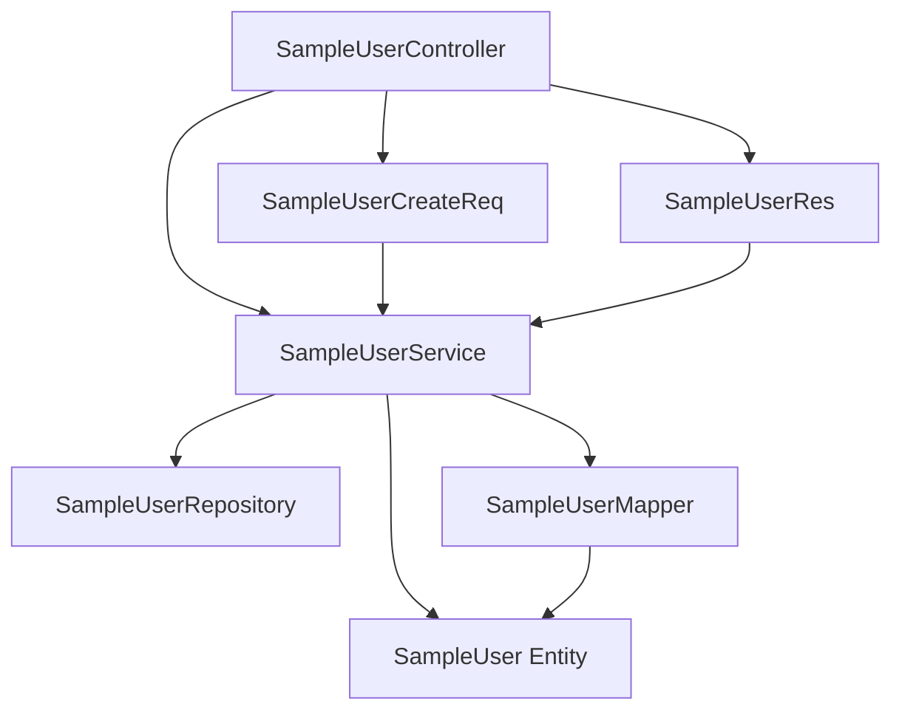
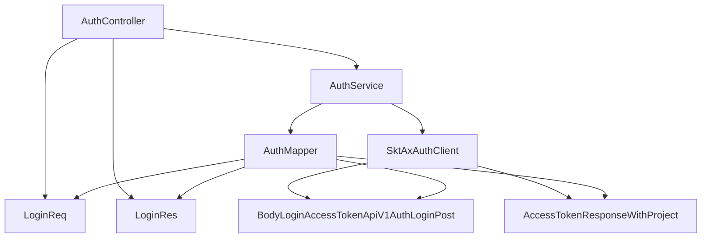

# 명명규칙 가이드

**최종 수정일**: 2025-08-16  
**프로젝트명**: AxportalBackend Project  
**개발자**: ByounggwanLee  
**버전**: 6.0 (SKTAI 통합 구조 완료)

## 목차
1. [개요](#1-개요)
2. [Rest Controller 명명규칙](#2-rest-controller-명명규칙)
   - 2.1. [Controller 클래스 명명](#21-controller-클래스-명명)
   - 2.2. [HTTP Method 매핑](#22-http-method-매핑)
   - 2.3. [GET 메서드 상세 규칙](#23-get-메서드-상세-규칙)
   - 2.4. [POST 메서드 규칙](#24-post-메서드-규칙)
   - 2.5. [PUT/PATCH 메서드 규칙](#25-putpatch-메서드-규칙)
   - 2.6. [DELETE 메서드 규칙](#26-delete-메서드-규칙)
3. [API 응답 표준 명명규칙](#3-api-응답-표준-명명규칙)
   - 3.1. [AxResponseEntity 사용 규칙](#31-axresponseentity-사용-규칙)
   - 3.2. [PageResponse 명명 표준](#32-pageresponse-명명-표준)
   - 3.3. [에러 응답 명명 규칙](#33-에러-응답-명명-규칙)
4. [아키텍처별 명명규칙 관계](#4-아키텍처별-명명규칙-관계)
   - 4.1. [Controller ↔ DTO ↔ Service ↔ Entity ↔ Repository](#41-controller--dto--service--entity--repository)
   - 4.2. [Controller ↔ DTO ↔ Service ↔ Feign DTO ↔ FeignClient](#42-controller--dto--service--feign-dto--feignclient)
5. [업무그룹별 디렉토리 구조](#5-업무그룹별-디렉토리-구조)
   - 5.1. [내부 비즈니스 로직](#51-내부-비즈니스-로직)
   - 5.2. [외부 연동 (FeignClient)](#52-외부-연동-feignclient)
6. [DTO 명명규칙](#6-dto-명명규칙)
   - 6.1. [내부 DTO](#61-내부-dto)
   - 6.2. [FeignClient DTO](#62-feignclient-dto)
7. [좋은 예시 vs 나쁜 예시](#7-좋은-예시-vs-나쁜-예시)
8. [실제 프로젝트 적용 사례](#8-실제-프로젝트-적용-사례)

---

## 1. 개요

본 명명규칙은 **AxportalBackend** 프로젝트의 일관성 있는 코드 작성을 위한 가이드라인입니다.
Spring Boot 3.5.4 기반의 RESTful API 개발에서 **AxResponseEntity<PageResponse<T>>** 통합 응답 체계와
**ErrorInfo/FieldError 구조**를 포함한 표준화된 에러 응답을 사용하여
Controller, Service, Repository, Entity, DTO, FeignClient 간의 명명 일관성을 확보하여 
코드 가독성과 유지보수성을 향상시키는 것을 목표로 합니다.

### 핵심 원칙
- **일관성**: 동일한 패턴과 규칙 적용
- **명확성**: 의도가 명확히 드러나는 네이밍
- **확장성**: 새로운 기능 추가 시 유연한 구조
- **표준화**: 팀 내 공통 규칙 준수
- **응답 표준화**: AxResponseEntity<PageResponse<T>> 기반 일관된 API 응답 (✅ 최신 추가)
- **에러 표준화**: ErrorInfo와 FieldError를 활용한 상세한 에러 정보 제공 (✅ 최신 추가)

---

## 2. Rest Controller 명명규칙

### 2.1. Controller 클래스 명명

#### 기본 규칙
```java
// ✅ 좋은 예시
[업무그룹][도메인명]Controller

// 실제 예시 (PageResponse 통합 반영)
public class SampleUserController        // 샘플 사용자 관리
public class AuthController             // 인증 관리
public class HealthController           // 헬스체크
```

#### 업무그룹별 Controller 명명
```java
// ✅ 내부 비즈니스 로직
public class UserController             // 사용자 관리
public class OrderController            // 주문 관리
public class ProductController          // 상품 관리

// ✅ 관리 기능
public class UserManagementController   // 사용자 관리 기능
public class SystemManagementController // 시스템 관리 기능

// ❌ 나쁜 예시
public class UserCtrl                   // 축약형 사용 금지
public class Users                      // Controller 접미사 누락
public class UserAPI                    // API 접미사 사용 금지
```

### 2.2. HTTP Method 매핑

#### RequestMapping 기본 구조
```java
@RestController
@RequestMapping("/api/v1/[업무그룹]/[리소스명]")
public class SampleUserController {
    
    // ✅ 표준 패턴
    @GetMapping                         // 전체 목록 조회
    @GetMapping("/{id}")               // 단건 조회
    @PostMapping                       // 생성
    @PutMapping("/{id}")              // 전체 수정
    @PatchMapping("/{id}")            // 부분 수정
    @DeleteMapping("/{id}")           // 삭제
}
```

### 2.3. GET 메서드 상세 규칙

#### 2.3.1. 전체 목록 조회
```java
// ✅ 기본 전체 조회 (페이징)
@GetMapping
public AxResponseEntity<PageResponse<SampleUserRes>> getAllUsers(
    @PageableDefault(size = 20, sort = "createdAt", direction = Sort.Direction.DESC) 
    Pageable pageable) {
    
    Page<SampleUserRes> users = sampleUserService.getAllUsers(pageable);
    return AxResponseEntity.ok(users, "사용자 목록을 성공적으로 조회했습니다.");
}

// ✅ 전체 조회 (리스트)
@GetMapping("/list")
public AxResponseEntity<List<SampleUserRes>> getAllUsersList() {
    List<SampleUserRes> users = sampleUserService.getAllUsersList();
    return AxResponseEntity.ok(users, "사용자 목록을 성공적으로 조회했습니다.");
}
```

#### 2.3.2. 단건 조회
```java
// ✅ ID로 단건 조회
@GetMapping("/{id}")
public AxResponseEntity<SampleUserRes> getUserById(@PathVariable Long id) {
    SampleUserRes user = sampleUserService.getUserById(id);
    return AxResponseEntity.ok(user, "사용자 정보를 성공적으로 조회했습니다.");
}

// ✅ 자연키로 단건 조회
@GetMapping("/username/{username}")
public AxResponseEntity<SampleUserRes> getUserByUsername(@PathVariable String username) {
    SampleUserRes user = sampleUserService.getUserByUsername(username);
    return AxResponseEntity.ok(user, "사용자 정보를 성공적으로 조회했습니다.");
}

// ✅ 이메일로 단건 조회
@GetMapping("/email/{email}")
public AxResponseEntity<SampleUserRes> getUserByEmail(@PathVariable String email) {
    SampleUserRes user = sampleUserService.getUserByEmail(email);
    return AxResponseEntity.ok(user, "사용자 정보를 성공적으로 조회했습니다.");
}
```

#### 2.3.3. 단수 조건 검색
```java
// ✅ 상태별 조회
@GetMapping("/status/{status}")
public AxResponseEntity<PageResponse<SampleUserRes>> getUsersByStatus(
    @PathVariable SampleUser.UserStatus status,
    Pageable pageable) {
    
    Page<SampleUserRes> users = sampleUserService.getUsersByStatus(status, pageable);
    return AxResponseEntity.ok(users, "상태별 사용자 목록을 성공적으로 조회했습니다.");
}

// ✅ 역할별 조회
@GetMapping("/role/{role}")
public AxResponseEntity<PageResponse<SampleUserRes>> getUsersByRole(
    @PathVariable String role,
    Pageable pageable) {
    
    Page<SampleUserRes> users = sampleUserService.getUsersByRole(role, pageable);
    return AxResponseEntity.ok(users, "역할별 사용자 목록을 성공적으로 조회했습니다.");
}

// ✅ 날짜 범위 조회
@GetMapping("/created-date")
public AxResponseEntity<Page<SampleUserRes>> getUsersByCreatedDate(
    @RequestParam @DateTimeFormat(iso = DateTimeFormat.ISO.DATE) LocalDate startDate,
    @RequestParam @DateTimeFormat(iso = DateTimeFormat.ISO.DATE) LocalDate endDate,
    Pageable pageable) {
    
    Page<SampleUserRes> users = sampleUserService.getUsersByCreatedDateBetween(startDate, endDate, pageable);
    return AxResponseEntity.ok(users, "날짜별 사용자 목록을 성공적으로 조회했습니다.");
}
```

#### 2.3.4. 복수 조건 검색
```java
// ✅ 복합 검색 (QueryParam 방식)
@GetMapping("/search")
public AxResponseEntity<Page<SampleUserRes>> searchUsers(
    @RequestParam(required = false) String username,
    @RequestParam(required = false) String email,
    @RequestParam(required = false) SampleUser.UserStatus status,
    @RequestParam(required = false) @DateTimeFormat(iso = DateTimeFormat.ISO.DATE) LocalDate startDate,
    @RequestParam(required = false) @DateTimeFormat(iso = DateTimeFormat.ISO.DATE) LocalDate endDate,
    Pageable pageable) {
    
    Page<SampleUserRes> users = sampleUserService.searchUsers(username, email, status, startDate, endDate, pageable);
    return AxResponseEntity.ok(users, "검색 결과를 성공적으로 조회했습니다.");
}

// ✅ 복합 검색 (RequestBody 방식 - 복잡한 조건)
@PostMapping("/search")
public AxResponseEntity<PageResponse<SampleUserRes>> searchUsersAdvanced(
    @Valid @RequestBody SampleUserSearchReq searchReq,
    Pageable pageable) {
    
    Page<SampleUserRes> users = sampleUserService.searchUsersAdvanced(searchReq, pageable);
    return AxResponseEntity.ok(users, "고급 검색 결과를 성공적으로 조회했습니다.");
}

// ✅ 키워드 검색
@GetMapping("/keyword")
public AxResponseEntity<PageResponse<SampleUserRes>> searchUsersByKeyword(
    @RequestParam String keyword,
    Pageable pageable) {
    
    Page<SampleUserRes> users = sampleUserService.searchUsersByKeyword(keyword, pageable);
    return AxResponseEntity.ok(users, "키워드 검색 결과를 성공적으로 조회했습니다.");
}
```

#### 2.3.5. 통계 및 집계 조회
```java
// ✅ 개수 조회
@GetMapping("/count")
public AxResponseEntity<Long> getUserCount() {
    Long count = sampleUserService.getUserCount();
    return AxResponseEntity.ok(count, "사용자 개수를 성공적으로 조회했습니다.");
}

// ✅ 상태별 통계
@GetMapping("/statistics/status")
public AxResponseEntity<Map<String, Long>> getUserStatisticsByStatus() {
    Map<String, Long> statistics = sampleUserService.getUserStatisticsByStatus();
    return AxResponseEntity.ok(statistics, "상태별 통계를 성공적으로 조회했습니다.");
}

// ✅ 존재 여부 확인
@GetMapping("/exists/username/{username}")
public AxResponseEntity<Boolean> existsByUsername(@PathVariable String username) {
    Boolean exists = sampleUserService.existsByUsername(username);
    return AxResponseEntity.ok(exists, "사용자명 존재 여부를 성공적으로 확인했습니다.");
}
```

### 2.4. POST 메서드 규칙

#### 2.4.1. 기본 생성
```java
// ✅ 단건 생성
@PostMapping
public AxResponseEntity<SampleUserRes> createUser(
    @Valid @RequestBody SampleUserCreateReq request) {
    
    SampleUserRes user = sampleUserService.createUser(request);
    return AxResponseEntity.created(user, "사용자가 성공적으로 생성되었습니다.");
}

// ✅ 배치 생성
@PostMapping("/batch")
public AxResponseEntity<List<SampleUserRes>> createUsers(
    @Valid @RequestBody List<SampleUserCreateReq> requests) {
    
    List<SampleUserRes> users = sampleUserService.createUsers(requests);
    return AxResponseEntity.created(users, "사용자들이 성공적으로 생성되었습니다.");
}
```

#### 2.4.2. 특수 액션
```java
// ✅ 사용자 활성화
@PostMapping("/{id}/activate")
public AxResponseEntity<SampleUserRes> activateUser(@PathVariable Long id) {
    SampleUserRes user = sampleUserService.activateUser(id);
    return AxResponseEntity.ok(user, "사용자가 활성화되었습니다.");
}

// ✅ 비밀번호 재설정
@PostMapping("/{id}/reset-password")
public AxResponseEntity<Void> resetPassword(@PathVariable Long id) {
    sampleUserService.resetPassword(id);
    return AxResponseEntity.ok(null, "비밀번호가 재설정되었습니다.");
}

// ✅ 복합 검색 (GET으로 처리하기 어려운 복잡한 조건)
@PostMapping("/search")
public AxResponseEntity<PageReponse<SampleUserRes>> searchUsers(
    @Valid @RequestBody SampleUserSearchReq searchReq,
    Pageable pageable) {
    
    Page<SampleUserRes> users = sampleUserService.searchUsers(searchReq, pageable);
    return AxResponseEntity.ok(users, "검색 결과를 성공적으로 조회했습니다.");
}
```

### 2.5. PUT/PATCH 메서드 규칙

#### 2.5.1. PUT (전체 수정)
```java
// ✅ 전체 필드 수정
@PutMapping("/{id}")
public AxResponseEntity<SampleUserRes> updateUser(
    @PathVariable Long id,
    @Valid @RequestBody SampleUserUpdateReq request) {
    
    SampleUserRes user = sampleUserService.updateUser(id, request);
    return AxResponseEntity.updated(user, "사용자 정보가 수정되었습니다.");
}

// ✅ 전체 교체
@PutMapping("/{id}/replace")
public AxResponseEntity<SampleUserRes> replaceUser(
    @PathVariable Long id,
    @Valid @RequestBody SampleUserCreateReq request) {
    
    SampleUserRes user = sampleUserService.replaceUser(id, request);
    return AxResponseEntity.updated(user, "사용자 정보가 교체되었습니다.");
}
```

#### 2.5.2. PATCH (부분 수정)
```java
// ✅ 특정 필드만 수정
@PatchMapping("/{id}")
public AxResponseEntity<SampleUserRes> patchUser(
    @PathVariable Long id,
    @Valid @RequestBody SampleUserPatchReq request) {
    
    SampleUserRes user = sampleUserService.patchUser(id, request);
    return AxResponseEntity.updated(user, "사용자 정보가 부분 수정되었습니다.");
}

// ✅ 상태 변경
@PatchMapping("/{id}/status")
public AxResponseEntity<SampleUserRes> updateUserStatus(
    @PathVariable Long id,
    @RequestParam SampleUser.UserStatus status) {
    
    SampleUserRes user = sampleUserService.updateUserStatus(id, status);
    return AxResponseEntity.updated(user, "사용자 상태가 변경되었습니다.");
}

// ✅ 이메일 변경
@PatchMapping("/{id}/email")
public AxResponseEntity<SampleUserRes> updateUserEmail(
    @PathVariable Long id,
    @Valid @RequestBody SampleUserEmailUpdateReq request) {
    
    SampleUserRes user = sampleUserService.updateUserEmail(id, request);
    return AxResponseEntity.updated(user, "이메일이 변경되었습니다.");
}
```

### 2.6. DELETE 메서드 규칙

#### 2.6.1. 기본 삭제
```java
// ✅ 단건 삭제
@DeleteMapping("/{id}")
public AxResponseEntity<Void> deleteUser(@PathVariable Long id) {
    sampleUserService.deleteUser(id);
    return AxResponseEntity.deleted("사용자가 삭제되었습니다.");
}

// ✅ 논리 삭제
@DeleteMapping("/{id}/soft")
public AxResponseEntity<Void> softDeleteUser(@PathVariable Long id) {
    sampleUserService.softDeleteUser(id);
    return AxResponseEntity.ok(null, "사용자가 비활성화되었습니다.");
}
```

#### 2.6.2. 배치 삭제
```java
// ✅ 여러 ID로 삭제
@DeleteMapping("/batch")
public AxResponseEntity<Void> deleteUsers(@RequestBody List<Long> ids) {
    sampleUserService.deleteUsers(ids);
    return AxResponseEntity.deleted("선택된 사용자들이 삭제되었습니다.");
}

// ✅ 조건부 삭제
@DeleteMapping("/inactive")
public AxResponseEntity<Integer> deleteInactiveUsers() {
    int deletedCount = sampleUserService.deleteInactiveUsers();
    return AxResponseEntity.deleted(deletedCount, 
        String.format("%d명의 비활성 사용자가 삭제되었습니다.", deletedCount));
}
```

---

## 3. API 응답 표준 명명규칙

### 3.1. AxResponseEntity 사용 규칙

#### 기본 명명 패턴
```java
// ✅ 표준 메서드 시그니처 (PageResponse 사용)
public AxResponseEntity<PageResponse<SampleUserRes>> getAllUsers(Pageable pageable)
public AxResponseEntity<PageResponse<SampleUserRes>> getUsersByStatus(UserStatus status, Pageable pageable)
public AxResponseEntity<PageResponse<SampleUserRes>> searchUsers(SearchCriteria criteria, Pageable pageable)

// ✅ 단건 조회 메서드 시그니처
public AxResponseEntity<SampleUserRes> getUserById(Long id)
public AxResponseEntity<SampleUserRes> getUserByUsername(String username)

// ✅ 생성/수정/삭제 메서드 시그니처
public AxResponseEntity<SampleUserRes> createUser(SampleUserCreateReq request)
public AxResponseEntity<SampleUserRes> updateUser(Long id, SampleUserUpdateReq request)
public AxResponseEntity<Void> deleteUser(Long id)
```

#### 반환 타입 명명 원칙
```java
// ✅ 페이징 조회: PageResponse<T> 필수 사용
AxResponseEntity<PageResponse<UserResponse>>        // 페이징 목록
AxResponseEntity<PageResponse<OrderResponse>>       // 주문 페이징 목록

// ✅ 단건 조회: Entity Response DTO
AxResponseEntity<UserResponse>                      // 단건 사용자
AxResponseEntity<OrderResponse>                     // 단건 주문

// ✅ 생성/수정: 생성된/수정된 Entity Response DTO
AxResponseEntity<UserResponse>                      // 생성된 사용자 반환
AxResponseEntity<OrderResponse>                     // 수정된 주문 반환

// ✅ 삭제/액션: Void 또는 결과 DTO
AxResponseEntity<Void>                              // 삭제 완료
AxResponseEntity<ActionResultResponse>              // 액션 결과
```

### 3.2. PageResponse 명명 표준

#### 패키지 및 Import 규칙
```java
// ✅ 필수 사용 패키지 (통합 완료)
import com.skax.aiplatform.common.response.PageResponse;
import com.skax.aiplatform.common.response.AxResponseEntity;

// ❌ 사용 금지 (구버전)
import com.skax.aiplatform.dto.common.PageResponse;           // 삭제된 패키지
import org.springframework.data.domain.Page;                  // 직접 반환 금지
```

#### Controller 메서드 명명 패턴
```java
// ✅ 페이징 조회 메서드 명명 표준
@GetMapping
public AxResponseEntity<PageResponse<SampleUserRes>> getAllUsers(Pageable pageable) {
    PageResponse<SampleUserRes> users = sampleUserService.getAllUsers(pageable);
    return AxResponseEntity.ok(users, "사용자 목록을 성공적으로 조회했습니다.");
}

@GetMapping("/active")
public AxResponseEntity<PageResponse<SampleUserRes>> getActiveUsers(Pageable pageable) {
    Page<SampleUserRes> userPage = sampleUserService.getActiveUsers(pageable);
    return AxResponseEntity.okPage(userPage, "활성 사용자 목록을 성공적으로 조회했습니다.");
}

@GetMapping("/search")
public AxResponseEntity<PageResponse<SampleUserRes>> searchUsers(
        @RequestParam(required = false) String keyword,
        Pageable pageable) {
    PageResponse<SampleUserRes> users = sampleUserService.searchUsers(keyword, pageable);
    return AxResponseEntity.ok(users, "검색 결과를 성공적으로 조회했습니다.");
}
```

#### Service 메서드 반환 타입 명명
```java
// ✅ Service 계층 메서드 명명 (두 가지 패턴 모두 허용)

// 패턴 1: PageResponse 직접 반환
public PageResponse<SampleUserRes> getAllUsers(Pageable pageable) {
    Page<SampleUser> userPage = sampleUserRepository.findAll(pageable);
    Page<SampleUserRes> responsePage = userPage.map(SampleUserRes::from);
    return PageResponse.from(responsePage);
}

// 패턴 2: Page 반환 (Controller에서 변환)
public Page<SampleUserRes> getActiveUsers(Pageable pageable) {
    Page<SampleUser> userPage = sampleUserRepository.findByEnabledTrue(pageable);
    return userPage.map(SampleUserRes::from);
}
```

#### 메시지 명명 표준
```java
// ✅ 성공 메시지 명명 패턴
"[도메인명] [작업결과]를 성공적으로 [동작]했습니다."

// 실제 예시
"사용자 목록을 성공적으로 조회했습니다."
"활성 사용자 목록을 성공적으로 조회했습니다." 
"검색 결과를 성공적으로 조회했습니다."
"사용자 정보를 성공적으로 생성했습니다."
"사용자 정보를 성공적으로 수정했습니다."
"사용자 정보를 성공적으로 삭제했습니다."
```

#### 금지사항
```java
// ❌ 사용 금지 패턴
AxResponseEntity<Page<SampleUserRes>>               // PageResponse 사용 필수
AxResponseEntity<List<SampleUserRes>>               // 페이징 없는 목록은 별도 케이스
return ResponseEntity.ok(...)                       // AxResponseEntity 사용 필수

// ❌ 잘못된 메서드 명명
public AxResponseEntity<Page<SampleUserRes>> getUsers()    // PageResponse 필수
public ResponseEntity<PageResponse<...>>                   // AxResponseEntity 필수
```

### 3.3. 에러 응답 명명 규칙

#### ErrorInfo 및 FieldError 명명 표준
```java
// ✅ 에러 코드 명명 패턴 (SCREAMING_SNAKE_CASE)
"USER_NOT_FOUND"                    // 사용자 미발견
"VALIDATION_FAILED"                 // 검증 실패
"AUTHENTICATION_FAILED"             // 인증 실패
"ACCESS_DENIED"                     // 접근 거부
"BUSINESS_RULE_VIOLATION"           // 비즈니스 규칙 위반
"INTERNAL_SERVER_ERROR"             // 서버 내부 오류

// ✅ 에러 메시지 명명 패턴 (한국어, 사용자 친화적)
"사용자를 찾을 수 없습니다"
"입력값 검증에 실패했습니다"
"인증에 실패했습니다"
"접근 권한이 없습니다"
"비즈니스 규칙에 위반됩니다"
"서버 내부 오류가 발생했습니다"
```

#### GlobalExceptionHandler 메서드 명명 패턴
```java
// ✅ Exception Handler 메서드 명명 표준
@ExceptionHandler(MethodArgumentNotValidException.class)
public AxResponseEntity<Void> handleValidationException(MethodArgumentNotValidException ex)

@ExceptionHandler(CustomException.class)
public AxResponseEntity<Void> handleCustomException(CustomException ex)

@ExceptionHandler(BusinessException.class)
public AxResponseEntity<Void> handleBusinessException(BusinessException ex)

@ExceptionHandler(EntityNotFoundException.class)
public AxResponseEntity<Void> handleEntityNotFoundException(EntityNotFoundException ex)
```

#### JWT 보안 핸들러 명명 규칙
```java
// ✅ 보안 관련 클래스 및 메서드 명명
public class JwtAuthenticationEntryPoint implements AuthenticationEntryPoint {
    public void commence(HttpServletRequest request, HttpServletResponse response,
                        AuthenticationException authException)
}

public class JwtAccessDeniedHandler implements AccessDeniedHandler {
    public void handle(HttpServletRequest request, HttpServletResponse response,
                      AccessDeniedException accessDeniedException)
}

// ✅ 에러 코드 사용 예시
AxResponse.failure("인증에 실패했습니다", "AUTHENTICATION_FAILED", "Unauthorized")
AxResponse.failure("접근 권한이 없습니다", "ACCESS_DENIED", "Forbidden")
```

### 3.4. PageResponse 구조 명명 규칙 (✅ 최신 업데이트)

#### PageResponse 필드 명명 표준
```java
// ✅ PageResponse 필드 명명 (camelCase)
public class PageResponse<T> {
    private List<T> content;             // 페이지 컨텐츠 목록
    private PageableInfo pageable;       // 페이지 정보 객체
    private long totalElements;          // 전체 요소 수
    private int totalPages;              // 전체 페이지 수
    private boolean first;               // 첫 번째 페이지 여부
    private boolean last;                // 마지막 페이지 여부
    private boolean hasNext;             // 다음 페이지 존재 여부
    private boolean hasPrevious;         // 이전 페이지 존재 여부
}
```

#### PageableInfo 내부 클래스 명명 표준
```java
// ✅ 페이지 정보 필드 명명
public static class PageableInfo {
    private int page;                    // 현재 페이지 번호 (0부터 시작)
    private int size;                    // 페이지 크기
    private String sort;                 // 정렬 정보
}
```

#### PageResponse 팩토리 메서드 명명
```java
// ✅ 표준 생성 메서드
PageResponse.from(Page<T> page)                           // Spring Data Page 변환

// ✅ AxResponseEntity 연동 메서드
AxResponseEntity.okPage(PageResponse<T> pageResponse)     // 직접 사용
AxResponseEntity.okPage(Page<T> page)                     // 자동 변환
AxResponseEntity.okPage(Page<T> page, String message)    // 메시지 포함
```

---

## 4. 아키텍처별 명명규칙 관계

### 4.1. Controller ↔ DTO ↔ Service ↔ Entity ↔ Repository

#### 완전한 아키텍처 명명 체계


#### 3.1.1. 실제 명명 관계
```java
// ✅ 완전한 아키텍처 예시

// 1. Controller
@RestController
@RequestMapping("/api/v1/sample/users")
public class SampleUserController {
    private final SampleUserService sampleUserService;
    
    @PostMapping
    public AxResponseEntity<SampleUserRes> createUser(
        @Valid @RequestBody SampleUserCreateReq request) {
        SampleUserRes user = sampleUserService.createUser(request);
        return AxResponseEntity.created(user, "사용자가 성공적으로 생성되었습니다.");
    }
}

// 2. Request DTO
@Getter
@Builder
@NoArgsConstructor
@AllArgsConstructor
@JsonNaming(PropertyNamingStrategies.SnakeCaseStrategy.class)
public class SampleUserCreateReq {
    @NotBlank(message = "사용자명은 필수입니다")
    private String username;
    
    @Email(message = "유효한 이메일 형식이어야 합니다")
    private String email;
}

// 3. Response DTO
@Getter
@Builder
@NoArgsConstructor
@AllArgsConstructor
@JsonNaming(PropertyNamingStrategies.SnakeCaseStrategy.class)
public class SampleUserRes {
    private Long id;
    private String username;
    private String email;
    private SampleUser.UserStatus status;
    private LocalDateTime createdAt;
}

// 4. Service
@Service
@RequiredArgsConstructor
@Transactional(readOnly = true)
public class SampleUserService {
    private final SampleUserRepository sampleUserRepository;
    private final SampleUserMapper sampleUserMapper;
    
    @Transactional
    public SampleUserRes createUser(SampleUserCreateReq request) {
        SampleUser user = sampleUserMapper.toEntity(request);
        SampleUser savedUser = sampleUserRepository.save(user);
        return sampleUserMapper.toResponse(savedUser);
    }
}

// 5. Entity
@Entity
@Table(name = "sample_users")
@Getter
@NoArgsConstructor(access = AccessLevel.PROTECTED)
@AllArgsConstructor
@Builder
public class SampleUser extends BaseEntity {
    @Id
    @GeneratedValue(strategy = GenerationType.IDENTITY)
    private Long id;
    
    @Column(name = "username", nullable = false, unique = true)
    private String username;
    
    @Column(name = "email", nullable = false, unique = true)
    private String email;
    
    @Enumerated(EnumType.STRING)
    @Column(name = "status")
    private UserStatus status;
    
    public enum UserStatus {
        ACTIVE, INACTIVE, SUSPENDED
    }
}

// 6. Repository
@Repository
public interface SampleUserRepository extends JpaRepository<SampleUser, Long> {
    Optional<SampleUser> findByUsername(String username);
    Optional<SampleUser> findByEmail(String email);
    Page<SampleUser> findByStatus(SampleUser.UserStatus status, Pageable pageable);
}

// 7. Mapper (MapStruct)
@Mapper(componentModel = "spring")
public interface SampleUserMapper {
    SampleUser toEntity(SampleUserCreateReq request);
    SampleUserRes toResponse(SampleUser entity);
    List<SampleUserRes> toResponseList(List<SampleUser> entities);
}
```

### 4.2. Controller ↔ DTO ↔ Service ↔ Feign DTO ↔ FeignClient

#### 외부 연동 아키텍처 명명 체계


#### 3.2.1. 실제 외부 연동 명명 관계
```java
// ✅ 외부 연동 완전한 아키텍처 예시

// 1. Controller (내부)
@RestController
@RequestMapping("/api/v1/auth")
public class AuthController {
    private final AuthService authService;
    
    @PostMapping("/login")
    public AxResponseEntity<LoginRes> login(
        @Valid @RequestBody LoginReq request) {
        LoginRes response = authService.login(request);
        return AxResponseEntity.ok(response, "로그인이 성공적으로 완료되었습니다.");
    }
}

// 2. Request DTO (내부)
@Getter
@Builder
@NoArgsConstructor
@AllArgsConstructor
public class LoginReq {
    @NotBlank(message = "사용자명은 필수입니다")
    private String username;
    
    @NotBlank(message = "비밀번호는 필수입니다")
    private String password;
}

// 3. Response DTO (내부)
@Getter
@Builder
@NoArgsConstructor
@AllArgsConstructor
public class LoginRes {
    private String accessToken;
    private String refreshToken;
    private Long expiresIn;
    private UserInfo userInfo;
}

// 4. Service (내부)
@Service
@RequiredArgsConstructor
public class AuthService {
    private final SktAxAuthClient sktAxAuthClient;
    private final AuthMapper authMapper;
    
    public LoginRes login(LoginReq request) {
        // 내부 DTO -> Feign DTO 변환
        BodyLoginAccessTokenApiV1AuthLoginPost feignRequest = 
            authMapper.toFeignRequest(request);
        
        // 외부 API 호출
        AccessTokenResponseWithProject feignResponse = 
            sktAxAuthClient.loginAccessToken(feignRequest);
        
        // Feign DTO -> 내부 DTO 변환
        return authMapper.toResponse(feignResponse);
    }
}

// 5. FeignClient
@FeignClient(
    name = "sktax-auth-client",
    url = "${sktai.api.base-url}",
    configuration = SktAxFeignConfig.class
)
public interface SktAxAuthClient {
    @PostMapping(value = "/api/v1/auth/login", 
                 consumes = MediaType.APPLICATION_FORM_URLENCODED_VALUE)
    AccessTokenResponseWithProject loginAccessToken(
        @RequestBody BodyLoginAccessTokenApiV1AuthLoginPost loginRequest
    );
}

// 6. Feign Request DTO
@Getter
@Builder
@NoArgsConstructor
@AllArgsConstructor
@JsonNaming(PropertyNamingStrategies.SnakeCaseStrategy.class)
public class BodyLoginAccessTokenApiV1AuthLoginPost {
    private String username;
    private String password;
    private String grantType;
}

// 7. Feign Response DTO
@Getter
@Builder
@NoArgsConstructor
@AllArgsConstructor
@JsonNaming(PropertyNamingStrategies.SnakeCaseStrategy.class)
public class AccessTokenResponseWithProject {
    private String accessToken;
    private String tokenType;
    private Long expiresIn;
    private String refreshToken;
    private ProjectInfo project;
}

// 8. Mapper (내부 ↔ Feign DTO 변환)
@Mapper(componentModel = "spring")
public interface AuthMapper {
    BodyLoginAccessTokenApiV1AuthLoginPost toFeignRequest(LoginReq request);
    LoginRes toResponse(AccessTokenResponseWithProject feignResponse);
}
```

---

## 5. 업무그룹별 디렉토리 구조

### 5.1. 내부 비즈니스 로직

#### 4.1.1. 표준 디렉토리 구조
```
src/main/java/com/skax/aiplatform/
├── controller/
│   ├── auth/                    # 인증 관련
│   │   └── AuthController.java
│   ├── user/                    # 사용자 관리
│   │   ├── UserController.java
│   │   └── UserManagementController.java
│   ├── order/                   # 주문 관리
│   │   ├── OrderController.java
│   │   └── OrderHistoryController.java
│   ├── product/                 # 상품 관리
│   │   └── ProductController.java
│   ├── sample/                  # 샘플/데모
│   │   └── SampleUserController.java
│   └── common/                  # 공통 기능
│       ├── HealthController.java
│       └── CorsTestController.java
│
├── dto/
│   ├── auth/
│   │   ├── request/
│   │   │   ├── LoginReq.java
│   │   │   └── SignupReq.java
│   │   └── response/
│   │       ├── LoginRes.java
│   │       └── TokenRes.java
│   ├── user/
│   │   ├── request/
│   │   │   ├── UserCreateReq.java
│   │   │   ├── UserUpdateReq.java
│   │   │   └── UserSearchReq.java
│   │   └── response/
│   │       ├── UserRes.java
│   │       └── UserSummaryRes.java
│   └── order/
│       ├── request/
│       │   ├── OrderCreateReq.java
│       │   └── OrderUpdateReq.java
│       └── response/
│           ├── OrderRes.java
│           └── OrderDetailRes.java
│
├── service/
│   ├── auth/
│   │   └── AuthService.java
│   ├── user/
│   │   └── UserService.java
│   ├── order/
│   │   └── OrderService.java
│   └── sample/
│       └── SampleUserService.java
│
├── entity/
│   ├── auth/
│   │   ├── User.java
│   │   └── Role.java
│   ├── order/
│   │   ├── Order.java
│   │   └── OrderItem.java
│   ├── product/
│   │   └── Product.java
│   └── sample/
│       └── SampleUser.java
│
└── repository/
    ├── auth/
    │   ├── UserRepository.java
    │   └── RoleRepository.java
    ├── order/
    │   ├── OrderRepository.java
    │   └── OrderItemRepository.java
    └── sample/
        └── SampleUserRepository.java
```

### 5.2. 외부 연동 (SKTAI FeignClient) - 2025-08-16 최신 구조

#### 5.2.1. SKTAI 통합 연동 디렉토리 구조
```
src/main/java/com/skax/aiplatform/client/sktai/
├── config/                          # 공통 설정
│   └── SktaiClientConfig.java      # SKTAI 전용 설정 (FormEncoder 포함)
│
├── auth/                           # 인증 서비스
│   ├── SktaiAuthClient.java       # OAuth2 인증 클라이언트
│   ├── SktaiGroupClient.java      # 그룹 관리 클라이언트
│   ├── SktaiProjectClient.java    # 프로젝트 관리 클라이언트
│   ├── SktaiUserClient.java       # 사용자 관리 클라이언트
│   ├── dto/                       # 인증 관련 DTO
│   │   ├── AccessTokenResponseDto.java
│   │   ├── Body_login_access_token_api_v1_auth_login_post.java
│   │   ├── SystemLoginRequestDto.java
│   │   └── ValidationErrorDto.java
│   └── service/                   # 인증 서비스 래퍼
│       └── SktaiAuthService.java  # SKTAI 인증 비즈니스 로직
│
├── agent/                         # Agent 관련 API
│   ├── SktaiAgentClient.java
│   └── dto/
│       ├── request/
│       │   └── AgentCreateRequest.java
│       └── response/
│           └── AgentResponse.java
│
├── agentgateway/                  # Agent Gateway API
│   ├── SktaiAgentGatewayClient.java
│   └── dto/
│       ├── request/
│       │   └── AgentGatewayRequest.java
│       └── response/
│           └── AgentGatewayResponse.java
│
├── data/                          # Data 관리 API
│   ├── SktaiDataClient.java
│   └── dto/
│       ├── request/
│       │   └── DataUploadRequest.java
│       └── response/
│           └── DataResponse.java
│
├── evaluation/                    # 평가 API
│   ├── SktaiEvaluationClient.java
│   └── dto/
│       ├── request/
│       │   └── EvaluationRequest.java
│       └── response/
│           └── EvaluationResponse.java
│
├── finetuning/                    # 파인튜닝 API
│   ├── SktaiFineTuningClient.java
│   └── dto/
│       ├── request/
│       │   └── FineTuningRequest.java
│       └── response/
│           └── FineTuningResponse.java
│
├── history/                       # 히스토리 관리 API
│   ├── SktaiHistoryClient.java
│   └── dto/
│       ├── request/
│       │   └── HistorySearchRequest.java
│       └── response/
│           ├── ModelHistoryResponse.java
│           └── AgentHistoryResponse.java
│
├── knowledge/                     # Knowledge 관리 API
│   ├── SktaiKnowledgeClient.java
│   └── dto/
│       ├── request/
│       │   └── KnowledgeCreateRequest.java
│       └── response/
│           └── KnowledgeResponse.java
│
├── model/                         # 모델 관리 API
│   ├── SktaiModelClient.java
│   └── dto/
│       ├── request/
│       │   └── ModelDeployRequest.java
│       └── response/
│           └── ModelResponse.java
│
├── modelgateway/                  # 모델 게이트웨이 API
│   ├── SktaiChatClient.java
│   ├── SktaiCompletionsClient.java
│   ├── SktaiEmbeddingsClient.java
│   └── dto/
│       ├── request/
│       │   ├── ChatCompletionRequest.java
│       │   ├── CompletionRequest.java
│       │   └── EmbeddingRequest.java
│       └── response/
│           ├── ChatCompletionResponse.java
│           ├── CompletionResponse.java
│           └── EmbeddingResponse.java
│
├── resource/                      # 리소스 관리 API
│   ├── SktaiResourceClient.java
│   └── dto/
│       ├── request/
│       │   └── ResourceAllocationRequest.java
│       └── response/
│           └── ResourceResponse.java
│
├── safetyfilter/                  # 안전 필터 API
│   ├── SktaiSafetyFilterClient.java
│   └── dto/
│       ├── request/
│       │   └── SafetyFilterRequest.java
│       └── response/
│           └── SafetyFilterResponse.java
│
├── serving/                       # 서빙 서비스 API
│   ├── SktaiServingClient.java
│   ├── SktaiAgentServingClient.java
│   └── dto/
│       ├── request/
│       │   ├── ServingRequest.java
│       │   └── AgentServingRequest.java
│       └── response/
│           ├── ServingResponse.java
│           └── AgentServingResponse.java
│
├── common/                        # 공통 DTO
│   ├── ApiResponse.java          # SKTAI 공통 응답 래퍼
│   ├── ErrorResponse.java        # SKTAI 에러 응답
│   └── PaginationRequest.java    # SKTAI 페이징 요청
│
└── dto/                          # 최상위 공통 DTO
    ├── BaseRequest.java          # 공통 요청 기본 클래스
    ├── BaseResponse.java         # 공통 응답 기본 클래스
    └── ErrorCode.java           # SKTAI 전용 에러 코드
│           ├── ServingResponse.java
│           └── AgentServingResponse.java
│
├── resource/                    # 리소스 관리
│   ├── ResourceClient.java
│   ├── ResourceManagementClient.java
│   └── dto/
│       ├── request/
│       │   └── ResourceCreateRequest.java
│       └── response/
│           └── ResourceResponse.java
│
├── evaluation/                  # 평가 서비스
│   ├── EvaluationClient.java
│   └── dto/
│       ├── request/
│       │   └── EvaluationRequest.java
│       └── response/
│           └── EvaluationResponse.java
│
├── finetuning/                  # 파인튜닝
│   ├── FinetuningClient.java
│   └── dto/
│       ├── request/
│       │   └── FinetuningRequest.java
│       └── response/
│           └── FinetuningResponse.java
│
├── data/                        # 데이터 관리
│   ├── DataClient.java
│   └── dto/
│       ├── request/
│       │   └── DataRequest.java
│       └── response/
│           └── DataResponse.java
│
├── knowledge/                   # 지식베이스
│   ├── KnowledgeClient.java
│   └── dto/
│       ├── request/
│       │   └── KnowledgeRequest.java
│       └── response/
│           └── KnowledgeResponse.java
│
├── safetyfilter/               # 안전 필터
│   ├── SafetyFilterClient.java
│   ├── SafetyCheckClient.java
│   └── dto/
│       ├── request/
│       │   └── SafetyCheckRequest.java
│       └── response/
│           └── SafetyCheckResponse.java
│
├── agent/                      # 에이전트 관리
│   ├── AgentClient.java
│   └── dto/
│       ├── request/
│       │   └── AgentRequest.java
│       └── response/
│           └── AgentResponse.java
│
├── agentgateway/               # 에이전트 게이트웨이
│   ├── AgentGatewayClient.java
│   └── dto/
│       ├── request/
│       │   └── AgentGatewayRequest.java
│       └── response/
│           └── AgentGatewayResponse.java
│
└── model/                      # 모델 관리
    ├── ModelClient.java
    └── dto/
        ├── request/
        │   └── ModelRequest.java
        └── response/
            └── ModelResponse.java
```

---

## 6. DTO 명명규칙

### 6.1. 내부 DTO

#### 5.1.1. Request DTO 명명규칙
```java
// ✅ 기본 생성 요청
public class UserCreateReq {
    // 사용자 생성에 필요한 필드들
}

// ✅ 수정 요청
public class UserUpdateReq {
    // 사용자 수정에 필요한 필드들
}

// ✅ 부분 수정 요청
public class UserPatchReq {
    // 부분 수정에 필요한 필드들 (Optional 필드들)
}

// ✅ 검색 요청
public class UserSearchReq {
    // 검색 조건 필드들
}

// ✅ 특수 액션 요청
public class UserPasswordResetReq {
    // 비밀번호 재설정에 필요한 필드들
}

public class UserEmailUpdateReq {
    // 이메일 변경에 필요한 필드들
}

// ❌ 나쁜 예시
public class UserRequest          // 용도가 불분명
public class CreateUserRequest    // 순서가 부자연스러움
public class UserReq             // 축약형이지만 Request보다 Req 선호
public class UserDto             // 용도 구분 불가
```

#### 5.1.2. Response DTO 명명규칙
```java
// ✅ 기본 응답
public class UserRes {
    // 사용자 기본 정보 응답
}

// ✅ 상세 응답
public class UserDetailRes {
    // 사용자 상세 정보 응답 (연관 데이터 포함)
}

// ✅ 요약 응답
public class UserSummaryRes {
    // 사용자 요약 정보 응답 (최소 필드)
}

// ✅ 목록용 응답
public class UserListRes {
    // 목록 조회시 사용하는 응답 (중간 수준 필드)
}

// ✅ 통계 응답
public class UserStatisticsRes {
    // 사용자 통계 정보 응답
}

// ❌ 나쁜 예시
public class UserResponse         // Response보다 Res 선호
public class UserDTO             // 용도 구분 불가
public class User                // Entity와 혼동
```

### 6.2. SKTAI FeignClient DTO (2025-08-16 최신 구조)

#### 6.2.1. SKTAI OpenAPI 명세 기반 명명
```java
// ✅ SKTAI OAuth2 Request DTO (OpenAPI 기반)
// operationId: "login_access_token_api_v1_auth_login_post"
@Data
@Builder
@NoArgsConstructor
@AllArgsConstructor
public class Body_login_access_token_api_v1_auth_login_post {
    private String grantType;
    private String username;
    private String password;
    private String clientId;
    private String clientSecret;
    private String scope;
}

// ✅ SKTAI 인증 Response DTO (명확한 네이밍)
public class AccessTokenResponseDto {
    private String accessToken;
    private String tokenType;
    private Long expiresIn;
    private String refreshToken;
    private String scope;
}

// ✅ SKTAI 시스템 로그인 Request DTO
public class SystemLoginRequestDto {
    private String clientId;
    private String clientSecret;
    private String grantType;
    private String scope;
}

// ✅ SKTAI 공통 에러 Response DTO
public class ValidationErrorDto {
    private List<String> loc;
    private String msg;
    private String type;
}
```

#### 6.2.2. SKTAI 서비스별 DTO 명명 규칙
```java
// ✅ Agent 관련 DTO (agent 패키지)
// 위치: /client/sktai/agent/dto/request/
public class SktaiAgentCreateRequest { }
public class SktaiAgentUpdateRequest { }

// 위치: /client/sktai/agent/dto/response/
public class SktaiAgentResponse { }
public class SktaiAgentListResponse { }

// ✅ Model Gateway 관련 DTO (modelgateway 패키지)
// 위치: /client/sktai/modelgateway/dto/request/
public class SktaiChatCompletionRequest { }
public class SktaiEmbeddingRequest { }
public class SktaiCompletionRequest { }

// 위치: /client/sktai/modelgateway/dto/response/
public class SktaiChatCompletionResponse { }
public class SktaiEmbeddingResponse { }
public class SktaiCompletionResponse { }

// ✅ History 관련 DTO (history 패키지)
// 위치: /client/sktai/history/dto/request/
public class SktaiHistorySearchRequest { }

// 위치: /client/sktai/history/dto/response/
public class SktaiModelHistoryResponse { }
public class SktaiAgentHistoryResponse { }

// ✅ Knowledge 관련 DTO (knowledge 패키지)
// 위치: /client/sktai/knowledge/dto/request/
public class SktaiKnowledgeCreateRequest { }
public class SktaiKnowledgeUpdateRequest { }

// 위치: /client/sktai/knowledge/dto/response/
public class SktaiKnowledgeResponse { }
public class SktaiKnowledgeListResponse { }
```

#### 6.2.3. SKTAI 공통 DTO 명명 규칙
```java
// ✅ 공통 API 응답 래퍼 (common 패키지)
// 위치: /client/sktai/common/
public class SktaiApiResponse<T> {
    private boolean success;
    private T data;
    private String message;
    private SktaiErrorInfo error;
}

// ✅ SKTAI 에러 정보 DTO
public class SktaiErrorInfo {
    private String code;
    private String message;
    private String details;
    private LocalDateTime timestamp;
}

// ✅ SKTAI 페이징 요청 DTO
public class SktaiPaginationRequest {
    private Integer page;
    private Integer size;
    private String sort;
    private String direction;
}

// ✅ SKTAI 페이징 응답 DTO
public class SktaiPaginationResponse<T> {
    private List<T> content;
    private Integer totalPages;
    private Long totalElements;
    private Integer currentPage;
    private Integer size;
}
```

#### 6.2.4. SKTAI 서비스 래퍼 명명 규칙
```java
// ✅ SKTAI 서비스 래퍼 클래스 (service 패키지)
// 위치: /client/sktai/auth/service/
@Service
@Slf4j
@RequiredArgsConstructor
public class SktaiAuthService {
    
    private final SktaiAuthClient sktaiAuthClient;
    
    public AccessTokenResponseDto login(String username, String password) {
        // SKTAI 로그인 로직
    }
    
    public AccessTokenResponseDto systemLogin(String clientId, String clientSecret) {
        // SKTAI 시스템 로그인 로직
    }
}

// ✅ SKTAI 클라이언트 인터페이스
// 위치: /client/sktai/auth/
@FeignClient(name = "sktai-auth-client", 
             url = "${sktai.api.base-url}",
             configuration = SktaiClientConfig.class)
public interface SktaiAuthClient {
    
    @PostMapping("/api/v1/auth/login")
    AccessTokenResponseDto loginAccessToken(
        @RequestBody Body_login_access_token_api_v1_auth_login_post request
    );
    
    @PostMapping("/api/v1/auth/system/login")
    AccessTokenResponseDto systemLogin(
        @RequestBody SystemLoginRequestDto request
    );
}
```

---

## 7. 좋은 예시 vs 나쁜 예시

### 6.1. Controller 명명

#### ✅ 좋은 예시
```java
// 업무 도메인이 명확한 Controller
@RestController
@RequestMapping("/api/v1/users")
public class UserController {
    
    // HTTP 메서드와 URL이 RESTful하게 매칭
    @GetMapping                        // GET /api/v1/users
    @GetMapping("/{id}")              // GET /api/v1/users/{id}
    @PostMapping                      // POST /api/v1/users
    @PutMapping("/{id}")             // PUT /api/v1/users/{id}
    @DeleteMapping("/{id}")          // DELETE /api/v1/users/{id}
    
    // 특수 액션도 의미가 명확
    @PostMapping("/{id}/activate")    // POST /api/v1/users/{id}/activate
    @GetMapping("/search")            // GET /api/v1/users/search
}

// 관리 기능이 명확한 Controller
@RestController  
@RequestMapping("/api/v1/management/users")
public class UserManagementController {
    
    @GetMapping("/statistics")        // 관리용 통계
    @PostMapping("/batch-import")     // 배치 가져오기
    @DeleteMapping("/inactive")       // 비활성 사용자 정리
}
```

#### ❌ 나쁜 예시
```java
// 축약형 사용 (가독성 저하)
public class UserCtrl { }
public class UsrController { }

// 목적이 불분명
public class UserAPI { }
public class UserEndpoint { }
public class UserREST { }

// 일관성 없는 명명
public class Users { }              // 복수형으로만 명명
public class UserHandler { }        // Handler 접미사
public class UserResource { }       // Resource 접미사

// 의미가 애매한 메서드명
@GetMapping("/get")                 // 중복 의미
@PostMapping("/create")             // 중복 의미
@GetMapping("/findUser")            // camelCase URL
```

### 6.2. DTO 명명

#### ✅ 좋은 예시
```java
// Request DTO - 용도가 명확
public class UserCreateReq {
    @NotBlank(message = "사용자명은 필수입니다")
    private String username;
    
    @Email(message = "이메일 형식이 올바르지 않습니다")
    private String email;
    
    @NotBlank(message = "비밀번호는 필수입니다")
    private String password;
}

// Response DTO - 용도별 구분
public class UserRes {              // 기본 응답
    private Long id;
    private String username;
    private String email;
    private UserStatus status;
    private LocalDateTime createdAt;
}

public class UserDetailRes {        // 상세 응답
    private Long id;
    private String username;
    private String email;
    private UserStatus status;
    private LocalDateTime createdAt;
    private LocalDateTime updatedAt;
    private List<RoleRes> roles;    // 연관 데이터 포함
    private ProfileRes profile;
}

public class UserSummaryRes {       // 요약 응답
    private Long id;
    private String username;
    private UserStatus status;
}

// 검색용 DTO
public class UserSearchReq {
    private String username;
    private String email;
    private UserStatus status;
    private LocalDate createdAfter;
    private LocalDate createdBefore;
}
```

#### ❌ 나쁜 예시
```java
// 용도가 불분명한 DTO
public class UserDTO { }            // Request인지 Response인지 불분명
public class User { }               // Entity와 혼동
public class UserData { }           // Data 접미사 의미 불분명

// 축약이 과도하거나 불분명
public class UsrReq { }            // 축약형 과도
public class UserRequest { }        // Request보다 Req 선호
public class UserResponse { }       // Response보다 Res 선호

// 일관성 없는 명명
public class CreateUserRequest { }  // [Action][Entity][Type] 순서
public class UserUpdateReq { }      // [Entity][Action][Type] 순서 - 혼재

// 너무 상세하거나 길어진 명명
public class UserManagementControllerCreateUserRequestDTO { }
```

### 6.3. Service 명명

#### ✅ 좋은 예시
```java
@Service
@RequiredArgsConstructor
@Transactional(readOnly = true)
public class UserService {
    
    // 메서드명이 역할을 명확히 표현
    @Transactional
    public UserRes createUser(UserCreateReq request) { }
    
    public UserRes getUserById(Long id) { }
    
    public Page<UserRes> getAllUsers(Pageable pageable) { }
    
    public Page<UserRes> searchUsers(UserSearchReq searchReq, Pageable pageable) { }
    
    @Transactional
    public UserRes updateUser(Long id, UserUpdateReq request) { }
    
    @Transactional
    public void deleteUser(Long id) { }
    
    // 비즈니스 로직 메서드도 명확
    @Transactional
    public UserRes activateUser(Long id) { }
    
    @Transactional
    public void resetPassword(Long id) { }
    
    public boolean existsByUsername(String username) { }
    
    public Map<UserStatus, Long> getUserStatisticsByStatus() { }
}
```

#### ❌ 나쁜 예시
```java
@Service
public class UserService {
    
    // 일관성 없는 메서드명
    public UserRes add(UserCreateReq request) { }        // create 대신 add
    public UserRes find(Long id) { }                     // get 대신 find
    public UserRes modify(Long id, UserUpdateReq req) { } // update 대신 modify
    public void remove(Long id) { }                      // delete 대신 remove
    
    // 축약형 사용
    public UserRes getUsrById(Long id) { }
    public List<UserRes> getAllUsrs() { }
    
    // 의미가 불분명한 메서드명
    public UserRes process(UserCreateReq request) { }
    public UserRes handle(Long id) { }
    public void action(Long id) { }
    
    // 너무 긴 메서드명
    public UserRes getUserByIdAndCheckActiveStatusAndValidatePermission(Long id) { }
}
```

### 6.4. FeignClient 명명

#### ✅ 좋은 예시
```java
// 업무그룹별 Client 분리
@FeignClient(
    name = "sktax-auth-client",
    url = "${sktax.auth.url}",
    configuration = SktAxFeignConfig.class
)
public interface SktAxAuthClient {
    
    @PostMapping("/api/v1/auth/login")
    AccessTokenResponseWithProject loginAccessToken(
        @RequestBody BodyLoginAccessTokenApiV1AuthLoginPost request
    );
    
    @GetMapping("/api/v1/auth/user/info")
    UserInfoResponse getUserInfo(@RequestHeader("Authorization") String token);
}

@FeignClient(
    name = "sktax-modelgateway-client", 
    url = "${sktax.modelgateway.url}",
    configuration = SktAxFeignConfig.class
)
public interface ModelGatewayChatClient {
    
    @PostMapping("/api/v1/chat/completions")
    ChatCompletionResponse createChatCompletion(
        @RequestBody ChatCompletionRequest request
    );
}

// DTO도 OpenAPI 명세 기반으로 정확히 명명
@Getter
@Builder
@NoArgsConstructor
@AllArgsConstructor
@JsonNaming(PropertyNamingStrategies.SnakeCaseStrategy.class)
public class BodyLoginAccessTokenApiV1AuthLoginPost {
    private String username;
    private String password;
    @Builder.Default
    private String grantType = "password";
}
```

#### ❌ 나쁜 예시
```java
// 일관성 없는 Client 명명
public interface AuthAPI { }              // API 접미사
public interface AuthFeign { }             // Feign 접미사
public interface AuthService { }           // Service 접미사 (혼동)
public interface SktAxAuth { }             // Client 접미사 누락

// URL과 Client명이 불일치
@FeignClient(name = "auth-service", url = "${sktax.modelgateway.url}")
public interface AuthClient { }            // URL은 modelgateway인데 Client명은 Auth

// 메서드명이 REST 패턴과 불일치
@PostMapping("/api/v1/auth/login")
public AccessTokenResponse getToken();     // POST인데 get으로 시작

// DTO명이 OpenAPI 명세와 불일치
public class LoginRequest { }              // 실제 OpenAPI 명세와 다른 명명
public class TokenResponse { }             // 실제 명세는 AccessTokenResponse
```

---

## 8. 실제 프로젝트 적용 사례

### 7.1. 현재 프로젝트 구조 분석

#### 7.1.1. 잘 적용된 부분
```java
// ✅ SampleUserController - 표준 패턴 준수
@RestController
@RequestMapping("/api/v1/sample/users")
public class SampleUserController {
    
    // RESTful URL 설계
    @PostMapping                           // POST /api/v1/sample/users
    @GetMapping("/{id}")                   // GET /api/v1/sample/users/{id}
    @GetMapping("/username/{username}")    // GET /api/v1/sample/users/username/{username}
    @GetMapping                           // GET /api/v1/sample/users
    @GetMapping("/status/{status}")       // GET /api/v1/sample/users/status/{status}
    
    // 메서드명이 명확하고 일관성 있음
    public AxResponseEntity<SampleUserRes> createUser(...)
    public AxResponseEntity<SampleUserRes> getUserById(...)
    public AxResponseEntity<SampleUserRes> getUserByUsername(...)
    public AxResponseEntity<Page<SampleUserRes>> getAllUsers(...)
}

// ✅ DTO 구조 - Request/Response 분리
// /dto/sample/request/
public class SampleUserCreateReq { }
public class SampleUserUpdateReq { }

// /dto/sample/response/
public class SampleUserRes { }

// ✅ FeignClient 구조 - 업무그룹별 분리
// /client/sktax/auth/
public interface SktAxAuthClient { }
public interface SktAxAuthUsersClient { }
public interface SktAxAuthRolesClient { }

// /client/sktax/modelgateway/
public interface ChatClient { }
public interface CompletionsClient { }
public interface EmbeddingsClient { }
```

#### 7.1.2. 개선이 필요한 부분
```java
// ⚠️ 일부 FeignClient DTO명이 OpenAPI 명세와 다름
// 현재: ChatCompletionRequest
// 권장: 실제 OpenAPI operationId 기반으로 정확한 명명 필요

// ⚠️ 일부 Controller에서 업무그룹 분류 개선 필요
// 현재: /controller/common/CorsTestController.java
// 권장: 테스트용이라면 /controller/test/ 디렉토리로 이동

// ⚠️ FeignClient DTO 디렉토리 구조 일부 개선 필요
// 현재: /client/sktax/auth/dto/ (request/response 분리 안됨)
// 권장: /client/sktax/auth/dto/request/, /client/sktax/auth/dto/response/
```

### 7.2. 신규 기능 개발 시 적용 예시

#### 7.2.1. 새로운 주문 관리 기능 추가
```java
// ✅ 표준 명명규칙 적용한 새로운 기능

// 1. Controller
@RestController
@RequestMapping("/api/v1/orders")
public class OrderController {
    
    @PostMapping
    public AxResponseEntity<OrderRes> createOrder(
        @Valid @RequestBody OrderCreateReq request) { }
    
    @GetMapping("/{id}")
    public AxResponseEntity<OrderDetailRes> getOrderById(
        @PathVariable Long id) { }
        
    @GetMapping
    public AxResponseEntity<Page<OrderRes>> getAllOrders(
        Pageable pageable) { }
        
    @GetMapping("/user/{userId}")
    public AxResponseEntity<Page<OrderRes>> getOrdersByUserId(
        @PathVariable Long userId, Pageable pageable) { }
        
    @GetMapping("/status/{status}")
    public AxResponseEntity<Page<OrderRes>> getOrdersByStatus(
        @PathVariable OrderStatus status, Pageable pageable) { }
        
    @PostMapping("/search")
    public AxResponseEntity<Page<OrderRes>> searchOrders(
        @Valid @RequestBody OrderSearchReq searchReq, Pageable pageable) { }
        
    @PatchMapping("/{id}/status")
    public AxResponseEntity<OrderRes> updateOrderStatus(
        @PathVariable Long id, @RequestParam OrderStatus status) { }
        
    @DeleteMapping("/{id}")
    public AxResponseEntity<Void> cancelOrder(@PathVariable Long id) { }
}

// 2. DTO 구조
// /dto/order/request/
public class OrderCreateReq { }
public class OrderUpdateReq { }
public class OrderSearchReq { }

// /dto/order/response/
public class OrderRes { }           // 기본 응답
public class OrderDetailRes { }     // 상세 응답 (OrderItem 포함)
public class OrderSummaryRes { }    // 요약 응답

// 3. Service
@Service
public class OrderService {
    public OrderRes createOrder(OrderCreateReq request) { }
    public OrderDetailRes getOrderById(Long id) { }
    public Page<OrderRes> getAllOrders(Pageable pageable) { }
    public Page<OrderRes> getOrdersByUserId(Long userId, Pageable pageable) { }
    public OrderRes updateOrderStatus(Long id, OrderStatus status) { }
    public void cancelOrder(Long id) { }
}

// 4. Entity
@Entity
@Table(name = "orders")
public class Order extends BaseEntity {
    @Id
    @GeneratedValue(strategy = GenerationType.IDENTITY)
    private Long id;
    
    @ManyToOne(fetch = FetchType.LAZY)
    @JoinColumn(name = "user_id")
    private User user;
    
    @Enumerated(EnumType.STRING)
    private OrderStatus status;
    
    @OneToMany(mappedBy = "order", cascade = CascadeType.ALL)
    private List<OrderItem> orderItems;
}

// 5. Repository
@Repository
public interface OrderRepository extends JpaRepository<Order, Long> {
    Page<Order> findByUserId(Long userId, Pageable pageable);
    Page<Order> findByStatus(OrderStatus status, Pageable pageable);
    
    @Query("SELECT o FROM Order o WHERE o.user.id = :userId AND o.status = :status")
    Page<Order> findByUserIdAndStatus(@Param("userId") Long userId, 
                                     @Param("status") OrderStatus status, 
                                     Pageable pageable);
}
```

#### 7.2.2. 새로운 외부 연동 추가
```java
// ✅ 새로운 결제 서비스 연동 추가

// 1. FeignClient 구조
// /client/payment/
public interface PaymentClient { }
public interface PaymentWebhookClient { }

// /client/payment/dto/request/
public class PaymentCreateRequest { }
public class PaymentCancelRequest { }

// /client/payment/dto/response/
public class PaymentResponse { }
public class PaymentStatusResponse { }

// /client/payment/dto/
public class PaymentWebhookPayload { }
public class PaymentError { }

// 2. 실제 FeignClient 구현
@FeignClient(
    name = "payment-client",
    url = "${payment.api.url}",
    configuration = PaymentFeignConfig.class
)
public interface PaymentClient {
    
    @PostMapping("/api/v1/payments")
    PaymentResponse createPayment(@RequestBody PaymentCreateRequest request);
    
    @GetMapping("/api/v1/payments/{paymentId}")
    PaymentStatusResponse getPaymentStatus(@PathVariable String paymentId);
    
    @PostMapping("/api/v1/payments/{paymentId}/cancel")
    PaymentResponse cancelPayment(@PathVariable String paymentId,
                                 @RequestBody PaymentCancelRequest request);
}

// 3. 내부 서비스와 연동
@Service
public class PaymentService {
    private final PaymentClient paymentClient;
    private final PaymentMapper paymentMapper;
    
    public PaymentRes processPayment(PaymentReq request) {
        // 내부 DTO -> 외부 DTO 변환
        PaymentCreateRequest externalRequest = paymentMapper.toExternalRequest(request);
        
        // 외부 API 호출
        PaymentResponse externalResponse = paymentClient.createPayment(externalRequest);
        
        // 외부 DTO -> 내부 DTO 변환
        return paymentMapper.toInternalResponse(externalResponse);
    }
}
```

---

## 결론

본 명명규칙을 통해 다음과 같은 효과를 기대할 수 있습니다:

### 🎯 핵심 효과
1. **코드 일관성 확보**: 팀 전체가 동일한 패턴으로 개발
2. **가독성 향상**: 파일과 메서드의 역할이 명확히 구분
3. **유지보수성 개선**: 새로운 팀원도 쉽게 이해 가능한 구조
4. **확장성 보장**: 새로운 기능 추가 시 일관된 구조 유지

### 📋 체크리스트
- [ ] Controller 클래스명이 `[업무그룹][도메인]Controller` 패턴인가?
- [ ] HTTP 메서드와 URL이 RESTful 패턴을 따르는가?
- [ ] DTO가 Request는 `Req`, Response는 `Res` 접미사를 사용하는가?
- [ ] FeignClient가 업무그룹별로 분리되어 있는가?
- [ ] FeignClient DTO가 OpenAPI 명세와 일치하는가?
- [ ] 디렉토리 구조가 표준을 따르고 있는가?

### 🔄 지속적 개선
명명규칙은 프로젝트 발전과 함께 지속적으로 개선되어야 합니다. 
새로운 요구사항이나 더 나은 패턴이 발견되면 팀 논의를 통해 본 규칙을 업데이트하겠습니다.
