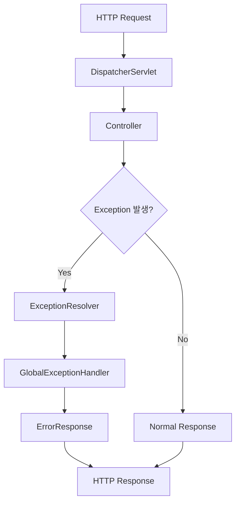
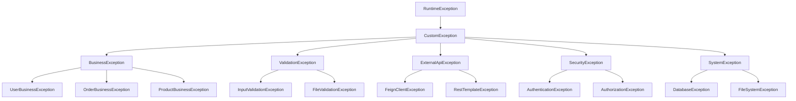

# 에러처리 개발가이드

## 📋 목차

### 1. 개요
- [1.1 에러처리의 중요성](#11-에러처리의-중요성)
- [1.2 Spring Boot 에러처리 아키텍처](#12-spring-boot-에러처리-아키텍처)
- [1.3 프로젝트 에러처리 방향성](#13-프로젝트-에러처리-방향성)
- [1.4 가이드 활용법](#14-가이드-활용법)

### 2. 에러처리 기본 개념
- [2.1 Exception vs Error](#21-exception-vs-error)
- [2.2 Checked vs Unchecked Exception](#22-checked-vs-unchecked-exception)
- [2.3 Spring Boot 에러처리 메커니즘](#23-spring-boot-에러처리-메커니즘)
- [2.4 HTTP 상태 코드와 에러의 관계](#24-http-상태-코드와-에러의-관계)

### 3. 커스텀 예외 설계
- [3.1 예외 계층구조 설계](#31-예외-계층구조-설계)
- [3.2 BaseException 및 하위 예외 클래스](#32-baseexception-및-하위-예외-클래스)
- [3.3 ErrorCode Enum 설계 패턴](#33-errorcode-enum-설계-패턴)
- [3.4 도메인별 예외 분류 및 명명 규칙](#34-도메인별-예외-분류-및-명명-규칙)

### 4. ErrorCode 표준화
- [4.1 ErrorCode 구조 및 필드 정의](#41-errorcode-구조-및-필드-정의)
- [4.2 도메인별 에러 코드 체계](#42-도메인별-에러-코드-체계)
- [4.3 HTTP 상태와 에러 코드 매핑](#43-http-상태와-에러-코드-매핑)
- [4.4 다국어 지원을 위한 메시지 설계](#44-다국어-지원을-위한-메시지-설계)

### 5. GlobalExceptionHandler 구현
- [5.1 @ControllerAdvice 기본 구조](#51-controlleradvice-기본-구조)
- [5.2 예외 타입별 핸들링 메서드](#52-예외-타입별-핸들링-메서드)
- [5.3 Validation 예외 처리](#53-validation-예외-처리)
- [5.4 Security 예외 처리](#54-security-예외-처리)
- [5.5 External API 예외 처리](#55-external-api-예외-처리)
- [5.6 Database 예외 처리](#56-database-예외-처리)

### 6. AxResponseEntity 활용
- [6.1 통합 응답 형식 설계](#61-통합-응답-형식-설계)
- [6.2 성공 응답 표준 메서드](#62-성공-응답-표준-메서드)
- [6.3 실패 응답 표준 메서드](#63-실패-응답-표준-메서드)
- [6.4 페이징 응답과 에러처리](#64-페이징-응답과-에러처리)
- [6.5 커스텀 메시지와 Detail 활용](#65-커스텀-메시지와-detail-활용)

### 7. 계층별 에러처리 전략
- [7.1 Controller 계층 에러처리](#71-controller-계층-에러처리)
- [7.2 Service 계층 에러처리 및 예외 변환](#72-service-계층-에러처리-및-예외-변환)
- [7.3 Repository 계층 에러처리](#73-repository-계층-에러처리)
- [7.4 External Client 계층 에러처리](#74-external-client-계층-에러처리)

### 8. 도메인별 에러처리 패턴
- [8.1 사용자 관리 도메인 에러처리](#81-사용자-관리-도메인-에러처리)
- [8.2 인증/인가 에러처리](#82-인증인가-에러처리)
- [8.3 파일 업로드/다운로드 에러처리](#83-파일-업로드다운로드-에러처리)
- [8.4 외부 API 연동 에러처리](#84-외부-api-연동-에러처리)

### 9. 입력값 검증과 에러처리
- [9.1 Jakarta Validation 활용](#91-jakarta-validation-활용)
- [9.2 커스텀 Validator 구현](#92-커스텀-validator-구현)
- [9.3 Request DTO 검증 에러처리](#93-request-dto-검증-에러처리)
- [9.4 PathVariable, RequestParam 검증](#94-pathvariable-requestparam-검증)

### 10. 로깅과 모니터링
- [10.1 에러 로깅 전략 및 레벨 설정](#101-에러-로깅-전략-및-레벨-설정)
- [10.2 구조화된 로그 포맷](#102-구조화된-로그-포맷)
- [10.3 에러 추적을 위한 Request ID](#103-에러-추적을-위한-request-id)
- [10.4 민감정보 로깅 방지](#104-민감정보-로깅-방지)

### 11. 외부 API 에러처리
- [11.1 Feign Client 에러처리](#111-feign-client-에러처리)
- [11.2 ErrorDecoder 구현](#112-errordecoder-구현)
- [11.3 재시도 정책과 Circuit Breaker](#113-재시도-정책과-circuit-breaker)
- [11.4 타임아웃 및 네트워크 에러 처리](#114-타임아웃-및-네트워크-에러-처리)

### 12. 보안 관련 에러처리
- [12.1 인증 실패 처리](#121-인증-실패-처리)
- [12.2 권한 부족 처리](#122-권한-부족-처리)
- [12.3 JWT 토큰 관련 에러처리](#123-jwt-토큰-관련-에러처리)
- [12.4 보안 정보 노출 방지](#124-보안-정보-노출-방지)

### 13. 성능과 에러처리
- [13.1 에러처리가 성능에 미치는 영향](#131-에러처리가-성능에-미치는-영향)
- [13.2 메모리 효율적인 예외 처리](#132-메모리-효율적인-예외-처리)
- [13.3 대용량 처리시 에러 핸들링](#133-대용량-처리시-에러-핸들링)
- [13.4 비동기 처리에서의 에러처리](#134-비동기-처리에서의-에러처리)

### 14. 테스트 전략
- [14.1 예외 상황 단위 테스트](#141-예외-상황-단위-테스트)
- [14.2 통합 테스트에서의 에러 시나리오](#142-통합-테스트에서의-에러-시나리오)
- [14.3 MockMvc를 활용한 에러 응답 테스트](#143-mockmvc를-활용한-에러-응답-테스트)
- [14.4 WireMock을 활용한 외부 API 에러 테스트](#144-wiremock을-활용한-외부-api-에러-테스트)

### 15. 클라이언트 친화적 에러 설계
- [15.1 사용자 친화적 에러 메시지](#151-사용자-친화적-에러-메시지)
- [15.2 클라이언트 개발자를 위한 에러 정보](#152-클라이언트-개발자를-위한-에러-정보)
- [15.3 Field Error 상세 정보 제공](#153-field-error-상세-정보-제공)
- [15.4 Action Type을 통한 UI 가이드](#154-action-type을-통한-ui-가이드)

### 16. 환경별 에러처리 설정
- [16.1 개발/스테이징/운영 환경별 에러 처리](#161-개발스테이징운영-환경별-에러-처리)
- [16.2 디버그 정보 노출 제어](#162-디버그-정보-노출-제어)
- [16.3 환경별 로그 레벨 설정](#163-환경별-로그-레벨-설정)
- [16.4 프로파일별 에러 응답 커스터마이징](#164-프로파일별-에러-응답-커스터마이징)

### 17. API 문서화
- [17.1 OpenAPI 3.0을 활용한 에러 응답 문서화](#171-openapi-30을-활용한-에러-응답-문서화)
- [17.2 @ApiResponse를 통한 에러 시나리오 명세](#172-apiresponse를-통한-에러-시나리오-명세)
- [17.3 에러 코드별 상세 설명 문서화](#173-에러-코드별-상세-설명-문서화)
- [17.4 클라이언트 개발자를 위한 에러 처리 가이드](#174-클라이언트-개발자를-위한-에러-처리-가이드)

### 18. 실무 적용 가이드
- [18.1 기존 프로젝트 마이그레이션 전략](#181-기존-프로젝트-마이그레이션-전략)
- [18.2 팀 개발 시 에러처리 컨벤션](#182-팀-개발-시-에러처리-컨벤션)
- [18.3 코드 리뷰 체크리스트](#183-코드-리뷰-체크리스트)
- [18.4 배포 전 에러처리 검증 항목](#184-배포-전-에러처리-검증-항목)

### 19. 트러블슈팅
- [19.1 자주 발생하는 에러 시나리오와 해결책](#191-자주-발생하는-에러-시나리오와-해결책)
- [19.2 성능 이슈를 유발하는 에러처리 안티패턴](#192-성능-이슈를-유발하는-에러처리-안티패턴)
- [19.3 메모리 리크를 유발하는 예외 처리](#193-메모리-리크를-유발하는-예외-처리)
- [19.4 외부 의존성 관련 에러 해결](#194-외부-의존성-관련-에러-해결)

### 20. 부록
- [20.1 ErrorCode 전체 목록](#201-errorcode-전체-목록)
- [20.2 HTTP 상태 코드 매핑 테이블](#202-http-상태-코드-매핑-테이블)
- [20.3 예외 처리 체크리스트](#203-예외-처리-체크리스트)
- [20.4 에러 메시지 다국어 템플릿](#204-에러-메시지-다국어-템플릿)
- [20.5 샘플 코드 및 템플릿](#205-샘플-코드-및-템플릿)

---

## 📚 가이드 개요

이 문서는 **AXPORTAL Backend 프로젝트**에서 일관되고 효율적인 에러처리를 위한 종합 가이드입니다.

### 🎯 목적
- Spring Boot 기반 프로젝트의 체계적인 에러처리 구현
- AxResponseEntity와 ErrorCode를 활용한 표준화된 응답 형식
- 개발팀 간 일관된 에러처리 컨벤션 제공
- 클라이언트 친화적인 에러 응답 설계

### 🏗️ 프로젝트 아키텍처 기반
- **Spring Boot 3.5.4** + **Java 17**
- **AxResponseEntity** 통합 응답 형식
- **ErrorCode Enum** 기반 에러 분류
- **GlobalExceptionHandler** 중앙 집중식 예외 처리
- **PageResponse** 페이징 응답 표준화

### 📝 적용 범위
- **Controller 계층**: REST API 에러 응답
- **Service 계층**: 비즈니스 로직 예외 처리
- **Repository 계층**: 데이터 액세스 예외 변환
- **External Client**: Feign Client 에러 처리
- **Security**: 인증/인가 예외 처리

### 🚀 주요 특징
- **타입 안전성**: ErrorCode 기반 컴파일 타임 검증
- **일관성**: 통일된 응답 형식과 에러 코드 체계
- **확장성**: 도메인별 에러 코드 분류 지원
- **다국어 지원**: 메시지 국제화 기반 설계
- **모니터링**: 구조화된 로깅과 에러 추적

---

*이 가이드는 실무에서 바로 적용할 수 있는 구체적이고 실용적인 내용으로 구성되었습니다.*
*각 섹션은 이론적 설명과 함께 실제 코드 예시를 포함하고 있습니다.*

**작성일**: 2025년 10월 9일  
**작성자**: ByounggwanLee  
**프로젝트**: AXPORTAL Backend  
**버전**: 1.0

---

## 1. 개요

### 1.1 에러처리의 중요성

현대의 웹 애플리케이션에서 에러처리는 단순히 예외를 잡아서 처리하는 것을 넘어서, **사용자 경험**, **시스템 안정성**, **개발 효율성**을 좌우하는 핵심 요소입니다.

#### 🎯 에러처리가 중요한 이유

##### 1. 사용자 경험 향상
```json
// ❌ 나쁜 에러 응답
{
  "timestamp": "2025-10-09T10:30:00.000+00:00",
  "status": 500,
  "error": "Internal Server Error",
  "path": "/api/users"
}

// ✅ 좋은 에러 응답
{
  "success": false,
  "message": "사용자를 찾을 수 없습니다",
  "error": {
    "hscode": "NOT_FOUND",
    "code": "U001",
    "message": "사용자를 찾을 수 없습니다",
    "details": "사용자 ID 123에 해당하는 사용자가 존재하지 않습니다",
    "timestamp": "2025-10-09T10:30:00",
    "path": "/api/users/123"
  }
}
```

##### 2. 개발 효율성 증대
- **일관된 에러 형식**: 클라이언트 개발자가 예측 가능한 에러 처리 로직 구현
- **명확한 에러 코드**: 디버깅 시간 단축 및 문제 원인 빠른 파악
- **자동화된 에러 처리**: GlobalExceptionHandler를 통한 중앙 집중식 관리

##### 3. 시스템 안정성 확보
- **Graceful Degradation**: 예상치 못한 오류 상황에서도 시스템이 완전히 중단되지 않음
- **에러 추적**: 로깅을 통한 문제 상황 모니터링 및 분석
- **보안 강화**: 민감한 정보 노출 방지

#### 📊 에러처리의 비즈니스 영향

| 구분 | 나쁜 에러처리 | 좋은 에러처리 |
|------|---------------|---------------|
| **사용자 이탈률** | 높음 (모호한 에러 메시지) | 낮음 (명확한 가이드) |
| **개발 속도** | 느림 (디버깅 시간 증가) | 빠름 (명확한 에러 정보) |
| **유지보수성** | 어려움 (분산된 에러 처리) | 쉬움 (중앙 집중식) |
| **고객 지원** | 비효율적 (문제 파악 어려움) | 효율적 (에러 코드 기반) |

### 1.2 Spring Boot 에러처리 아키텍처

Spring Boot는 에러처리를 위한 강력하고 유연한 아키텍처를 제공합니다.

#### 🏗️ Spring Boot 에러처리 구조



#### 📋 주요 컴포넌트

##### 1. ExceptionResolver 체인
```java
// Spring Boot 기본 ExceptionResolver 순서
1. ExceptionHandlerExceptionResolver    // @ExceptionHandler
2. ResponseStatusExceptionResolver      // @ResponseStatus  
3. DefaultHandlerExceptionResolver      // Spring MVC 기본 예외
```

##### 2. @ControllerAdvice와 @ExceptionHandler
```java
@ControllerAdvice
@Slf4j
public class GlobalExceptionHandler {
    
    /**
     * 비즈니스 예외 처리
     */
    @ExceptionHandler(BusinessException.class)
    public AxResponseEntity<Void> handleBusinessException(BusinessException ex) {
        log.warn("Business exception: {}", ex.getMessage(), ex);
        return AxResponseEntity.error(ex.getErrorCode());
    }
}
```

##### 3. 자동 구성 (Auto Configuration)
Spring Boot는 다음과 같은 에러처리 관련 설정을 자동으로 제공합니다:

```yaml
# application.yml - 기본 에러 처리 설정
server:
  error:
    include-message: always           # 에러 메시지 포함
    include-binding-errors: always    # 바인딩 에러 포함  
    include-stacktrace: on_param      # 스택트레이스 조건부 포함
    include-exception: false          # 예외 클래스명 미포함
```

#### 🔄 에러처리 플로우

```java
// 1. 컨트롤러에서 예외 발생
@GetMapping("/users/{id}")
public AxResponseEntity<UserResponse> getUser(@PathVariable Long id) {
    UserResponse user = userService.getUserById(id); // 예외 발생 가능
    return AxResponseEntity.ok(user);
}

// 2. Service에서 비즈니스 예외 발생
public UserResponse getUserById(Long id) {
    User user = userRepository.findById(id)
        .orElseThrow(() -> new BusinessException(ErrorCode.USER_NOT_FOUND));
    return userMapper.toResponse(user);
}

// 3. GlobalExceptionHandler에서 처리
@ExceptionHandler(BusinessException.class)
public AxResponseEntity<Void> handleBusinessException(BusinessException ex) {
    return AxResponseEntity.error(ex.getErrorCode());
}
```

### 1.3 프로젝트 에러처리 방향성

AXPORTAL Backend 프로젝트의 에러처리는 다음과 같은 방향성을 가지고 설계되었습니다.

#### 🎯 핵심 원칙

##### 1. 타입 안전성 (Type Safety)
```java
// ErrorCode Enum을 통한 컴파일 타임 검증
public enum ErrorCode {
    USER_NOT_FOUND(HttpStatus.NOT_FOUND, "U001", "사용자를 찾을 수 없습니다"),
    USER_ALREADY_EXISTS(HttpStatus.CONFLICT, "U002", "이미 존재하는 사용자입니다");
    
    private final HttpStatus status;
    private final String code;
    private final String message;
}
```

##### 2. 일관성 (Consistency)
```java
// 모든 API 응답에 동일한 형식 적용
public class AxResponseEntity<T> {
    private AxResponse<T> body;
    private HttpStatus status;
    
    // 통일된 성공/실패 응답 메서드 제공
    public static <T> AxResponseEntity<T> ok(T data, String message) { ... }
    public static <T> AxResponseEntity<T> error(ErrorCode errorCode) { ... }
}
```

##### 3. 확장성 (Scalability)
```java
// 도메인별 에러 코드 분류 체계
// U001~U099: 사용자 관련
// S001~S099: 샘플 관련  
// A001~A099: 인증/인가 관련
// E001~E099: 서버 오류
```

#### 🏛️ 아키텍처 설계

##### 계층별 책임 분리
```java
// Controller: HTTP 관련 예외만 처리
@RestController
public class UserController {
    public AxResponseEntity<UserResponse> getUser(@PathVariable Long id) {
        // 비즈니스 예외는 Service에서 발생, GlobalExceptionHandler에서 처리
    }
}

// Service: 비즈니스 예외 발생
@Service
public class UserService {
    public UserResponse getUserById(Long id) {
        // BusinessException 발생
        throw new BusinessException(ErrorCode.USER_NOT_FOUND);
    }
}

// GlobalExceptionHandler: 모든 예외 중앙 처리
@ControllerAdvice
public class GlobalExceptionHandler {
    // 예외 타입별 처리 로직
}
```

#### 🌐 클라이언트 중심 설계

##### 1. 개발자 친화적 에러 정보
```json
{
  "success": false,
  "message": "입력값 검증에 실패했습니다",
  "error": {
    "hscode": "BAD_REQUEST",
    "code": "C002",
    "fieldErrors": [
      {
        "field": "email",
        "rejectedValue": "invalid-email",
        "message": "올바른 이메일 형식이 아닙니다"
      }
    ]
  }
}
```

##### 2. 액션 가이드 제공
```java
public enum ActionType {
    CONFIRM,    // 확인 후 계속
    RETRY,      // 재시도 권장
    PREVIOUS,   // 이전 단계로
    CANCEL      // 작업 취소
}
```

### 1.4 가이드 활용법

이 가이드를 효과적으로 활용하기 위한 방법을 안내합니다.

#### 📖 학습 순서

##### 1단계: 기본 개념 이해 (2-4섹션)
- Exception과 Error의 차이점
- Spring Boot 에러처리 메커니즘
- HTTP 상태 코드 이해
- 커스텀 예외 설계 원칙

##### 2단계: 구현 방법 숙지 (5-7섹션)  
- GlobalExceptionHandler 구현
- AxResponseEntity 활용법
- 계층별 에러처리 전략

##### 3단계: 실무 적용 (8-15섹션)
- 도메인별 에러처리 패턴
- 입력값 검증과 에러처리
- 외부 API 에러처리
- 보안 관련 에러처리

##### 4단계: 고급 주제 (16-20섹션)
- 성능 최적화
- 테스트 전략
- 환경별 설정
- 트러블슈팅

#### 🛠️ 실무 적용 체크리스트

##### 새 기능 개발 시
- [ ] 도메인별 ErrorCode 정의
- [ ] 비즈니스 예외 클래스 생성
- [ ] Controller에서 AxResponseEntity 사용
- [ ] Service에서 적절한 예외 발생
- [ ] 테스트 코드에 예외 시나리오 포함

##### 기존 코드 개선 시
- [ ] 하드코딩된 에러 메시지를 ErrorCode로 변경
- [ ] ResponseEntity를 AxResponseEntity로 교체
- [ ] GlobalExceptionHandler에 새 예외 처리 추가
- [ ] 로깅 레벨 및 형식 표준화

#### 📋 팀 협업 가이드

##### 코드 리뷰 체크포인트
```markdown
## 에러처리 코드 리뷰 체크리스트

### 예외 설계
- [ ] 적절한 ErrorCode 사용 여부
- [ ] 커스텀 메시지와 detail 활용 적절성
- [ ] 예외 계층구조 준수 여부

### 응답 형식
- [ ] AxResponseEntity 사용 여부
- [ ] HTTP 상태 코드와 ErrorCode 일치성
- [ ] 클라이언트 친화적 에러 메시지

### 로깅
- [ ] 적절한 로그 레벨 사용
- [ ] 민감정보 로깅 방지
- [ ] 구조화된 로그 형식 준수
```

##### 개발 컨벤션
```java
// ✅ 권장 패턴
@ExceptionHandler(BusinessException.class)
public AxResponseEntity<Void> handleBusinessException(BusinessException ex) {
    log.warn("Business exception: {}", ex.getMessage(), ex);
    ErrorCode errorCode = ex.getErrorCode();
    String customMessage = ex.getMessage();
    
    if (customMessage != null && !customMessage.equals(errorCode.getMessage())) {
        return AxResponseEntity.error(errorCode, errorCode.getMessage(), customMessage);
    }
    return AxResponseEntity.error(errorCode);
}

// ❌ 피해야 할 패턴  
@ExceptionHandler(Exception.class)
public ResponseEntity<String> handleException(Exception ex) {
    return ResponseEntity.status(500).body("오류가 발생했습니다");
}
```

#### 🎓 학습 자료 활용

##### 코드 템플릿 사용
- **20.5 샘플 코드 및 템플릿** 섹션의 보일러플레이트 코드 활용
- IDE 코드 템플릿으로 등록하여 개발 속도 향상
- 팀 표준 코드 스타일 유지

##### 참고 문서 연계
- **부록** 섹션의 ErrorCode 전체 목록 참조
- HTTP 상태 코드 매핑 테이블 활용
- 체크리스트를 통한 자가 점검

---

## 2. 에러처리 기본 개념

### 2.1 Exception vs Error

Java와 Spring Boot에서 Exception과 Error는 서로 다른 목적과 특성을 가지고 있습니다. 이를 명확히 구분하여 사용하는 것이 효과적인 에러처리의 첫 번째 단계입니다.

#### 🔍 기본 개념 비교

##### Exception (예외)
```java
// Exception 계층구조
Throwable
├── Exception
│   ├── RuntimeException (Unchecked)
│   │   ├── NullPointerException
│   │   ├── IllegalArgumentException
│   │   └── BusinessException (커스텀)
│   └── CheckedException (Checked)
│       ├── IOException
│       ├── SQLException
│       └── ClassNotFoundException
└── Error (시스템 레벨 오류)
    ├── OutOfMemoryError
    ├── StackOverflowError
    └── NoClassDefFoundError
```

##### Error (에러)
- **시스템 레벨 오류**: JVM이나 시스템 자원 부족으로 발생
- **복구 불가능**: 일반적으로 애플리케이션에서 처리할 수 없음
- **예측 어려움**: 개발자가 예상하기 어려운 상황

#### 📊 Exception vs Error 비교표

| 구분 | Exception | Error |
|------|-----------|-------|
| **복구 가능성** | 가능 (try-catch로 처리) | 불가능 (시스템 재시작 필요) |
| **발생 원인** | 프로그램 로직, 외부 요인 | JVM, 시스템 자원 |
| **처리 방법** | 예외 처리 로직 구현 | 로깅 후 시스템 종료 |
| **예방 방법** | 검증 로직, 방어 코드 | 시스템 모니터링, 자원 관리 |

#### 💡 실무 적용 가이드

##### Exception 처리 패턴
```java
// ✅ 올바른 Exception 처리
@Service
public class UserService {
    
    public UserResponse getUserById(Long id) {
        // 1. 입력값 검증
        if (id == null || id <= 0) {
            throw new ValidationException(ErrorCode.INVALID_INPUT_VALUE, 
                "사용자 ID는 1 이상의 값이어야 합니다");
        }
        
        // 2. 비즈니스 로직 예외 처리
        User user = userRepository.findById(id)
            .orElseThrow(() -> new BusinessException(ErrorCode.USER_NOT_FOUND,
                "사용자 ID " + id + "를 찾을 수 없습니다"));
        
        return userMapper.toResponse(user);
    }
}
```

##### Error 모니터링 패턴
```java
// Error 발생 시 모니터링 및 알림
@ControllerAdvice
public class GlobalExceptionHandler {
    
    @ExceptionHandler(OutOfMemoryError.class)
    public AxResponseEntity<Void> handleOutOfMemoryError(OutOfMemoryError error) {
        log.error("🚨 OutOfMemoryError 발생 - 즉시 시스템 점검 필요", error);
        
        // 외부 모니터링 시스템에 알림 (예: Slack, 이메일)
        alertService.sendCriticalAlert("메모리 부족 오류 발생", error);
        
        return AxResponseEntity.internalServerError("시스템 오류가 발생했습니다. 관리자에게 문의하세요.");
    }
}
```

### 2.2 Checked vs Unchecked Exception

Java의 예외는 컴파일 타임 처리 여부에 따라 Checked와 Unchecked로 분류됩니다.

#### 🔄 Checked Exception

##### 특징
- **컴파일 타임 검증**: 반드시 try-catch 또는 throws 선언 필요
- **외부 의존성**: 파일 I/O, 네트워크, 데이터베이스 등
- **예측 가능**: 개발자가 예상할 수 있는 예외 상황

##### 예시와 처리 방법
```java
// Checked Exception 처리 패턴
@Service
public class FileService {
    
    // 1. try-catch로 처리
    public String readFile(String filePath) {
        try {
            return Files.readString(Paths.get(filePath));
        } catch (IOException e) {
            log.error("파일 읽기 실패: {}", filePath, e);
            throw new BusinessException(ErrorCode.FILE_READ_ERROR, 
                "파일을 읽을 수 없습니다: " + filePath);
        }
    }
    
    // 2. throws로 위임
    public void writeFile(String filePath, String content) throws IOException {
        Files.writeString(Paths.get(filePath), content);
    }
}
```

#### ⚡ Unchecked Exception (RuntimeException)

##### 특징
- **런타임 검증**: 컴파일 시점에 처리 강제하지 않음
- **프로그램 로직 오류**: NPE, IllegalArgument 등
- **선택적 처리**: 필요에 따라 처리

##### Spring Boot에서의 활용
```java
// Unchecked Exception을 활용한 비즈니스 예외
@Getter
@RequiredArgsConstructor
public class BusinessException extends RuntimeException {
    private final ErrorCode errorCode;
    
    public BusinessException(ErrorCode errorCode, String customMessage) {
        super(customMessage);
        this.errorCode = errorCode;
    }
}

// 사용 예시
@Service
public class OrderService {
    
    public OrderResponse createOrder(OrderCreateRequest request) {
        // 재고 확인
        if (!inventoryService.hasStock(request.getProductId(), request.getQuantity())) {
            throw new BusinessException(ErrorCode.INSUFFICIENT_STOCK,
                "상품 재고가 부족합니다. 요청량: " + request.getQuantity());
        }
        
        // 주문 생성 로직...
    }
}
```

#### 🎯 선택 기준

| 상황 | 권장 타입 | 이유 |
|------|-----------|------|
| **비즈니스 로직 검증** | Unchecked | 개발자 의도된 제어 흐름 |
| **외부 API 호출** | Checked → Unchecked 변환 | 일관된 예외 처리 |
| **파일/네트워크 I/O** | Checked 유지 또는 변환 | 상황에 따라 결정 |
| **데이터베이스 접근** | Unchecked (Spring 기본) | Spring의 DataAccessException 활용 |

### 2.3 Spring Boot 에러처리 메커니즘

Spring Boot는 다계층에 걸친 포괄적인 에러처리 메커니즘을 제공합니다.

#### 🏗️ 처리 계층 구조

```mermaid
graph TD
    A[Client Request] --> B[Filter Chain]
    B --> C[DispatcherServlet]
    C --> D[HandlerMapping]
    D --> E[HandlerAdapter]
    E --> F[Controller]
    F --> G{Exception?}
    G -->|Yes| H[HandlerExceptionResolver]
    G -->|No| I[ViewResolver]
    H --> J[@ExceptionHandler]
    J --> K[AxResponseEntity]
    I --> L[Response]
    K --> L
```

#### 📋 ExceptionResolver 처리 순서

##### 1. ExceptionHandlerExceptionResolver
```java
// @ExceptionHandler 메서드를 찾아서 처리
@ControllerAdvice
public class GlobalExceptionHandler {
    
    @ExceptionHandler(ValidationException.class)
    public AxResponseEntity<Void> handleValidationException(ValidationException ex) {
        log.warn("Validation error: {}", ex.getMessage());
        return AxResponseEntity.badRequest(ex.getErrorCode());
    }
}
```

##### 2. ResponseStatusExceptionResolver
```java
// @ResponseStatus 어노테이션 기반 처리
@ResponseStatus(HttpStatus.NOT_FOUND)
public class ResourceNotFoundException extends RuntimeException {
    public ResourceNotFoundException(String message) {
        super(message);
    }
}
```

##### 3. DefaultHandlerExceptionResolver
```java
// Spring MVC 기본 예외 처리
// - MethodArgumentNotValidException
// - MissingServletRequestParameterException
// - HttpRequestMethodNotSupportedException
// 등을 기본 HTTP 상태 코드로 변환
```

#### 🔧 Auto Configuration

Spring Boot는 기본적으로 다음과 같은 에러처리 설정을 제공합니다:

```yaml
# application.yml
server:
  error:
    # 기본 에러 페이지 설정
    path: /error
    whitelabel:
      enabled: false  # 기본 에러 페이지 비활성화
    
    # 에러 응답에 포함할 정보
    include-message: always
    include-binding-errors: always
    include-stacktrace: on_param  # ?trace=true 시에만 포함
    include-exception: false

# 로깅 설정
logging:
  level:
    com.skax.aiplatform: DEBUG
    org.springframework.web: DEBUG
```

#### 🎛️ 커스터마이징 포인트

##### 1. ErrorAttributes 커스터마이징
```java
@Component
public class CustomErrorAttributes extends DefaultErrorAttributes {
    
    @Override
    public Map<String, Object> getErrorAttributes(WebRequest webRequest, 
                                                 ErrorAttributeOptions options) {
        Map<String, Object> errorAttributes = super.getErrorAttributes(webRequest, options);
        
        // 커스텀 에러 정보 추가
        errorAttributes.put("errorId", UUID.randomUUID().toString());
        errorAttributes.put("supportContact", "support@skax.com");
        
        return errorAttributes;
    }
}
```

##### 2. ErrorController 구현
```java
@RestController
public class CustomErrorController implements ErrorController {
    
    @RequestMapping("/error")
    public AxResponseEntity<Void> handleError(HttpServletRequest request) {
        Integer statusCode = (Integer) request.getAttribute(RequestDispatcher.ERROR_STATUS_CODE);
        String message = (String) request.getAttribute(RequestDispatcher.ERROR_MESSAGE);
        
        ErrorCode errorCode = mapToErrorCode(statusCode);
        return AxResponseEntity.error(errorCode, message);
    }
    
    private ErrorCode mapToErrorCode(Integer statusCode) {
        return switch (statusCode) {
            case 404 -> ErrorCode.RESOURCE_NOT_FOUND;
            case 403 -> ErrorCode.ACCESS_DENIED;
            case 401 -> ErrorCode.AUTHENTICATION_FAILED;
            default -> ErrorCode.INTERNAL_SERVER_ERROR;
        };
    }
}
```

### 2.4 HTTP 상태 코드와 에러의 관계

HTTP 상태 코드는 클라이언트에게 요청 처리 결과를 명확하게 전달하는 핵심 수단입니다.

#### 📊 상태 코드 분류와 의미

##### 4xx 클라이언트 오류
```java
// 400 Bad Request - 잘못된 요청
@ExceptionHandler(MethodArgumentNotValidException.class)
public AxResponseEntity<Void> handleValidationError(MethodArgumentNotValidException ex) {
    List<FieldError> fieldErrors = ex.getBindingResult().getFieldErrors();
    
    return AxResponseEntity.badRequest(
        ErrorCode.VALIDATION_FAILED,
        "입력값 검증에 실패했습니다",
        fieldErrors.stream()
            .map(error -> error.getField() + ": " + error.getDefaultMessage())
            .collect(Collectors.joining(", "))
    );
}

// 401 Unauthorized - 인증 실패
@ExceptionHandler(AuthenticationException.class)
public AxResponseEntity<Void> handleAuthenticationError(AuthenticationException ex) {
    return AxResponseEntity.unauthorized(ErrorCode.AUTHENTICATION_FAILED);
}

// 403 Forbidden - 권한 부족
@ExceptionHandler(AccessDeniedException.class)
public AxResponseEntity<Void> handleAccessDenied(AccessDeniedException ex) {
    return AxResponseEntity.forbidden(ErrorCode.ACCESS_DENIED);
}

// 404 Not Found - 리소스 없음
@ExceptionHandler(ResourceNotFoundException.class)
public AxResponseEntity<Void> handleResourceNotFound(ResourceNotFoundException ex) {
    return AxResponseEntity.notFound(ErrorCode.RESOURCE_NOT_FOUND);
}

// 409 Conflict - 리소스 충돌
@ExceptionHandler(DataIntegrityViolationException.class)
public AxResponseEntity<Void> handleDataIntegrityViolation(DataIntegrityViolationException ex) {
    return AxResponseEntity.conflict(ErrorCode.DATA_INTEGRITY_VIOLATION);
}
```

##### 5xx 서버 오류
```java
// 500 Internal Server Error - 서버 내부 오류
@ExceptionHandler(Exception.class)
public AxResponseEntity<Void> handleInternalError(Exception ex) {
    log.error("Unexpected error occurred", ex);
    return AxResponseEntity.internalServerError(ErrorCode.INTERNAL_SERVER_ERROR);
}

// 502 Bad Gateway - 외부 서비스 오류
@ExceptionHandler(FeignException.class)
public AxResponseEntity<Void> handleFeignError(FeignException ex) {
    log.error("External service error: {}", ex.getMessage());
    return AxResponseEntity.badGateway(ErrorCode.EXTERNAL_SERVICE_ERROR);
}

// 503 Service Unavailable - 서비스 일시 중단
@ExceptionHandler(ServiceUnavailableException.class)
public AxResponseEntity<Void> handleServiceUnavailable(ServiceUnavailableException ex) {
    return AxResponseEntity.serviceUnavailable(ErrorCode.SERVICE_UNAVAILABLE);
}
```

#### 🎯 상태 코드 선택 가이드라인

##### 비즈니스 로직 에러 매핑
```java
public enum ErrorCode {
    // 400 Bad Request
    INVALID_INPUT_VALUE(HttpStatus.BAD_REQUEST, "C001", "잘못된 입력값입니다"),
    VALIDATION_FAILED(HttpStatus.BAD_REQUEST, "C002", "입력값 검증에 실패했습니다"),
    
    // 401 Unauthorized  
    AUTHENTICATION_FAILED(HttpStatus.UNAUTHORIZED, "A001", "인증에 실패했습니다"),
    TOKEN_EXPIRED(HttpStatus.UNAUTHORIZED, "A003", "토큰이 만료되었습니다"),
    
    // 403 Forbidden
    ACCESS_DENIED(HttpStatus.FORBIDDEN, "A002", "접근 권한이 없습니다"),
    INSUFFICIENT_PERMISSION(HttpStatus.FORBIDDEN, "A004", "권한이 부족합니다"),
    
    // 404 Not Found
    USER_NOT_FOUND(HttpStatus.NOT_FOUND, "U001", "사용자를 찾을 수 없습니다"),
    RESOURCE_NOT_FOUND(HttpStatus.NOT_FOUND, "C003", "요청한 리소스를 찾을 수 없습니다"),
    
    // 409 Conflict
    USER_ALREADY_EXISTS(HttpStatus.CONFLICT, "U002", "이미 존재하는 사용자입니다"),
    DATA_INTEGRITY_VIOLATION(HttpStatus.CONFLICT, "C004", "데이터 무결성 위반"),
    
    // 500 Internal Server Error
    INTERNAL_SERVER_ERROR(HttpStatus.INTERNAL_SERVER_ERROR, "E001", "서버 내부 오류가 발생했습니다"),
    
    // 502 Bad Gateway
    EXTERNAL_SERVICE_ERROR(HttpStatus.BAD_GATEWAY, "E002", "외부 서비스 오류가 발생했습니다");
}
```

#### 🔄 상태 코드 매핑 규칙

##### 1. RESTful API 원칙 준수
```java
// ✅ 올바른 상태 코드 사용
@PostMapping("/users")
public AxResponseEntity<UserResponse> createUser(@Valid @RequestBody UserCreateRequest request) {
    UserResponse user = userService.createUser(request);
    return AxResponseEntity.created(user, "사용자가 성공적으로 생성되었습니다");  // 201 Created
}

@GetMapping("/users/{id}")
public AxResponseEntity<UserResponse> getUser(@PathVariable Long id) {
    UserResponse user = userService.getUserById(id);
    return AxResponseEntity.ok(user, "사용자 정보를 성공적으로 조회했습니다");  // 200 OK
}

@DeleteMapping("/users/{id}")
public AxResponseEntity<Void> deleteUser(@PathVariable Long id) {
    userService.deleteUser(id);
    return AxResponseEntity.deleted("사용자가 성공적으로 삭제되었습니다");  // 200 OK
}
```

##### 2. 클라이언트 가이드 제공
```java
// 상태 코드별 클라이언트 액션 가이드
public enum ActionType {
    CONFIRM(Arrays.asList(200, 201, 204)),     // 성공 - 계속 진행
    RETRY(Arrays.asList(429, 502, 503)),       // 재시도 권장
    FIX_INPUT(Arrays.asList(400, 422)),        // 입력값 수정 필요
    AUTHENTICATE(Arrays.asList(401)),          // 재인증 필요
    CONTACT_ADMIN(Arrays.asList(403, 500));    // 관리자 문의
    
    private final List<Integer> statusCodes;
}
```

#### 📈 모니터링과 메트릭스

##### 상태 코드별 모니터링 설정
```yaml
# application.yml
management:
  endpoints:
    web:
      exposure:
        include: health,metrics,prometheus
  metrics:
    export:
      prometheus:
        enabled: true
    web:
      server:
        request:
          autotime:
            enabled: true
            percentiles: 0.5,0.95,0.99
            percentiles-histogram: true

# 상태 코드별 알림 임계값 설정
alert:
  error-rate:
    4xx-threshold: 10%  # 4xx 에러율 10% 초과 시 알림
    5xx-threshold: 5%   # 5xx 에러율 5% 초과 시 알림
  response-time:
    p95-threshold: 2000ms  # 95% 응답시간 2초 초과 시 알림
```

---

## 3. 커스텀 예외 설계

### 3.1 예외 계층구조 설계

효과적인 에러처리를 위해서는 체계적인 예외 계층구조가 필요합니다. AXPORTAL Backend 프로젝트에서는 타입 안전성과 확장성을 고려한 예외 계층을 설계합니다.

#### 🏗️ 예외 계층구조 아키텍처



#### 📋 계층별 책임과 역할

##### 1. CustomException (최상위 추상 클래스)
```java
/**
 * 모든 커스텀 예외의 최상위 클래스
 * 
 * <p>프로젝트 내 모든 커스텀 예외는 이 클래스를 상속받아야 합니다.
 * ErrorCode 기반 타입 안전성과 통일된 예외 처리를 보장합니다.</p>
 * 
 * @author ByounggwanLee
 * @since 2025-10-09
 * @version 1.0
 */
@Getter
@RequiredArgsConstructor
public abstract class CustomException extends RuntimeException {
    
    /**
     * 에러 코드
     * 
     * <p>HTTP 상태 코드, 에러 코드, 메시지를 포함하는 Enum입니다.
     * 타입 안전성을 보장하고 일관된 에러 응답을 제공합니다.</p>
     */
    private final ErrorCode errorCode;
    
    /**
     * ErrorCode와 커스텀 메시지를 함께 사용하는 생성자
     * 
     * @param errorCode 에러 코드 Enum
     * @param customMessage 상황별 상세 메시지
     */
    public CustomException(ErrorCode errorCode, String customMessage) {
        super(customMessage);
        this.errorCode = errorCode;
    }
    
    /**
     * ErrorCode와 원인 예외를 함께 사용하는 생성자
     * 
     * @param errorCode 에러 코드 Enum
     * @param cause 원인 예외
     */
    public CustomException(ErrorCode errorCode, Throwable cause) {
        super(errorCode.getMessage(), cause);
        this.errorCode = errorCode;
    }
    
    /**
     * 모든 정보를 포함하는 생성자
     * 
     * @param errorCode 에러 코드 Enum
     * @param customMessage 상황별 상세 메시지
     * @param cause 원인 예외
     */
    public CustomException(ErrorCode errorCode, String customMessage, Throwable cause) {
        super(customMessage, cause);
        this.errorCode = errorCode;
    }
}
```

##### 2. BusinessException (비즈니스 로직 예외)
```java
/**
 * 비즈니스 로직 관련 예외
 * 
 * <p>애플리케이션의 비즈니스 규칙 위반이나 도메인 로직 오류 시 발생합니다.
 * 사용자의 요청은 올바르지만, 비즈니스 규칙에 어긋나는 경우에 사용합니다.</p>
 * 
 * <h3>사용 시나리오:</h3>
 * <ul>
 *   <li>사용자가 존재하지 않음</li>
 *   <li>중복된 이메일로 가입 시도</li>
 *   <li>재고 부족으로 주문 불가</li>
 *   <li>권한 부족으로 접근 불가</li>
 * </ul>
 * 
 * @author ByounggwanLee
 * @since 2025-10-09
 */
public class BusinessException extends CustomException {
    
    public BusinessException(ErrorCode errorCode) {
        super(errorCode);
    }
    
    public BusinessException(ErrorCode errorCode, String customMessage) {
        super(errorCode, customMessage);
    }
    
    public BusinessException(ErrorCode errorCode, Throwable cause) {
        super(errorCode, cause);
    }
    
    public BusinessException(ErrorCode errorCode, String customMessage, Throwable cause) {
        super(errorCode, customMessage, cause);
    }
}
```

##### 3. ValidationException (입력값 검증 예외)
```java
/**
 * 입력값 검증 관련 예외
 * 
 * <p>클라이언트로부터 받은 입력값이 유효하지 않을 때 발생합니다.
 * Jakarta Validation과 연계하여 사용하며, 필드별 상세 검증 오류를 포함할 수 있습니다.</p>
 * 
 * <h3>사용 시나리오:</h3>
 * <ul>
 *   <li>필수 필드 누락</li>
 *   <li>잘못된 이메일 형식</li>
 *   <li>범위를 벗어난 값</li>
 *   <li>패턴 불일치</li>
 * </ul>
 * 
 * @author ByounggwanLee
 * @since 2025-10-09
 */
@Getter
public class ValidationException extends CustomException {
    
    /**
     * 필드별 검증 오류 목록
     */
    private final List<FieldValidationError> fieldErrors;
    
    public ValidationException(ErrorCode errorCode) {
        super(errorCode);
        this.fieldErrors = Collections.emptyList();
    }
    
    public ValidationException(ErrorCode errorCode, String customMessage) {
        super(errorCode, customMessage);
        this.fieldErrors = Collections.emptyList();
    }
    
    public ValidationException(ErrorCode errorCode, List<FieldValidationError> fieldErrors) {
        super(errorCode);
        this.fieldErrors = fieldErrors != null ? fieldErrors : Collections.emptyList();
    }
    
    public ValidationException(ErrorCode errorCode, String customMessage, List<FieldValidationError> fieldErrors) {
        super(errorCode, customMessage);
        this.fieldErrors = fieldErrors != null ? fieldErrors : Collections.emptyList();
    }
    
    /**
     * 필드 검증 오류 정보
     */
    @Getter
    @AllArgsConstructor
    @Builder
    public static class FieldValidationError {
        private final String field;           // 필드명
        private final Object rejectedValue;   // 거부된 값
        private final String message;         // 오류 메시지
    }
}
```

##### 4. ExternalApiException (외부 API 예외)
```java
/**
 * 외부 API 호출 관련 예외
 * 
 * <p>외부 시스템과의 통신에서 발생하는 예외를 처리합니다.
 * Feign Client, RestTemplate 등을 통한 외부 API 호출 시 발생하는 오류를 래핑합니다.</p>
 * 
 * <h3>사용 시나리오:</h3>
 * <ul>
 *   <li>외부 API 호출 실패</li>
 *   <li>타임아웃 발생</li>
 *   <li>네트워크 연결 오류</li>
 *   <li>외부 서비스 일시 중단</li>
 * </ul>
 * 
 * @author ByounggwanLee
 * @since 2025-10-09
 */
@Getter
public class ExternalApiException extends CustomException {
    
    /**
     * 외부 API 정보
     */
    private final String apiName;
    private final String endpoint;
    private final Integer responseStatus;
    
    public ExternalApiException(ErrorCode errorCode, String apiName, String endpoint) {
        super(errorCode);
        this.apiName = apiName;
        this.endpoint = endpoint;
        this.responseStatus = null;
    }
    
    public ExternalApiException(ErrorCode errorCode, String apiName, String endpoint, 
                               Integer responseStatus, String customMessage) {
        super(errorCode, customMessage);
        this.apiName = apiName;
        this.endpoint = endpoint;
        this.responseStatus = responseStatus;
    }
    
    public ExternalApiException(ErrorCode errorCode, String apiName, String endpoint, Throwable cause) {
        super(errorCode, cause);
        this.apiName = apiName;
        this.endpoint = endpoint;
        this.responseStatus = null;
    }
}
```

#### 🎯 계층구조 설계 원칙

##### 1. 단일 책임 원칙 (SRP)
```java
// ✅ 각 예외 클래스는 명확한 책임을 가짐
BusinessException    // 비즈니스 로직 오류만 담당
ValidationException  // 입력값 검증 오류만 담당
ExternalApiException // 외부 API 오류만 담당
```

##### 2. 개방-폐쇄 원칙 (OCP)
```java
// ✅ 새로운 예외 타입 추가 시 기존 코드 수정 없이 확장 가능
public class PaymentException extends BusinessException {
    // 결제 관련 특화 기능 추가
}

public class FileUploadException extends ValidationException {
    // 파일 업로드 검증 특화 기능 추가
}
```

##### 3. 리스코프 치환 원칙 (LSP)
```java
// ✅ 모든 하위 예외는 CustomException으로 치환 가능
public void handleException(CustomException ex) {
    // BusinessException, ValidationException 등 모두 처리 가능
    ErrorCode errorCode = ex.getErrorCode();
    log.warn("Exception occurred: {}", errorCode);
}
```

### 3.2 BaseException 및 하위 예외 클래스

BaseException은 프로젝트의 모든 예외 클래스가 상속받는 기본 클래스로, 공통 기능과 표준화된 인터페이스를 제공합니다.

#### 🏛️ BaseException 설계

```java
/**
 * 모든 커스텀 예외의 기본 클래스
 * 
 * <p>프로젝트 내 모든 커스텀 예외는 이 클래스를 상속받아야 합니다.
 * ErrorCode 기반 타입 안전성과 통일된 예외 처리를 보장합니다.</p>
 * 
 * <h3>주요 기능:</h3>
 * <ul>
 *   <li>ErrorCode 기반 타입 안전한 예외 처리</li>
 *   <li>다양한 생성자를 통한 유연한 예외 생성</li>
 *   <li>체이닝을 통한 원인 예외 추적</li>
 *   <li>구조화된 로깅 지원</li>
 * </ul>
 * 
 * @author ByounggwanLee
 * @since 2025-10-09
 * @version 1.0
 */
@Getter
@Slf4j
public abstract class BaseException extends RuntimeException {
    
    /**
     * 에러 코드 - HTTP 상태, 코드, 메시지 포함
     */
    private final ErrorCode errorCode;
    
    /**
     * 예외 발생 시간
     */
    private final LocalDateTime occurredAt;
    
    /**
     * 예외 고유 ID (추적용)
     */
    private final String exceptionId;
    
    /**
     * 기본 생성자 - ErrorCode만 사용
     * 
     * @param errorCode 에러 코드 Enum
     */
    protected BaseException(ErrorCode errorCode) {
        super(errorCode.getMessage());
        this.errorCode = errorCode;
        this.occurredAt = LocalDateTime.now();
        this.exceptionId = UUID.randomUUID().toString();
        logException();
    }
    
    /**
     * 커스텀 메시지를 포함하는 생성자
     * 
     * @param errorCode 에러 코드 Enum
     * @param customMessage 상황별 상세 메시지
     */
    protected BaseException(ErrorCode errorCode, String customMessage) {
        super(customMessage);
        this.errorCode = errorCode;
        this.occurredAt = LocalDateTime.now();
        this.exceptionId = UUID.randomUUID().toString();
        logException();
    }
    
    /**
     * 원인 예외를 포함하는 생성자
     * 
     * @param errorCode 에러 코드 Enum
     * @param cause 원인 예외
     */
    protected BaseException(ErrorCode errorCode, Throwable cause) {
        super(errorCode.getMessage(), cause);
        this.errorCode = errorCode;
        this.occurredAt = LocalDateTime.now();
        this.exceptionId = UUID.randomUUID().toString();
        logException();
    }
    
    /**
     * 모든 정보를 포함하는 생성자
     * 
     * @param errorCode 에러 코드 Enum
     * @param customMessage 상황별 상세 메시지
     * @param cause 원인 예외
     */
    protected BaseException(ErrorCode errorCode, String customMessage, Throwable cause) {
        super(customMessage, cause);
        this.errorCode = errorCode;
        this.occurredAt = LocalDateTime.now();
        this.exceptionId = UUID.randomUUID().toString();
        logException();
    }
    
    /**
     * 예외 발생 시 자동 로깅
     */
    private void logException() {
        if (errorCode.getStatus().is5xxServerError()) {
            log.error("🚨 Server Error [{}] {}: {} - ExceptionId: {}", 
                errorCode.getCode(), errorCode.getStatus(), getMessage(), exceptionId, this);
        } else if (errorCode.getStatus().is4xxClientError()) {
            log.warn("⚠️ Client Error [{}] {}: {} - ExceptionId: {}", 
                errorCode.getCode(), errorCode.getStatus(), getMessage(), exceptionId);
        } else {
            log.info("ℹ️ Exception [{}] {}: {} - ExceptionId: {}", 
                errorCode.getCode(), errorCode.getStatus(), getMessage(), exceptionId);
        }
    }
    
    /**
     * 예외 정보를 Map으로 반환 (로깅, 모니터링용)
     * 
     * @return 예외 정보 Map
     */
    public Map<String, Object> toLogMap() {
        Map<String, Object> logMap = new HashMap<>();
        logMap.put("exceptionId", exceptionId);
        logMap.put("errorCode", errorCode.getCode());
        logMap.put("httpStatus", errorCode.getStatus().value());
        logMap.put("message", getMessage());
        logMap.put("occurredAt", occurredAt);
        logMap.put("exceptionType", this.getClass().getSimpleName());
        
        if (getCause() != null) {
            logMap.put("rootCause", getCause().getClass().getSimpleName());
            logMap.put("rootCauseMessage", getCause().getMessage());
        }
        
        return logMap;
    }
    
    /**
     * 예외 체이닝을 통한 근본 원인 탐색
     * 
     * @return 근본 원인 예외
     */
    public Throwable getRootCause() {
        Throwable cause = this.getCause();
        if (cause == null) {
            return this;
        }
        
        while (cause.getCause() != null) {
            cause = cause.getCause();
        }
        
        return cause;
    }
}
```

#### 🔧 도메인별 하위 예외 클래스

##### 1. 사용자 관리 도메인 예외
```java
/**
 * 사용자 관리 도메인 예외
 * 
 * <p>사용자 생성, 조회, 수정, 삭제와 관련된 비즈니스 로직 예외를 처리합니다.</p>
 * 
 * @author ByounggwanLee
 * @since 2025-10-09
 */
public class UserException extends BusinessException {
    
    public UserException(ErrorCode errorCode) {
        super(errorCode);
    }
    
    public UserException(ErrorCode errorCode, String customMessage) {
        super(errorCode, customMessage);
    }
    
    // 정적 팩토리 메서드를 통한 의미있는 예외 생성
    public static UserException notFound(Long userId) {
        return new UserException(ErrorCode.USER_NOT_FOUND, 
            "사용자 ID " + userId + "를 찾을 수 없습니다");
    }
    
    public static UserException alreadyExists(String email) {
        return new UserException(ErrorCode.USER_ALREADY_EXISTS, 
            "이미 존재하는 이메일입니다: " + email);
    }
    
    public static UserException inactive(Long userId) {
        return new UserException(ErrorCode.USER_INACTIVE, 
            "비활성화된 사용자입니다: " + userId);
    }
    
    public static UserException invalidPassword() {
        return new UserException(ErrorCode.INVALID_PASSWORD, 
            "잘못된 비밀번호입니다");
    }
}
```

##### 2. 파일 처리 도메인 예외
```java
/**
 * 파일 처리 도메인 예외
 * 
 * <p>파일 업로드, 다운로드, 검증과 관련된 예외를 처리합니다.</p>
 * 
 * @author ByounggwanLee
 * @since 2025-10-09
 */
@Getter
public class FileException extends ValidationException {
    
    private final String fileName;
    private final Long fileSize;
    private final String contentType;
    
    public FileException(ErrorCode errorCode, String fileName) {
        super(errorCode);
        this.fileName = fileName;
        this.fileSize = null;
        this.contentType = null;
    }
    
    public FileException(ErrorCode errorCode, String fileName, Long fileSize, String contentType) {
        super(errorCode);
        this.fileName = fileName;
        this.fileSize = fileSize;
        this.contentType = contentType;
    }
    
    // 정적 팩토리 메서드
    public static FileException tooLarge(String fileName, Long fileSize, Long maxSize) {
        return new FileException(ErrorCode.FILE_SIZE_EXCEEDED, 
            String.format("파일 크기가 초과되었습니다. 파일: %s, 크기: %d bytes, 최대: %d bytes", 
                fileName, fileSize, maxSize), fileSize, null);
    }
    
    public static FileException unsupportedType(String fileName, String contentType) {
        return new FileException(ErrorCode.UNSUPPORTED_FILE_TYPE, 
            String.format("지원하지 않는 파일 형식입니다. 파일: %s, 타입: %s", fileName, contentType),
            null, contentType);
    }
    
    public static FileException uploadFailed(String fileName, Throwable cause) {
        FileException exception = new FileException(ErrorCode.FILE_UPLOAD_FAILED, fileName);
        exception.initCause(cause);
        return exception;
    }
}
```

##### 3. 외부 API 연동 예외
```java
/**
 * SKTAI API 연동 예외
 * 
 * <p>SKTAI 외부 API 호출과 관련된 예외를 처리합니다.</p>
 * 
 * @author ByounggwanLee
 * @since 2025-10-09
 */
@Getter
public class SktaiApiException extends ExternalApiException {
    
    private final String requestId;
    private final String projectId;
    
    public SktaiApiException(ErrorCode errorCode, String endpoint, String requestId) {
        super(errorCode, "SKTAI-API", endpoint);
        this.requestId = requestId;
        this.projectId = null;
    }
    
    public SktaiApiException(ErrorCode errorCode, String endpoint, String requestId, 
                            String projectId, Integer responseStatus) {
        super(errorCode, "SKTAI-API", endpoint, responseStatus, 
            String.format("SKTAI API 호출 실패 - ProjectId: %s, RequestId: %s", projectId, requestId));
        this.requestId = requestId;
        this.projectId = projectId;
    }
    
    // 정적 팩토리 메서드
    public static SktaiApiException authenticationFailed(String endpoint, String requestId) {
        return new SktaiApiException(ErrorCode.SKTAI_AUTH_FAILED, endpoint, requestId);
    }
    
    public static SktaiApiException quotaExceeded(String endpoint, String requestId, String projectId) {
        return new SktaiApiException(ErrorCode.SKTAI_QUOTA_EXCEEDED, endpoint, requestId, projectId, 429);
    }
    
    public static SktaiApiException serviceUnavailable(String endpoint, String requestId) {
        return new SktaiApiException(ErrorCode.SKTAI_SERVICE_UNAVAILABLE, endpoint, requestId, null, 503);
    }
}
```

### 3.3 ErrorCode Enum 설계 패턴

ErrorCode는 에러 정보를 타입 안전하게 관리하는 핵심 컴포넌트입니다. HTTP 상태 코드, 비즈니스 에러 코드, 메시지를 하나로 통합하여 관리합니다.

#### 🎯 ErrorCode 기본 구조

```java
/**
 * 에러 코드 정의 Enum
 * 
 * <p>모든 에러 상황에 대한 HTTP 상태 코드, 비즈니스 에러 코드, 메시지를 통합 관리합니다.
 * 타입 안전성을 보장하고 일관된 에러 응답을 제공합니다.</p>
 * 
 * <h3>코드 체계:</h3>
 * <ul>
 *   <li><strong>U001~U099</strong>: 사용자 관련</li>
 *   <li><strong>S001~S099</strong>: 샘플 관련</li>
 *   <li><strong>A001~A099</strong>: 인증/인가 관련</li>
 *   <li><strong>C001~C099</strong>: 공통/검증 관련</li>
 *   <li><strong>F001~F099</strong>: 파일 관련</li>
 *   <li><strong>E001~E099</strong>: 서버/시스템 관련</li>
 *   <li><strong>X001~X099</strong>: 외부 API 관련</li>
 * </ul>
 * 
 * @author ByounggwanLee
 * @since 2025-10-09
 * @version 1.0
 */
@Getter
@RequiredArgsConstructor
public enum ErrorCode {
    
    // ========== 사용자 관련 (U001~U099) ==========
    /**
     * 사용자를 찾을 수 없음
     */
    USER_NOT_FOUND(HttpStatus.NOT_FOUND, "U001", "사용자를 찾을 수 없습니다"),
    
    /**
     * 이미 존재하는 사용자
     */
    USER_ALREADY_EXISTS(HttpStatus.CONFLICT, "U002", "이미 존재하는 사용자입니다"),
    
    /**
     * 비활성화된 사용자
     */
    USER_INACTIVE(HttpStatus.FORBIDDEN, "U003", "비활성화된 사용자입니다"),
    
    /**
     * 잘못된 비밀번호
     */
    INVALID_PASSWORD(HttpStatus.UNAUTHORIZED, "U004", "잘못된 비밀번호입니다"),
    
    /**
     * 사용자 권한 부족
     */
    USER_PERMISSION_DENIED(HttpStatus.FORBIDDEN, "U005", "사용자 권한이 부족합니다"),
    
    // ========== 샘플 관련 (S001~S099) ==========
    /**
     * 샘플을 찾을 수 없음
     */
    SAMPLE_NOT_FOUND(HttpStatus.NOT_FOUND, "S001", "샘플을 찾을 수 없습니다"),
    
    /**
     * 이미 존재하는 샘플
     */
    SAMPLE_ALREADY_EXISTS(HttpStatus.CONFLICT, "S002", "이미 존재하는 샘플입니다"),
    
    // ========== 인증/인가 관련 (A001~A099) ==========
    /**
     * 인증 실패
     */
    AUTHENTICATION_FAILED(HttpStatus.UNAUTHORIZED, "A001", "인증에 실패했습니다"),
    
    /**
     * 접근 권한 없음
     */
    ACCESS_DENIED(HttpStatus.FORBIDDEN, "A002", "접근 권한이 없습니다"),
    
    /**
     * 토큰 만료
     */
    TOKEN_EXPIRED(HttpStatus.UNAUTHORIZED, "A003", "토큰이 만료되었습니다"),
    
    /**
     * 유효하지 않은 토큰
     */
    INVALID_TOKEN(HttpStatus.UNAUTHORIZED, "A004", "유효하지 않은 토큰입니다"),
    
    /**
     * 권한 부족
     */
    INSUFFICIENT_PERMISSION(HttpStatus.FORBIDDEN, "A005", "권한이 부족합니다"),
    
    // ========== 공통/검증 관련 (C001~C099) ==========
    /**
     * 잘못된 입력값
     */
    INVALID_INPUT_VALUE(HttpStatus.BAD_REQUEST, "C001", "잘못된 입력값입니다"),
    
    /**
     * 입력값 검증 실패
     */
    VALIDATION_FAILED(HttpStatus.BAD_REQUEST, "C002", "입력값 검증에 실패했습니다"),
    
    /**
     * 요청한 리소스를 찾을 수 없음
     */
    RESOURCE_NOT_FOUND(HttpStatus.NOT_FOUND, "C003", "요청한 리소스를 찾을 수 없습니다"),
    
    /**
     * 데이터 무결성 위반
     */
    DATA_INTEGRITY_VIOLATION(HttpStatus.CONFLICT, "C004", "데이터 무결성 위반입니다"),
    
    /**
     * 중복된 리소스
     */
    DUPLICATE_RESOURCE(HttpStatus.CONFLICT, "C005", "중복된 리소스입니다"),
    
    // ========== 파일 관련 (F001~F099) ==========
    /**
     * 파일 크기 초과
     */
    FILE_SIZE_EXCEEDED(HttpStatus.BAD_REQUEST, "F001", "파일 크기가 초과되었습니다"),
    
    /**
     * 지원하지 않는 파일 형식
     */
    UNSUPPORTED_FILE_TYPE(HttpStatus.BAD_REQUEST, "F002", "지원하지 않는 파일 형식입니다"),
    
    /**
     * 파일 업로드 실패
     */
    FILE_UPLOAD_FAILED(HttpStatus.INTERNAL_SERVER_ERROR, "F003", "파일 업로드에 실패했습니다"),
    
    /**
     * 파일 다운로드 실패
     */
    FILE_DOWNLOAD_FAILED(HttpStatus.INTERNAL_SERVER_ERROR, "F004", "파일 다운로드에 실패했습니다"),
    
    /**
     * 파일을 찾을 수 없음
     */
    FILE_NOT_FOUND(HttpStatus.NOT_FOUND, "F005", "파일을 찾을 수 없습니다"),
    
    // ========== 서버/시스템 관련 (E001~E099) ==========
    /**
     * 서버 내부 오류
     */
    INTERNAL_SERVER_ERROR(HttpStatus.INTERNAL_SERVER_ERROR, "E001", "서버 내부 오류가 발생했습니다"),
    
    /**
     * 외부 서비스 오류
     */
    EXTERNAL_SERVICE_ERROR(HttpStatus.BAD_GATEWAY, "E002", "외부 서비스 오류가 발생했습니다"),
    
    /**
     * 데이터베이스 연결 오류
     */
    DATABASE_CONNECTION_ERROR(HttpStatus.INTERNAL_SERVER_ERROR, "E003", "데이터베이스 연결 오류가 발생했습니다"),
    
    /**
     * 서비스 일시 중단
     */
    SERVICE_UNAVAILABLE(HttpStatus.SERVICE_UNAVAILABLE, "E004", "서비스가 일시적으로 중단되었습니다"),
    
    /**
     * 타임아웃 발생
     */
    REQUEST_TIMEOUT(HttpStatus.REQUEST_TIMEOUT, "E005", "요청 시간이 초과되었습니다"),
    
    // ========== 외부 API 관련 (X001~X099) ==========
    /**
     * SKTAI API 인증 실패
     */
    SKTAI_AUTH_FAILED(HttpStatus.UNAUTHORIZED, "X001", "SKTAI API 인증에 실패했습니다"),
    
    /**
     * SKTAI API 할당량 초과
     */
    SKTAI_QUOTA_EXCEEDED(HttpStatus.TOO_MANY_REQUESTS, "X002", "SKTAI API 할당량을 초과했습니다"),
    
    /**
     * SKTAI API 서비스 중단
     */
    SKTAI_SERVICE_UNAVAILABLE(HttpStatus.SERVICE_UNAVAILABLE, "X003", "SKTAI API 서비스가 일시 중단되었습니다"),
    
    /**
     * 외부 API 호출 실패
     */
    EXTERNAL_API_CALL_FAILED(HttpStatus.BAD_GATEWAY, "X004", "외부 API 호출에 실패했습니다");
    
    /**
     * HTTP 상태 코드
     */
    private final HttpStatus status;
    
    /**
     * 비즈니스 에러 코드
     */
    private final String code;
    
    /**
     * 에러 메시지
     */
    private final String message;
    
    /**
     * 에러 코드를 문자열로 반환
     * 
     * @return "상태코드-에러코드" 형식의 문자열
     */
    public String getFullCode() {
        return status.value() + "-" + code;
    }
    
    /**
     * 에러 정보를 Map으로 반환
     * 
     * @return 에러 정보가 담긴 Map
     */
    public Map<String, Object> toMap() {
        Map<String, Object> map = new HashMap<>();
        map.put("status", status.value());
        map.put("code", code);
        map.put("message", message);
        map.put("fullCode", getFullCode());
        return map;
    }
    
    /**
     * HTTP 상태 코드별 ErrorCode 목록 조회
     * 
     * @param status HTTP 상태 코드
     * @return 해당 상태 코드를 가진 ErrorCode 목록
     */
    public static List<ErrorCode> getByStatus(HttpStatus status) {
        return Arrays.stream(values())
                .filter(errorCode -> errorCode.getStatus() == status)
                .collect(Collectors.toList());
    }
    
    /**
     * 에러 코드로 ErrorCode 조회
     * 
     * @param code 에러 코드
     * @return 해당 코드를 가진 ErrorCode
     * @throws IllegalArgumentException 해당 코드가 없는 경우
     */
    public static ErrorCode getByCode(String code) {
        return Arrays.stream(values())
                .filter(errorCode -> errorCode.getCode().equals(code))
                .findFirst()
                .orElseThrow(() -> new IllegalArgumentException("Unknown error code: " + code));
    }
}
```

#### 🏷️ ErrorCode 사용 패턴

##### 1. 기본 사용법
```java
// ✅ 기본 ErrorCode 사용
throw new BusinessException(ErrorCode.USER_NOT_FOUND);

// ✅ 커스텀 메시지와 함께 사용
throw new BusinessException(ErrorCode.USER_NOT_FOUND, 
    "사용자 ID " + userId + "를 찾을 수 없습니다");
```

##### 2. 정적 팩토리 메서드 활용
```java
// UserService 클래스 내부
public UserResponse getUserById(Long id) {
    return userRepository.findById(id)
        .map(userMapper::toResponse)
        .orElseThrow(() -> UserException.notFound(id));
}

public UserResponse createUser(UserCreateRequest request) {
    if (userRepository.existsByEmail(request.getEmail())) {
        throw UserException.alreadyExists(request.getEmail());
    }
    // 사용자 생성 로직...
}
```

##### 3. 조건부 ErrorCode 선택
```java
public class ValidationService {
    
    public void validateUserInput(UserCreateRequest request) {
        List<FieldValidationError> errors = new ArrayList<>();
        
        if (StringUtils.isBlank(request.getName())) {
            errors.add(FieldValidationError.builder()
                .field("name")
                .rejectedValue(request.getName())
                .message("이름은 필수입니다")
                .build());
        }
        
        if (!EmailValidator.isValid(request.getEmail())) {
            errors.add(FieldValidationError.builder()
                .field("email")
                .rejectedValue(request.getEmail())
                .message("올바른 이메일 형식이 아닙니다")
                .build());
        }
        
        if (!errors.isEmpty()) {
            throw new ValidationException(ErrorCode.VALIDATION_FAILED, errors);
        }
    }
}
```

### 3.4 도메인별 예외 분류 및 명명 규칙

체계적인 예외 관리를 위해 도메인별로 예외를 분류하고 일관된 명명 규칙을 적용합니다.

#### 🗂️ 도메인별 분류 체계

##### 1. 사용자 관리 도메인 (User Domain)
```java
// 패키지 구조: com.skax.aiplatform.common.exception.user
UserException.java              // 사용자 관련 기본 예외
UserNotFoundException.java      // 사용자 미발견 특화 예외
UserDuplicateException.java     // 사용자 중복 특화 예외
UserInactiveException.java      // 비활성 사용자 특화 예외

// ErrorCode 범위: U001~U099
USER_NOT_FOUND(U001)
USER_ALREADY_EXISTS(U002)
USER_INACTIVE(U003)
INVALID_PASSWORD(U004)
USER_PERMISSION_DENIED(U005)
```

##### 2. 인증/인가 도메인 (Auth Domain)
```java
// 패키지 구조: com.skax.aiplatform.common.exception.auth
AuthException.java              // 인증/인가 기본 예외
AuthenticationException.java    // 인증 실패 특화 예외
AuthorizationException.java     // 권한 부족 특화 예외
TokenException.java            // 토큰 관련 특화 예외

// ErrorCode 범위: A001~A099
AUTHENTICATION_FAILED(A001)
ACCESS_DENIED(A002)
TOKEN_EXPIRED(A003)
INVALID_TOKEN(A004)
INSUFFICIENT_PERMISSION(A005)
```

##### 3. 파일 처리 도메인 (File Domain)
```java
// 패키지 구조: com.skax.aiplatform.common.exception.file
FileException.java              // 파일 관련 기본 예외
FileUploadException.java        // 파일 업로드 특화 예외
FileValidationException.java    // 파일 검증 특화 예외
FileStorageException.java       // 파일 저장 특화 예외

// ErrorCode 범위: F001~F099
FILE_SIZE_EXCEEDED(F001)
UNSUPPORTED_FILE_TYPE(F002)
FILE_UPLOAD_FAILED(F003)
FILE_DOWNLOAD_FAILED(F004)
FILE_NOT_FOUND(F005)
```

##### 4. 외부 API 도메인 (External API Domain)
```java
// 패키지 구조: com.skax.aiplatform.common.exception.external
ExternalApiException.java       // 외부 API 기본 예외
SktaiApiException.java         // SKTAI API 특화 예외
FeignClientException.java      // Feign Client 특화 예외
RestTemplateException.java     // RestTemplate 특화 예외

// ErrorCode 범위: X001~X099
SKTAI_AUTH_FAILED(X001)
SKTAI_QUOTA_EXCEEDED(X002)
SKTAI_SERVICE_UNAVAILABLE(X003)
EXTERNAL_API_CALL_FAILED(X004)
```

#### 📝 명명 규칙 가이드라인

##### 1. 예외 클래스 명명 규칙
```java
// ✅ 권장 패턴
{Domain}{Purpose}Exception

// 예시
UserException              // 사용자 도메인 기본 예외
UserNotFoundException      // 사용자 미발견 특화 예외
FileUploadException       // 파일 업로드 특화 예외
SktaiApiException         // SKTAI API 특화 예외

// ❌ 지양할 패턴
UserError                 // Error 접미사 사용 지양
UserExceptionClass       // 불필요한 Class 접미사
InvalidUserException     // 모호한 형용사 사용
```

##### 2. ErrorCode 명명 규칙
```java
// ✅ 권장 패턴
{DOMAIN}_{ACTION}_{RESULT}

// 예시
USER_NOT_FOUND           // 사용자_미발견
FILE_SIZE_EXCEEDED       // 파일_크기_초과
SKTAI_AUTH_FAILED       // SKTAI_인증_실패
TOKEN_EXPIRED           // 토큰_만료

// ❌ 지양할 패턴
BAD_USER                // 모호한 표현
ERROR_001               // 숫자만으로 구성
user_not_found          // 소문자 사용
```

##### 3. 메시지 명명 규칙
```java
// ✅ 권장 패턴: 명확하고 사용자 친화적
"사용자를 찾을 수 없습니다"
"파일 크기가 초과되었습니다"
"접근 권한이 없습니다"
"입력값 검증에 실패했습니다"

// ❌ 지양할 패턴: 모호하거나 기술적
"오류가 발생했습니다"
"Exception occurred"
"NullPointerException"
"Database error"
```

#### 🏗️ 도메인별 예외 구조 템플릿

##### 기본 도메인 예외 템플릿
```java
/**
 * {도메인명} 도메인 예외
 * 
 * <p>{도메인 설명 및 사용 목적}</p>
 * 
 * <h3>사용 시나리오:</h3>
 * <ul>
 *   <li>시나리오 1</li>
 *   <li>시나리오 2</li>
 *   <li>시나리오 3</li>
 * </ul>
 * 
 * @author ByounggwanLee
 * @since 2025-10-09
 */
public class {Domain}Exception extends BusinessException {
    
    public {Domain}Exception(ErrorCode errorCode) {
        super(errorCode);
    }
    
    public {Domain}Exception(ErrorCode errorCode, String customMessage) {
        super(errorCode, customMessage);
    }
    
    // 정적 팩토리 메서드
    public static {Domain}Exception {specificCase}({parameters}) {
        return new {Domain}Exception(ErrorCode.{ERROR_CODE}, 
            "{구체적인 메시지}");
    }
}
```

##### 사용 예시: 주문 도메인 예외
```java
/**
 * 주문 도메인 예외
 * 
 * <p>주문 생성, 수정, 취소와 관련된 비즈니스 로직 예외를 처리합니다.</p>
 * 
 * <h3>사용 시나리오:</h3>
 * <ul>
 *   <li>주문을 찾을 수 없음</li>
 *   <li>재고 부족으로 주문 불가</li>
 *   <li>이미 취소된 주문</li>
 *   <li>주문 수량 제한 초과</li>
 * </ul>
 * 
 * @author ByounggwanLee
 * @since 2025-10-09
 */
public class OrderException extends BusinessException {
    
    public OrderException(ErrorCode errorCode) {
        super(errorCode);
    }
    
    public OrderException(ErrorCode errorCode, String customMessage) {
        super(errorCode, customMessage);
    }
    
    // 정적 팩토리 메서드
    public static OrderException notFound(Long orderId) {
        return new OrderException(ErrorCode.ORDER_NOT_FOUND, 
            "주문 ID " + orderId + "를 찾을 수 없습니다");
    }
    
    public static OrderException insufficientStock(Long productId, Integer requestedQuantity, Integer availableStock) {
        return new OrderException(ErrorCode.INSUFFICIENT_STOCK, 
            String.format("재고가 부족합니다. 상품ID: %d, 요청수량: %d, 재고: %d", 
                productId, requestedQuantity, availableStock));
    }
    
    public static OrderException alreadyCancelled(Long orderId) {
        return new OrderException(ErrorCode.ORDER_ALREADY_CANCELLED, 
            "이미 취소된 주문입니다: " + orderId);
    }
    
    public static OrderException quantityExceeded(Integer requestedQuantity, Integer maxQuantity) {
        return new OrderException(ErrorCode.ORDER_QUANTITY_EXCEEDED, 
            String.format("주문 수량이 초과되었습니다. 요청: %d, 최대: %d", 
                requestedQuantity, maxQuantity));
    }
}
```

이러한 체계적인 도메인별 예외 분류와 명명 규칙을 통해 코드의 가독성과 유지보수성을 크게 향상시킬 수 있습니다.

---

## 4. ErrorCode 표준화

### 4.1 ErrorCode 구조 및 필드 정의

ErrorCode는 에러 정보를 체계적이고 일관되게 관리하는 핵심 컴포넌트입니다. HTTP 상태 코드, 비즈니스 에러 코드, 메시지, 그리고 추가 메타데이터를 하나로 통합하여 타입 안전한 에러 처리를 제공합니다.

#### 🏗️ ErrorCode 기본 구조

```java
/**
 * 에러 코드 정의 Enum
 * 
 * <p>모든 에러 상황에 대한 통합적인 정보를 관리합니다.
 * HTTP 상태 코드, 비즈니스 에러 코드, 메시지, 그리고 추가 메타데이터를 포함하여
 * 타입 안전하고 확장 가능한 에러 처리 시스템을 제공합니다.</p>
 * 
 * <h3>설계 원칙:</h3>
 * <ul>
 *   <li><strong>타입 안전성</strong>: Enum을 통한 컴파일 타임 검증</li>
 *   <li><strong>일관성</strong>: 모든 에러에 대한 통일된 구조</li>
 *   <li><strong>확장성</strong>: 새로운 에러 타입 쉽게 추가 가능</li>
 *   <li><strong>국제화</strong>: 다국어 메시지 지원</li>
 *   <li><strong>추적성</strong>: 에러 분류 및 통계 지원</li>
 * </ul>
 * 
 * @author ByounggwanLee
 * @since 2025-10-09
 * @version 1.0
 */
@Getter
@RequiredArgsConstructor
public enum ErrorCode {
    
    // 에러 코드 정의 (이전 섹션에서 정의된 내용)
    
    /**
     * HTTP 상태 코드
     * 
     * <p>REST API 응답에 사용될 HTTP 상태 코드입니다.
     * 클라이언트가 에러의 성격을 빠르게 파악할 수 있도록 도와줍니다.</p>
     */
    private final HttpStatus status;
    
    /**
     * 비즈니스 에러 코드
     * 
     * <p>애플리케이션 내부에서 사용하는 고유한 에러 식별자입니다.
     * 도메인별로 분류되어 있으며, 로깅 및 모니터링에 활용됩니다.</p>
     * 
     * @implNote 형식: {도메인 코드}{일련번호} (예: U001, A002, C003)
     */
    private final String code;
    
    /**
     * 기본 에러 메시지
     * 
     * <p>사용자에게 표시될 기본 메시지입니다.
     * 한국어로 작성되어 있으며, 국제화를 통해 다국어 지원이 가능합니다.</p>
     */
    private final String message;
    
    /**
     * 에러 분류 (선택적)
     * 
     * <p>에러의 성격을 분류하여 통계 및 모니터링에 활용합니다.</p>
     */
    private final ErrorCategory category;
    
    /**
     * 클라이언트 액션 가이드 (선택적)
     * 
     * <p>클라이언트가 에러 발생 시 취해야 할 권장 액션을 제공합니다.</p>
     */
    private final ActionType actionType;
    
    /**
     * 로그 레벨 (선택적)
     * 
     * <p>해당 에러가 발생했을 때 사용할 로그 레벨을 지정합니다.</p>
     */
    private final LogLevel logLevel;
    
    // 생성자 (기본 필드만 사용)
    ErrorCode(HttpStatus status, String code, String message) {
        this.status = status;
        this.code = code;
        this.message = message;
        this.category = ErrorCategory.BUSINESS;  // 기본값
        this.actionType = ActionType.CONFIRM;    // 기본값
        this.logLevel = determineLogLevel(status); // 상태 코드 기반 자동 결정
    }
    
    // 생성자 (모든 필드 사용)
    ErrorCode(HttpStatus status, String code, String message, 
             ErrorCategory category, ActionType actionType, LogLevel logLevel) {
        this.status = status;
        this.code = code;
        this.message = message;
        this.category = category;
        this.actionType = actionType;
        this.logLevel = logLevel;
    }
    
    /**
     * HTTP 상태 코드 기반 로그 레벨 자동 결정
     */
    private static LogLevel determineLogLevel(HttpStatus status) {
        if (status.is5xxServerError()) {
            return LogLevel.ERROR;
        } else if (status.is4xxClientError()) {
            return status == HttpStatus.UNAUTHORIZED || status == HttpStatus.FORBIDDEN 
                ? LogLevel.WARN : LogLevel.INFO;
        } else {
            return LogLevel.DEBUG;
        }
    }
}
```

#### 📋 필드별 상세 설명

##### 1. status (HttpStatus) - 필수 필드
```java
/**
 * HTTP 상태 코드 매핑 가이드라인
 */
public class HttpStatusGuide {
    
    // 2xx Success - 성공적인 요청 처리
    HttpStatus.OK;              // 200 - 일반적인 성공 응답
    HttpStatus.CREATED;         // 201 - 리소스 생성 성공
    HttpStatus.NO_CONTENT;      // 204 - 성공했지만 응답 바디 없음
    
    // 4xx Client Error - 클라이언트 오류
    HttpStatus.BAD_REQUEST;           // 400 - 잘못된 요청
    HttpStatus.UNAUTHORIZED;          // 401 - 인증 실패
    HttpStatus.FORBIDDEN;             // 403 - 권한 부족
    HttpStatus.NOT_FOUND;             // 404 - 리소스 없음
    HttpStatus.METHOD_NOT_ALLOWED;    // 405 - 허용되지 않은 메서드
    HttpStatus.CONFLICT;              // 409 - 리소스 충돌
    HttpStatus.UNPROCESSABLE_ENTITY;  // 422 - 처리할 수 없는 엔티티
    HttpStatus.TOO_MANY_REQUESTS;     // 429 - 요청 한도 초과
    
    // 5xx Server Error - 서버 오류
    HttpStatus.INTERNAL_SERVER_ERROR;  // 500 - 서버 내부 오류
    HttpStatus.BAD_GATEWAY;            // 502 - 게이트웨이 오류
    HttpStatus.SERVICE_UNAVAILABLE;    // 503 - 서비스 이용 불가
    HttpStatus.GATEWAY_TIMEOUT;        // 504 - 게이트웨이 타임아웃
}
```

##### 2. code (String) - 필수 필드
```java
/**
 * 에러 코드 명명 규칙
 */
public class ErrorCodeNamingGuide {
    
    // 형식: {도메인 코드}{일련번호}
    // 도메인 코드: 1-2자리 영문자
    // 일련번호: 3자리 숫자 (001부터 시작)
    
    // 사용자 관리 도메인 (U)
    "U001", "U002", "U003" ... "U099"
    
    // 인증/인가 도메인 (A)  
    "A001", "A002", "A003" ... "A099"
    
    // 공통/검증 도메인 (C)
    "C001", "C002", "C003" ... "C099"
    
    // 파일 처리 도메인 (F)
    "F001", "F002", "F003" ... "F099"
    
    // 서버/시스템 도메인 (E)
    "E001", "E002", "E003" ... "E099"
    
    // 외부 API 도메인 (X)
    "X001", "X002", "X003" ... "X099"
    
    // 프로젝트 관리 도메인 (P) - 새로 추가
    "P001", "P002", "P003" ... "P099"
    
    // 역할 관리 도메인 (R) - 새로 추가
    "R001", "R002", "R003" ... "R099"
}
```

##### 3. message (String) - 필수 필드
```java
/**
 * 메시지 작성 가이드라인
 */
public class MessageGuide {
    
    // ✅ 좋은 메시지 예시
    "사용자를 찾을 수 없습니다"          // 명확하고 구체적
    "파일 크기가 초과되었습니다"         // 문제 상황 명시
    "입력값 검증에 실패했습니다"         // 원인 제시
    "접근 권한이 없습니다"              // 간결하고 이해하기 쉬움
    
    // ❌ 피해야 할 메시지 예시
    "오류가 발생했습니다"               // 너무 모호함
    "Exception occurred"             // 기술적 용어 사용
    "NullPointerException"          // 예외 클래스명 노출
    "데이터베이스 에러"                 // 내부 구현 정보 노출
    
    // 메시지 작성 원칙
    // 1. 사용자 관점에서 이해하기 쉽게
    // 2. 구체적이고 명확하게
    // 3. 기술적 세부사항 숨기기  
    // 4. 해결 방향 제시 (가능한 경우)
    // 5. 일관된 어조와 표현 사용
}
```

#### 🔧 확장 필드 정의

##### 1. ErrorCategory Enum
```java
/**
 * 에러 분류 카테고리
 * 
 * <p>에러의 성격을 분류하여 통계 및 모니터링에 활용합니다.</p>
 * 
 * @author ByounggwanLee
 * @since 2025-10-09
 */
@Getter
@RequiredArgsConstructor
public enum ErrorCategory {
    
    /**
     * 비즈니스 로직 오류
     * 애플리케이션의 비즈니스 규칙 위반
     */
    BUSINESS("비즈니스 로직 오류", "business"),
    
    /**
     * 입력값 검증 오류
     * 클라이언트로부터 받은 입력값의 형식이나 값이 잘못됨
     */
    VALIDATION("입력값 검증 오류", "validation"),
    
    /**
     * 인증/인가 오류
     * 사용자 인증 실패 또는 권한 부족
     */
    SECURITY("인증/인가 오류", "security"),
    
    /**
     * 외부 시스템 연동 오류
     * 외부 API, 데이터베이스 등과의 통신 문제
     */
    EXTERNAL("외부 시스템 연동 오류", "external"),
    
    /**
     * 시스템 리소스 오류
     * 메모리, 디스크, 네트워크 등 시스템 자원 관련 문제
     */
    SYSTEM("시스템 리소스 오류", "system"),
    
    /**
     * 설정 오류
     * 애플리케이션 설정 파일이나 환경 변수 관련 문제
     */
    CONFIGURATION("설정 오류", "configuration");
    
    private final String description;
    private final String code;
}
```

##### 2. ActionType Enum
```java
/**
 * 클라이언트 액션 가이드
 * 
 * <p>에러 발생 시 클라이언트가 취해야 할 권장 액션을 제공합니다.</p>
 * 
 * @author ByounggwanLee
 * @since 2025-10-09
 */
@Getter
@RequiredArgsConstructor
public enum ActionType {
    
    /**
     * 확인 후 계속
     * 사용자가 확인 버튼을 클릭한 후 현재 화면에서 계속 진행
     */
    CONFIRM("확인 후 계속", "confirm"),
    
    /**
     * 재시도 권장
     * 일시적인 오류로 재시도하면 성공할 가능성이 높음
     */
    RETRY("재시도 권장", "retry"),
    
    /**
     * 이전 단계로
     * 현재 단계에서 오류가 발생했으므로 이전 단계로 돌아가야 함
     */
    PREVIOUS("이전 단계로", "previous"),
    
    /**
     * 다음 단계로
     * 현재 오류는 무시하고 다음 단계로 진행 가능
     */
    NEXT("다음 단계로", "next"),
    
    /**
     * 작업 취소
     * 현재 작업을 취소하고 초기 상태로 돌아가야 함
     */
    CANCEL("작업 취소", "cancel"),
    
    /**
     * 새로고침
     * 페이지나 데이터를 새로고침하여 문제 해결 시도
     */
    REFRESH("새로고침", "refresh"),
    
    /**
     * 관리자 문의
     * 사용자가 해결할 수 없는 문제로 관리자에게 문의 필요
     */
    CONTACT_ADMIN("관리자 문의", "contact_admin");
    
    private final String description;
    private final String code;
}
```

##### 3. LogLevel Enum
```java
/**
 * 로그 레벨 정의
 * 
 * <p>에러 발생 시 사용할 로그 레벨을 지정합니다.</p>
 * 
 * @author ByounggwanLee
 * @since 2025-10-09
 */
@Getter
@RequiredArgsConstructor
public enum LogLevel {
    
    /**
     * 에러 레벨
     * 시스템에 심각한 영향을 미치는 오류
     */
    ERROR("ERROR", 40),
    
    /**
     * 경고 레벨
     * 주의가 필요한 상황이지만 시스템 동작에는 문제없음
     */
    WARN("WARN", 30),
    
    /**
     * 정보 레벨
     * 일반적인 정보성 로그
     */
    INFO("INFO", 20),
    
    /**
     * 디버그 레벨
     * 개발 및 디버깅 목적의 상세 정보
     */
    DEBUG("DEBUG", 10);
    
    private final String name;
    private final int level;
}
```

#### 🛠️ ErrorCode 유틸리티 메서드

```java
/**
 * ErrorCode 유틸리티 메서드 (ErrorCode Enum 내부)
 */
public enum ErrorCode {
    
    // ... 에러 코드 정의 ...
    
    /**
     * 에러 코드를 전체 코드 형식으로 반환
     * 
     * @return "HTTP상태코드-에러코드" 형식의 문자열 (예: "404-U001")
     */
    public String getFullCode() {
        return status.value() + "-" + code;
    }
    
    /**
     * 에러 정보를 Map 형태로 반환
     * 
     * @return 에러 정보가 담긴 Map
     */
    public Map<String, Object> toMap() {
        Map<String, Object> map = new HashMap<>();
        map.put("status", status.value());
        map.put("statusText", status.getReasonPhrase());
        map.put("code", code);
        map.put("message", message);
        map.put("category", category.getCode());
        map.put("actionType", actionType.getCode());
        map.put("logLevel", logLevel.getName());
        map.put("fullCode", getFullCode());
        return map;
    }
    
    /**
     * HTTP 상태 코드별 ErrorCode 목록 조회
     * 
     * @param status HTTP 상태 코드
     * @return 해당 상태 코드를 가진 ErrorCode 목록
     */
    public static List<ErrorCode> getByStatus(HttpStatus status) {
        return Arrays.stream(values())
                .filter(errorCode -> errorCode.getStatus() == status)
                .collect(Collectors.toList());
    }
    
    /**
     * 에러 코드로 ErrorCode 조회
     * 
     * @param code 에러 코드
     * @return 해당 코드를 가진 ErrorCode
     * @throws IllegalArgumentException 해당 코드가 없는 경우
     */
    public static ErrorCode getByCode(String code) {
        return Arrays.stream(values())
                .filter(errorCode -> errorCode.getCode().equals(code))
                .findFirst()
                .orElseThrow(() -> new IllegalArgumentException("Unknown error code: " + code));
    }
    
    /**
     * 카테고리별 ErrorCode 목록 조회
     * 
     * @param category 에러 카테고리
     * @return 해당 카테고리의 ErrorCode 목록
     */
    public static List<ErrorCode> getByCategory(ErrorCategory category) {
        return Arrays.stream(values())
                .filter(errorCode -> errorCode.getCategory() == category)
                .collect(Collectors.toList());
    }
    
    /**
     * 액션 타입별 ErrorCode 목록 조회
     * 
     * @param actionType 액션 타입
     * @return 해당 액션 타입의 ErrorCode 목록
     */
    public static List<ErrorCode> getByActionType(ActionType actionType) {
        return Arrays.stream(values())
                .filter(errorCode -> errorCode.getActionType() == actionType)
                .collect(Collectors.toList());
    }
    
    /**
     * 에러 통계 정보 생성
     * 
     * @return 카테고리별, 상태코드별 에러 통계
     */
    public static Map<String, Object> getStatistics() {
        Map<String, Object> stats = new HashMap<>();
        
        // 카테고리별 통계
        Map<ErrorCategory, Long> categoryStats = Arrays.stream(values())
                .collect(Collectors.groupingBy(
                    ErrorCode::getCategory,
                    Collectors.counting()
                ));
        stats.put("byCategory", categoryStats);
        
        // HTTP 상태코드별 통계
        Map<HttpStatus, Long> statusStats = Arrays.stream(values())
                .collect(Collectors.groupingBy(
                    ErrorCode::getStatus,
                    Collectors.counting()
                ));
        stats.put("byStatus", statusStats);
        
        // 액션 타입별 통계
        Map<ActionType, Long> actionStats = Arrays.stream(values())
                .collect(Collectors.groupingBy(
                    ErrorCode::getActionType,
                    Collectors.counting()
                ));
        stats.put("byActionType", actionStats);
        
        stats.put("total", values().length);
        
        return stats;
    }
    
    /**
     * 클라이언트용 에러 정보 생성
     * 민감한 정보를 제외하고 클라이언트에 전달할 정보만 포함
     * 
     * @return 클라이언트용 에러 정보
     */
    public Map<String, Object> toClientMap() {
        Map<String, Object> map = new HashMap<>();
        map.put("code", code);
        map.put("message", message);
        map.put("actionType", actionType.getCode());
        map.put("actionDescription", actionType.getDescription());
        return map;
    }
}
```

### 4.2 도메인별 에러 코드 체계

도메인별로 체계적인 에러 코드를 관리함으로써 코드의 가독성을 높이고, 팀 간 협업을 원활하게 하며, 에러 추적 및 분석을 용이하게 합니다.

#### 🗂️ 도메인 분류 체계

##### 1. 사용자 관리 도메인 (U001~U099)
```java
/**
 * 사용자 관리 도메인 에러 코드
 * 
 * <p>사용자 생성, 조회, 수정, 삭제와 관련된 모든 에러를 정의합니다.</p>
 */
public enum UserErrorCode {
    
    // 기본 CRUD 오류 (U001~U020)
    USER_NOT_FOUND(HttpStatus.NOT_FOUND, "U001", "사용자를 찾을 수 없습니다",
                   ErrorCategory.BUSINESS, ActionType.CONFIRM, LogLevel.INFO),
    
    USER_ALREADY_EXISTS(HttpStatus.CONFLICT, "U002", "이미 존재하는 사용자입니다",
                        ErrorCategory.BUSINESS, ActionType.CONFIRM, LogLevel.WARN),
    
    USER_CREATION_FAILED(HttpStatus.INTERNAL_SERVER_ERROR, "U003", "사용자 생성에 실패했습니다",
                         ErrorCategory.SYSTEM, ActionType.RETRY, LogLevel.ERROR),
    
    USER_UPDATE_FAILED(HttpStatus.INTERNAL_SERVER_ERROR, "U004", "사용자 정보 수정에 실패했습니다",
                       ErrorCategory.SYSTEM, ActionType.RETRY, LogLevel.ERROR),
    
    USER_DELETION_FAILED(HttpStatus.INTERNAL_SERVER_ERROR, "U005", "사용자 삭제에 실패했습니다",
                         ErrorCategory.SYSTEM, ActionType.CONTACT_ADMIN, LogLevel.ERROR),
    
    // 사용자 상태 관련 (U021~U040)
    USER_INACTIVE(HttpStatus.FORBIDDEN, "U021", "비활성화된 사용자입니다",
                  ErrorCategory.BUSINESS, ActionType.CONTACT_ADMIN, LogLevel.WARN),
    
    USER_SUSPENDED(HttpStatus.FORBIDDEN, "U022", "정지된 사용자입니다",
                   ErrorCategory.SECURITY, ActionType.CONTACT_ADMIN, LogLevel.WARN),
    
    USER_DORMANT(HttpStatus.FORBIDDEN, "U023", "휴면 계정입니다",
                 ErrorCategory.BUSINESS, ActionType.CONFIRM, LogLevel.INFO),
    
    USER_WITHDRAWAL(HttpStatus.FORBIDDEN, "U024", "탈퇴한 사용자입니다",
                    ErrorCategory.BUSINESS, ActionType.CONFIRM, LogLevel.INFO),
    
    // 사용자 검증 관련 (U041~U060)
    INVALID_USER_EMAIL(HttpStatus.BAD_REQUEST, "U041", "올바르지 않은 이메일 형식입니다",
                       ErrorCategory.VALIDATION, ActionType.PREVIOUS, LogLevel.INFO),
    
    INVALID_USER_PASSWORD(HttpStatus.BAD_REQUEST, "U042", "비밀번호 형식이 올바르지 않습니다",
                          ErrorCategory.VALIDATION, ActionType.PREVIOUS, LogLevel.INFO),
    
    PASSWORD_TOO_WEAK(HttpStatus.BAD_REQUEST, "U043", "비밀번호가 너무 약합니다",
                      ErrorCategory.VALIDATION, ActionType.PREVIOUS, LogLevel.INFO),
    
    PASSWORD_MISMATCH(HttpStatus.BAD_REQUEST, "U044", "비밀번호가 일치하지 않습니다",
                      ErrorCategory.VALIDATION, ActionType.PREVIOUS, LogLevel.INFO),
    
    // 사용자 권한 관련 (U061~U080)
    USER_PERMISSION_DENIED(HttpStatus.FORBIDDEN, "U061", "사용자 권한이 부족합니다",
                           ErrorCategory.SECURITY, ActionType.CONTACT_ADMIN, LogLevel.WARN),
    
    USER_ROLE_NOT_ASSIGNED(HttpStatus.FORBIDDEN, "U062", "사용자에게 역할이 할당되지 않았습니다",
                           ErrorCategory.SECURITY, ActionType.CONTACT_ADMIN, LogLevel.WARN),
    
    INVALID_USER_ROLE(HttpStatus.BAD_REQUEST, "U063", "올바르지 않은 사용자 역할입니다",
                      ErrorCategory.VALIDATION, ActionType.PREVIOUS, LogLevel.INFO),
    
    // 사용자 프로필 관련 (U081~U099)
    PROFILE_UPDATE_FAILED(HttpStatus.INTERNAL_SERVER_ERROR, "U081", "프로필 업데이트에 실패했습니다",
                          ErrorCategory.SYSTEM, ActionType.RETRY, LogLevel.ERROR),
    
    PROFILE_IMAGE_UPLOAD_FAILED(HttpStatus.INTERNAL_SERVER_ERROR, "U082", "프로필 이미지 업로드에 실패했습니다",
                                ErrorCategory.SYSTEM, ActionType.RETRY, LogLevel.ERROR),
    
    INVALID_PROFILE_DATA(HttpStatus.BAD_REQUEST, "U083", "올바르지 않은 프로필 데이터입니다",
                         ErrorCategory.VALIDATION, ActionType.PREVIOUS, LogLevel.INFO);
}
```

##### 2. 프로젝트 관리 도메인 (P001~P099)
```java
/**
 * 프로젝트 관리 도메인 에러 코드
 * 
 * <p>프로젝트 생성, 조회, 수정, 삭제 및 구성원 관리와 관련된 모든 에러를 정의합니다.</p>
 */
public enum ProjectErrorCode {
    
    // 기본 CRUD 오류 (P001~P020)
    PROJECT_NOT_FOUND(HttpStatus.NOT_FOUND, "P001", "프로젝트를 찾을 수 없습니다",
                      ErrorCategory.BUSINESS, ActionType.CONFIRM, LogLevel.INFO),
    
    PROJECT_ALREADY_EXISTS(HttpStatus.CONFLICT, "P002", "이미 존재하는 프로젝트입니다",
                           ErrorCategory.BUSINESS, ActionType.CONFIRM, LogLevel.WARN),
    
    PROJECT_CREATION_FAILED(HttpStatus.INTERNAL_SERVER_ERROR, "P003", "프로젝트 생성에 실패했습니다",
                           ErrorCategory.SYSTEM, ActionType.RETRY, LogLevel.ERROR),
    
    PROJECT_UPDATE_FAILED(HttpStatus.INTERNAL_SERVER_ERROR, "P004", "프로젝트 수정에 실패했습니다",
                          ErrorCategory.SYSTEM, ActionType.RETRY, LogLevel.ERROR),
    
    PROJECT_DELETION_FAILED(HttpStatus.INTERNAL_SERVER_ERROR, "P005", "프로젝트 삭제에 실패했습니다",
                           ErrorCategory.SYSTEM, ActionType.CONTACT_ADMIN, LogLevel.ERROR),
    
    // 프로젝트 상태 관련 (P021~P040)
    PROJECT_ALREADY_COMPLETED(HttpStatus.CONFLICT, "P021", "이미 완료된 프로젝트입니다",
                              ErrorCategory.BUSINESS, ActionType.CONFIRM, LogLevel.INFO),
    
    PROJECT_IN_PROGRESS(HttpStatus.CONFLICT, "P022", "진행 중인 프로젝트는 삭제할 수 없습니다",
                        ErrorCategory.BUSINESS, ActionType.CONFIRM, LogLevel.WARN),
    
    PROJECT_SUSPENDED(HttpStatus.FORBIDDEN, "P023", "일시 중단된 프로젝트입니다",
                      ErrorCategory.BUSINESS, ActionType.CONTACT_ADMIN, LogLevel.WARN),
    
    CANNOT_COMPLETE_PROJECT(HttpStatus.CONFLICT, "P024", "프로젝트를 완료할 수 없습니다",
                           ErrorCategory.BUSINESS, ActionType.CONFIRM, LogLevel.WARN),
    
    // 프로젝트 권한 관련 (P041~P060)
    PROJECT_ACCESS_DENIED(HttpStatus.FORBIDDEN, "P041", "프로젝트에 접근할 권한이 없습니다",
                          ErrorCategory.SECURITY, ActionType.CONTACT_ADMIN, LogLevel.WARN),
    
    PROJECT_ADMIN_REQUIRED(HttpStatus.FORBIDDEN, "P042", "프로젝트 관리자 권한이 필요합니다",
                          ErrorCategory.SECURITY, ActionType.CONTACT_ADMIN, LogLevel.WARN),
    
    PORTAL_ADMIN_REQUIRED(HttpStatus.FORBIDDEN, "P043", "포털 관리자 권한이 필요합니다",
                         ErrorCategory.SECURITY, ActionType.CONTACT_ADMIN, LogLevel.WARN),
    
    // 프로젝트 구성원 관리 (P061~P080)
    USER_NOT_IN_PROJECT(HttpStatus.NOT_FOUND, "P061", "프로젝트에 속하지 않은 사용자입니다",
                        ErrorCategory.BUSINESS, ActionType.CONFIRM, LogLevel.INFO),
    
    USER_ALREADY_IN_PROJECT(HttpStatus.CONFLICT, "P062", "이미 프로젝트에 참여 중인 사용자입니다",
                           ErrorCategory.BUSINESS, ActionType.CONFIRM, LogLevel.WARN),
    
    CANNOT_REMOVE_PROJECT_ADMIN(HttpStatus.CONFLICT, "P063", "프로젝트 관리자는 제거할 수 없습니다",
                                ErrorCategory.BUSINESS, ActionType.CONFIRM, LogLevel.WARN),
    
    PROJECT_MEMBER_LIMIT_EXCEEDED(HttpStatus.CONFLICT, "P064", "프로젝트 구성원 수 제한을 초과했습니다",
                                 ErrorCategory.BUSINESS, ActionType.CONFIRM, LogLevel.WARN),
    
    // 프로젝트 검증 관련 (P081~P099)
    INVALID_PROJECT_NAME(HttpStatus.BAD_REQUEST, "P081", "올바르지 않은 프로젝트명입니다",
                         ErrorCategory.VALIDATION, ActionType.PREVIOUS, LogLevel.INFO),
    
    PROJECT_NAME_TOO_LONG(HttpStatus.BAD_REQUEST, "P082", "프로젝트명이 너무 깁니다",
                          ErrorCategory.VALIDATION, ActionType.PREVIOUS, LogLevel.INFO),
    
    INVALID_PROJECT_DESCRIPTION(HttpStatus.BAD_REQUEST, "P083", "올바르지 않은 프로젝트 설명입니다",
                               ErrorCategory.VALIDATION, ActionType.PREVIOUS, LogLevel.INFO),
    
    INVALID_PROJECT_DATES(HttpStatus.BAD_REQUEST, "P084", "올바르지 않은 프로젝트 일정입니다",
                          ErrorCategory.VALIDATION, ActionType.PREVIOUS, LogLevel.INFO);
}
```

##### 3. 역할 관리 도메인 (R001~R099)
```java
/**
 * 역할 관리 도메인 에러 코드
 * 
 * <p>역할 생성, 조회, 수정, 삭제 및 권한 관리와 관련된 모든 에러를 정의합니다.</p>
 */
public enum RoleErrorCode {
    
    // 기본 CRUD 오류 (R001~R020)
    ROLE_NOT_FOUND(HttpStatus.NOT_FOUND, "R001", "역할을 찾을 수 없습니다",
                   ErrorCategory.BUSINESS, ActionType.CONFIRM, LogLevel.INFO),
    
    ROLE_ALREADY_EXISTS(HttpStatus.CONFLICT, "R002", "이미 존재하는 역할입니다",
                        ErrorCategory.BUSINESS, ActionType.CONFIRM, LogLevel.WARN),
    
    ROLE_CREATION_FAILED(HttpStatus.INTERNAL_SERVER_ERROR, "R003", "역할 생성에 실패했습니다",
                         ErrorCategory.SYSTEM, ActionType.RETRY, LogLevel.ERROR),
    
    ROLE_UPDATE_FAILED(HttpStatus.INTERNAL_SERVER_ERROR, "R004", "역할 수정에 실패했습니다",
                       ErrorCategory.SYSTEM, ActionType.RETRY, LogLevel.ERROR),
    
    ROLE_DELETION_FAILED(HttpStatus.INTERNAL_SERVER_ERROR, "R005", "역할 삭제에 실패했습니다",
                         ErrorCategory.SYSTEM, ActionType.CONTACT_ADMIN, LogLevel.ERROR),
    
    // 역할 상태 관련 (R021~R040)
    ROLE_INACTIVE(HttpStatus.FORBIDDEN, "R021", "비활성화된 역할입니다",
                  ErrorCategory.BUSINESS, ActionType.CONTACT_ADMIN, LogLevel.WARN),
    
    DEFAULT_ROLE_CANNOT_DELETE(HttpStatus.CONFLICT, "R022", "기본 역할은 삭제할 수 없습니다",
                               ErrorCategory.BUSINESS, ActionType.CONFIRM, LogLevel.WARN),
    
    ROLE_IN_USE(HttpStatus.CONFLICT, "R023", "사용 중인 역할은 삭제할 수 없습니다",
                ErrorCategory.BUSINESS, ActionType.CONFIRM, LogLevel.WARN),
    
    // 역할 권한 관련 (R041~R060)
    PERMISSION_NOT_FOUND(HttpStatus.NOT_FOUND, "R041", "권한을 찾을 수 없습니다",
                         ErrorCategory.BUSINESS, ActionType.CONFIRM, LogLevel.INFO),
    
    PERMISSION_ALREADY_ASSIGNED(HttpStatus.CONFLICT, "R042", "이미 할당된 권한입니다",
                               ErrorCategory.BUSINESS, ActionType.CONFIRM, LogLevel.WARN),
    
    PERMISSION_NOT_ASSIGNED(HttpStatus.NOT_FOUND, "R043", "할당되지 않은 권한입니다",
                           ErrorCategory.BUSINESS, ActionType.CONFIRM, LogLevel.INFO),
    
    INSUFFICIENT_PERMISSION(HttpStatus.FORBIDDEN, "R044", "권한이 부족합니다",
                           ErrorCategory.SECURITY, ActionType.CONTACT_ADMIN, LogLevel.WARN),
    
    // 역할 검증 관련 (R061~R080)
    INVALID_ROLE_NAME(HttpStatus.BAD_REQUEST, "R061", "올바르지 않은 역할명입니다",
                      ErrorCategory.VALIDATION, ActionType.PREVIOUS, LogLevel.INFO),
    
    ROLE_NAME_TOO_LONG(HttpStatus.BAD_REQUEST, "R062", "역할명이 너무 깁니다",
                       ErrorCategory.VALIDATION, ActionType.PREVIOUS, LogLevel.INFO),
    
    INVALID_ROLE_DESCRIPTION(HttpStatus.BAD_REQUEST, "R063", "올바르지 않은 역할 설명입니다",
                            ErrorCategory.VALIDATION, ActionType.PREVIOUS, LogLevel.INFO),
    
    INVALID_PERMISSION_CODE(HttpStatus.BAD_REQUEST, "R064", "올바르지 않은 권한 코드입니다",
                           ErrorCategory.VALIDATION, ActionType.PREVIOUS, LogLevel.INFO),
    
    // 역할 할당 관련 (R081~R099)
    ROLE_ASSIGNMENT_FAILED(HttpStatus.INTERNAL_SERVER_ERROR, "R081", "역할 할당에 실패했습니다",
                          ErrorCategory.SYSTEM, ActionType.RETRY, LogLevel.ERROR),
    
    ROLE_UNASSIGNMENT_FAILED(HttpStatus.INTERNAL_SERVER_ERROR, "R082", "역할 해제에 실패했습니다",
                            ErrorCategory.SYSTEM, ActionType.RETRY, LogLevel.ERROR),
    
    CANNOT_UNASSIGN_LAST_ADMIN(HttpStatus.CONFLICT, "R083", "마지막 관리자 역할은 해제할 수 없습니다",
                              ErrorCategory.BUSINESS, ActionType.CONFIRM, LogLevel.WARN);
}
```

#### 📊 도메인 코드 할당 현황

| 도메인 코드 | 도메인명 | 할당 범위 | 사용 현황 | 확장 가능성 |
|-------------|----------|-----------|-----------|-------------|
| **U** | 사용자 관리 | U001~U099 | 23개 할당 | 높음 |
| **P** | 프로젝트 관리 | P001~P099 | 18개 할당 | 높음 |
| **R** | 역할 관리 | R001~R099 | 15개 할당 | 중간 |
| **A** | 인증/인가 | A001~A099 | 5개 할당 | 중간 |
| **C** | 공통/검증 | C001~C099 | 6개 할당 | 높음 |
| **F** | 파일 처리 | F001~F099 | 5개 할당 | 중간 |
| **E** | 서버/시스템 | E001~E099 | 5개 할당 | 낮음 |
| **X** | 외부 API | X001~X099 | 4개 할당 | 높음 |
| **S** | 샘플/예제 | S001~S099 | 2개 할당 | 낮음 |

#### 🔄 도메인 확장 가이드라인

##### 1. 새 도메인 추가 시 고려사항
```java
/**
 * 새 도메인 추가 체크리스트
 */
public class NewDomainGuide {
    
    // 1. 도메인 코드 선택
    // - 이미 사용 중인 코드와 중복되지 않는지 확인
    // - 의미상 혼동을 일으키지 않는 코드 선택
    // - 가능하면 도메인 이름의 첫 글자 사용
    
    // 2. 에러 코드 범위 할당
    // - 도메인 크기에 따라 적절한 범위 결정
    // - 일반적으로 001~099 (99개) 할당
    // - 대규모 도메인은 A01~A99, B01~B99 형태로 확장 고려
    
    // 3. 에러 코드 분류
    // - 기본 CRUD 오류: 001~020
    // - 상태 관련 오류: 021~040  
    // - 권한 관련 오류: 041~060
    // - 검증 관련 오류: 061~080
    // - 기타 도메인 특화: 081~099
    
    // 4. 문서화
    // - ErrorCode Enum에 상세 주석 추가
    // - 도메인별 에러 코드 매핑 테이블 업데이트
    // - API 문서에 새 에러 코드 추가
}
```

##### 2. 실제 도메인 추가 예시: 알림 관리 (N001~N099)
```java
/**
 * 알림 관리 도메인 에러 코드
 * 
 * <p>알림 생성, 발송, 조회, 설정 관리와 관련된 모든 에러를 정의합니다.</p>
 */
public enum NotificationErrorCode {
    
    // 기본 CRUD 오류 (N001~N020)
    NOTIFICATION_NOT_FOUND(HttpStatus.NOT_FOUND, "N001", "알림을 찾을 수 없습니다"),
    NOTIFICATION_CREATION_FAILED(HttpStatus.INTERNAL_SERVER_ERROR, "N002", "알림 생성에 실패했습니다"),
    NOTIFICATION_SEND_FAILED(HttpStatus.INTERNAL_SERVER_ERROR, "N003", "알림 발송에 실패했습니다"),
    
    // 알림 상태 관련 (N021~N040)
    NOTIFICATION_ALREADY_READ(HttpStatus.CONFLICT, "N021", "이미 읽은 알림입니다"),
    NOTIFICATION_EXPIRED(HttpStatus.GONE, "N022", "만료된 알림입니다"),
    
    // 알림 설정 관련 (N041~N060)
    NOTIFICATION_DISABLED(HttpStatus.FORBIDDEN, "N041", "알림이 비활성화되어 있습니다"),
    INVALID_NOTIFICATION_TYPE(HttpStatus.BAD_REQUEST, "N042", "올바르지 않은 알림 유형입니다"),
    
    // 알림 검증 관련 (N061~N080)
    INVALID_NOTIFICATION_CONTENT(HttpStatus.BAD_REQUEST, "N061", "알림 내용이 올바르지 않습니다"),
    NOTIFICATION_CONTENT_TOO_LONG(HttpStatus.BAD_REQUEST, "N062", "알림 내용이 너무 깁니다"),
    
    // 외부 알림 서비스 관련 (N081~N099)
    EMAIL_SERVICE_UNAVAILABLE(HttpStatus.SERVICE_UNAVAILABLE, "N081", "이메일 서비스를 사용할 수 없습니다"),
    SMS_SERVICE_UNAVAILABLE(HttpStatus.SERVICE_UNAVAILABLE, "N082", "SMS 서비스를 사용할 수 없습니다"),
    PUSH_NOTIFICATION_FAILED(HttpStatus.INTERNAL_SERVER_ERROR, "N083", "푸시 알림 발송에 실패했습니다");
}
```

### 4.3 HTTP 상태와 에러 코드 매핑

HTTP 상태 코드와 비즈니스 에러 코드 간의 정확한 매핑은 RESTful API의 일관성과 클라이언트 개발 효율성을 보장하는 핵심 요소입니다.

#### 🎯 매핑 원칙

##### 1. 의미론적 일치성
```java
/**
 * HTTP 상태 코드와 비즈니스 에러의 의미적 매핑
 */
public class HttpErrorMapping {
    
    // ✅ 올바른 매핑 예시
    USER_NOT_FOUND(HttpStatus.NOT_FOUND, "U001", "사용자를 찾을 수 없습니다")
    // 404: 요청한 리소스(사용자)가 존재하지 않음
    
    INVALID_PASSWORD(HttpStatus.BAD_REQUEST, "U042", "비밀번호 형식이 올바르지 않습니다")
    // 400: 클라이언트의 잘못된 요청 (형식 오류)
    
    ACCESS_DENIED(HttpStatus.FORBIDDEN, "A002", "접근 권한이 없습니다")
    // 403: 인증은 되었지만 해당 리소스에 대한 권한 없음
    
    // ❌ 잘못된 매핑 예시
    USER_NOT_FOUND(HttpStatus.BAD_REQUEST, "U001", "사용자를 찾을 수 없습니다")
    // 400은 요청 형식 오류에 사용해야 함
    
    INVALID_PASSWORD(HttpStatus.NOT_FOUND, "U042", "비밀번호가 틀렸습니다")
    // 404는 리소스 부재에 사용해야 함
}
```

##### 2. 클라이언트 행동 유도
```java
/**
 * HTTP 상태 코드별 클라이언트 기대 행동
 */
public class ClientBehaviorGuide {
    
    // 2xx: 성공 - 정상 진행
    HttpStatus.OK           -> "요청 성공, 결과 사용"
    HttpStatus.CREATED      -> "리소스 생성 성공, 생성된 리소스 정보 활용"
    HttpStatus.NO_CONTENT   -> "요청 성공, 추가 처리 없음"
    
    // 4xx: 클라이언트 오류 - 요청 수정 필요
    HttpStatus.BAD_REQUEST      -> "요청 데이터 검토 및 수정 후 재요청"
    HttpStatus.UNAUTHORIZED     -> "인증 정보 확인 및 재인증"
    HttpStatus.FORBIDDEN        -> "권한 확인, 관리자 문의"
    HttpStatus.NOT_FOUND        -> "요청 경로 및 리소스 ID 확인"
    HttpStatus.CONFLICT         -> "중복 데이터 확인, 비즈니스 규칙 검토"
    
    // 5xx: 서버 오류 - 재시도 또는 관리자 문의
    HttpStatus.INTERNAL_SERVER_ERROR -> "잠시 후 재시도, 지속 시 관리자 문의"
    HttpStatus.BAD_GATEWAY          -> "외부 서비스 상태 확인, 재시도"
    HttpStatus.SERVICE_UNAVAILABLE  -> "서비스 복구 대기 후 재시도"
}
```

#### 📊 상태 코드별 에러 매핑 테이블

##### 1. 4xx 클라이언트 오류 매핑
```java
/**
 * 4xx 클라이언트 오류 상세 매핑
 */
public enum ClientErrorMapping {
    
    // 400 Bad Request - 잘못된 요청 형식
    BAD_REQUEST_ERRORS(HttpStatus.BAD_REQUEST, Arrays.asList(
        "C001", // INVALID_INPUT_VALUE
        "C002", // VALIDATION_FAILED
        "U042", // INVALID_USER_PASSWORD
        "U043", // PASSWORD_TOO_WEAK
        "U044", // PASSWORD_MISMATCH
        "U041", // INVALID_USER_EMAIL
        "P081", // INVALID_PROJECT_NAME
        "P082", // PROJECT_NAME_TOO_LONG
        "P083", // INVALID_PROJECT_DESCRIPTION
        "P084", // INVALID_PROJECT_DATES
        "R061", // INVALID_ROLE_NAME
        "R062", // ROLE_NAME_TOO_LONG
        "R063", // INVALID_ROLE_DESCRIPTION
        "R064", // INVALID_PERMISSION_CODE
        "F001", // FILE_SIZE_EXCEEDED
        "F002"  // UNSUPPORTED_FILE_TYPE
    )),
    
    // 401 Unauthorized - 인증 실패
    UNAUTHORIZED_ERRORS(HttpStatus.UNAUTHORIZED, Arrays.asList(
        "A001", // AUTHENTICATION_FAILED
        "A003", // TOKEN_EXPIRED
        "A004", // INVALID_TOKEN
        "U004", // INVALID_PASSWORD
        "X001"  // SKTAI_AUTH_FAILED
    )),
    
    // 403 Forbidden - 권한 부족
    FORBIDDEN_ERRORS(HttpStatus.FORBIDDEN, Arrays.asList(
        "A002", // ACCESS_DENIED
        "A005", // INSUFFICIENT_PERMISSION
        "U003", // USER_INACTIVE
        "U021", // USER_SUSPENDED
        "U022", // USER_DORMANT
        "U023", // USER_WITHDRAWAL
        "U061", // USER_PERMISSION_DENIED
        "U062", // USER_ROLE_NOT_ASSIGNED
        "P041", // PROJECT_ACCESS_DENIED
        "P042", // PROJECT_ADMIN_REQUIRED
        "P043", // PORTAL_ADMIN_REQUIRED
        "R021", // ROLE_INACTIVE
        "R044"  // INSUFFICIENT_PERMISSION
    )),
    
    // 404 Not Found - 리소스 없음
    NOT_FOUND_ERRORS(HttpStatus.NOT_FOUND, Arrays.asList(
        "C003", // RESOURCE_NOT_FOUND
        "U001", // USER_NOT_FOUND
        "P001", // PROJECT_NOT_FOUND
        "P061", // USER_NOT_IN_PROJECT
        "R001", // ROLE_NOT_FOUND
        "R041", // PERMISSION_NOT_FOUND
        "R043", // PERMISSION_NOT_ASSIGNED
        "F005"  // FILE_NOT_FOUND
    )),
    
    // 409 Conflict - 리소스 충돌
    CONFLICT_ERRORS(HttpStatus.CONFLICT, Arrays.asList(
        "C004", // DATA_INTEGRITY_VIOLATION
        "C005", // DUPLICATE_RESOURCE
        "U002", // USER_ALREADY_EXISTS
        "P002", // PROJECT_ALREADY_EXISTS
        "P021", // PROJECT_ALREADY_COMPLETED
        "P022", // PROJECT_IN_PROGRESS
        "P024", // CANNOT_COMPLETE_PROJECT
        "P062", // USER_ALREADY_IN_PROJECT
        "P063", // CANNOT_REMOVE_PROJECT_ADMIN
        "P064", // PROJECT_MEMBER_LIMIT_EXCEEDED
        "R002", // ROLE_ALREADY_EXISTS
        "R022", // DEFAULT_ROLE_CANNOT_DELETE
        "R023", // ROLE_IN_USE
        "R042", // PERMISSION_ALREADY_ASSIGNED
        "R083"  // CANNOT_UNASSIGN_LAST_ADMIN
    )),
    
    // 429 Too Many Requests - 요청 한도 초과
    TOO_MANY_REQUESTS_ERRORS(HttpStatus.TOO_MANY_REQUESTS, Arrays.asList(
        "X002"  // SKTAI_QUOTA_EXCEEDED
    ));
}
```

##### 2. 5xx 서버 오류 매핑
```java
/**
 * 5xx 서버 오류 상세 매핑
 */
public enum ServerErrorMapping {
    
    // 500 Internal Server Error - 서버 내부 오류
    INTERNAL_SERVER_ERROR_CODES(HttpStatus.INTERNAL_SERVER_ERROR, Arrays.asList(
        "E001", // INTERNAL_SERVER_ERROR
        "E003", // DATABASE_CONNECTION_ERROR
        "U003", // USER_CREATION_FAILED
        "U004", // USER_UPDATE_FAILED
        "U005", // USER_DELETION_FAILED
        "P003", // PROJECT_CREATION_FAILED
        "P004", // PROJECT_UPDATE_FAILED
        "P005", // PROJECT_DELETION_FAILED
        "R003", // ROLE_CREATION_FAILED
        "R004", // ROLE_UPDATE_FAILED
        "R005", // ROLE_DELETION_FAILED
        "R081", // ROLE_ASSIGNMENT_FAILED
        "R082", // ROLE_UNASSIGNMENT_FAILED
        "F003", // FILE_UPLOAD_FAILED
        "F004", // FILE_DOWNLOAD_FAILED
        "U081", // PROFILE_UPDATE_FAILED
        "U082", // PROFILE_IMAGE_UPLOAD_FAILED
        "N002", // NOTIFICATION_CREATION_FAILED
        "N003", // NOTIFICATION_SEND_FAILED
        "N083"  // PUSH_NOTIFICATION_FAILED
    )),
    
    // 502 Bad Gateway - 외부 서비스 오류
    BAD_GATEWAY_ERRORS(HttpStatus.BAD_GATEWAY, Arrays.asList(
        "E002", // EXTERNAL_SERVICE_ERROR
        "X004"  // EXTERNAL_API_CALL_FAILED
    )),
    
    // 503 Service Unavailable - 서비스 일시 중단
    SERVICE_UNAVAILABLE_ERRORS(HttpStatus.SERVICE_UNAVAILABLE, Arrays.asList(
        "E004", // SERVICE_UNAVAILABLE
        "X003", // SKTAI_SERVICE_UNAVAILABLE
        "N081", // EMAIL_SERVICE_UNAVAILABLE
        "N082"  // SMS_SERVICE_UNAVAILABLE
    )),
    
    // 504 Gateway Timeout - 타임아웃
    GATEWAY_TIMEOUT_ERRORS(HttpStatus.GATEWAY_TIMEOUT, Arrays.asList(
        "E005"  // REQUEST_TIMEOUT
    ));
}
```

#### 🔧 동적 매핑 검증 도구

##### 1. 매핑 일관성 검증기
```java
/**
 * HTTP 상태 코드와 에러 코드 매핑 검증 도구
 * 
 * <p>컴파일 타임 및 런타임에 매핑의 일관성을 검증합니다.</p>
 * 
 * @author ByounggwanLee
 * @since 2025-10-09
 */
@Component
@Slf4j
public class ErrorCodeMappingValidator {
    
    /**
     * 애플리케이션 시작 시 매핑 검증 수행
     */
    @EventListener(ApplicationReadyEvent.class)
    public void validateErrorCodeMapping() {
        log.info("🔍 ErrorCode 매핑 검증 시작...");
        
        List<String> violations = new ArrayList<>();
        
        // 1. HTTP 상태와 에러 코드 의미 일치성 검증
        violations.addAll(validateSemanticConsistency());
        
        // 2. 중복 에러 코드 검증
        violations.addAll(validateUniqueErrorCodes());
        
        // 3. 미사용 HTTP 상태 검증
        violations.addAll(validateHttpStatusCoverage());
        
        // 4. 도메인별 코드 범위 검증
        violations.addAll(validateDomainCodeRanges());
        
        if (violations.isEmpty()) {
            log.info("✅ ErrorCode 매핑 검증 성공");
        } else {
            log.error("❌ ErrorCode 매핑 검증 실패:");
            violations.forEach(violation -> log.error("  - {}", violation));
            throw new IllegalStateException("ErrorCode 매핑 오류가 발견되었습니다.");
        }
    }
    
    /**
     * 의미적 일관성 검증
     */
    private List<String> validateSemanticConsistency() {
        List<String> violations = new ArrayList<>();
        
        for (ErrorCode errorCode : ErrorCode.values()) {
            String code = errorCode.getCode();
            HttpStatus status = errorCode.getStatus();
            
            // 4xx 에러인데 서버 오류 메시지가 있는 경우 검증
            if (status.is4xxClientError() && 
                errorCode.getMessage().contains("서버") || 
                errorCode.getMessage().contains("시스템")) {
                violations.add(String.format(
                    "4xx 상태코드(%s)인데 서버 관련 메시지를 포함: %s - %s", 
                    status, code, errorCode.getMessage()));
            }
            
            // 5xx 에러인데 클라이언트 오류 메시지가 있는 경우 검증
            if (status.is5xxServerError() && 
                errorCode.getMessage().contains("입력") || 
                errorCode.getMessage().contains("형식")) {
                violations.add(String.format(
                    "5xx 상태코드(%s)인데 클라이언트 관련 메시지를 포함: %s - %s", 
                    status, code, errorCode.getMessage()));
            }
        }
        
        return violations;
    }
    
    /**
     * 중복 에러 코드 검증
     */
    private List<String> validateUniqueErrorCodes() {
        List<String> violations = new ArrayList<>();
        Map<String, List<ErrorCode>> codeGroups = Arrays.stream(ErrorCode.values())
                .collect(Collectors.groupingBy(ErrorCode::getCode));
        
        codeGroups.entrySet().stream()
                .filter(entry -> entry.getValue().size() > 1)
                .forEach(entry -> violations.add(
                    String.format("중복된 에러 코드: %s (사용 위치: %s)", 
                        entry.getKey(), 
                        entry.getValue().stream()
                            .map(Enum::name)
                            .collect(Collectors.joining(", ")))));
        
        return violations;
    }
    
    /**
     * HTTP 상태 커버리지 검증
     */
    private List<String> validateHttpStatusCoverage() {
        List<String> violations = new ArrayList<>();
        Set<HttpStatus> usedStatuses = Arrays.stream(ErrorCode.values())
                .map(ErrorCode::getStatus)
                .collect(Collectors.toSet());
        
        // 주요 HTTP 상태 코드가 누락되었는지 확인
        List<HttpStatus> requiredStatuses = Arrays.asList(
            HttpStatus.BAD_REQUEST,
            HttpStatus.UNAUTHORIZED,
            HttpStatus.FORBIDDEN,
            HttpStatus.NOT_FOUND,
            HttpStatus.CONFLICT,
            HttpStatus.INTERNAL_SERVER_ERROR
        );
        
        requiredStatuses.stream()
                .filter(status -> !usedStatuses.contains(status))
                .forEach(status -> violations.add(
                    String.format("필수 HTTP 상태 코드가 누락됨: %s", status)));
        
        return violations;
    }
    
    /**
     * 도메인별 코드 범위 검증
     */
    private List<String> validateDomainCodeRanges() {
        List<String> violations = new ArrayList<>();
        Map<String, List<String>> domainGroups = Arrays.stream(ErrorCode.values())
                .collect(Collectors.groupingBy(
                    errorCode -> errorCode.getCode().substring(0, 1),
                    Collectors.mapping(ErrorCode::getCode, Collectors.toList())
                ));
        
        domainGroups.forEach((domain, codes) -> {
            if (codes.size() > 99) {
                violations.add(String.format(
                    "도메인 %s의 에러 코드가 할당 한계(99개)를 초과: %d개", domain, codes.size()));
            }
        });
        
        return violations;
    }
    
    /**
     * 런타임 매핑 검증 (테스트용)
     */
    public boolean validateMapping(ErrorCode errorCode, HttpStatus expectedStatus) {
        return errorCode.getStatus().equals(expectedStatus);
    }
    
    /**
     * 매핑 통계 생성
     */
    public Map<String, Object> getMappingStatistics() {
        Map<String, Object> stats = new HashMap<>();
        
        // HTTP 상태별 분포
        Map<HttpStatus, Long> statusDistribution = Arrays.stream(ErrorCode.values())
                .collect(Collectors.groupingBy(
                    ErrorCode::getStatus,
                    Collectors.counting()
                ));
        stats.put("statusDistribution", statusDistribution);
        
        // 도메인별 분포
        Map<String, Long> domainDistribution = Arrays.stream(ErrorCode.values())
                .collect(Collectors.groupingBy(
                    errorCode -> errorCode.getCode().substring(0, 1),
                    Collectors.counting()
                ));
        stats.put("domainDistribution", domainDistribution);
        
        // 카테고리별 분포
        Map<ErrorCategory, Long> categoryDistribution = Arrays.stream(ErrorCode.values())
                .collect(Collectors.groupingBy(
                    ErrorCode::getCategory,
                    Collectors.counting()
                ));
        stats.put("categoryDistribution", categoryDistribution);
        
        return stats;
    }
}
```

##### 2. 테스트 케이스 자동 생성
```java
/**
 * ErrorCode 매핑 테스트 자동 생성기
 * 
 * @author ByounggwanLee
 * @since 2025-10-09
 */
@ExtendWith(SpringExtension.class)
@SpringBootTest
class ErrorCodeMappingTest {
    
    @Autowired
    private ErrorCodeMappingValidator validator;
    
    /**
     * 모든 ErrorCode의 HTTP 상태 매핑 검증
     */
    @ParameterizedTest
    @EnumSource(ErrorCode.class)
    @DisplayName("ErrorCode HTTP 상태 매핑 검증")
    void testErrorCodeHttpStatusMapping(ErrorCode errorCode) {
        // Given
        HttpStatus status = errorCode.getStatus();
        String code = errorCode.getCode();
        String message = errorCode.getMessage();
        
        // When & Then
        assertThat(status).isNotNull();
        assertThat(code).isNotBlank();
        assertThat(message).isNotBlank();
        
        // HTTP 상태와 메시지 일관성 검증
        if (status.is4xxClientError()) {
            assertThat(message)
                .as("4xx 에러는 클라이언트 오류 메시지여야 함")
                .doesNotContainIgnoringCase("서버", "시스템", "내부");
        }
        
        if (status.is5xxServerError()) {
            assertThat(message)
                .as("5xx 에러는 서버 오류 메시지여야 함")
                .doesNotContainIgnoringCase("입력", "형식", "검증");
        }
    }
    
    /**
     * 도메인별 에러 코드 범위 검증
     */
    @Test
    @DisplayName("도메인별 에러 코드 범위 검증")
    void testDomainCodeRanges() {
        Map<String, List<ErrorCode>> domainGroups = Arrays.stream(ErrorCode.values())
                .collect(Collectors.groupingBy(
                    errorCode -> errorCode.getCode().substring(0, 1)
                ));
        
        domainGroups.forEach((domain, errorCodes) -> {
            assertThat(errorCodes.size())
                .as("도메인 %s의 에러 코드 수", domain)
                .isLessThanOrEqualTo(99);
            
            // 에러 코드 형식 검증
            errorCodes.forEach(errorCode -> {
                assertThat(errorCode.getCode())
                    .as("에러 코드 형식")
                    .matches("^[A-Z]\\d{3}$");
            });
        });
    }
    
    /**
     * RESTful API 규칙 준수 검증
     */
    @Test
    @DisplayName("RESTful API 규칙 준수 검증")
    void testRestfulApiCompliance() {
        // CRUD 작업별 적절한 HTTP 상태 사용 검증
        List<ErrorCode> notFoundErrors = Arrays.stream(ErrorCode.values())
                .filter(code -> code.getMessage().contains("찾을 수 없"))
                .collect(Collectors.toList());
        
        notFoundErrors.forEach(errorCode -> {
            assertThat(errorCode.getStatus())
                .as("'찾을 수 없음' 메시지는 404 상태여야 함")
                .isEqualTo(HttpStatus.NOT_FOUND);
        });
        
        List<ErrorCode> alreadyExistsErrors = Arrays.stream(ErrorCode.values())
                .filter(code -> code.getMessage().contains("이미 존재"))
                .collect(Collectors.toList());
        
        alreadyExistsErrors.forEach(errorCode -> {
            assertThat(errorCode.getStatus())
                .as("'이미 존재' 메시지는 409 상태여야 함")
                .isEqualTo(HttpStatus.CONFLICT);
        });
    }
}
```

### 4.4 다국어 지원을 위한 메시지 설계

글로벌 서비스를 위한 다국어 지원은 현대 웹 애플리케이션의 필수 요소입니다. 체계적인 메시지 국제화 설계를 통해 확장 가능하고 유지보수하기 쉬운 다국어 에러 처리 시스템을 구축합니다.

#### 🌍 국제화 아키텍처 설계

##### 1. 메시지 키 체계
```java
/**
 * 다국어 메시지 키 명명 규칙
 * 
 * <p>일관되고 예측 가능한 메시지 키 체계를 정의합니다.</p>
 */
public class MessageKeySchema {
    
    /**
     * 기본 키 구조: {category}.{domain}.{action}.{result}
     */
    
    // 에러 메시지 키 패턴
    "error.user.find.notFound"        // 사용자 조회 실패
    "error.user.create.alreadyExists"  // 사용자 생성 시 중복
    "error.user.update.failed"        // 사용자 수정 실패
    "error.user.delete.inUse"         // 사용중인 사용자 삭제 시도
    
    "error.project.find.notFound"     // 프로젝트 조회 실패
    "error.project.access.denied"     // 프로젝트 접근 권한 없음
    "error.project.complete.failed"   // 프로젝트 완료 실패
    
    "error.role.assign.failed"        // 역할 할당 실패
    "error.role.permission.insufficient" // 권한 부족
    
    "error.file.upload.sizeLimitExceeded" // 파일 크기 초과
    "error.file.type.unsupported"     // 지원하지 않는 파일 형식
    
    "error.auth.login.failed"         // 로그인 실패
    "error.auth.token.expired"        // 토큰 만료
    "error.auth.permission.denied"    // 권한 거부
    
    "error.system.database.connectionFailed" // DB 연결 실패
    "error.system.external.serviceUnavailable" // 외부 서비스 중단
    
    // 성공 메시지 키 패턴
    "success.user.create.completed"   // 사용자 생성 성공
    "success.user.update.completed"   // 사용자 수정 성공
    "success.user.delete.completed"   // 사용자 삭제 성공
    
    "success.project.create.completed" // 프로젝트 생성 성공
    "success.project.update.completed" // 프로젝트 수정 성공
    "success.project.complete.finished" // 프로젝트 완료 성공
    
    // 검증 메시지 키 패턴
    "validation.user.email.format"    // 이메일 형식 오류
    "validation.user.password.strength" // 비밀번호 강도 부족
    "validation.user.name.required"   // 이름 필수 입력
    "validation.user.age.range"       // 나이 범위 오류
    
    "validation.project.name.length"  // 프로젝트명 길이 오류
    "validation.project.date.invalid" // 프로젝트 일정 오류
    
    // 액션 가이드 메시지 키 패턴
    "action.confirm.continue"         // 확인 후 계속
    "action.retry.recommended"        // 재시도 권장
    "action.contact.admin"            // 관리자 문의
    "action.fix.input"                // 입력값 수정
}
```

##### 2. ErrorCode와 메시지 키 연결
```java
/**
 * 국제화 지원을 위한 ErrorCode 확장
 * 
 * @author ByounggwanLee
 * @since 2025-10-09
 */
@Getter
@RequiredArgsConstructor
public enum ErrorCode {
    
    // 사용자 관련 에러 (메시지 키 포함)
    USER_NOT_FOUND(
        HttpStatus.NOT_FOUND, 
        "U001", 
        "error.user.find.notFound",           // 메시지 키
        "사용자를 찾을 수 없습니다",              // 기본 메시지 (한국어)
        ErrorCategory.BUSINESS, 
        ActionType.CONFIRM
    ),
    
    USER_ALREADY_EXISTS(
        HttpStatus.CONFLICT, 
        "U002", 
        "error.user.create.alreadyExists",
        "이미 존재하는 사용자입니다",
        ErrorCategory.BUSINESS, 
        ActionType.CONFIRM
    ),
    
    INVALID_USER_EMAIL(
        HttpStatus.BAD_REQUEST, 
        "U041", 
        "validation.user.email.format",
        "올바르지 않은 이메일 형식입니다",
        ErrorCategory.VALIDATION, 
        ActionType.PREVIOUS
    ),
    
    // 프로젝트 관련 에러
    PROJECT_NOT_FOUND(
        HttpStatus.NOT_FOUND, 
        "P001", 
        "error.project.find.notFound",
        "프로젝트를 찾을 수 없습니다",
        ErrorCategory.BUSINESS, 
        ActionType.CONFIRM
    ),
    
    PROJECT_ACCESS_DENIED(
        HttpStatus.FORBIDDEN, 
        "P041", 
        "error.project.access.denied",
        "프로젝트에 접근할 권한이 없습니다",
        ErrorCategory.SECURITY, 
        ActionType.CONTACT_ADMIN
    );
    
    private final HttpStatus status;
    private final String code;
    private final String messageKey;      // 국제화 메시지 키
    private final String defaultMessage;  // 기본 메시지 (fallback)
    private final ErrorCategory category;
    private final ActionType actionType;
    
    /**
     * 현재 로케일에 맞는 메시지 반환
     * 
     * @param messageSource 메시지 소스
     * @param locale 로케일
     * @param args 메시지 파라미터
     * @return 국제화된 메시지
     */
    public String getLocalizedMessage(MessageSource messageSource, Locale locale, Object... args) {
        try {
            return messageSource.getMessage(messageKey, args, locale);
        } catch (NoSuchMessageException e) {
            // 메시지 키가 없으면 기본 메시지 반환
            return defaultMessage;
        }
    }
    
    /**
     * 파라미터를 포함한 메시지 생성
     * 
     * @param messageSource 메시지 소스
     * @param locale 로케일
     * @param params 메시지 파라미터 Map
     * @return 파라미터가 적용된 국제화 메시지
     */
    public String getLocalizedMessage(MessageSource messageSource, Locale locale, Map<String, Object> params) {
        try {
            String template = messageSource.getMessage(messageKey, null, locale);
            return MessageFormatter.format(template, params);
        } catch (NoSuchMessageException e) {
            return MessageFormatter.format(defaultMessage, params);
        }
    }
}
```

#### 📁 메시지 파일 구조

##### 1. 한국어 메시지 (messages_ko.properties)
```properties
# =================================
# 에러 메시지 - 사용자 관리
# =================================

# 사용자 조회 관련
error.user.find.notFound=사용자를 찾을 수 없습니다
error.user.find.inactive=비활성화된 사용자입니다
error.user.find.suspended=정지된 사용자입니다
error.user.find.dormant=휴면 계정입니다

# 사용자 생성 관련
error.user.create.alreadyExists=이미 존재하는 사용자입니다
error.user.create.failed=사용자 생성에 실패했습니다
error.user.create.emailDuplicate=중복된 이메일 주소입니다

# 사용자 수정 관련
error.user.update.failed=사용자 정보 수정에 실패했습니다
error.user.update.permissionDenied=수정 권한이 없습니다
error.user.update.profileFailed=프로필 업데이트에 실패했습니다

# 사용자 삭제 관련
error.user.delete.failed=사용자 삭제에 실패했습니다
error.user.delete.inUse=사용 중인 사용자는 삭제할 수 없습니다
error.user.delete.lastAdmin=마지막 관리자는 삭제할 수 없습니다

# =================================
# 에러 메시지 - 프로젝트 관리
# =================================

# 프로젝트 조회 관련
error.project.find.notFound=프로젝트를 찾을 수 없습니다
error.project.find.suspended=일시 중단된 프로젝트입니다

# 프로젝트 생성 관련
error.project.create.alreadyExists=이미 존재하는 프로젝트입니다
error.project.create.failed=프로젝트 생성에 실패했습니다
error.project.create.nameDuplicate=중복된 프로젝트명입니다

# 프로젝트 수정 관련
error.project.update.failed=프로젝트 수정에 실패했습니다
error.project.update.completed=이미 완료된 프로젝트입니다

# 프로젝트 완료 관련
error.project.complete.failed=프로젝트 완료에 실패했습니다
error.project.complete.inProgress=진행 중인 작업이 있어 완료할 수 없습니다
error.project.complete.alreadyCompleted=이미 완료된 프로젝트입니다

# 프로젝트 접근 권한
error.project.access.denied=프로젝트에 접근할 권한이 없습니다
error.project.access.adminRequired=프로젝트 관리자 권한이 필요합니다
error.project.access.portalAdminRequired=포털 관리자 권한이 필요합니다

# =================================
# 에러 메시지 - 역할 관리
# =================================

# 역할 조회 관련
error.role.find.notFound=역할을 찾을 수 없습니다
error.role.find.inactive=비활성화된 역할입니다

# 역할 생성/수정/삭제
error.role.create.alreadyExists=이미 존재하는 역할입니다
error.role.update.failed=역할 수정에 실패했습니다
error.role.delete.defaultRole=기본 역할은 삭제할 수 없습니다
error.role.delete.inUse=사용 중인 역할은 삭제할 수 없습니다

# 역할 할당
error.role.assign.failed=역할 할당에 실패했습니다
error.role.assign.alreadyAssigned=이미 할당된 역할입니다
error.role.unassign.failed=역할 해제에 실패했습니다
error.role.unassign.lastAdmin=마지막 관리자 역할은 해제할 수 없습니다

# 권한 관련
error.role.permission.notFound=권한을 찾을 수 없습니다
error.role.permission.insufficient=권한이 부족합니다
error.role.permission.alreadyAssigned=이미 할당된 권한입니다

# =================================
# 입력값 검증 메시지
# =================================

# 사용자 입력 검증
validation.user.email.format=올바른 이메일 형식을 입력하세요
validation.user.email.required=이메일은 필수 입력 항목입니다
validation.user.password.format=비밀번호는 8자 이상, 영문/숫자/특수문자를 포함해야 합니다
validation.user.password.strength=비밀번호가 너무 약합니다
validation.user.password.mismatch=비밀번호가 일치하지 않습니다
validation.user.name.required=이름은 필수 입력 항목입니다
validation.user.name.length=이름은 2자 이상 50자 이하로 입력하세요
validation.user.age.range=나이는 1세 이상 150세 이하로 입력하세요

# 프로젝트 입력 검증
validation.project.name.required=프로젝트명은 필수 입력 항목입니다
validation.project.name.length=프로젝트명은 3자 이상 100자 이하로 입력하세요
validation.project.name.format=프로젝트명에 특수문자는 사용할 수 없습니다
validation.project.description.length=프로젝트 설명은 500자 이하로 입력하세요
validation.project.date.invalid=올바른 날짜를 입력하세요
validation.project.date.range=종료일은 시작일보다 늦어야 합니다

# 파일 입력 검증
validation.file.required=파일을 선택하세요
validation.file.size.exceeded=파일 크기가 {0}MB를 초과했습니다
validation.file.type.unsupported=지원하지 않는 파일 형식입니다 (허용: {0})
validation.file.name.invalid=올바르지 않은 파일명입니다

# =================================
# 성공 메시지
# =================================

# 사용자 관리 성공
success.user.create.completed=사용자가 성공적으로 생성되었습니다
success.user.update.completed=사용자 정보가 성공적으로 수정되었습니다
success.user.delete.completed=사용자가 성공적으로 삭제되었습니다
success.user.find.completed=사용자 정보를 성공적으로 조회했습니다

# 프로젝트 관리 성공
success.project.create.completed=프로젝트가 성공적으로 생성되었습니다
success.project.update.completed=프로젝트가 성공적으로 수정되었습니다
success.project.complete.finished=프로젝트가 성공적으로 완료되었습니다
success.project.find.completed=프로젝트 정보를 성공적으로 조회했습니다

# 역할 관리 성공
success.role.create.completed=역할이 성공적으로 생성되었습니다
success.role.update.completed=역할이 성공적으로 수정되었습니다
success.role.delete.completed=역할이 성공적으로 삭제되었습니다
success.role.assign.completed=역할이 성공적으로 할당되었습니다

# =================================
# 액션 가이드 메시지
# =================================

action.confirm.continue=확인 버튼을 클릭하여 계속 진행하세요
action.retry.recommended=잠시 후 다시 시도해 주세요
action.contact.admin=관리자에게 문의하시기 바랍니다
action.fix.input=입력 내용을 확인하고 다시 입력해 주세요
action.previous.step=이전 단계로 돌아가서 다시 시도해 주세요
action.refresh.page=페이지를 새로고침한 후 다시 시도해 주세요

# =================================
# 파라미터가 있는 메시지
# =================================

# 사용자 관련 파라미터 메시지
error.user.find.notFoundWithId=사용자 ID {0}를 찾을 수 없습니다
error.user.create.emailDuplicateWithEmail={0}은 이미 사용 중인 이메일입니다
error.user.update.permissionDeniedWithAction={0} 권한이 없습니다

# 프로젝트 관련 파라미터 메시지
error.project.find.notFoundWithId=프로젝트 ID {0}를 찾을 수 없습니다
error.project.member.limitExceeded=프로젝트 구성원 수가 최대 {0}명을 초과했습니다
error.project.complete.hasActiveTasks=진행 중인 작업이 {0}개 있어 완료할 수 없습니다

# 파일 관련 파라미터 메시지
error.file.size.exceededWithLimit=파일 크기가 최대 {0}MB를 초과했습니다
error.file.type.unsupportedWithTypes=지원하지 않는 파일 형식입니다. 허용 형식: {0}
```

##### 2. 영어 메시지 (messages_en.properties)
```properties
# =================================
# Error Messages - User Management
# =================================

# User Find Related
error.user.find.notFound=User not found
error.user.find.inactive=User account is inactive
error.user.find.suspended=User account is suspended
error.user.find.dormant=User account is dormant

# User Create Related
error.user.create.alreadyExists=User already exists
error.user.create.failed=Failed to create user
error.user.create.emailDuplicate=Email address already exists

# User Update Related
error.user.update.failed=Failed to update user information
error.user.update.permissionDenied=Permission denied to update user
error.user.update.profileFailed=Failed to update user profile

# User Delete Related
error.user.delete.failed=Failed to delete user
error.user.delete.inUse=Cannot delete user that is currently in use
error.user.delete.lastAdmin=Cannot delete the last administrator

# =================================
# Error Messages - Project Management
# =================================

# Project Find Related
error.project.find.notFound=Project not found
error.project.find.suspended=Project is temporarily suspended

# Project Create Related
error.project.create.alreadyExists=Project already exists
error.project.create.failed=Failed to create project
error.project.create.nameDuplicate=Project name already exists

# Project Update Related
error.project.update.failed=Failed to update project
error.project.update.completed=Project is already completed

# Project Complete Related
error.project.complete.failed=Failed to complete project
error.project.complete.inProgress=Cannot complete project with active tasks
error.project.complete.alreadyCompleted=Project is already completed

# Project Access Permission
error.project.access.denied=Access denied to project
error.project.access.adminRequired=Project administrator permission required
error.project.access.portalAdminRequired=Portal administrator permission required

# =================================
# Error Messages - Role Management
# =================================

# Role Find Related
error.role.find.notFound=Role not found
error.role.find.inactive=Role is inactive

# Role CRUD Operations
error.role.create.alreadyExists=Role already exists
error.role.update.failed=Failed to update role
error.role.delete.defaultRole=Cannot delete default role
error.role.delete.inUse=Cannot delete role that is currently in use

# Role Assignment
error.role.assign.failed=Failed to assign role
error.role.assign.alreadyAssigned=Role is already assigned
error.role.unassign.failed=Failed to unassign role
error.role.unassign.lastAdmin=Cannot unassign the last administrator role

# Permission Related
error.role.permission.notFound=Permission not found
error.role.permission.insufficient=Insufficient permissions
error.role.permission.alreadyAssigned=Permission is already assigned

# =================================
# Validation Messages
# =================================

# User Input Validation
validation.user.email.format=Please enter a valid email format
validation.user.email.required=Email is a required field
validation.user.password.format=Password must be at least 8 characters with letters, numbers, and special characters
validation.user.password.strength=Password is too weak
validation.user.password.mismatch=Passwords do not match
validation.user.name.required=Name is a required field
validation.user.name.length=Name must be between 2 and 50 characters
validation.user.age.range=Age must be between 1 and 150

# Project Input Validation
validation.project.name.required=Project name is a required field
validation.project.name.length=Project name must be between 3 and 100 characters
validation.project.name.format=Special characters are not allowed in project name
validation.project.description.length=Project description must be 500 characters or less
validation.project.date.invalid=Please enter a valid date
validation.project.date.range=End date must be later than start date

# File Input Validation
validation.file.required=Please select a file
validation.file.size.exceeded=File size exceeds {0}MB limit
validation.file.type.unsupported=Unsupported file type (Allowed: {0})
validation.file.name.invalid=Invalid file name

# =================================
# Success Messages
# =================================

# User Management Success
success.user.create.completed=User created successfully
success.user.update.completed=User information updated successfully
success.user.delete.completed=User deleted successfully
success.user.find.completed=User information retrieved successfully

# Project Management Success
success.project.create.completed=Project created successfully
success.project.update.completed=Project updated successfully
success.project.complete.finished=Project completed successfully
success.project.find.completed=Project information retrieved successfully

# Role Management Success
success.role.create.completed=Role created successfully
success.role.update.completed=Role updated successfully
success.role.delete.completed=Role deleted successfully
success.role.assign.completed=Role assigned successfully

# =================================
# Action Guide Messages
# =================================

action.confirm.continue=Click confirm to continue
action.retry.recommended=Please try again later
action.contact.admin=Please contact administrator
action.fix.input=Please check your input and try again
action.previous.step=Please go back to previous step and try again
action.refresh.page=Please refresh the page and try again

# =================================
# Parameterized Messages
# =================================

# User Related Parameter Messages
error.user.find.notFoundWithId=User ID {0} not found
error.user.create.emailDuplicateWithEmail={0} is already in use
error.user.update.permissionDeniedWithAction=No permission for {0}

# Project Related Parameter Messages
error.project.find.notFoundWithId=Project ID {0} not found
error.project.member.limitExceeded=Project member count exceeds maximum limit of {0}
error.project.complete.hasActiveTasks=Cannot complete project with {0} active tasks

# File Related Parameter Messages
error.file.size.exceededWithLimit=File size exceeds maximum limit of {0}MB
error.file.type.unsupportedWithTypes=Unsupported file type. Allowed types: {0}
```

#### 🔧 다국어 지원 구현

##### 1. 메시지 소스 설정
```java
/**
 * 다국어 지원을 위한 메시지 소스 설정
 * 
 * @author ByounggwanLee
 * @since 2025-10-09
 */
@Configuration
public class InternationalizationConfig {
    
    /**
     * 메시지 소스 Bean 설정
     */
    @Bean
    public MessageSource messageSource() {
        ResourceBundleMessageSource messageSource = new ResourceBundleMessageSource();
        messageSource.setBasenames("messages", "validation", "success", "action");
        messageSource.setDefaultEncoding("UTF-8");
        messageSource.setCacheSeconds(3600);  // 1시간 캐시
        messageSource.setFallbackToSystemLocale(false);
        messageSource.setUseCodeAsDefaultMessage(false);
        return messageSource;
    }
    
    /**
     * 로케일 리졸버 설정
     */
    @Bean
    public LocaleResolver localeResolver() {
        SessionLocaleResolver resolver = new SessionLocaleResolver();
        resolver.setDefaultLocale(Locale.KOREAN);  // 기본 로케일: 한국어
        return resolver;
    }
    
    /**
     * 로케일 변경 인터셉터
     */
    @Bean
    public LocaleChangeInterceptor localeChangeInterceptor() {
        LocaleChangeInterceptor interceptor = new LocaleChangeInterceptor();
        interceptor.setParamName("lang");  // ?lang=en
        return interceptor;
    }
    
    /**
     * 인터셉터 등록
     */
    @Override
    public void addInterceptors(InterceptorRegistry registry) {
        registry.addInterceptor(localeChangeInterceptor());
    }
}
```

##### 2. 다국어 메시지 서비스
```java
/**
 * 다국어 메시지 처리 서비스
 * 
 * @author ByounggwanLee
 * @since 2025-10-09
 */
@Service
@RequiredArgsConstructor
@Slf4j
public class LocalizedMessageService {
    
    private final MessageSource messageSource;
    
    /**
     * ErrorCode를 기반으로 현재 로케일의 메시지 반환
     * 
     * @param errorCode 에러 코드
     * @param args 메시지 파라미터
     * @return 현재 로케일에 맞는 에러 메시지
     */
    public String getErrorMessage(ErrorCode errorCode, Object... args) {
        Locale currentLocale = LocaleContextHolder.getLocale();
        return getErrorMessage(errorCode, currentLocale, args);
    }
    
    /**
     * ErrorCode를 기반으로 지정된 로케일의 메시지 반환
     * 
     * @param errorCode 에러 코드
     * @param locale 로케일
     * @param args 메시지 파라미터
     * @return 지정된 로케일에 맞는 에러 메시지
     */
    public String getErrorMessage(ErrorCode errorCode, Locale locale, Object... args) {
        try {
            return messageSource.getMessage(errorCode.getMessageKey(), args, locale);
        } catch (NoSuchMessageException e) {
            log.warn("메시지 키를 찾을 수 없음: {} (로케일: {})", errorCode.getMessageKey(), locale);
            return errorCode.getDefaultMessage();
        }
    }
    
    /**
     * 성공 메시지 반환
     * 
     * @param messageKey 메시지 키
     * @param args 메시지 파라미터
     * @return 성공 메시지
     */
    public String getSuccessMessage(String messageKey, Object... args) {
        Locale currentLocale = LocaleContextHolder.getLocale();
        try {
            return messageSource.getMessage(messageKey, args, currentLocale);
        } catch (NoSuchMessageException e) {
            log.warn("성공 메시지 키를 찾을 수 없음: {} (로케일: {})", messageKey, currentLocale);
            return "작업이 성공적으로 완료되었습니다";  // 기본 메시지
        }
    }
    
    /**
     * 검증 메시지 반환
     * 
     * @param messageKey 메시지 키
     * @param args 메시지 파라미터
     * @return 검증 메시지
     */
    public String getValidationMessage(String messageKey, Object... args) {
        Locale currentLocale = LocaleContextHolder.getLocale();
        try {
            return messageSource.getMessage(messageKey, args, currentLocale);
        } catch (NoSuchMessageException e) {
            log.warn("검증 메시지 키를 찾을 수 없음: {} (로케일: {})", messageKey, currentLocale);
            return "입력값을 확인해 주세요";  // 기본 메시지
        }
    }
    
    /**
     * 복잡한 파라미터를 포함한 메시지 생성
     * 
     * @param messageKey 메시지 키
     * @param params 파라미터 Map
     * @return 파라미터가 적용된 메시지
     */
    public String getFormattedMessage(String messageKey, Map<String, Object> params) {
        Locale currentLocale = LocaleContextHolder.getLocale();
        try {
            String template = messageSource.getMessage(messageKey, null, currentLocale);
            return formatMessageWithNamedParameters(template, params);
        } catch (NoSuchMessageException e) {
            log.warn("메시지 키를 찾을 수 없음: {} (로케일: {})", messageKey, currentLocale);
            return "메시지를 찾을 수 없습니다";
        }
    }
    
    /**
     * 명명된 파라미터를 사용한 메시지 포맷팅
     * 
     * @param template 메시지 템플릿 (예: "사용자 {userName}이 {action}을 수행했습니다")
     * @param params 파라미터 Map
     * @return 포맷팅된 메시지
     */
    private String formatMessageWithNamedParameters(String template, Map<String, Object> params) {
        String result = template;
        for (Map.Entry<String, Object> entry : params.entrySet()) {
            String placeholder = "{" + entry.getKey() + "}";
            String value = entry.getValue() != null ? entry.getValue().toString() : "";
            result = result.replace(placeholder, value);
        }
        return result;
    }
    
    /**
     * 지원되는 로케일 목록 반환
     * 
     * @return 지원되는 로케일 목록
     */
    public List<Locale> getSupportedLocales() {
        return Arrays.asList(
            Locale.KOREAN,
            Locale.ENGLISH,
            Locale.JAPANESE,
            Locale.CHINESE
        );
    }
    
    /**
     * 현재 로케일 정보 반환
     * 
     * @return 현재 로케일 정보
     */
    public LocaleInfo getCurrentLocaleInfo() {
        Locale currentLocale = LocaleContextHolder.getLocale();
        return LocaleInfo.builder()
                .locale(currentLocale)
                .languageCode(currentLocale.getLanguage())
                .countryCode(currentLocale.getCountry())
                .displayName(currentLocale.getDisplayName(currentLocale))
                .isSupported(getSupportedLocales().contains(currentLocale))
                .build();
    }
    
    /**
     * 로케일 정보 DTO
     */
    @Getter
    @Builder
    public static class LocaleInfo {
        private Locale locale;
        private String languageCode;
        private String countryCode;
        private String displayName;
        private boolean isSupported;
    }
}
```

##### 3. 다국어 지원 AxResponseEntity
```java
/**
 * 다국어 지원을 위한 AxResponseEntity 확장
 * 
 * @author ByounggwanLee
 * @since 2025-10-09
 */
@Component
@RequiredArgsConstructor
public class LocalizedAxResponseEntity {
    
    private final LocalizedMessageService messageService;
    
    /**
     * 다국어 지원 성공 응답
     * 
     * @param data 응답 데이터
     * @param messageKey 성공 메시지 키
     * @param args 메시지 파라미터
     * @return 다국어 성공 응답
     */
    public <T> AxResponseEntity<T> ok(T data, String messageKey, Object... args) {
        String localizedMessage = messageService.getSuccessMessage(messageKey, args);
        return AxResponseEntity.ok(data, localizedMessage);
    }
    
    /**
     * 다국어 지원 에러 응답
     * 
     * @param errorCode 에러 코드
     * @param args 메시지 파라미터
     * @return 다국어 에러 응답
     */
    public <T> AxResponseEntity<T> error(ErrorCode errorCode, Object... args) {
        String localizedMessage = messageService.getErrorMessage(errorCode, args);
        return AxResponseEntity.error(errorCode, localizedMessage);
    }
    
    /**
     * 다국어 지원 페이징 응답
     * 
     * @param pageData 페이징 데이터
     * @param messageKey 성공 메시지 키
     * @param args 메시지 파라미터
     * @return 다국어 페이징 응답
     */
    public <T> AxResponseEntity<PageResponse<T>> okPage(Page<T> pageData, String messageKey, Object... args) {
        String localizedMessage = messageService.getSuccessMessage(messageKey, args);
        return AxResponseEntity.okPage(pageData, localizedMessage);
    }
    
    /**
     * 다국어 지원 검증 에러 응답
     * 
     * @param validationErrors 검증 에러 목록
     * @param messageKey 에러 메시지 키
     * @return 다국어 검증 에러 응답
     */
    public <T> AxResponseEntity<T> validationError(List<ValidationError> validationErrors, String messageKey) {
        // 각 검증 에러의 메시지도 다국어로 변환
        List<ValidationError> localizedErrors = validationErrors.stream()
                .map(error -> ValidationError.builder()
                        .field(error.getField())
                        .rejectedValue(error.getRejectedValue())
                        .message(messageService.getValidationMessage(error.getMessageKey()))
                        .build())
                .collect(Collectors.toList());
        
        String localizedMessage = messageService.getValidationMessage(messageKey);
        
        ValidationException exception = new ValidationException(
            ErrorCode.VALIDATION_FAILED, localizedMessage, localizedErrors);
        
        return AxResponseEntity.error(exception.getErrorCode(), localizedMessage);
    }
}
```

---

## 5. GlobalExceptionHandler 구현

### 5.1 @ControllerAdvice 기본 구조

GlobalExceptionHandler는 애플리케이션 전체의 예외를 중앙에서 처리하는 핵심 컴포넌트입니다. @ControllerAdvice를 사용하여 모든 컨트롤러에서 발생하는 예외를 일관되게 처리합니다.

#### 🏗️ 기본 구조 설계

##### 1. GlobalExceptionHandler 클래스 구조
```java
/**
 * 전역 예외 처리 핸들러
 * 
 * <p>애플리케이션 전체에서 발생하는 모든 예외를 중앙에서 처리합니다.
 * 일관된 에러 응답 형식을 제공하고, 적절한 로깅을 수행합니다.</p>
 * 
 * <h3>처리 예외 범위:</h3>
 * <ul>
 *   <li>커스텀 비즈니스 예외 (BusinessException, ValidationException 등)</li>
 *   <li>Spring 표준 예외 (MethodArgumentNotValidException, AccessDeniedException 등)</li>
 *   <li>JPA/데이터베이스 예외 (DataIntegrityViolationException 등)</li>
 *   <li>외부 API 예외 (FeignException, RestClientException 등)</li>
 *   <li>시스템 예외 (RuntimeException, Exception 등)</li>
 * </ul>
 * 
 * <h3>응답 형식:</h3>
 * <ul>
 *   <li>성공: AxResponseEntity&lt;T&gt;를 통한 통일된 성공 응답</li>
 *   <li>실패: AxResponseEntity&lt;Void&gt;를 통한 통일된 에러 응답</li>
 *   <li>다국어: 현재 로케일에 맞는 메시지 제공</li>
 * </ul>
 * 
 * @author ByounggwanLee
 * @since 2025-10-09
 * @version 1.0
 */
@ControllerAdvice
@Slf4j
@RequiredArgsConstructor
@Order(Ordered.HIGHEST_PRECEDENCE)  // 최우선 처리
public class GlobalExceptionHandler {
    
    private final LocalizedMessageService messageService;
    private final ErrorMetricsService metricsService;
    
    /**
     * 요청 컨텍스트 정보 추출
     * 
     * @return 현재 요청의 컨텍스트 정보
     */
    private RequestContext getCurrentRequestContext() {
        HttpServletRequest request = getCurrentRequest();
        return RequestContext.builder()
                .method(request.getMethod())
                .uri(request.getRequestURI())
                .userAgent(request.getHeader("User-Agent"))
                .clientIp(getClientIpAddress(request))
                .sessionId(request.getSession(false) != null ? 
                          request.getSession().getId() : null)
                .timestamp(LocalDateTime.now())
                .build();
    }
    
    /**
     * 현재 HTTP 요청 객체 획득
     */
    private HttpServletRequest getCurrentRequest() {
        RequestAttributes requestAttributes = RequestContextHolder.currentRequestAttributes();
        return ((ServletRequestAttributes) requestAttributes).getRequest();
    }
    
    /**
     * 클라이언트 IP 주소 추출
     */
    private String getClientIpAddress(HttpServletRequest request) {
        String[] headerNames = {
            "X-Forwarded-For", "X-Real-IP", "Proxy-Client-IP", 
            "WL-Proxy-Client-IP", "HTTP_X_FORWARDED_FOR", "HTTP_X_FORWARDED", 
            "HTTP_X_CLUSTER_CLIENT_IP", "HTTP_CLIENT_IP", "HTTP_FORWARDED_FOR", 
            "HTTP_FORWARDED", "HTTP_VIA", "REMOTE_ADDR"
        };
        
        for (String headerName : headerNames) {
            String ip = request.getHeader(headerName);
            if (ip != null && !ip.isEmpty() && !"unknown".equalsIgnoreCase(ip)) {
                return ip.split(",")[0].trim();
            }
        }
        
        return request.getRemoteAddr();
    }
    
    /**
     * 공통 에러 응답 생성
     * 
     * @param errorCode 에러 코드
     * @param customMessage 커스텀 메시지 (선택적)
     * @param exception 원본 예외
     * @param args 메시지 파라미터
     * @return 표준화된 에러 응답
     */
    private AxResponseEntity<Void> createErrorResponse(ErrorCode errorCode, 
                                                      String customMessage, 
                                                      Throwable exception, 
                                                      Object... args) {
        // 메트릭스 수집
        metricsService.recordException(errorCode, exception);
        
        // 요청 컨텍스트 추가
        RequestContext context = getCurrentRequestContext();
        
        // 다국어 메시지 처리
        String localizedMessage = customMessage != null ? 
            customMessage : messageService.getErrorMessage(errorCode, args);
        
        // 에러 응답 생성
        if (customMessage != null && !customMessage.equals(errorCode.getDefaultMessage())) {
            return AxResponseEntity.error(errorCode, localizedMessage, customMessage);
        } else {
            return AxResponseEntity.error(errorCode, localizedMessage);
        }
    }
    
    /**
     * 에러 로깅 수행
     * 
     * @param level 로그 레벨
     * @param message 로그 메시지
     * @param exception 예외 객체
     * @param context 요청 컨텍스트
     */
    private void logException(LogLevel level, String message, Throwable exception, RequestContext context) {
        String logMessage = String.format("[%s] %s - Method: %s, URI: %s, IP: %s", 
            level.getName(), message, context.getMethod(), context.getUri(), context.getClientIp());
        
        switch (level) {
            case ERROR -> log.error(logMessage, exception);
            case WARN -> log.warn(logMessage, exception);
            case INFO -> log.info(logMessage);
            case DEBUG -> log.debug(logMessage);
        }
    }
}
```

##### 2. 요청 컨텍스트 DTO
```java
/**
 * 요청 컨텍스트 정보
 * 
 * @author ByounggwanLee
 * @since 2025-10-09
 */
@Getter
@Builder
public class RequestContext {
    private String method;        // HTTP 메서드
    private String uri;           // 요청 URI
    private String userAgent;     // User-Agent 헤더
    private String clientIp;      // 클라이언트 IP
    private String sessionId;     // 세션 ID
    private LocalDateTime timestamp; // 요청 시간
    
    /**
     * 로깅용 요약 정보 반환
     */
    public String toLogString() {
        return String.format("%s %s (IP: %s, Session: %s)", 
            method, uri, clientIp, sessionId);
    }
}
```

##### 3. 에러 메트릭스 서비스
```java
/**
 * 에러 발생 메트릭스 수집 서비스
 * 
 * @author ByounggwanLee
 * @since 2025-10-09
 */
@Service
@RequiredArgsConstructor
@Slf4j
public class ErrorMetricsService {
    
    private final MeterRegistry meterRegistry;
    
    /**
     * 예외 발생 메트릭스 기록
     * 
     * @param errorCode 에러 코드
     * @param exception 예외 객체
     */
    public void recordException(ErrorCode errorCode, Throwable exception) {
        // 에러 카운터 증가
        Counter.builder("application.errors")
                .tag("error.code", errorCode.getCode())
                .tag("error.category", errorCode.getCategory().getCode())
                .tag("http.status", String.valueOf(errorCode.getStatus().value()))
                .tag("exception.type", exception.getClass().getSimpleName())
                .register(meterRegistry)
                .increment();
        
        // 에러 레벨별 카운터
        Counter.builder("application.errors.by.level")
                .tag("log.level", errorCode.getLogLevel().getName())
                .tag("error.code", errorCode.getCode())
                .register(meterRegistry)
                .increment();
    }
    
    /**
     * 에러 처리 시간 기록
     * 
     * @param errorCode 에러 코드
     * @param duration 처리 시간
     */
    public void recordErrorProcessingTime(ErrorCode errorCode, Duration duration) {
        Timer.builder("application.error.processing.time")
                .tag("error.code", errorCode.getCode())
                .tag("error.category", errorCode.getCategory().getCode())
                .register(meterRegistry)
                .record(duration);
    }
}
```

#### 🔧 @ControllerAdvice 고급 설정

##### 1. 조건부 예외 처리
```java
/**
 * 특정 패키지나 컨트롤러에 대한 조건부 예외 처리
 */
@ControllerAdvice(basePackages = "com.skax.aiplatform.controller")
public class ApiExceptionHandler {
    // API 컨트롤러 전용 예외 처리
}

@ControllerAdvice(assignableTypes = {AdminController.class, UserController.class})
public class WebExceptionHandler {
    // 특정 컨트롤러 전용 예외 처리
}

@ControllerAdvice(annotations = RestController.class)
public class RestApiExceptionHandler {
    // @RestController 어노테이션이 있는 컨트롤러 전용
}
```

##### 2. 우선순위 기반 예외 처리
```java
/**
 * 예외 처리 우선순위 설정
 */
@ControllerAdvice
@Order(1)  // 높은 우선순위
public class SecurityExceptionHandler {
    // 보안 관련 예외 우선 처리
}

@ControllerAdvice
@Order(2)  // 중간 우선순위
public class BusinessExceptionHandler {
    // 비즈니스 예외 처리
}

@ControllerAdvice
@Order(Ordered.LOWEST_PRECEDENCE)  // 최저 우선순위
public class GenericExceptionHandler {
    // 일반적인 예외 처리
}
```

### 5.2 예외 타입별 핸들링 메서드

각 예외 타입에 맞는 전문적인 처리 메서드를 구현하여 정확하고 유용한 에러 응답을 제공합니다.

#### 🎯 커스텀 예외 처리

##### 1. BusinessException 처리
```java
/**
 * 비즈니스 예외 처리
 * 
 * <p>애플리케이션의 비즈니스 로직에서 발생하는 예외를 처리합니다.
 * 사용자에게 명확한 오류 원인과 해결 방안을 제시합니다.</p>
 * 
 * @param ex BusinessException
 * @return 비즈니스 에러 응답
 */
@ExceptionHandler(BusinessException.class)
public AxResponseEntity<Void> handleBusinessException(BusinessException ex) {
    RequestContext context = getCurrentRequestContext();
    ErrorCode errorCode = ex.getErrorCode();
    String customMessage = ex.getMessage();
    
    // 커스텀 메시지가 있는 경우 상세 정보로 제공
    String localizedMessage = messageService.getErrorMessage(errorCode);
    String details = customMessage != null && !customMessage.equals(errorCode.getDefaultMessage()) 
        ? customMessage : null;
    
    // 로깅
    logException(errorCode.getLogLevel(), 
        String.format("Business exception [%s]: %s", errorCode.getCode(), localizedMessage), 
        ex, context);
    
    // 응답 생성
    if (details != null) {
        return AxResponseEntity.error(errorCode, localizedMessage, details);
    } else {
        return AxResponseEntity.error(errorCode, localizedMessage);
    }
}
```

##### 2. ValidationException 처리
```java
/**
 * 입력값 검증 예외 처리
 * 
 * <p>클라이언트로부터 받은 입력값의 검증 실패를 처리합니다.
 * 필드별 상세한 오류 정보를 제공하여 클라이언트가 정확히 수정할 수 있도록 도움을 줍니다.</p>
 * 
 * @param ex ValidationException
 * @return 검증 에러 응답
 */
@ExceptionHandler(ValidationException.class)
public AxResponseEntity<Void> handleValidationException(ValidationException ex) {
    RequestContext context = getCurrentRequestContext();
    ErrorCode errorCode = ex.getErrorCode();
    List<ValidationException.FieldValidationError> fieldErrors = ex.getFieldErrors();
    
    // 필드 에러를 AxResponse의 FieldError 형식으로 변환
    List<AxResponse.FieldError> responseFieldErrors = fieldErrors.stream()
            .map(error -> AxResponse.FieldError.builder()
                    .field(error.getField())
                    .rejectedValue(error.getRejectedValue())
                    .message(messageService.getValidationMessage(
                        "validation." + error.getField() + ".invalid", 
                        error.getRejectedValue()))
                    .build())
            .collect(Collectors.toList());
    
    String localizedMessage = messageService.getErrorMessage(errorCode);
    
    // 로깅 (INFO 레벨 - 클라이언트 입력 오류)
    log.info("Validation exception [{}]: {} - Fields: {} - Context: {}", 
        errorCode.getCode(), localizedMessage, 
        fieldErrors.stream().map(ValidationException.FieldValidationError::getField)
                   .collect(Collectors.joining(", ")), 
        context.toLogString());
    
    return AxResponseEntity.error(errorCode, localizedMessage, responseFieldErrors);
}
```

##### 3. ExternalApiException 처리
```java
/**
 * 외부 API 예외 처리
 * 
 * <p>외부 시스템과의 통신에서 발생하는 예외를 처리합니다.
 * 외부 서비스의 상태와 재시도 가능 여부를 포함한 정보를 제공합니다.</p>
 * 
 * @param ex ExternalApiException
 * @return 외부 API 에러 응답
 */
@ExceptionHandler(ExternalApiException.class)
public AxResponseEntity<Void> handleExternalApiException(ExternalApiException ex) {
    RequestContext context = getCurrentRequestContext();
    ErrorCode errorCode = ex.getErrorCode();
    
    String localizedMessage = messageService.getErrorMessage(errorCode);
    String details = String.format("외부 API 호출 실패 - API: %s, Endpoint: %s, Status: %s", 
        ex.getApiName(), ex.getEndpoint(), 
        ex.getResponseStatus() != null ? ex.getResponseStatus() : "Unknown");
    
    // 에러 레벨에 따른 로깅
    if (errorCode.getStatus().is5xxServerError()) {
        log.error("External API exception [{}]: {} - Details: {} - Context: {}", 
            errorCode.getCode(), localizedMessage, details, context.toLogString(), ex);
    } else {
        log.warn("External API exception [{}]: {} - Details: {} - Context: {}", 
            errorCode.getCode(), localizedMessage, details, context.toLogString());
    }
    
    return AxResponseEntity.error(errorCode, localizedMessage, details);
}
```

#### 🔄 Spring 표준 예외 처리

##### 1. MethodArgumentNotValidException 처리
```java
/**
 * Spring Validation 예외 처리
 * 
 * <p>@Valid 어노테이션을 통한 Bean Validation 실패를 처리합니다.
 * Jakarta Validation API의 어노테이션들(@NotNull, @NotBlank, @Email 등)의 
 * 검증 실패를 상세하게 처리합니다.</p>
 * 
 * @param ex MethodArgumentNotValidException
 * @return 검증 에러 응답
 */
@ExceptionHandler(MethodArgumentNotValidException.class)
public AxResponseEntity<Void> handleMethodArgumentNotValid(MethodArgumentNotValidException ex) {
    RequestContext context = getCurrentRequestContext();
    BindingResult bindingResult = ex.getBindingResult();
    
    // 필드 에러 추출 및 변환
    List<AxResponse.FieldError> fieldErrors = bindingResult.getFieldErrors().stream()
            .map(error -> {
                String messageKey = String.format("validation.%s.%s", 
                    error.getField(), error.getCode().toLowerCase());
                String localizedMessage = messageService.getValidationMessage(
                    messageKey, error.getRejectedValue());
                
                return AxResponse.FieldError.builder()
                        .field(error.getField())
                        .rejectedValue(error.getRejectedValue())
                        .message(localizedMessage)
                        .build();
            })
            .collect(Collectors.toList());
    
    // 글로벌 에러 추출
    List<String> globalErrors = bindingResult.getGlobalErrors().stream()
            .map(error -> messageService.getValidationMessage(
                "validation.global." + error.getCode(), error.getDefaultMessage()))
            .collect(Collectors.toList());
    
    String localizedMessage = messageService.getErrorMessage(ErrorCode.VALIDATION_FAILED);
    
    log.info("Method argument validation failed - Fields: {} - Global: {} - Context: {}", 
        fieldErrors.stream().map(AxResponse.FieldError::getField)
                   .collect(Collectors.joining(", ")),
        String.join(", ", globalErrors),
        context.toLogString());
    
    return AxResponseEntity.error(ErrorCode.VALIDATION_FAILED, localizedMessage, fieldErrors);
}
```

##### 2. ConstraintViolationException 처리
```java
/**
 * Bean Validation 제약 조건 위반 예외 처리
 * 
 * <p>메서드 레벨 validation이나 엔티티 validation 실패를 처리합니다.</p>
 * 
 * @param ex ConstraintViolationException
 * @return 제약 조건 위반 에러 응답
 */
@ExceptionHandler(ConstraintViolationException.class)
public AxResponseEntity<Void> handleConstraintViolation(ConstraintViolationException ex) {
    RequestContext context = getCurrentRequestContext();
    
    List<AxResponse.FieldError> fieldErrors = ex.getConstraintViolations().stream()
            .map(violation -> {
                String fieldName = getFieldNameFromPath(violation.getPropertyPath());
                String messageKey = String.format("validation.%s.constraint", fieldName);
                String localizedMessage = messageService.getValidationMessage(
                    messageKey, violation.getInvalidValue());
                
                return AxResponse.FieldError.builder()
                        .field(fieldName)
                        .rejectedValue(violation.getInvalidValue())
                        .message(localizedMessage)
                        .build();
            })
            .collect(Collectors.toList());
    
    String localizedMessage = messageService.getErrorMessage(ErrorCode.VALIDATION_FAILED);
    
    log.info("Constraint violation - Violations: {} - Context: {}", 
        fieldErrors.size(), context.toLogString());
    
    return AxResponseEntity.error(ErrorCode.VALIDATION_FAILED, localizedMessage, fieldErrors);
}

/**
 * PropertyPath에서 필드명 추출
 */
private String getFieldNameFromPath(Path propertyPath) {
    String pathString = propertyPath.toString();
    return pathString.substring(pathString.lastIndexOf('.') + 1);
}
```

##### 3. MissingServletRequestParameterException 처리
```java
/**
 * 필수 요청 파라미터 누락 예외 처리
 * 
 * @param ex MissingServletRequestParameterException
 * @return 파라미터 누락 에러 응답
 */
@ExceptionHandler(MissingServletRequestParameterException.class)
public AxResponseEntity<Void> handleMissingServletRequestParameter(
        MissingServletRequestParameterException ex) {
    RequestContext context = getCurrentRequestContext();
    
    String localizedMessage = messageService.getErrorMessage(
        ErrorCode.INVALID_INPUT_VALUE, ex.getParameterName());
    
    String details = String.format("필수 파라미터가 누락되었습니다: %s (타입: %s)", 
        ex.getParameterName(), ex.getParameterType());
    
    log.info("Missing request parameter - Parameter: {} - Type: {} - Context: {}", 
        ex.getParameterName(), ex.getParameterType(), context.toLogString());
    
    return AxResponseEntity.error(ErrorCode.INVALID_INPUT_VALUE, localizedMessage, details);
}
```

##### 4. HttpRequestMethodNotSupportedException 처리
```java
/**
 * HTTP 메서드 지원하지 않음 예외 처리
 * 
 * @param ex HttpRequestMethodNotSupportedException
 * @return 메서드 지원하지 않음 에러 응답
 */
@ExceptionHandler(HttpRequestMethodNotSupportedException.class)
public AxResponseEntity<Void> handleHttpRequestMethodNotSupported(
        HttpRequestMethodNotSupportedException ex) {
    RequestContext context = getCurrentRequestContext();
    
    String supportedMethods = ex.getSupportedHttpMethods() != null ?
        ex.getSupportedHttpMethods().stream()
            .map(HttpMethod::name)
            .collect(Collectors.joining(", ")) : "Unknown";
    
    String localizedMessage = messageService.getErrorMessage(ErrorCode.INVALID_INPUT_VALUE);
    String details = String.format("지원하지 않는 HTTP 메서드입니다. 요청: %s, 지원: %s", 
        ex.getMethod(), supportedMethods);
    
    log.info("HTTP method not supported - Method: {} - Supported: {} - Context: {}", 
        ex.getMethod(), supportedMethods, context.toLogString());
    
    return AxResponseEntity.error(ErrorCode.INVALID_INPUT_VALUE, localizedMessage, details);
}
```

#### 💾 데이터베이스 예외 처리

##### 1. DataIntegrityViolationException 처리
```java
/**
 * 데이터 무결성 위반 예외 처리
 * 
 * <p>데이터베이스 제약 조건 위반(중복 키, 외래 키, NOT NULL 등)을 처리합니다.</p>
 * 
 * @param ex DataIntegrityViolationException
 * @return 데이터 무결성 위반 에러 응답
 */
@ExceptionHandler(DataIntegrityViolationException.class)
public AxResponseEntity<Void> handleDataIntegrityViolation(DataIntegrityViolationException ex) {
    RequestContext context = getCurrentRequestContext();
    
    // 구체적인 에러 코드 결정
    ErrorCode errorCode = determineDataIntegrityErrorCode(ex);
    String localizedMessage = messageService.getErrorMessage(errorCode);
    
    // 민감한 DB 정보는 로그에만 기록, 사용자에게는 일반적 메시지 제공
    log.warn("Data integrity violation [{}]: {} - Context: {} - Root cause: {}", 
        errorCode.getCode(), localizedMessage, context.toLogString(), 
        ex.getRootCause() != null ? ex.getRootCause().getMessage() : ex.getMessage());
    
    return AxResponseEntity.error(errorCode, localizedMessage);
}

/**
 * 데이터 무결성 위반 유형에 따른 ErrorCode 결정
 */
private ErrorCode determineDataIntegrityErrorCode(DataIntegrityViolationException ex) {
    String message = ex.getMessage().toLowerCase();
    Throwable rootCause = ex.getRootCause();
    
    if (rootCause instanceof SQLException sqlEx) {
        // SQL State 코드를 기반으로 판단
        String sqlState = sqlEx.getSQLState();
        if ("23000".equals(sqlState) || "23505".equals(sqlState)) {
            return ErrorCode.DUPLICATE_RESOURCE;  // 중복 키
        } else if ("23503".equals(sqlState)) {
            return ErrorCode.DATA_INTEGRITY_VIOLATION;  // 외래 키 위반
        }
    }
    
    // 메시지 기반 판단
    if (message.contains("duplicate") || message.contains("unique")) {
        return ErrorCode.DUPLICATE_RESOURCE;
    } else if (message.contains("foreign key") || message.contains("cannot delete")) {
        return ErrorCode.DATA_INTEGRITY_VIOLATION;
    }
    
    return ErrorCode.DATA_INTEGRITY_VIOLATION;  // 기본값
}
```

##### 2. JPA 관련 예외 처리
```java
/**
 * JPA 예외 처리
 * 
 * @param ex JpaSystemException
 * @return JPA 에러 응답
 */
@ExceptionHandler(JpaSystemException.class)
public AxResponseEntity<Void> handleJpaSystemException(JpaSystemException ex) {
    RequestContext context = getCurrentRequestContext();
    String localizedMessage = messageService.getErrorMessage(ErrorCode.DATABASE_CONNECTION_ERROR);
    
    log.error("JPA system exception - Context: {} - Root cause: {}", 
        context.toLogString(), ex.getRootCause() != null ? 
        ex.getRootCause().getMessage() : ex.getMessage(), ex);
    
    return AxResponseEntity.error(ErrorCode.DATABASE_CONNECTION_ERROR, localizedMessage);
}

/**
 * EntityNotFoundException 처리
 * 
 * @param ex EntityNotFoundException
 * @return 엔티티 없음 에러 응답
 */
@ExceptionHandler(EntityNotFoundException.class)
public AxResponseEntity<Void> handleEntityNotFound(EntityNotFoundException ex) {
    RequestContext context = getCurrentRequestContext();
    String localizedMessage = messageService.getErrorMessage(ErrorCode.RESOURCE_NOT_FOUND);
    
    log.info("Entity not found - Context: {} - Message: {}", 
        context.toLogString(), ex.getMessage());
    
    return AxResponseEntity.error(ErrorCode.RESOURCE_NOT_FOUND, localizedMessage);
}
```

#### 🌐 일반 시스템 예외 처리

##### 1. RuntimeException 처리
```java
/**
 * RuntimeException 처리 (예상치 못한 런타임 오류)
 * 
 * @param ex RuntimeException
 * @return 런타임 에러 응답
 */
@ExceptionHandler(RuntimeException.class)
public AxResponseEntity<Void> handleRuntimeException(RuntimeException ex) {
    RequestContext context = getCurrentRequestContext();
    
    // NPE나 IllegalArgument 등 일반적인 프로그래밍 오류는 더 구체적으로 처리
    ErrorCode errorCode = determineRuntimeErrorCode(ex);
    String localizedMessage = messageService.getErrorMessage(errorCode);
    
    log.error("Runtime exception [{}] - Context: {} - Exception: {}", 
        errorCode.getCode(), context.toLogString(), ex.getClass().getSimpleName(), ex);
    
    return AxResponseEntity.error(errorCode, localizedMessage);
}

/**
 * RuntimeException 유형에 따른 ErrorCode 결정
 */
private ErrorCode determineRuntimeErrorCode(RuntimeException ex) {
    if (ex instanceof NullPointerException) {
        return ErrorCode.INTERNAL_SERVER_ERROR;
    } else if (ex instanceof IllegalArgumentException) {
        return ErrorCode.INVALID_INPUT_VALUE;
    } else if (ex instanceof IllegalStateException) {
        return ErrorCode.INTERNAL_SERVER_ERROR;
    } else if (ex instanceof UnsupportedOperationException) {
        return ErrorCode.INTERNAL_SERVER_ERROR;
    }
    
    return ErrorCode.INTERNAL_SERVER_ERROR;  // 기본값
}
```

##### 2. Exception 처리 (최종 안전망)
```java
/**
 * Exception 처리 (모든 예외의 최종 안전망)
 * 
 * <p>위의 모든 핸들러에서 처리되지 않은 예외를 처리합니다.
 * 예상치 못한 오류 상황에서도 안정적인 응답을 제공합니다.</p>
 * 
 * @param ex Exception
 * @return 일반 에러 응답
 */
@ExceptionHandler(Exception.class)
public AxResponseEntity<Void> handleGenericException(Exception ex) {
    RequestContext context = getCurrentRequestContext();
    String localizedMessage = messageService.getErrorMessage(ErrorCode.INTERNAL_SERVER_ERROR);
    
    // 예외 ID 생성 (문의 시 참조용)
    String exceptionId = UUID.randomUUID().toString();
    
    log.error("Unexpected exception [ID: {}] - Context: {} - Exception: {}", 
        exceptionId, context.toLogString(), ex.getClass().getSimpleName(), ex);
    
    // 운영 환경에서는 상세한 오류 정보 숨김
    String details = isProductionEnvironment() ? 
        String.format("오류 ID: %s (관리자 문의 시 참조)", exceptionId) :
        String.format("Exception: %s - Message: %s", ex.getClass().getSimpleName(), ex.getMessage());
    
    return AxResponseEntity.error(ErrorCode.INTERNAL_SERVER_ERROR, localizedMessage, details);
}

/**
 * 운영 환경 여부 확인
 */
private boolean isProductionEnvironment() {
    return Arrays.stream(environment.getActiveProfiles())
            .anyMatch(profile -> "prod".equals(profile) || "production".equals(profile));
}
```

---

## 6. AxResponseEntity 사용법

### 6.1 통합 응답 형식의 이해

AxResponseEntity는 기존 Spring의 ResponseEntity와 커스텀 AxResponse를 통합한 표준화된 응답 래퍼입니다. 모든 API 응답을 일관된 형식으로 제공하여 클라이언트 개발 효율성을 높이고 에러 처리를 표준화합니다.

#### 🏗️ AxResponseEntity 구조 분석

##### 1. 기본 클래스 구조
```java
/**
 * 통합 API 응답 엔티티
 * 
 * <p>Spring의 ResponseEntity와 커스텀 AxResponse를 결합하여
 * 일관된 API 응답 형식을 제공합니다.</p>
 * 
 * <h3>주요 기능:</h3>
 * <ul>
 *   <li>HTTP 상태 코드와 응답 본문의 통합 관리</li>
 *   <li>성공/실패 응답의 표준화된 형식</li>
 *   <li>다국어 메시지 지원</li>
 *   <li>페이지네이션 응답 최적화</li>
 *   <li>에러 세부 정보 포함</li>
 * </ul>
 * 
 * @param <T> 응답 데이터 타입
 * @author ByounggwanLee
 * @since 2025-10-09
 * @version 1.0
 */
public class AxResponseEntity<T> extends ResponseEntity<AxResponse<T>> {
    
    /**
     * AxResponseEntity 생성자
     * 
     * @param body AxResponse 본문
     * @param status HTTP 상태 코드
     */
    public AxResponseEntity(AxResponse<T> body, HttpStatus status) {
        super(body, status);
    }
    
    /**
     * AxResponseEntity 생성자 (헤더 포함)
     * 
     * @param body AxResponse 본문
     * @param headers HTTP 헤더
     * @param status HTTP 상태 코드
     */
    public AxResponseEntity(AxResponse<T> body, HttpHeaders headers, HttpStatus status) {
        super(body, headers, status);
    }
    
    // 정적 팩토리 메서드들은 아래에서 상세히 설명
}
```

##### 2. AxResponse 핵심 구조
```java
/**
 * API 응답 본문 표준 구조
 * 
 * @param <T> 응답 데이터 타입
 * @author ByounggwanLee
 * @since 2025-10-09
 */
@Getter
@Builder
@NoArgsConstructor
@AllArgsConstructor
@JsonInclude(JsonInclude.Include.NON_NULL)
public class AxResponse<T> {
    
    /**
     * 요청 성공 여부
     */
    @Schema(description = "요청 성공 여부", example = "true")
    private Boolean success;
    
    /**
     * 응답 메시지
     */
    @Schema(description = "응답 메시지", example = "요청이 성공적으로 처리되었습니다")
    private String message;
    
    /**
     * 응답 데이터 (성공 시)
     */
    @Schema(description = "응답 데이터")
    private T data;
    
    /**
     * 에러 정보 (실패 시)
     */
    @Schema(description = "에러 정보")
    private AxError error;
    
    /**
     * 응답 생성 시간
     */
    @Schema(description = "응답 생성 시간", example = "2025-10-09T14:30:00")
    @JsonFormat(pattern = "yyyy-MM-dd'T'HH:mm:ss")
    private LocalDateTime timestamp;
    
    /**
     * 요청 경로
     */
    @Schema(description = "요청 경로", example = "/api/v1/users")
    private String path;
    
    /**
     * 성공 응답 생성
     */
    public static <T> AxResponse<T> success(T data, String message) {
        return AxResponse.<T>builder()
                .success(true)
                .message(message)
                .data(data)
                .timestamp(LocalDateTime.now())
                .path(getCurrentRequestPath())
                .build();
    }
    
    /**
     * 실패 응답 생성
     */
    public static <T> AxResponse<T> failure(String message, AxError error) {
        return AxResponse.<T>builder()
                .success(false)
                .message(message)
                .error(error)
                .timestamp(LocalDateTime.now())
                .path(getCurrentRequestPath())
                .build();
    }
    
    /**
     * 현재 요청 경로 추출
     */
    private static String getCurrentRequestPath() {
        try {
            RequestAttributes requestAttributes = RequestContextHolder.currentRequestAttributes();
            HttpServletRequest request = ((ServletRequestAttributes) requestAttributes).getRequest();
            return request.getRequestURI();
        } catch (IllegalStateException e) {
            return "Unknown";
        }
    }
}
```

##### 3. AxError 상세 구조
```java
/**
 * API 에러 정보 상세 구조
 * 
 * @author ByounggwanLee
 * @since 2025-10-09
 */
@Getter
@Builder
@NoArgsConstructor
@AllArgsConstructor
@JsonInclude(JsonInclude.Include.NON_NULL)
public class AxError {
    
    /**
     * HTTP 상태 기반 코드 (예: "NOT_FOUND", "BAD_REQUEST")
     */
    @Schema(description = "HTTP 상태 기반 코드", example = "NOT_FOUND")
    private String hscode;
    
    /**
     * 구체적인 에러 코드 (예: "U001", "V002")
     */
    @Schema(description = "구체적인 에러 코드", example = "U001")
    private String code;
    
    /**
     * 에러 메시지
     */
    @Schema(description = "에러 메시지", example = "사용자를 찾을 수 없습니다")
    private String message;
    
    /**
     * 에러 상세 정보
     */
    @Schema(description = "에러 상세 정보", example = "ID 123에 해당하는 사용자가 존재하지 않습니다")
    private String details;
    
    /**
     * 에러 발생 시간
     */
    @Schema(description = "에러 발생 시간", example = "2025-10-09T14:30:00")
    @JsonFormat(pattern = "yyyy-MM-dd'T'HH:mm:ss")
    private LocalDateTime timestamp;
    
    /**
     * 요청 경로
     */
    @Schema(description = "요청 경로", example = "/api/v1/users/123")
    private String path;
    
    /**
     * 에러 처리 액션 타입
     */
    @Schema(description = "에러 처리 액션 타입", example = "CONFIRM")
    private ActionType actionType;
    
    /**
     * 필드 검증 에러 목록
     */
    @Schema(description = "필드 검증 에러 목록")
    private List<FieldError> fieldErrors;
    
    /**
     * 에러 처리 액션 타입
     */
    public enum ActionType {
        CONFIRM("확인"),     // 확인 버튼 표시(기본)
        PREVIOUS("이전"),    // 이전 버튼 표시
        NEXT("다음"),        // 다음 버튼 표시
        RETRY("재시도"),     // 재시도 버튼 표시
        CANCEL("취소");      // 취소 버튼 표시
        
        private final String description;
        
        ActionType(String description) {
            this.description = description;
        }
        
        public String getDescription() {
            return description;
        }
    }
    
    /**
     * 필드 검증 에러 정보
     */
    @Getter
    @Builder
    @NoArgsConstructor
    @AllArgsConstructor
    public static class FieldError {
        
        /**
         * 필드명
         */
        @Schema(description = "필드명", example = "email")
        private String field;
        
        /**
         * 거부된 값
         */
        @Schema(description = "거부된 값", example = "invalid-email")
        private Object rejectedValue;
        
        /**
         * 에러 메시지
         */
        @Schema(description = "에러 메시지", example = "올바른 이메일 형식이 아닙니다")
        private String message;
    }
}
```

#### 🎯 응답 형식 표준화의 장점

##### 1. 클라이언트 개발 효율성
```typescript
// TypeScript 클라이언트 예시
interface ApiResponse<T> {
  success: boolean;
  message: string;
  data?: T;
  error?: {
    hscode: string;
    code: string;
    message: string;
    details?: string;
    timestamp: string;
    path: string;
    actionType?: string;
    fieldErrors?: Array<{
      field: string;
      rejectedValue: any;
      message: string;
    }>;
  };
  timestamp: string;
  path: string;
}

// 통일된 응답 처리
function handleApiResponse<T>(response: ApiResponse<T>): T | never {
  if (response.success) {
    showSuccessMessage(response.message);
    return response.data!;
  } else {
    handleApiError(response.error!);
    throw new Error(response.error!.message);
  }
}
```

##### 2. 에러 처리 표준화
```javascript
// JavaScript 클라이언트 에러 처리 예시
function handleApiError(error) {
  // 필드 에러 처리
  if (error.fieldErrors && error.fieldErrors.length > 0) {
    error.fieldErrors.forEach(fieldError => {
      showFieldError(fieldError.field, fieldError.message);
    });
  }
  
  // 액션 타입별 UI 처리
  switch (error.actionType) {
    case 'RETRY':
      showRetryButton();
      break;
    case 'PREVIOUS':
      showPreviousButton();
      break;
    case 'CONFIRM':
    default:
      showConfirmButton();
      break;
  }
  
  // 메시지 표시
  showErrorMessage(error.message, error.details);
}
```

### 6.2 성공 응답 패턴

성공 응답은 클라이언트가 요청을 성공적으로 처리했음을 명확하게 전달하고, 필요한 데이터와 메시지를 제공합니다.

#### 🎯 기본 성공 응답 메서드

##### 1. 단일 데이터 조회 (200 OK)
```java
/**
 * 단일 데이터 성공 응답 생성
 * 
 * <p>조회, 수정 등의 성공적인 처리 결과를 반환합니다.</p>
 * 
 * @param data 응답 데이터
 * @param message 성공 메시지
 * @param <T> 데이터 타입
 * @return 200 OK 응답
 */
public static <T> AxResponseEntity<T> ok(T data, String message) {
    AxResponse<T> response = AxResponse.success(data, message);
    return new AxResponseEntity<>(response, HttpStatus.OK);
}

// 사용 예시
@GetMapping("/{id}")
public AxResponseEntity<UserResponse> getUser(@PathVariable Long id) {
    UserResponse user = userService.getUserById(id);
    return AxResponseEntity.ok(user, "사용자 정보를 성공적으로 조회했습니다.");
}
```

##### 2. 페이지네이션 응답 (200 OK)
```java
/**
 * 페이지네이션 성공 응답 생성
 * 
 * <p>Spring Data의 Page 객체를 PageResponse로 변환하여 
 * 클라이언트 친화적인 페이징 정보를 제공합니다.</p>
 * 
 * @param pageResponse 페이지 응답 데이터
 * @param message 성공 메시지
 * @param <T> 데이터 타입
 * @return 200 OK 페이지 응답
 */
public static <T> AxResponseEntity<PageResponse<T>> okPage(PageResponse<T> pageResponse, String message) {
    AxResponse<PageResponse<T>> response = AxResponse.success(pageResponse, message);
    return new AxResponseEntity<>(response, HttpStatus.OK);
}

// 사용 예시
@GetMapping
public AxResponseEntity<PageResponse<UserResponse>> getUsers(
        @PageableDefault(size = 20) Pageable pageable,
        @RequestParam(required = false) String search) {
    PageResponse<UserResponse> users = userService.getUsers(pageable, search);
    return AxResponseEntity.okPage(users, "사용자 목록을 성공적으로 조회했습니다.");
}
```

##### 3. 리소스 생성 (201 CREATED)
```java
/**
 * 리소스 생성 성공 응답 생성
 * 
 * <p>새로운 리소스가 성공적으로 생성되었음을 나타냅니다.</p>
 * 
 * @param data 생성된 리소스 데이터
 * @param message 생성 성공 메시지
 * @param <T> 데이터 타입
 * @return 201 CREATED 응답
 */
public static <T> AxResponseEntity<T> created(T data, String message) {
    AxResponse<T> response = AxResponse.success(data, message);
    return new AxResponseEntity<>(response, HttpStatus.CREATED);
}

// 사용 예시
@PostMapping
public AxResponseEntity<UserResponse> createUser(@Valid @RequestBody UserCreateRequest request) {
    UserResponse user = userService.createUser(request);
    return AxResponseEntity.created(user, "사용자가 성공적으로 생성되었습니다.");
}
```

##### 4. 리소스 수정 (200 OK)
```java
/**
 * 리소스 수정 성공 응답 생성
 * 
 * <p>기존 리소스가 성공적으로 수정되었음을 나타냅니다.</p>
 * 
 * @param data 수정된 리소스 데이터
 * @param message 수정 성공 메시지
 * @param <T> 데이터 타입
 * @return 200 OK 응답
 */
public static <T> AxResponseEntity<T> updated(T data, String message) {
    AxResponse<T> response = AxResponse.success(data, message);
    return new AxResponseEntity<>(response, HttpStatus.OK);
}

// 사용 예시
@PutMapping("/{id}")
public AxResponseEntity<UserResponse> updateUser(
        @PathVariable Long id, 
        @Valid @RequestBody UserUpdateRequest request) {
    UserResponse user = userService.updateUser(id, request);
    return AxResponseEntity.updated(user, "사용자 정보가 성공적으로 수정되었습니다.");
}
```

##### 5. 리소스 삭제 (200 OK)
```java
/**
 * 리소스 삭제 성공 응답 생성
 * 
 * <p>리소스가 성공적으로 삭제되었음을 나타냅니다.
 * 일반적으로 데이터는 포함하지 않습니다.</p>
 * 
 * @param message 삭제 성공 메시지
 * @return 200 OK 응답
 */
public static AxResponseEntity<Void> deleted(String message) {
    AxResponse<Void> response = AxResponse.success(null, message);
    return new AxResponseEntity<>(response, HttpStatus.OK);
}

// 사용 예시
@DeleteMapping("/{id}")
public AxResponseEntity<Void> deleteUser(@PathVariable Long id) {
    userService.deleteUser(id);
    return AxResponseEntity.deleted("사용자가 성공적으로 삭제되었습니다.");
}
```

#### 🎨 고급 성공 응답 패턴

##### 1. 조건부 응답 데이터
```java
/**
 * 조건부 데이터를 포함한 성공 응답
 * 
 * @param data 응답 데이터 (null 가능)
 * @param message 성공 메시지
 * @param <T> 데이터 타입
 * @return 조건부 성공 응답
 */
public static <T> AxResponseEntity<T> okOptional(Optional<T> data, String message) {
    AxResponse<T> response = AxResponse.success(data.orElse(null), message);
    return new AxResponseEntity<>(response, HttpStatus.OK);
}

// 사용 예시
@GetMapping("/{id}/profile")
public AxResponseEntity<UserProfileResponse> getUserProfile(@PathVariable Long id) {
    Optional<UserProfileResponse> profile = userService.getUserProfile(id);
    return AxResponseEntity.okOptional(profile, 
        profile.isPresent() ? 
        "사용자 프로필을 성공적으로 조회했습니다." : 
        "사용자 프로필이 없습니다.");
}
```

##### 2. 배치 처리 결과
```java
/**
 * 배치 처리 결과 응답
 * 
 * @param results 배치 처리 결과 목록
 * @param message 성공 메시지
 * @param <T> 결과 타입
 * @return 배치 처리 응답
 */
public static <T> AxResponseEntity<BatchResult<T>> batch(BatchResult<T> results, String message) {
    AxResponse<BatchResult<T>> response = AxResponse.success(results, message);
    return new AxResponseEntity<>(response, HttpStatus.OK);
}

// BatchResult DTO
@Getter
@Builder
public class BatchResult<T> {
    private List<T> successful;     // 성공한 항목들
    private List<BatchError> failed; // 실패한 항목들
    private int totalCount;         // 전체 처리 수
    private int successCount;       // 성공 수
    private int failureCount;       // 실패 수
    
    @Getter
    @Builder
    public static class BatchError {
        private Object item;        // 실패한 항목
        private String errorCode;   // 에러 코드
        private String errorMessage; // 에러 메시지
    }
}

// 사용 예시
@PostMapping("/batch")
public AxResponseEntity<BatchResult<UserResponse>> createUsersBatch(
        @Valid @RequestBody List<UserCreateRequest> requests) {
    BatchResult<UserResponse> result = userService.createUsersBatch(requests);
    return AxResponseEntity.batch(result, 
        String.format("배치 처리 완료: 성공 %d건, 실패 %d건", 
                     result.getSuccessCount(), result.getFailureCount()));
}
```

##### 3. 파일 다운로드 응답
```java
/**
 * 파일 다운로드 성공 응답
 * 
 * @param fileData 파일 데이터
 * @param filename 파일명
 * @param contentType 컨텐츠 타입
 * @return 파일 다운로드 응답
 */
public static AxResponseEntity<byte[]> file(byte[] fileData, String filename, String contentType) {
    HttpHeaders headers = new HttpHeaders();
    headers.setContentType(MediaType.parseMediaType(contentType));
    headers.setContentDisposition(ContentDisposition.builder("attachment")
            .filename(filename, StandardCharsets.UTF_8)
            .build());
    headers.setContentLength(fileData.length);
    
    AxResponse<byte[]> response = AxResponse.success(fileData, "파일 다운로드가 준비되었습니다.");
    return new AxResponseEntity<>(response, headers, HttpStatus.OK);
}

// 사용 예시
@GetMapping("/{id}/download")
public AxResponseEntity<byte[]> downloadUserReport(@PathVariable Long id) {
    FileDownloadResult result = userService.generateUserReport(id);
    return AxResponseEntity.file(result.getData(), result.getFilename(), result.getContentType());
}
```

#### 📊 성공 응답 메시지 가이드라인

##### 1. 명확하고 구체적인 메시지
```java
// ❌ 나쁜 예시
return AxResponseEntity.ok(user, "성공");
return AxResponseEntity.ok(users, "조회 완료");

// ✅ 좋은 예시
return AxResponseEntity.ok(user, "사용자 정보를 성공적으로 조회했습니다.");
return AxResponseEntity.okPage(users, "총 " + users.getTotalElements() + "건의 사용자를 조회했습니다.");
```

##### 2. 액션과 결과를 명시
```java
// ✅ 액션 + 결과 명시
return AxResponseEntity.created(user, "새로운 사용자 계정이 생성되었습니다.");
return AxResponseEntity.updated(user, "사용자 정보가 성공적으로 수정되었습니다.");
return AxResponseEntity.deleted("사용자 계정이 완전히 삭제되었습니다.");
```

##### 3. 다국어 메시지 적용
```java
// MessageSource를 활용한 다국어 메시지
@RestController
@RequiredArgsConstructor
public class UserController {
    
    private final MessageSource messageSource;
    
    @GetMapping("/{id}")
    public AxResponseEntity<UserResponse> getUser(@PathVariable Long id, Locale locale) {
        UserResponse user = userService.getUserById(id);
        String message = messageSource.getMessage("user.get.success", null, locale);
        return AxResponseEntity.ok(user, message);
    }
}
```

### 6.3 실패 응답 패턴

실패 응답은 클라이언트가 오류를 정확히 이해하고 적절한 조치를 취할 수 있도록 상세하고 유용한 정보를 제공해야 합니다.

#### 🚨 기본 실패 응답 메서드

##### 1. ErrorCode 기반 응답 (권장)
```java
/**
 * ErrorCode를 사용한 실패 응답 생성
 * 
 * <p>ErrorCode 객체의 정보를 활용하여 표준화된 에러 응답을 생성합니다.
 * HTTP 상태 코드, 에러 코드, 메시지가 자동으로 설정됩니다.</p>
 * 
 * @param errorCode ErrorCode 객체
 * @param <T> 데이터 타입
 * @return 에러 응답
 */
public static <T> AxResponseEntity<T> error(ErrorCode errorCode) {
    AxError axError = AxError.builder()
            .hscode(errorCode.getStatus().name())
            .code(errorCode.getCode())
            .message(errorCode.getDefaultMessage())
            .timestamp(LocalDateTime.now())
            .path(getCurrentRequestPath())
            .actionType(errorCode.getActionType())
            .build();
    
    AxResponse<T> response = AxResponse.failure(errorCode.getDefaultMessage(), axError);
    return new AxResponseEntity<>(response, errorCode.getStatus());
}

// 사용 예시
@GetMapping("/{id}")
public AxResponseEntity<UserResponse> getUser(@PathVariable Long id) {
    Optional<User> user = userRepository.findById(id);
    if (user.isEmpty()) {
        return AxResponseEntity.error(ErrorCode.USER_NOT_FOUND);
    }
    UserResponse userResponse = userMapper.toResponse(user.get());
    return AxResponseEntity.ok(userResponse, "사용자 정보를 성공적으로 조회했습니다.");
}
```

##### 2. 커스텀 메시지와 상세 정보 포함
```java
/**
 * ErrorCode와 커스텀 메시지, 상세 정보를 포함한 실패 응답 생성
 * 
 * @param errorCode ErrorCode 객체
 * @param customMessage 커스텀 메시지 (상황별 구체적 메시지)
 * @param details 상세 정보 (디버깅이나 문제 해결에 도움이 되는 정보)
 * @param <T> 데이터 타입
 * @return 상세 에러 응답
 */
public static <T> AxResponseEntity<T> error(ErrorCode errorCode, String customMessage, String details) {
    AxError axError = AxError.builder()
            .hscode(errorCode.getStatus().name())
            .code(errorCode.getCode())
            .message(customMessage)
            .details(details)
            .timestamp(LocalDateTime.now())
            .path(getCurrentRequestPath())
            .actionType(errorCode.getActionType())
            .build();
    
    AxResponse<T> response = AxResponse.failure(customMessage, axError);
    return new AxResponseEntity<>(response, errorCode.getStatus());
}

// 사용 예시 - 비즈니스 예외 처리
@PostMapping
public AxResponseEntity<UserResponse> createUser(@Valid @RequestBody UserCreateRequest request) {
    if (userService.existsByEmail(request.getEmail())) {
        return AxResponseEntity.error(
            ErrorCode.USER_ALREADY_EXISTS,
            "이미 존재하는 이메일입니다",
            String.format("이메일 '%s'는 이미 다른 사용자가 사용 중입니다. 다른 이메일을 사용해주세요.", 
                         request.getEmail())
        );
    }
    UserResponse user = userService.createUser(request);
    return AxResponseEntity.created(user, "사용자가 성공적으로 생성되었습니다.");
}
```

##### 3. 필드 검증 에러 포함
```java
/**
 * 필드 검증 에러를 포함한 실패 응답 생성
 * 
 * @param errorCode ErrorCode 객체
 * @param message 메시지
 * @param fieldErrors 필드 검증 에러 목록
 * @param <T> 데이터 타입
 * @return 필드 에러 포함 응답
 */
public static <T> AxResponseEntity<T> error(ErrorCode errorCode, String message, 
                                           List<AxError.FieldError> fieldErrors) {
    AxError axError = AxError.builder()
            .hscode(errorCode.getStatus().name())
            .code(errorCode.getCode())
            .message(message)
            .timestamp(LocalDateTime.now())
            .path(getCurrentRequestPath())
            .actionType(errorCode.getActionType())
            .fieldErrors(fieldErrors)
            .build();
    
    AxResponse<T> response = AxResponse.failure(message, axError);
    return new AxResponseEntity<>(response, errorCode.getStatus());
}

// 사용 예시 - 커스텀 검증 로직
@PostMapping
public AxResponseEntity<UserResponse> createUser(@RequestBody UserCreateRequest request) {
    List<AxError.FieldError> validationErrors = validateUserRequest(request);
    if (!validationErrors.isEmpty()) {
        return AxResponseEntity.error(
            ErrorCode.VALIDATION_FAILED,
            "입력값 검증에 실패했습니다",
            validationErrors
        );
    }
    
    UserResponse user = userService.createUser(request);
    return AxResponseEntity.created(user, "사용자가 성공적으로 생성되었습니다.");
}

/**
 * 커스텀 검증 로직
 */
private List<AxError.FieldError> validateUserRequest(UserCreateRequest request) {
    List<AxError.FieldError> errors = new ArrayList<>();
    
    // 이메일 중복 검사
    if (userService.existsByEmail(request.getEmail())) {
        errors.add(AxError.FieldError.builder()
                .field("email")
                .rejectedValue(request.getEmail())
                .message("이미 사용 중인 이메일입니다")
                .build());
    }
    
    // 비밀번호 복잡성 검사
    if (!isValidPassword(request.getPassword())) {
        errors.add(AxError.FieldError.builder()
                .field("password")
                .rejectedValue("****")  // 민감 정보 마스킹
                .message("비밀번호는 영문자, 숫자, 특수문자를 포함하여 8자 이상이어야 합니다")
                .build());
    }
    
    return errors;
}
```

#### 🎯 HTTP 상태 코드별 응답 메서드

##### 1. 400 Bad Request
```java
/**
 * 400 Bad Request 응답 생성
 * 
 * @param message 에러 메시지
 * @param code 구체적인 에러 코드
 * @param <T> 데이터 타입
 * @return 400 응답
 */
public static <T> AxResponseEntity<T> badRequest(String message, String code) {
    AxError axError = AxError.builder()
            .hscode("BAD_REQUEST")
            .code(code)
            .message(message)
            .timestamp(LocalDateTime.now())
            .path(getCurrentRequestPath())
            .actionType(AxError.ActionType.CONFIRM)
            .build();
    
    AxResponse<T> response = AxResponse.failure(message, axError);
    return new AxResponseEntity<>(response, HttpStatus.BAD_REQUEST);
}
```

##### 2. 401 Unauthorized
```java
/**
 * 401 Unauthorized 응답 생성
 * 
 * @param message 인증 실패 메시지
 * @param <T> 데이터 타입
 * @return 401 응답
 */
public static <T> AxResponseEntity<T> unauthorized(String message) {
    AxError axError = AxError.builder()
            .hscode("UNAUTHORIZED")
            .code("A001")
            .message(message)
            .timestamp(LocalDateTime.now())
            .path(getCurrentRequestPath())
            .actionType(AxError.ActionType.RETRY)
            .build();
    
    AxResponse<T> response = AxResponse.failure(message, axError);
    return new AxResponseEntity<>(response, HttpStatus.UNAUTHORIZED);
}
```

##### 3. 403 Forbidden
```java
/**
 * 403 Forbidden 응답 생성
 * 
 * @param message 권한 부족 메시지
 * @param <T> 데이터 타입
 * @return 403 응답
 */
public static <T> AxResponseEntity<T> forbidden(String message) {
    AxError axError = AxError.builder()
            .hscode("FORBIDDEN")
            .code("A002")
            .message(message)
            .timestamp(LocalDateTime.now())
            .path(getCurrentRequestPath())
            .actionType(AxError.ActionType.PREVIOUS)
            .build();
    
    AxResponse<T> response = AxResponse.failure(message, axError);
    return new AxResponseEntity<>(response, HttpStatus.FORBIDDEN);
}
```

##### 4. 404 Not Found
```java
/**
 * 404 Not Found 응답 생성
 * 
 * @param message 리소스 없음 메시지
 * @param <T> 데이터 타입
 * @return 404 응답
 */
public static <T> AxResponseEntity<T> notFound(String message) {
    AxError axError = AxError.builder()
            .hscode("NOT_FOUND")
            .code("C003")
            .message(message)
            .timestamp(LocalDateTime.now())
            .path(getCurrentRequestPath())
            .actionType(AxError.ActionType.PREVIOUS)
            .build();
    
    AxResponse<T> response = AxResponse.failure(message, axError);
    return new AxResponseEntity<>(response, HttpStatus.NOT_FOUND);
}
```

#### 🔧 실패 응답 모범 사례

##### 1. 보안을 고려한 에러 메시지
```java
// ❌ 보안에 취약한 메시지
return AxResponseEntity.unauthorized("user123의 비밀번호가 틀렸습니다");
return AxResponseEntity.notFound("users 테이블에서 ID 123을 찾을 수 없습니다");

// ✅ 보안을 고려한 메시지
return AxResponseEntity.unauthorized("사용자 인증에 실패했습니다");
return AxResponseEntity.notFound("요청한 사용자를 찾을 수 없습니다");
```

##### 2. 사용자 친화적인 에러 메시지
```java
// ❌ 기술적인 메시지
return AxResponseEntity.error(ErrorCode.VALIDATION_FAILED, "javax.validation.ConstraintViolationException");

// ✅ 사용자 친화적인 메시지
return AxResponseEntity.error(ErrorCode.VALIDATION_FAILED, "입력하신 정보를 다시 확인해 주세요");
```

##### 3. 문제 해결 가이드 포함
```java
// ✅ 해결 방안 제시
return AxResponseEntity.error(
    ErrorCode.FILE_SIZE_EXCEEDED,
    "파일 크기가 제한을 초과했습니다",
    "파일 크기는 10MB 이하여야 합니다. 파일을 압축하거나 다른 파일을 선택해 주세요."
);

return AxResponseEntity.error(
    ErrorCode.INVALID_EMAIL_FORMAT,
    "올바르지 않은 이메일 형식입니다",
    "이메일은 'example@domain.com' 형식으로 입력해 주세요."
);
```

---

## 7. 계층별 에러 처리 전략

### 7.1 Controller 계층 에러 처리

Controller 계층은 클라이언트와 직접 소통하는 인터페이스로서, 사용자 친화적인 에러 응답을 제공하고 적절한 HTTP 상태 코드를 설정하는 역할을 담합니다.

#### 🎯 Controller 계층의 책임

##### 1. 입력 검증 및 변환
```java
/**
 * 사용자 컨트롤러
 * 
 * <p>사용자 관련 REST API를 제공하며, 입력 검증과 응답 변환을 담당합니다.</p>
 * 
 * @author ByounggwanLee
 * @since 2025-10-09
 */
@RestController
@RequestMapping("/api/v1/users")
@RequiredArgsConstructor
@Validated  // 메서드 레벨 검증 활성화
@Slf4j
public class UserController {
    
    private final UserService userService;
    private final MessageSource messageSource;
    
    /**
     * 사용자 생성
     * 
     * @param request 사용자 생성 요청
     * @return 생성된 사용자 정보
     */
    @PostMapping
    @Operation(summary = "사용자 생성", description = "새로운 사용자를 생성합니다")
    @ApiResponses({
        @ApiResponse(responseCode = "201", description = "사용자 생성 성공"),
        @ApiResponse(responseCode = "400", description = "잘못된 요청 데이터"),
        @ApiResponse(responseCode = "409", description = "이메일 중복")
    })
    public AxResponseEntity<UserResponse> createUser(
            @Valid @RequestBody UserCreateRequest request,
            Locale locale) {
        
        try {
            // 비즈니스 로직 위임
            UserResponse user = userService.createUser(request);
            
            // 성공 메시지 다국어 처리
            String message = messageSource.getMessage("user.create.success", null, locale);
            
            return AxResponseEntity.created(user, message);
            
        } catch (BusinessException ex) {
            // 비즈니스 예외는 GlobalExceptionHandler에서 처리
            throw ex;
        } catch (Exception ex) {
            // 예상치 못한 오류 로깅 및 재던지기
            log.error("Unexpected error while creating user", ex);
            throw new BusinessException(ErrorCode.INTERNAL_SERVER_ERROR, 
                "사용자 생성 중 오류가 발생했습니다");
        }
    }
    
    /**
     * 사용자 조회 (ID 기반)
     * 
     * @param id 사용자 ID
     * @return 사용자 정보
     */
    @GetMapping("/{id}")
    @Operation(summary = "사용자 조회", description = "ID로 사용자를 조회합니다")
    public AxResponseEntity<UserResponse> getUser(
            @PathVariable @Positive(message = "사용자 ID는 양수여야 합니다") Long id,
            Locale locale) {
        
        UserResponse user = userService.getUserById(id);
        String message = messageSource.getMessage("user.get.success", null, locale);
        
        return AxResponseEntity.ok(user, message);
    }
    
    /**
     * 사용자 목록 조회 (페이징)
     * 
     * @param pageable 페이징 정보
     * @param search 검색 키워드
     * @return 사용자 목록
     */
    @GetMapping
    @Operation(summary = "사용자 목록 조회", description = "페이징된 사용자 목록을 조회합니다")
    public AxResponseEntity<PageResponse<UserResponse>> getUsers(
            @PageableDefault(size = 20, sort = "createdAt", direction = Sort.Direction.DESC) Pageable pageable,
            @RequestParam(required = false) @Size(min = 2, max = 50, message = "검색어는 2~50자 사이여야 합니다") String search,
            Locale locale) {
        
        PageResponse<UserResponse> users = userService.getUsers(pageable, search);
        String message = messageSource.getMessage("user.list.success", 
            new Object[]{users.getTotalElements()}, locale);
        
        return AxResponseEntity.okPage(users, message);
    }
    
    /**
     * 사용자 정보 수정
     * 
     * @param id 사용자 ID
     * @param request 수정 요청
     * @return 수정된 사용자 정보
     */
    @PutMapping("/{id}")
    @Operation(summary = "사용자 수정", description = "사용자 정보를 수정합니다")
    public AxResponseEntity<UserResponse> updateUser(
            @PathVariable @Positive Long id,
            @Valid @RequestBody UserUpdateRequest request,
            Locale locale) {
        
        // ID 일치성 검증 (선택적)
        if (request.getId() != null && !request.getId().equals(id)) {
            return AxResponseEntity.badRequest(
                "경로의 ID와 요청 본문의 ID가 일치하지 않습니다", "C001");
        }
        
        UserResponse user = userService.updateUser(id, request);
        String message = messageSource.getMessage("user.update.success", null, locale);
        
        return AxResponseEntity.updated(user, message);
    }
    
    /**
     * 사용자 삭제
     * 
     * @param id 사용자 ID
     * @return 삭제 완료 응답
     */
    @DeleteMapping("/{id}")
    @Operation(summary = "사용자 삭제", description = "사용자를 삭제합니다")
    public AxResponseEntity<Void> deleteUser(
            @PathVariable @Positive Long id,
            Authentication authentication,
            Locale locale) {
        
        // 권한 확인 (선택적 - 일반적으로 Security에서 처리)
        if (!userService.canDeleteUser(authentication.getName(), id)) {
            String message = messageSource.getMessage("error.access.denied", null, locale);
            return AxResponseEntity.forbidden(message);
        }
        
        userService.deleteUser(id);
        String message = messageSource.getMessage("user.delete.success", null, locale);
        
        return AxResponseEntity.deleted(message);
    }
}
```

##### 2. 입력 검증 전략

###### Bean Validation 활용
```java
/**
 * 사용자 생성 요청 DTO
 */
@Getter
@Setter
@NoArgsConstructor
@AllArgsConstructor
@Builder
public class UserCreateRequest {
    
    @NotBlank(message = "이름은 필수입니다")
    @Size(min = 2, max = 50, message = "이름은 2~50자 사이여야 합니다")
    private String name;
    
    @NotBlank(message = "이메일은 필수입니다")
    @Email(message = "올바른 이메일 형식이 아닙니다")
    private String email;
    
    @NotBlank(message = "비밀번호는 필수입니다")
    @Pattern(regexp = "^(?=.*[A-Za-z])(?=.*\\d)(?=.*[@$!%*#?&])[A-Za-z\\d@$!%*#?&]{8,}$",
             message = "비밀번호는 영문자, 숫자, 특수문자를 포함하여 8자 이상이어야 합니다")
    private String password;
    
    @Min(value = 18, message = "나이는 18세 이상이어야 합니다")
    @Max(value = 120, message = "나이는 120세 이하여야 합니다")
    private Integer age;
    
    @Pattern(regexp = "^01[0-9]-\\d{3,4}-\\d{4}$", message = "올바른 휴대폰 번호 형식이 아닙니다")
    private String phoneNumber;
}
```

###### 커스텀 검증 로직
```java
/**
 * 커스텀 검증 메서드
 */
@PostMapping
public AxResponseEntity<UserResponse> createUser(@Valid @RequestBody UserCreateRequest request) {
    
    // 추가 비즈니스 검증
    List<AxError.FieldError> customValidationErrors = performCustomValidation(request);
    
    if (!customValidationErrors.isEmpty()) {
        return AxResponseEntity.error(
            ErrorCode.VALIDATION_FAILED,
            "입력값 검증에 실패했습니다",
            customValidationErrors
        );
    }
    
    UserResponse user = userService.createUser(request);
    return AxResponseEntity.created(user, "사용자가 성공적으로 생성되었습니다.");
}

/**
 * 커스텀 검증 수행
 */
private List<AxError.FieldError> performCustomValidation(UserCreateRequest request) {
    List<AxError.FieldError> errors = new ArrayList<>();
    
    // 이메일 중복 검사
    if (userService.existsByEmail(request.getEmail())) {
        errors.add(createFieldError("email", request.getEmail(), "이미 사용 중인 이메일입니다"));
    }
    
    // 전화번호 중복 검사
    if (request.getPhoneNumber() != null && userService.existsByPhoneNumber(request.getPhoneNumber())) {
        errors.add(createFieldError("phoneNumber", request.getPhoneNumber(), "이미 사용 중인 전화번호입니다"));
    }
    
    // 비밀번호 복잡성 추가 검사 (예: 연속 문자 금지)
    if (hasConsecutiveCharacters(request.getPassword())) {
        errors.add(createFieldError("password", "****", "연속된 문자를 사용할 수 없습니다"));
    }
    
    return errors;
}

/**
 * FieldError 생성 헬퍼 메서드
 */
private AxError.FieldError createFieldError(String field, Object rejectedValue, String message) {
    return AxError.FieldError.builder()
            .field(field)
            .rejectedValue(rejectedValue)
            .message(message)
            .build();
}
```

##### 3. 조건부 응답 처리

###### Optional 데이터 처리
```java
/**
 * 사용자 프로필 조회 (있을 수도, 없을 수도 있음)
 */
@GetMapping("/{id}/profile")
public AxResponseEntity<UserProfileResponse> getUserProfile(@PathVariable Long id) {
    Optional<UserProfileResponse> profile = userService.getUserProfile(id);
    
    if (profile.isPresent()) {
        return AxResponseEntity.ok(profile.get(), "사용자 프로필을 성공적으로 조회했습니다.");
    } else {
        return AxResponseEntity.ok(null, "사용자 프로필이 설정되지 않았습니다.");
    }
}
```

###### 조건부 권한 검사
```java
/**
 * 사용자별 접근 권한이 있는 리소스 조회
 */
@GetMapping("/{id}/sensitive-data")
public AxResponseEntity<UserSensitiveDataResponse> getSensitiveData(
        @PathVariable Long id,
        Authentication authentication) {
    
    // 본인 또는 관리자만 접근 가능
    if (!userService.canAccessSensitiveData(authentication.getName(), id)) {
        return AxResponseEntity.forbidden("해당 정보에 접근할 권한이 없습니다");
    }
    
    UserSensitiveDataResponse data = userService.getSensitiveData(id);
    return AxResponseEntity.ok(data, "민감 정보를 성공적으로 조회했습니다.");
}
```

#### 🔄 Controller 에러 처리 모범 사례

##### 1. 예외 전파 전략
```java
@PostMapping
public AxResponseEntity<UserResponse> createUser(@Valid @RequestBody UserCreateRequest request) {
    try {
        // 비즈니스 로직 수행
        UserResponse user = userService.createUser(request);
        return AxResponseEntity.created(user, "사용자가 성공적으로 생성되었습니다.");
        
    } catch (ValidationException ex) {
        // 검증 예외는 GlobalExceptionHandler에서 처리하도록 재던지기
        throw ex;
        
    } catch (BusinessException ex) {
        // 비즈니스 예외도 GlobalExceptionHandler에서 처리
        throw ex;
        
    } catch (Exception ex) {
        // 예상치 못한 예외는 로깅 후 적절한 비즈니스 예외로 변환
        log.error("Unexpected error while creating user: {}", request.getEmail(), ex);
        throw new BusinessException(ErrorCode.INTERNAL_SERVER_ERROR, 
            "사용자 생성 중 예상치 못한 오류가 발생했습니다");
    }
}
```

##### 2. 로깅 전략
```java
@GetMapping("/{id}")
public AxResponseEntity<UserResponse> getUser(@PathVariable Long id) {
    // 요청 로깅 (디버그 레벨)
    log.debug("Getting user with ID: {}", id);
    
    try {
        UserResponse user = userService.getUserById(id);
        
        // 성공 로깅 (디버그 레벨)
        log.debug("Successfully retrieved user: {}", user.getEmail());
        
        return AxResponseEntity.ok(user, "사용자 정보를 성공적으로 조회했습니다.");
        
    } catch (BusinessException ex) {
        // 비즈니스 예외 로깅 (정보 레벨)
        log.info("Business exception while getting user {}: {}", id, ex.getMessage());
        throw ex;
        
    } catch (Exception ex) {
        // 시스템 예외 로깅 (에러 레벨)
        log.error("System exception while getting user {}", id, ex);
        throw new BusinessException(ErrorCode.INTERNAL_SERVER_ERROR);
    }
}
```

### 7.2 Service 계층 에러 처리

Service 계층은 비즈니스 로직의 핵심으로서, 도메인 규칙 검증, 트랜잭션 관리, 그리고 의미 있는 비즈니스 예외 처리를 담당합니다.

#### 🎯 Service 계층의 책임

##### 1. 비즈니스 규칙 검증 및 예외 처리
```java
/**
 * 사용자 서비스
 * 
 * <p>사용자 관련 비즈니스 로직을 처리하며, 도메인 규칙을 검증하고
 * 적절한 비즈니스 예외를 발생시킵니다.</p>
 * 
 * @author ByounggwanLee
 * @since 2025-10-09
 */
@Service
@RequiredArgsConstructor
@Transactional
@Slf4j
public class UserService {
    
    private final UserRepository userRepository;
    private final UserMapper userMapper;
    private final PasswordEncoder passwordEncoder;
    private final EmailService emailService;
    
    /**
     * 사용자 생성
     * 
     * @param request 사용자 생성 요청
     * @return 생성된 사용자 정보
     * @throws BusinessException 비즈니스 규칙 위반 시
     */
    public UserResponse createUser(UserCreateRequest request) {
        log.debug("Creating user with email: {}", request.getEmail());
        
        // 1. 비즈니스 규칙 검증
        validateUserCreationRules(request);
        
        try {
            // 2. 엔티티 변환 및 설정
            User user = userMapper.toEntity(request);
            user.setPassword(passwordEncoder.encode(request.getPassword()));
            user.setStatus(UserStatus.ACTIVE);
            user.setEmailVerified(false);
            
            // 3. 데이터 저장
            User savedUser = userRepository.save(user);
            
            // 4. 후속 처리 (이메일 발송 등)
            sendWelcomeEmail(savedUser);
            
            log.info("Successfully created user: {}", savedUser.getEmail());
            return userMapper.toResponse(savedUser);
            
        } catch (DataIntegrityViolationException ex) {
            // 데이터베이스 제약 조건 위반 (중복 키 등)
            log.warn("Data integrity violation while creating user: {}", request.getEmail(), ex);
            throw new BusinessException(ErrorCode.USER_ALREADY_EXISTS, 
                String.format("이메일 '%s'는 이미 사용 중입니다", request.getEmail()));
                
        } catch (Exception ex) {
            // 예상치 못한 오류
            log.error("Unexpected error while creating user: {}", request.getEmail(), ex);
            throw new BusinessException(ErrorCode.INTERNAL_SERVER_ERROR, 
                "사용자 생성 중 오류가 발생했습니다");
        }
    }
    
    /**
     * 사용자 조회 (ID 기반)
     * 
     * @param id 사용자 ID
     * @return 사용자 정보
     * @throws BusinessException 사용자 없음 또는 접근 불가 시
     */
    @Transactional(readOnly = true)
    public UserResponse getUserById(Long id) {
        log.debug("Getting user by ID: {}", id);
        
        User user = findUserById(id);
        
        // 비즈니스 규칙: 비활성화된 사용자는 조회 불가
        if (user.getStatus() == UserStatus.INACTIVE) {
            log.warn("Attempted to access inactive user: {}", id);
            throw new BusinessException(ErrorCode.USER_INACTIVE, 
                "비활성화된 사용자입니다");
        }
        
        return userMapper.toResponse(user);
    }
    
    /**
     * 사용자 목록 조회 (페이징)
     * 
     * @param pageable 페이징 정보
     * @param search 검색 키워드
     * @return 사용자 목록
     */
    @Transactional(readOnly = true)
    public PageResponse<UserResponse> getUsers(Pageable pageable, String search) {
        log.debug("Getting users - page: {}, size: {}, search: {}", 
            pageable.getPageNumber(), pageable.getPageSize(), search);
        
        try {
            Page<User> userPage = StringUtils.hasText(search) ?
                userRepository.findByNameContainingOrEmailContaining(search, search, pageable) :
                userRepository.findAllByStatus(UserStatus.ACTIVE, pageable);
            
            Page<UserResponse> responsePage = userPage.map(userMapper::toResponse);
            
            log.debug("Found {} users", userPage.getTotalElements());
            return PageResponse.from(responsePage);
            
        } catch (Exception ex) {
            log.error("Error while getting users", ex);
            throw new BusinessException(ErrorCode.INTERNAL_SERVER_ERROR, 
                "사용자 목록 조회 중 오류가 발생했습니다");
        }
    }
    
    /**
     * 사용자 정보 수정
     * 
     * @param id 사용자 ID
     * @param request 수정 요청
     * @return 수정된 사용자 정보
     */
    public UserResponse updateUser(Long id, UserUpdateRequest request) {
        log.debug("Updating user: {} with data: {}", id, request);
        
        User existingUser = findUserById(id);
        
        // 비즈니스 규칙 검증
        validateUserUpdateRules(existingUser, request);
        
        try {
            // 변경 사항 적용
            updateUserFields(existingUser, request);
            
            User updatedUser = userRepository.save(existingUser);
            
            log.info("Successfully updated user: {}", updatedUser.getEmail());
            return userMapper.toResponse(updatedUser);
            
        } catch (DataIntegrityViolationException ex) {
            log.warn("Data integrity violation while updating user: {}", id, ex);
            throw new BusinessException(ErrorCode.DATA_INTEGRITY_VIOLATION, 
                "수정하려는 정보가 이미 다른 사용자에 의해 사용 중입니다");
                
        } catch (Exception ex) {
            log.error("Unexpected error while updating user: {}", id, ex);
            throw new BusinessException(ErrorCode.INTERNAL_SERVER_ERROR, 
                "사용자 정보 수정 중 오류가 발생했습니다");
        }
    }
    
    /**
     * 사용자 삭제
     * 
     * @param id 사용자 ID
     */
    public void deleteUser(Long id) {
        log.debug("Deleting user: {}", id);
        
        User user = findUserById(id);
        
        // 비즈니스 규칙: 관리자는 삭제할 수 없음
        if (user.hasRole("ADMIN")) {
            throw new BusinessException(ErrorCode.OPERATION_NOT_ALLOWED, 
                "관리자 계정은 삭제할 수 없습니다");
        }
        
        try {
            // 소프트 삭제 (상태 변경)
            user.setStatus(UserStatus.DELETED);
            user.setDeletedAt(LocalDateTime.now());
            userRepository.save(user);
            
            // 관련 데이터 정리
            cleanupUserRelatedData(user);
            
            log.info("Successfully deleted user: {}", user.getEmail());
            
        } catch (Exception ex) {
            log.error("Error while deleting user: {}", id, ex);
            throw new BusinessException(ErrorCode.INTERNAL_SERVER_ERROR, 
                "사용자 삭제 중 오류가 발생했습니다");
        }
    }
    
    /**
     * 사용자 존재 여부 확인 (이메일 기반)
     * 
     * @param email 이메일
     * @return 존재 여부
     */
    @Transactional(readOnly = true)
    public boolean existsByEmail(String email) {
        return userRepository.existsByEmailAndStatusNot(email, UserStatus.DELETED);
    }
    
    // ========== Private 헬퍼 메서드 ==========
    
    /**
     * 사용자 ID로 조회 (예외 처리 포함)
     */
    private User findUserById(Long id) {
        return userRepository.findByIdAndStatusNot(id, UserStatus.DELETED)
                .orElseThrow(() -> new BusinessException(ErrorCode.USER_NOT_FOUND, 
                    String.format("ID %d에 해당하는 사용자를 찾을 수 없습니다", id)));
    }
    
    /**
     * 사용자 생성 규칙 검증
     */
    private void validateUserCreationRules(UserCreateRequest request) {
        // 이메일 중복 검사
        if (existsByEmail(request.getEmail())) {
            throw new BusinessException(ErrorCode.USER_ALREADY_EXISTS, 
                String.format("이메일 '%s'는 이미 사용 중입니다", request.getEmail()));
        }
        
        // 비밀번호 복잡성 검증 (추가 규칙)
        if (!isPasswordSecure(request.getPassword())) {
            throw new ValidationException(ErrorCode.WEAK_PASSWORD, 
                "비밀번호가 보안 요구사항을 충족하지 않습니다");
        }
        
        // 나이 제한 검증
        if (request.getAge() != null && request.getAge() < 14) {
            throw new BusinessException(ErrorCode.AGE_RESTRICTION, 
                "만 14세 미만은 회원가입이 제한됩니다");
        }
    }
    
    /**
     * 사용자 수정 규칙 검증
     */
    private void validateUserUpdateRules(User existingUser, UserUpdateRequest request) {
        // 이메일 변경 시 중복 검사
        if (!existingUser.getEmail().equals(request.getEmail()) && 
            existsByEmail(request.getEmail())) {
            throw new BusinessException(ErrorCode.USER_ALREADY_EXISTS, 
                String.format("이메일 '%s'는 이미 사용 중입니다", request.getEmail()));
        }
        
        // 중요 정보 변경 제한 (예: 이메일은 인증 후에만 변경 가능)
        if (!existingUser.getEmail().equals(request.getEmail()) && 
            !existingUser.isEmailVerified()) {
            throw new BusinessException(ErrorCode.OPERATION_NOT_ALLOWED, 
                "이메일 인증 후에 이메일을 변경할 수 있습니다");
        }
    }
    
    /**
     * 사용자 필드 업데이트
     */
    private void updateUserFields(User user, UserUpdateRequest request) {
        if (StringUtils.hasText(request.getName())) {
            user.setName(request.getName());
        }
        
        if (StringUtils.hasText(request.getEmail())) {
            user.setEmail(request.getEmail());
            user.setEmailVerified(false);  // 이메일 변경 시 재인증 필요
        }
        
        if (request.getAge() != null) {
            user.setAge(request.getAge());
        }
        
        // 수정 시간 업데이트는 JPA Auditing에서 자동 처리
    }
    
    /**
     * 환영 이메일 발송
     */
    private void sendWelcomeEmail(User user) {
        try {
            emailService.sendWelcomeEmail(user.getEmail(), user.getName());
        } catch (Exception ex) {
            // 이메일 발송 실패는 비즈니스 로직에 영향을 주지 않음
            log.warn("Failed to send welcome email to: {}", user.getEmail(), ex);
        }
    }
    
    /**
     * 사용자 관련 데이터 정리
     */
    private void cleanupUserRelatedData(User user) {
        try {
            // 관련 데이터 비활성화 또는 삭제
            // 예: 사용자의 게시글, 댓글 등을 비활성화
            log.debug("Cleaning up related data for user: {}", user.getId());
        } catch (Exception ex) {
            log.warn("Failed to cleanup user related data: {}", user.getId(), ex);
        }
    }
    
    /**
     * 비밀번호 보안성 검증
     */
    private boolean isPasswordSecure(String password) {
        // 추가 보안 규칙 (예: 사전 단어 금지, 연속 문자 금지 등)
        return !containsDictionaryWords(password) && 
               !hasRepeatingCharacters(password) &&
               !hasSequentialCharacters(password);
    }
}
```

##### 2. 트랜잭션 경계 관리
```java
/**
 * 트랜잭션 세밀한 제어
 */
@Service
@RequiredArgsConstructor
@Transactional
public class UserService {
    
    /**
     * 읽기 전용 트랜잭션
     */
    @Transactional(readOnly = true)
    public UserResponse getUserById(Long id) {
        // 읽기 전용 최적화
    }
    
    /**
     * 격리 수준 제어
     */
    @Transactional(isolation = Isolation.READ_COMMITTED)
    public UserResponse updateUserConcurrently(Long id, UserUpdateRequest request) {
        // 동시성 제어가 필요한 경우
    }
    
    /**
     * 트랜잭션 전파 제어
     */
    @Transactional(propagation = Propagation.REQUIRES_NEW)
    public void logUserActivity(Long userId, String activity) {
        // 별도 트랜잭션에서 로그 기록
    }
    
    /**
     * 조건부 롤백
     */
    @Transactional(rollbackFor = {BusinessException.class, ValidationException.class})
    public UserResponse createUserWithRollback(UserCreateRequest request) {
        // 특정 예외 발생 시 롤백
    }
    
    /**
     * 트랜잭션 없이 실행
     */
    @Transactional(propagation = Propagation.NOT_SUPPORTED)
    public void sendEmailNotification(String email, String message) {
        // 트랜잭션과 무관한 작업
    }
}
```

### 7.3 Repository 계층 에러 처리

Repository 계층은 데이터 액세스의 최하단으로서, 데이터베이스 연결 오류, 제약 조건 위반, 성능 이슈 등 데이터 계층 특화된 예외를 처리합니다.

#### 🎯 Repository 계층의 책임

##### 1. 데이터 액세스 예외 변환
```java
/**
 * 사용자 레포지토리
 * 
 * <p>사용자 데이터 액세스를 담당하며, 데이터베이스 예외를 의미있는 
 * 비즈니스 예외로 변환합니다.</p>
 * 
 * @author ByounggwanLee
 * @since 2025-10-09
 */
@Repository
public interface UserRepository extends JpaRepository<User, Long> {
    
    /**
     * 이메일과 상태로 사용자 조회
     * 
     * @param email 이메일
     * @param status 제외할 상태
     * @return 사용자 (Optional)
     */
    Optional<User> findByEmailAndStatusNot(String email, UserStatus status);
    
    /**
     * ID와 상태로 사용자 조회
     * 
     * @param id 사용자 ID
     * @param status 제외할 상태
     * @return 사용자 (Optional)
     */
    Optional<User> findByIdAndStatusNot(Long id, UserStatus status);
    
    /**
     * 이메일 존재 여부 확인 (삭제된 사용자 제외)
     * 
     * @param email 이메일
     * @param status 제외할 상태
     * @return 존재 여부
     */
    boolean existsByEmailAndStatusNot(String email, UserStatus status);
    
    /**
     * 상태별 사용자 목록 조회 (페이징)
     * 
     * @param status 사용자 상태
     * @param pageable 페이징 정보
     * @return 사용자 목록
     */
    Page<User> findAllByStatus(UserStatus status, Pageable pageable);
    
    /**
     * 이름 또는 이메일로 검색 (페이징)
     * 
     * @param name 이름 검색어
     * @param email 이메일 검색어
     * @param pageable 페이징 정보
     * @return 검색 결과
     */
    @Query("SELECT u FROM User u WHERE " +
           "(LOWER(u.name) LIKE LOWER(CONCAT('%', :name, '%')) OR " +
           "LOWER(u.email) LIKE LOWER(CONCAT('%', :email, '%'))) AND " +
           "u.status != 'DELETED'")
    Page<User> findByNameContainingOrEmailContaining(
        @Param("name") String name, 
        @Param("email") String email, 
        Pageable pageable);
    
    /**
     * 생성일 범위로 사용자 조회
     * 
     * @param startDate 시작일
     * @param endDate 종료일
     * @return 사용자 목록
     */
    @Query("SELECT u FROM User u WHERE " +
           "u.createdAt BETWEEN :startDate AND :endDate AND " +
           "u.status = 'ACTIVE' " +
           "ORDER BY u.createdAt DESC")
    List<User> findActiveUsersByCreatedAtBetween(
        @Param("startDate") LocalDateTime startDate,
        @Param("endDate") LocalDateTime endDate);
    
    /**
     * 사용자 통계 조회
     * 
     * @return 상태별 사용자 수
     */
    @Query("SELECT u.status, COUNT(u) FROM User u GROUP BY u.status")
    List<Object[]> getUserStatsByStatus();
}
```

##### 2. 커스텀 Repository 구현
```java
/**
 * 사용자 커스텀 레포지토리 인터페이스
 */
public interface UserRepositoryCustom {
    
    /**
     * 복잡한 검색 조건으로 사용자 조회
     * 
     * @param searchCriteria 검색 조건
     * @param pageable 페이징 정보
     * @return 검색 결과
     */
    Page<User> findUsersWithComplexCriteria(UserSearchCriteria searchCriteria, Pageable pageable);
    
    /**
     * 벌크 업데이트 (배치 처리)
     * 
     * @param userIds 사용자 ID 목록
     * @param status 변경할 상태
     * @return 업데이트된 레코드 수
     */
    int bulkUpdateUserStatus(List<Long> userIds, UserStatus status);
}

/**
 * 사용자 커스텀 레포지토리 구현
 */
@Repository
@RequiredArgsConstructor
@Slf4j
public class UserRepositoryCustomImpl implements UserRepositoryCustom {
    
    private final EntityManager entityManager;
    
    @Override
    public Page<User> findUsersWithComplexCriteria(UserSearchCriteria searchCriteria, Pageable pageable) {
        try {
            CriteriaBuilder cb = entityManager.getCriteriaBuilder();
            CriteriaQuery<User> query = cb.createQuery(User.class);
            Root<User> root = query.from(User.class);
            
            List<Predicate> predicates = buildPredicates(cb, root, searchCriteria);
            query.where(predicates.toArray(new Predicate[0]));
            
            // 정렬 적용
            if (pageable.getSort().isSorted()) {
                List<Order> orders = pageable.getSort().stream()
                    .map(order -> order.isAscending() ? 
                        cb.asc(root.get(order.getProperty())) : 
                        cb.desc(root.get(order.getProperty())))
                    .collect(Collectors.toList());
                query.orderBy(orders);
            }
            
            TypedQuery<User> typedQuery = entityManager.createQuery(query);
            typedQuery.setFirstResult((int) pageable.getOffset());
            typedQuery.setMaxResults(pageable.getPageSize());
            
            List<User> users = typedQuery.getResultList();
            long total = countUsersWithCriteria(searchCriteria);
            
            return new PageImpl<>(users, pageable, total);
            
        } catch (Exception ex) {
            log.error("Error executing complex user search", ex);
            throw new RepositoryException(ErrorCode.DATABASE_QUERY_ERROR, 
                "사용자 검색 중 데이터베이스 오류가 발생했습니다", ex);
        }
    }
    
    @Override
    @Modifying
    @Transactional
    public int bulkUpdateUserStatus(List<Long> userIds, UserStatus status) {
        if (userIds.isEmpty()) {
            return 0;
        }
        
        try {
            String jpql = "UPDATE User u SET u.status = :status, u.updatedAt = :updatedAt " +
                         "WHERE u.id IN :userIds";
            
            Query query = entityManager.createQuery(jpql);
            query.setParameter("status", status);
            query.setParameter("updatedAt", LocalDateTime.now());
            query.setParameter("userIds", userIds);
            
            int updatedCount = query.executeUpdate();
            
            log.info("Bulk updated {} users to status: {}", updatedCount, status);
            return updatedCount;
            
        } catch (Exception ex) {
            log.error("Error executing bulk update for user status", ex);
            throw new RepositoryException(ErrorCode.DATABASE_UPDATE_ERROR, 
                "사용자 상태 일괄 업데이트 중 오류가 발생했습니다", ex);
        }
    }
    
    /**
     * 검색 조건을 Predicate로 변환
     */
    private List<Predicate> buildPredicates(CriteriaBuilder cb, Root<User> root, 
                                          UserSearchCriteria criteria) {
        List<Predicate> predicates = new ArrayList<>();
        
        // 기본 조건: 삭제되지 않은 사용자
        predicates.add(cb.notEqual(root.get("status"), UserStatus.DELETED));
        
        // 이름 검색
        if (StringUtils.hasText(criteria.getName())) {
            predicates.add(cb.like(cb.lower(root.get("name")), 
                "%" + criteria.getName().toLowerCase() + "%"));
        }
        
        // 이메일 검색
        if (StringUtils.hasText(criteria.getEmail())) {
            predicates.add(cb.like(cb.lower(root.get("email")), 
                "%" + criteria.getEmail().toLowerCase() + "%"));
        }
        
        // 상태 필터
        if (criteria.getStatus() != null) {
            predicates.add(cb.equal(root.get("status"), criteria.getStatus()));
        }
        
        // 나이 범위
        if (criteria.getMinAge() != null) {
            predicates.add(cb.greaterThanOrEqualTo(root.get("age"), criteria.getMinAge()));
        }
        if (criteria.getMaxAge() != null) {
            predicates.add(cb.lessThanOrEqualTo(root.get("age"), criteria.getMaxAge()));
        }
        
        // 생성일 범위
        if (criteria.getCreatedAfter() != null) {
            predicates.add(cb.greaterThanOrEqualTo(root.get("createdAt"), criteria.getCreatedAfter()));
        }
        if (criteria.getCreatedBefore() != null) {
            predicates.add(cb.lessThanOrEqualTo(root.get("createdAt"), criteria.getCreatedBefore()));
        }
        
        return predicates;
    }
    
    /**
     * 검색 조건에 맞는 총 개수 조회
     */
    private long countUsersWithCriteria(UserSearchCriteria searchCriteria) {
        CriteriaBuilder cb = entityManager.getCriteriaBuilder();
        CriteriaQuery<Long> countQuery = cb.createQuery(Long.class);
        Root<User> root = countQuery.from(User.class);
        
        List<Predicate> predicates = buildPredicates(cb, root, searchCriteria);
        countQuery.select(cb.count(root));
        countQuery.where(predicates.toArray(new Predicate[0]));
        
        return entityManager.createQuery(countQuery).getSingleResult();
    }
}
```

##### 3. Repository 예외 처리
```java
/**
 * Repository 전용 예외
 */
@Getter
public class RepositoryException extends CustomException {
    
    private final Throwable cause;
    
    public RepositoryException(ErrorCode errorCode) {
        super(errorCode);
        this.cause = null;
    }
    
    public RepositoryException(ErrorCode errorCode, String customMessage) {
        super(errorCode, customMessage);
        this.cause = null;
    }
    
    public RepositoryException(ErrorCode errorCode, String customMessage, Throwable cause) {
        super(errorCode, customMessage);
        this.cause = cause;
    }
}

/**
 * Repository 예외 처리 유틸리티
 */
@Component
@Slf4j
public class RepositoryExceptionHandler {
    
    /**
     * JPA 예외를 비즈니스 예외로 변환
     * 
     * @param ex JPA 예외
     * @param operation 수행 중인 작업
     * @return 변환된 비즈니스 예외
     */
    public RepositoryException convertJpaException(Exception ex, String operation) {
        log.error("JPA exception during {}", operation, ex);
        
        if (ex instanceof DataIntegrityViolationException) {
            return handleDataIntegrityViolation((DataIntegrityViolationException) ex);
        } else if (ex instanceof PessimisticLockingFailureException) {
            return new RepositoryException(ErrorCode.DATABASE_LOCK_ERROR, 
                "데이터베이스 잠금 오류가 발생했습니다", ex);
        } else if (ex instanceof QueryTimeoutException) {
            return new RepositoryException(ErrorCode.DATABASE_TIMEOUT_ERROR, 
                "데이터베이스 쿼리 타임아웃이 발생했습니다", ex);
        } else if (ex instanceof TransactionSystemException) {
            return new RepositoryException(ErrorCode.DATABASE_TRANSACTION_ERROR, 
                "데이터베이스 트랜잭션 오류가 발생했습니다", ex);
        } else {
            return new RepositoryException(ErrorCode.DATABASE_CONNECTION_ERROR, 
                "데이터베이스 연결 오류가 발생했습니다", ex);
        }
    }
    
    /**
     * 데이터 무결성 위반 예외 처리
     */
    private RepositoryException handleDataIntegrityViolation(DataIntegrityViolationException ex) {
        String message = ex.getMessage().toLowerCase();
        Throwable rootCause = ex.getRootCause();
        
        if (rootCause instanceof SQLException sqlEx) {
            String sqlState = sqlEx.getSQLState();
            
            // 중복 키 위반
            if ("23000".equals(sqlState) || "23505".equals(sqlState)) {
                if (message.contains("email")) {
                    return new RepositoryException(ErrorCode.USER_ALREADY_EXISTS, 
                        "이미 사용 중인 이메일입니다", ex);
                } else {
                    return new RepositoryException(ErrorCode.DUPLICATE_RESOURCE, 
                        "중복된 데이터입니다", ex);
                }
            }
            // 외래 키 위반
            else if ("23503".equals(sqlState)) {
                return new RepositoryException(ErrorCode.DATA_INTEGRITY_VIOLATION, 
                    "참조하는 데이터가 존재하지 않습니다", ex);
            }
            // NOT NULL 위반
            else if ("23502".equals(sqlState)) {
                return new RepositoryException(ErrorCode.INVALID_INPUT_VALUE, 
                    "필수 데이터가 누락되었습니다", ex);
            }
        }
        
        return new RepositoryException(ErrorCode.DATA_INTEGRITY_VIOLATION, 
            "데이터 무결성 위반이 발생했습니다", ex);
    }
}
```

##### 4. 성능 모니터링 및 예외 처리
```java
/**
 * Repository 성능 모니터링
 */
@Aspect
@Component
@Slf4j
@RequiredArgsConstructor
public class RepositoryPerformanceAspect {
    
    private final MeterRegistry meterRegistry;
    
    @Around("execution(* com.skax.aiplatform.repository.*.*(..))")
    public Object monitorRepositoryPerformance(ProceedingJoinPoint joinPoint) throws Throwable {
        String methodName = joinPoint.getSignature().getName();
        String className = joinPoint.getTarget().getClass().getSimpleName();
        
        Timer.Sample sample = Timer.start(meterRegistry);
        
        try {
            Object result = joinPoint.proceed();
            
            // 성공 메트릭 기록
            sample.stop(Timer.builder("repository.execution.time")
                    .tag("class", className)
                    .tag("method", methodName)
                    .tag("status", "success")
                    .register(meterRegistry));
            
            return result;
            
        } catch (Exception ex) {
            // 실패 메트릭 기록
            sample.stop(Timer.builder("repository.execution.time")
                    .tag("class", className)
                    .tag("method", methodName)
                    .tag("status", "error")
                    .register(meterRegistry));
            
            // 에러 카운터 증가
            Counter.builder("repository.errors")
                    .tag("class", className)
                    .tag("method", methodName)
                    .tag("exception", ex.getClass().getSimpleName())
                    .register(meterRegistry)
                    .increment();
            
            // 슬로우 쿼리 감지
            if (sample.stop(Timer.builder("temp").register(meterRegistry)).toSeconds() > 5.0) {
                log.warn("Slow query detected: {}.{} took more than 5 seconds", 
                    className, methodName);
            }
            
            throw ex;
        }
    }
}
```

---

## 8. 외부 API 연동 에러 처리

### 8.1 Feign Client 에러 처리

외부 API 연동에서는 네트워크 불안정, 타임아웃, 인증 실패, 외부 서비스 장애 등 다양한 예외 상황이 발생할 수 있습니다. 이를 체계적으로 처리하여 시스템의 안정성을 확보해야 합니다.

#### 🌐 Feign Client 기본 구조

##### 1. SKTAI Feign Client 예시
```java
/**
 * SKTAI 인증 API 클라이언트
 * 
 * <p>SKTAI 외부 API와의 인증 관련 통신을 담당합니다.
 * OAuth2 기반 인증과 사용자 관리 API를 제공합니다.</p>
 * 
 * @author ByounggwanLee
 * @since 2025-10-09
 */
@FeignClient(
    name = "sktai-auth-client",
    url = "${sktai.api.base-url}",
    configuration = SktaiClientConfig.class
)
public interface SktaiAuthClient {
    
    /**
     * OAuth2 로그인
     * 
     * @param request 로그인 요청
     * @return 액세스 토큰 응답
     */
    @PostMapping("/api/v1/auth/login")
    @Operation(summary = "OAuth2 로그인", description = "사용자명/비밀번호 기반 OAuth2 인증")
    @ApiResponses({
        @ApiResponse(responseCode = "200", description = "로그인 성공"),
        @ApiResponse(responseCode = "401", description = "인증 실패"),
        @ApiResponse(responseCode = "422", description = "입력값 검증 실패"),
        @ApiResponse(responseCode = "500", description = "서버 오류")
    })
    AccessTokenResponseDto login(@RequestBody LoginRequestDto request);
    
    /**
     * 사용자 정보 조회
     * 
     * @param authorization Bearer 토큰
     * @return 사용자 정보
     */
    @GetMapping("/api/v1/auth/me")
    @Operation(summary = "현재 사용자 정보 조회", description = "인증된 사용자의 정보를 조회합니다")
    MeResponseDto getCurrentUser(@RequestHeader("Authorization") String authorization);
    
    /**
     * 사용자 목록 조회
     * 
     * @param authorization Bearer 토큰
     * @param page 페이지 번호
     * @param size 페이지 크기
     * @param sort 정렬 조건
     * @param filter 필터 조건
     * @param search 검색어
     * @return 사용자 목록
     */
    @GetMapping("/api/v1/users")
    @Operation(summary = "사용자 목록 조회", description = "페이징된 사용자 목록을 조회합니다")
    UsersResponseDto getUsers(
        @RequestHeader("Authorization") String authorization,
        @RequestParam(value = "page", defaultValue = "1") Integer page,
        @RequestParam(value = "size", defaultValue = "10") Integer size,
        @RequestParam(value = "sort", required = false) String sort,
        @RequestParam(value = "filter", required = false) String filter,
        @RequestParam(value = "search", required = false) String search
    );
}
```

##### 2. Feign Client 설정
```java
/**
 * SKTAI Feign Client 설정
 * 
 * @author ByounggwanLee
 * @since 2025-10-09
 */
@Configuration
@EnableFeignClients(basePackages = "com.skax.aiplatform.client")
@Slf4j
public class SktaiClientConfig {
    
    @Value("${sktai.api.timeout.connect:10000}")
    private int connectTimeout;
    
    @Value("${sktai.api.timeout.read:60000}")
    private int readTimeout;
    
    /**
     * 요청 인터셉터 (공통 헤더 설정)
     */
    @Bean
    public RequestInterceptor sktaiRequestInterceptor() {
        return new SktaiRequestInterceptor();
    }
    
    /**
     * 에러 디코더 (외부 API 에러를 내부 예외로 변환)
     */
    @Bean
    public ErrorDecoder sktaiErrorDecoder() {
        return new SktaiErrorDecoder();
    }
    
    /**
     * 재시도 정책
     */
    @Bean
    public Retryer sktaiRetryer() {
        return new Retryer.Default(1000, 3000, 3);  // 1초 시작, 3초 최대, 3회 재시도
    }
    
    /**
     * 타임아웃 설정
     */
    @Bean
    public Request.Options sktaiRequestOptions() {
        return new Request.Options(
            Duration.ofMillis(connectTimeout),
            Duration.ofMillis(readTimeout)
        );
    }
    
    /**
     * 로그 레벨 설정
     */
    @Bean
    public Logger.Level feignLoggerLevel() {
        return Logger.Level.BASIC;  // 운영환경에서는 BASIC, 개발환경에서는 FULL
    }
    
    /**
     * 커스텀 인코더/디코더 (필요시)
     */
    @Bean
    public Encoder feignEncoder() {
        return new JacksonEncoder();
    }
    
    @Bean
    public Decoder feignDecoder() {
        return new JacksonDecoder();
    }
}
```

##### 3. 요청 인터셉터 구현
```java
/**
 * SKTAI 요청 인터셉터
 * 
 * <p>모든 SKTAI API 요청에 공통 헤더를 자동으로 추가합니다.</p>
 * 
 * @author ByounggwanLee
 * @since 2025-10-09
 */
@Component
@RequiredArgsConstructor
@Slf4j
public class SktaiRequestInterceptor implements RequestInterceptor {
    
    private final SktaiTokenManager tokenManager;
    
    @Override
    public void apply(RequestTemplate template) {
        // 공통 헤더 설정
        template.header("Content-Type", "application/json");
        template.header("Accept", "application/json");
        template.header("User-Agent", "AXPORTAL-Backend/1.0");
        
        // 인증이 필요한 요청인지 확인
        if (requiresAuthentication(template)) {
            try {
                String accessToken = tokenManager.getValidAccessToken();
                template.header("Authorization", "Bearer " + accessToken);
                
                log.debug("Added authorization header for request: {} {}", 
                    template.method(), template.url());
                    
            } catch (Exception ex) {
                log.error("Failed to add authorization header", ex);
                // 인증 토큰 추가 실패 시에도 요청은 계속 진행
                // 서버에서 401 응답을 받아 적절히 처리
            }
        }
        
        // 요청 ID 추가 (추적용)
        String requestId = UUID.randomUUID().toString();
        template.header("X-Request-ID", requestId);
        
        // 요청 로깅
        logRequest(template, requestId);
    }
    
    /**
     * 인증이 필요한 요청인지 확인
     */
    private boolean requiresAuthentication(RequestTemplate template) {
        String url = template.url();
        
        // 로그인 API는 인증 불필요
        if (url.contains("/auth/login")) {
            return false;
        }
        
        // 나머지 API는 인증 필요
        return true;
    }
    
    /**
     * 요청 로깅
     */
    private void logRequest(RequestTemplate template, String requestId) {
        if (log.isDebugEnabled()) {
            log.debug("SKTAI API Request [{}]: {} {} - Headers: {}", 
                requestId, template.method(), template.url(), 
                template.headers().keySet());
        }
    }
}
```

##### 4. 에러 디코더 구현
```java
/**
 * SKTAI 에러 디코더
 * 
 * <p>SKTAI API의 HTTP 에러 응답을 적절한 비즈니스 예외로 변환합니다.</p>
 * 
 * @author ByounggwanLee
 * @since 2025-10-09
 */
@Component
@Slf4j
public class SktaiErrorDecoder implements ErrorDecoder {
    
    private final ObjectMapper objectMapper;
    
    public SktaiErrorDecoder() {
        this.objectMapper = new ObjectMapper();
        this.objectMapper.configure(DeserializationFeature.FAIL_ON_UNKNOWN_PROPERTIES, false);
    }
    
    @Override
    public Exception decode(String methodKey, Response response) {
        String requestId = extractRequestId(response);
        
        log.warn("SKTAI API error [{}]: {} {} - Status: {}", 
            requestId, response.request().httpMethod(), 
            response.request().url(), response.status());
        
        try {
            String responseBody = getResponseBody(response);
            SktaiErrorResponse errorResponse = parseErrorResponse(responseBody);
            
            return createBusinessException(response.status(), errorResponse, methodKey, requestId);
            
        } catch (Exception ex) {
            log.error("Failed to decode SKTAI error response [{}]", requestId, ex);
            return createDefaultException(response.status(), methodKey, requestId);
        }
    }
    
    /**
     * 요청 ID 추출
     */
    private String extractRequestId(Response response) {
        Collection<String> requestIds = response.request().headers().get("X-Request-ID");
        return requestIds != null && !requestIds.isEmpty() ? 
            requestIds.iterator().next() : "unknown";
    }
    
    /**
     * 응답 본문 추출
     */
    private String getResponseBody(Response response) throws IOException {
        if (response.body() == null) {
            return "{}";
        }
        
        try (InputStream inputStream = response.body().asInputStream()) {
            return IOUtils.toString(inputStream, StandardCharsets.UTF_8);
        }
    }
    
    /**
     * 에러 응답 파싱
     */
    private SktaiErrorResponse parseErrorResponse(String responseBody) {
        try {
            return objectMapper.readValue(responseBody, SktaiErrorResponse.class);
        } catch (Exception ex) {
            log.warn("Failed to parse SKTAI error response: {}", responseBody);
            return SktaiErrorResponse.builder()
                    .error("UNKNOWN_ERROR")
                    .message("Unknown error occurred")
                    .build();
        }
    }
    
    /**
     * HTTP 상태 코드에 따른 비즈니스 예외 생성
     */
    private Exception createBusinessException(int status, SktaiErrorResponse errorResponse, 
                                            String methodKey, String requestId) {
        String message = String.format("SKTAI API 오류 [%s]: %s", requestId, errorResponse.getMessage());
        String details = String.format("Method: %s, Error: %s", methodKey, errorResponse.getError());
        
        switch (status) {
            case 400:
                return new ExternalApiException(ErrorCode.EXTERNAL_API_BAD_REQUEST, message, details)
                        .withApiName("SKTAI")
                        .withEndpoint(methodKey)
                        .withResponseStatus(status);
                        
            case 401:
                return new ExternalApiException(ErrorCode.EXTERNAL_AUTH_FAILED, message, details)
                        .withApiName("SKTAI")
                        .withEndpoint(methodKey)
                        .withResponseStatus(status);
                        
            case 403:
                return new ExternalApiException(ErrorCode.EXTERNAL_ACCESS_DENIED, message, details)
                        .withApiName("SKTAI")
                        .withEndpoint(methodKey)
                        .withResponseStatus(status);
                        
            case 404:
                return new ExternalApiException(ErrorCode.EXTERNAL_RESOURCE_NOT_FOUND, message, details)
                        .withApiName("SKTAI")
                        .withEndpoint(methodKey)
                        .withResponseStatus(status);
                        
            case 422:
                return new ExternalApiException(ErrorCode.EXTERNAL_VALIDATION_FAILED, message, details)
                        .withApiName("SKTAI")
                        .withEndpoint(methodKey)
                        .withResponseStatus(status);
                        
            case 429:
                return new ExternalApiException(ErrorCode.EXTERNAL_RATE_LIMIT_EXCEEDED, message, details)
                        .withApiName("SKTAI")
                        .withEndpoint(methodKey)
                        .withResponseStatus(status);
                        
            case 500:
            case 502:
            case 503:
            case 504:
                return new ExternalApiException(ErrorCode.EXTERNAL_SERVER_ERROR, message, details)
                        .withApiName("SKTAI")
                        .withEndpoint(methodKey)
                        .withResponseStatus(status);
                        
            default:
                return new ExternalApiException(ErrorCode.EXTERNAL_API_ERROR, message, details)
                        .withApiName("SKTAI")
                        .withEndpoint(methodKey)
                        .withResponseStatus(status);
        }
    }
    
    /**
     * 기본 예외 생성 (파싱 실패 시)
     */
    private Exception createDefaultException(int status, String methodKey, String requestId) {
        String message = String.format("SKTAI API 통신 오류 [%s]", requestId);
        String details = String.format("Method: %s, Status: %d", methodKey, status);
        
        return new ExternalApiException(ErrorCode.EXTERNAL_API_ERROR, message, details)
                .withApiName("SKTAI")
                .withEndpoint(methodKey)
                .withResponseStatus(status);
    }
}

/**
 * SKTAI API 에러 응답 DTO
 */
@Getter
@Builder
@NoArgsConstructor
@AllArgsConstructor
public class SktaiErrorResponse {
    
    @JsonProperty("error")
    private String error;
    
    @JsonProperty("message")
    private String message;
    
    @JsonProperty("details")
    private String details;
    
    @JsonProperty("timestamp")
    private String timestamp;
}
```

### 8.2 외부 API 예외 클래스

외부 API 연동에서 발생하는 다양한 예외 상황을 체계적으로 관리하기 위한 전용 예외 클래스를 정의합니다.

#### 🚨 ExternalApiException 구현

##### 1. 기본 외부 API 예외 클래스
```java
/**
 * 외부 API 연동 예외
 * 
 * <p>외부 시스템과의 통신에서 발생하는 모든 예외를 담당합니다.
 * API 이름, 엔드포인트, 응답 상태 등 디버깅에 필요한 정보를 포함합니다.</p>
 * 
 * @author ByounggwanLee
 * @since 2025-10-09
 */
@Getter
public class ExternalApiException extends CustomException {
    
    /**
     * 외부 API 이름 (예: "SKTAI", "OpenAI", "Google")
     */
    private String apiName;
    
    /**
     * 호출한 엔드포인트 (예: "/api/v1/auth/login")
     */
    private String endpoint;
    
    /**
     * HTTP 응답 상태 코드
     */
    private Integer responseStatus;
    
    /**
     * 응답 본문 (민감하지 않은 정보만)
     */
    private String responseBody;
    
    /**
     * 재시도 가능 여부
     */
    private boolean retryable;
    
    /**
     * 원본 요청 정보
     */
    private String requestInfo;
    
    public ExternalApiException(ErrorCode errorCode) {
        super(errorCode);
    }
    
    public ExternalApiException(ErrorCode errorCode, String customMessage) {
        super(errorCode, customMessage);
    }
    
    public ExternalApiException(ErrorCode errorCode, String customMessage, String details) {
        super(errorCode, customMessage);
        // details는 별도 필드로 관리하거나 cause에 포함
    }
    
    public ExternalApiException(ErrorCode errorCode, String customMessage, Throwable cause) {
        super(errorCode, customMessage);
        initCause(cause);
    }
    
    /**
     * API 이름 설정 (빌더 패턴)
     */
    public ExternalApiException withApiName(String apiName) {
        this.apiName = apiName;
        return this;
    }
    
    /**
     * 엔드포인트 설정 (빌더 패턴)
     */
    public ExternalApiException withEndpoint(String endpoint) {
        this.endpoint = endpoint;
        return this;
    }
    
    /**
     * 응답 상태 설정 (빌더 패턴)
     */
    public ExternalApiException withResponseStatus(Integer responseStatus) {
        this.responseStatus = responseStatus;
        this.retryable = isRetryableStatus(responseStatus);
        return this;
    }
    
    /**
     * 응답 본문 설정 (빌더 패턴)
     */
    public ExternalApiException withResponseBody(String responseBody) {
        this.responseBody = sanitizeResponseBody(responseBody);
        return this;
    }
    
    /**
     * 요청 정보 설정 (빌더 패턴)
     */
    public ExternalApiException withRequestInfo(String requestInfo) {
        this.requestInfo = requestInfo;
        return this;
    }
    
    /**
     * 재시도 가능한 상태 코드인지 확인
     */
    private boolean isRetryableStatus(Integer status) {
        if (status == null) {
            return false;
        }
        
        // 5xx 서버 오류는 재시도 가능
        if (status >= 500 && status < 600) {
            return true;
        }
        
        // 429 Rate Limit도 재시도 가능
        if (status == 429) {
            return true;
        }
        
        // 408 Request Timeout도 재시도 가능
        if (status == 408) {
            return true;
        }
        
        return false;
    }
    
    /**
     * 응답 본문에서 민감한 정보 제거
     */
    private String sanitizeResponseBody(String responseBody) {
        if (responseBody == null || responseBody.trim().isEmpty()) {
            return null;
        }
        
        // 응답 본문이 너무 길면 자르기
        if (responseBody.length() > 1000) {
            responseBody = responseBody.substring(0, 1000) + "... (truncated)";
        }
        
        // 민감한 정보 패턴 제거 (토큰, 비밀번호 등)
        responseBody = responseBody.replaceAll("\"token\"\\s*:\\s*\"[^\"]+\"", "\"token\":\"***\"");
        responseBody = responseBody.replaceAll("\"password\"\\s*:\\s*\"[^\"]+\"", "\"password\":\"***\"");
        responseBody = responseBody.replaceAll("\"secret\"\\s*:\\s*\"[^\"]+\"", "\"secret\":\"***\"");
        
        return responseBody;
    }
    
    /**
     * 디버깅을 위한 상세 정보 생성
     */
    public String getDetailedInfo() {
        StringBuilder sb = new StringBuilder();
        
        if (apiName != null) {
            sb.append("API: ").append(apiName).append(", ");
        }
        
        if (endpoint != null) {
            sb.append("Endpoint: ").append(endpoint).append(", ");
        }
        
        if (responseStatus != null) {
            sb.append("Status: ").append(responseStatus).append(", ");
        }
        
        sb.append("Retryable: ").append(retryable);
        
        if (requestInfo != null) {
            sb.append(", Request: ").append(requestInfo);
        }
        
        return sb.toString();
    }
}
```

##### 2. 특화된 외부 API 예외들
```java
/**
 * 외부 API 인증 실패 예외
 */
public class ExternalAuthException extends ExternalApiException {
    
    private String tokenType;
    private LocalDateTime tokenExpiry;
    
    public ExternalAuthException(ErrorCode errorCode, String customMessage) {
        super(errorCode, customMessage);
    }
    
    public ExternalAuthException withTokenInfo(String tokenType, LocalDateTime tokenExpiry) {
        this.tokenType = tokenType;
        this.tokenExpiry = tokenExpiry;
        return this;
    }
    
    public boolean isTokenExpired() {
        return tokenExpiry != null && LocalDateTime.now().isAfter(tokenExpiry);
    }
}

/**
 * 외부 API 요청 제한 예외
 */
public class ExternalRateLimitException extends ExternalApiException {
    
    private Integer retryAfterSeconds;
    private Integer remainingRequests;
    private LocalDateTime resetTime;
    
    public ExternalRateLimitException(ErrorCode errorCode, String customMessage) {
        super(errorCode, customMessage);
    }
    
    public ExternalRateLimitException withRateLimitInfo(Integer retryAfterSeconds, 
                                                       Integer remainingRequests, 
                                                       LocalDateTime resetTime) {
        this.retryAfterSeconds = retryAfterSeconds;
        this.remainingRequests = remainingRequests;
        this.resetTime = resetTime;
        return this;
    }
    
    public Duration getRetryAfterDuration() {
        return retryAfterSeconds != null ? 
            Duration.ofSeconds(retryAfterSeconds) : Duration.ofMinutes(1);
    }
}

/**
 * 외부 API 타임아웃 예외
 */
public class ExternalTimeoutException extends ExternalApiException {
    
    private Duration timeout;
    private String timeoutType; // "connect", "read", "total"
    
    public ExternalTimeoutException(ErrorCode errorCode, String customMessage) {
        super(errorCode, customMessage);
    }
    
    public ExternalTimeoutException withTimeoutInfo(Duration timeout, String timeoutType) {
        this.timeout = timeout;
        this.timeoutType = timeoutType;
        return this;
    }
}
```

### 8.3 서비스 래퍼 패턴

외부 API 클라이언트를 직접 사용하지 않고 Service 계층에서 래핑하여 비즈니스 로직과 예외 처리를 통합 관리합니다.

#### 🔄 SKTAI 서비스 래퍼 구현

##### 1. SKTAI 인증 서비스
```java
/**
 * SKTAI 인증 서비스
 * 
 * <p>SKTAI API의 인증 관련 기능을 비즈니스 로직과 함께 제공합니다.
 * 토큰 관리, 자동 갱신, 에러 처리를 담당합니다.</p>
 * 
 * @author ByounggwanLee
 * @since 2025-10-09
 */
@Service
@Slf4j
@RequiredArgsConstructor
public class SktaiAuthService {
    
    private final SktaiAuthClient sktaiAuthClient;
    private final SktaiTokenManager tokenManager;
    private final ExternalApiMetrics apiMetrics;
    
    /**
     * SKTAI 로그인
     * 
     * @param username 사용자명
     * @param password 비밀번호
     * @return 액세스 토큰 정보
     */
    public AccessTokenResponseDto login(String username, String password) {
        String requestId = UUID.randomUUID().toString();
        
        // 입력값 검증
        validateLoginInput(username, password);
        
        // 요청 객체 생성
        LoginRequestDto request = LoginRequestDto.builder()
                .grantType("password")
                .username(username)
                .password(password)
                .build();
        
        Timer.Sample sample = Timer.start();
        
        try {
            log.info("SKTAI 로그인 요청 시작 [{}]: username={}", requestId, username);
            
            // API 호출
            AccessTokenResponseDto response = sktaiAuthClient.login(request);
            
            // 토큰 저장
            tokenManager.storeToken(response.getAccessToken(), response.getExpiresIn());
            
            // 성공 메트릭 기록
            sample.stop(apiMetrics.getLoginTimer("success"));
            apiMetrics.incrementLoginCounter("success");
            
            log.info("SKTAI 로그인 성공 [{}]: username={}, expiresIn={}", 
                requestId, username, response.getExpiresIn());
            
            // 비밀번호 제거된 응답 반환
            return sanitizeTokenResponse(response);
            
        } catch (FeignException.Unauthorized ex) {
            sample.stop(apiMetrics.getLoginTimer("unauthorized"));
            apiMetrics.incrementLoginCounter("unauthorized");
            
            log.warn("SKTAI 로그인 인증 실패 [{}]: username={}", requestId, username);
            throw new ExternalAuthException(ErrorCode.EXTERNAL_AUTH_FAILED, 
                "SKTAI 인증에 실패했습니다. 사용자명과 비밀번호를 확인해주세요.")
                .withApiName("SKTAI")
                .withEndpoint("/api/v1/auth/login")
                .withResponseStatus(401);
                
        } catch (FeignException.UnprocessableEntity ex) {
            sample.stop(apiMetrics.getLoginTimer("validation_error"));
            apiMetrics.incrementLoginCounter("validation_error");
            
            log.warn("SKTAI 로그인 입력값 오류 [{}]: username={}", requestId, username);
            throw new ExternalApiException(ErrorCode.EXTERNAL_VALIDATION_FAILED, 
                "입력값이 올바르지 않습니다.")
                .withApiName("SKTAI")
                .withEndpoint("/api/v1/auth/login")
                .withResponseStatus(422);
                
        } catch (FeignException ex) {
            sample.stop(apiMetrics.getLoginTimer("error"));
            apiMetrics.incrementLoginCounter("error");
            
            log.error("SKTAI 로그인 API 오류 [{}]: username={}, status={}", 
                requestId, username, ex.status(), ex);
            throw new ExternalApiException(ErrorCode.EXTERNAL_API_ERROR, 
                "SKTAI 로그인 중 오류가 발생했습니다.")
                .withApiName("SKTAI")
                .withEndpoint("/api/v1/auth/login")
                .withResponseStatus(ex.status());
                
        } catch (Exception ex) {
            sample.stop(apiMetrics.getLoginTimer("error"));
            apiMetrics.incrementLoginCounter("error");
            
            log.error("SKTAI 로그인 예상치 못한 오류 [{}]: username={}", requestId, username, ex);
            throw new ExternalApiException(ErrorCode.EXTERNAL_API_ERROR, 
                "SKTAI 로그인 중 예상치 못한 오류가 발생했습니다.", ex)
                .withApiName("SKTAI")
                .withEndpoint("/api/v1/auth/login");
        }
    }
    
    /**
     * 현재 사용자 정보 조회
     * 
     * @return 사용자 정보
     */
    public MeResponseDto getCurrentUser() {
        String requestId = UUID.randomUUID().toString();
        
        try {
            String accessToken = tokenManager.getValidAccessToken();
            String authorization = "Bearer " + accessToken;
            
            log.debug("SKTAI 현재 사용자 정보 조회 시작 [{}]", requestId);
            
            MeResponseDto response = sktaiAuthClient.getCurrentUser(authorization);
            
            log.debug("SKTAI 현재 사용자 정보 조회 성공 [{}]: userId={}", 
                requestId, response.getId());
            
            return response;
            
        } catch (FeignException.Unauthorized ex) {
            log.warn("SKTAI 토큰 만료 또는 인증 실패 [{}]", requestId);
            
            // 토큰 갱신 시도
            try {
                tokenManager.refreshToken();
                String newAccessToken = tokenManager.getValidAccessToken();
                String authorization = "Bearer " + newAccessToken;
                
                MeResponseDto response = sktaiAuthClient.getCurrentUser(authorization);
                log.info("SKTAI 토큰 갱신 후 사용자 정보 조회 성공 [{}]", requestId);
                
                return response;
                
            } catch (Exception refreshEx) {
                log.error("SKTAI 토큰 갱신 실패 [{}]", requestId, refreshEx);
                throw new ExternalAuthException(ErrorCode.TOKEN_EXPIRED, 
                    "인증 토큰이 만료되었습니다. 다시 로그인해주세요.")
                    .withApiName("SKTAI")
                    .withEndpoint("/api/v1/auth/me")
                    .withResponseStatus(401);
            }
            
        } catch (Exception ex) {
            log.error("SKTAI 현재 사용자 정보 조회 오류 [{}]", requestId, ex);
            throw new ExternalApiException(ErrorCode.EXTERNAL_API_ERROR, 
                "사용자 정보 조회 중 오류가 발생했습니다.", ex)
                .withApiName("SKTAI")
                .withEndpoint("/api/v1/auth/me");
        }
    }
    
    /**
     * 입력값 검증
     */
    private void validateLoginInput(String username, String password) {
        if (!StringUtils.hasText(username)) {
            throw new ValidationException(ErrorCode.INVALID_INPUT_VALUE, 
                "사용자명은 필수입니다.");
        }
        
        if (!StringUtils.hasText(password)) {
            throw new ValidationException(ErrorCode.INVALID_INPUT_VALUE, 
                "비밀번호는 필수입니다.");
        }
        
        if (username.length() < 3 || username.length() > 50) {
            throw new ValidationException(ErrorCode.INVALID_INPUT_VALUE, 
                "사용자명은 3-50자 사이여야 합니다.");
        }
        
        if (password.length() < 8) {
            throw new ValidationException(ErrorCode.INVALID_INPUT_VALUE, 
                "비밀번호는 8자 이상이어야 합니다.");
        }
    }
    
    /**
     * 토큰 응답에서 민감한 정보 제거
     */
    private AccessTokenResponseDto sanitizeTokenResponse(AccessTokenResponseDto response) {
        return AccessTokenResponseDto.builder()
                .accessToken(response.getAccessToken())
                .tokenType(response.getTokenType())
                .expiresIn(response.getExpiresIn())
                .scope(response.getScope())
                // refreshToken 등 민감한 정보는 제외하고 반환
                .build();
    }
}
```

##### 2. SKTAI 사용자 관리 서비스
```java
/**
 * SKTAI 사용자 관리 서비스
 * 
 * @author ByounggwanLee
 * @since 2025-10-09
 */
@Service
@Slf4j
@RequiredArgsConstructor
public class SktaiUserService {
    
    private final SktaiUserClient sktaiUserClient;
    private final SktaiTokenManager tokenManager;
    private final ExternalApiMetrics apiMetrics;
    
    /**
     * 사용자 목록 조회
     * 
     * @param page 페이지 번호
     * @param size 페이지 크기
     * @param sort 정렬 조건
     * @param filter 필터 조건
     * @param search 검색어
     * @return 사용자 목록
     */
    public UsersResponseDto getUsers(Integer page, Integer size, String sort, 
                                   String filter, String search) {
        String requestId = UUID.randomUUID().toString();
        
        // 기본값 설정
        page = page != null ? page : 1;
        size = size != null ? size : 10;
        
        // 페이징 검증
        validatePagingParameters(page, size);
        
        Timer.Sample sample = Timer.start();
        
        try {
            String authorization = "Bearer " + tokenManager.getValidAccessToken();
            
            log.debug("SKTAI 사용자 목록 조회 시작 [{}]: page={}, size={}, search={}", 
                requestId, page, size, search);
            
            UsersResponseDto response = sktaiUserClient.getUsers(
                authorization, page, size, sort, filter, search);
            
            sample.stop(apiMetrics.getUsersTimer("success"));
            apiMetrics.incrementUsersCounter("success");
            
            log.debug("SKTAI 사용자 목록 조회 성공 [{}]: totalCount={}", 
                requestId, response.getTotalCount());
            
            return response;
            
        } catch (FeignException.Unauthorized ex) {
            sample.stop(apiMetrics.getUsersTimer("unauthorized"));
            apiMetrics.incrementUsersCounter("unauthorized");
            
            // 토큰 갱신 후 재시도
            return retryWithTokenRefresh(() -> {
                String authorization = "Bearer " + tokenManager.getValidAccessToken();
                return sktaiUserClient.getUsers(authorization, page, size, sort, filter, search);
            }, requestId, "getUsers");
            
        } catch (FeignException ex) {
            sample.stop(apiMetrics.getUsersTimer("error"));
            apiMetrics.incrementUsersCounter("error");
            
            log.error("SKTAI 사용자 목록 조회 오류 [{}]: status={}", requestId, ex.status(), ex);
            throw new ExternalApiException(ErrorCode.EXTERNAL_API_ERROR, 
                "사용자 목록 조회 중 오류가 발생했습니다.")
                .withApiName("SKTAI")
                .withEndpoint("/api/v1/users")
                .withResponseStatus(ex.status());
                
        } catch (Exception ex) {
            sample.stop(apiMetrics.getUsersTimer("error"));
            apiMetrics.incrementUsersCounter("error");
            
            log.error("SKTAI 사용자 목록 조회 예상치 못한 오류 [{}]", requestId, ex);
            throw new ExternalApiException(ErrorCode.EXTERNAL_API_ERROR, 
                "사용자 목록 조회 중 예상치 못한 오류가 발생했습니다.", ex)
                .withApiName("SKTAI")
                .withEndpoint("/api/v1/users");
        }
    }
    
    /**
     * 페이징 파라미터 검증
     */
    private void validatePagingParameters(Integer page, Integer size) {
        if (page < 1) {
            throw new ValidationException(ErrorCode.INVALID_INPUT_VALUE, 
                "페이지 번호는 1 이상이어야 합니다.");
        }
        
        if (size < 1 || size > 100) {
            throw new ValidationException(ErrorCode.INVALID_INPUT_VALUE, 
                "페이지 크기는 1-100 사이여야 합니다.");
        }
    }
    
    /**
     * 토큰 갱신 후 재시도
     */
    private <T> T retryWithTokenRefresh(Supplier<T> operation, String requestId, String operationName) {
        try {
            log.info("SKTAI 토큰 갱신 후 {} 재시도 [{}]", operationName, requestId);
            tokenManager.refreshToken();
            
            T result = operation.get();
            log.info("SKTAI 토큰 갱신 후 {} 성공 [{}]", operationName, requestId);
            
            return result;
            
        } catch (Exception refreshEx) {
            log.error("SKTAI 토큰 갱신 후 {} 재시도 실패 [{}]", operationName, requestId, refreshEx);
            throw new ExternalAuthException(ErrorCode.TOKEN_EXPIRED, 
                "인증 토큰이 만료되었습니다. 다시 로그인해주세요.")
                .withApiName("SKTAI")
                .withEndpoint("/api/v1/users");
        }
    }
}
```

##### 3. 토큰 관리자
```java
/**
 * SKTAI 토큰 관리자
 * 
 * <p>액세스 토큰의 저장, 갱신, 유효성 검사를 담당합니다.</p>
 * 
 * @author ByounggwanLee
 * @since 2025-10-09
 */
@Component
@Slf4j
public class SktaiTokenManager {
    
    private volatile String accessToken;
    private volatile LocalDateTime tokenExpiry;
    private volatile String refreshToken;
    
    private final Object tokenLock = new Object();
    
    /**
     * 토큰 저장
     * 
     * @param accessToken 액세스 토큰
     * @param expiresInSeconds 만료 시간 (초)
     */
    public void storeToken(String accessToken, Integer expiresInSeconds) {
        synchronized (tokenLock) {
            this.accessToken = accessToken;
            this.tokenExpiry = LocalDateTime.now().plusSeconds(expiresInSeconds - 60); // 1분 여유
            
            log.debug("SKTAI 토큰 저장 완료: expiry={}", tokenExpiry);
        }
    }
    
    /**
     * 유효한 액세스 토큰 반환
     * 
     * @return 액세스 토큰
     * @throws ExternalAuthException 토큰이 없거나 만료된 경우
     */
    public String getValidAccessToken() {
        synchronized (tokenLock) {
            if (!isTokenValid()) {
                throw new ExternalAuthException(ErrorCode.TOKEN_EXPIRED, 
                    "유효한 액세스 토큰이 없습니다. 로그인이 필요합니다.");
            }
            
            return accessToken;
        }
    }
    
    /**
     * 토큰 유효성 검사
     * 
     * @return 유효 여부
     */
    public boolean isTokenValid() {
        return accessToken != null && 
               tokenExpiry != null && 
               LocalDateTime.now().isBefore(tokenExpiry);
    }
    
    /**
     * 토큰 갱신
     * 
     * @throws ExternalAuthException 갱신 실패 시
     */
    public void refreshToken() {
        synchronized (tokenLock) {
            if (refreshToken == null) {
                throw new ExternalAuthException(ErrorCode.TOKEN_EXPIRED, 
                    "리프레시 토큰이 없습니다. 다시 로그인해주세요.");
            }
            
            // 실제 토큰 갱신 로직은 프로젝트에 따라 구현
            // 여기서는 예시로 처리
            log.warn("토큰 갱신 기능이 구현되지 않았습니다. 다시 로그인해주세요.");
            throw new ExternalAuthException(ErrorCode.TOKEN_EXPIRED, 
                "토큰이 만료되었습니다. 다시 로그인해주세요.");
        }
    }
    
    /**
     * 토큰 삭제
     */
    public void clearToken() {
        synchronized (tokenLock) {
            this.accessToken = null;
            this.tokenExpiry = null;
            this.refreshToken = null;
            
            log.debug("SKTAI 토큰 삭제 완료");
        }
    }
}
```

---

## 9. 유효성 검증 에러 처리

### 9.1 Bean Validation 통합

Spring Boot의 Bean Validation을 활용하여 입력값 검증과 에러 처리를 체계화합니다.

#### 🔍 Bean Validation 기본 구조

##### 1. 요청 DTO 검증 어노테이션
```java
/**
 * 사용자 생성 요청 DTO
 * 
 * @author ByounggwanLee
 * @since 2025-10-09
 */
@Data
@NoArgsConstructor
@AllArgsConstructor
@Builder
@Schema(description = "사용자 생성 요청 정보")
public class UserCreateReq {
    
    /**
     * 사용자 이름
     */
    @NotBlank(message = "{user.validation.name.notBlank}")
    @Size(min = 2, max = 50, message = "{user.validation.name.size}")
    @Pattern(regexp = "^[가-힣a-zA-Z\\s]+$", message = "{user.validation.name.pattern}")
    @Schema(description = "사용자 이름", example = "홍길동", required = true)
    private String name;
    
    /**
     * 이메일 주소
     */
    @NotBlank(message = "{user.validation.email.notBlank}")
    @Email(message = "{user.validation.email.format}")
    @Size(max = 100, message = "{user.validation.email.size}")
    @Schema(description = "이메일 주소", example = "hong@example.com", required = true)
    private String email;
    
    /**
     * 비밀번호
     */
    @NotBlank(message = "{user.validation.password.notBlank}")
    @Size(min = 8, max = 20, message = "{user.validation.password.size}")
    @Pattern(regexp = "^(?=.*[a-z])(?=.*[A-Z])(?=.*\\d)(?=.*[@$!%*?&])[A-Za-z\\d@$!%*?&]+$", 
             message = "{user.validation.password.pattern}")
    @Schema(description = "비밀번호 (영문 대소문자, 숫자, 특수문자 포함)", example = "Password123!", required = true)
    private String password;
    
    /**
     * 나이
     */
    @NotNull(message = "{user.validation.age.notNull}")
    @Min(value = 14, message = "{user.validation.age.min}")
    @Max(value = 120, message = "{user.validation.age.max}")
    @Schema(description = "나이", example = "25", required = true)
    private Integer age;
    
    /**
     * 전화번호
     */
    @Pattern(regexp = "^01[0-9]-\\d{4}-\\d{4}$", message = "{user.validation.phone.pattern}")
    @Schema(description = "전화번호 (010-1234-5678 형식)", example = "010-1234-5678")
    private String phone;
    
    /**
     * 주소
     */
    @ValidAddress
    @Schema(description = "주소 정보")
    private AddressDto address;
    
    /**
     * 취미 목록
     */
    @Size(max = 5, message = "{user.validation.hobbies.size}")
    @Schema(description = "취미 목록 (최대 5개)")
    private List<@NotBlank(message = "{user.validation.hobby.notBlank}") 
                  @Size(max = 20, message = "{user.validation.hobby.size}") String> hobbies;
    
    /**
     * 동의 항목
     */
    @Valid
    @NotNull(message = "{user.validation.agreement.notNull}")
    @Schema(description = "동의 항목", required = true)
    private UserAgreementDto agreement;
}

/**
 * 주소 DTO
 */
@Data
@NoArgsConstructor
@AllArgsConstructor
@Builder
public class AddressDto {
    
    @Size(max = 10, message = "{address.validation.zipCode.size}")
    @Pattern(regexp = "^\\d{5}$", message = "{address.validation.zipCode.pattern}")
    @Schema(description = "우편번호", example = "12345")
    private String zipCode;
    
    @Size(max = 100, message = "{address.validation.street.size}")
    @Schema(description = "도로명 주소", example = "서울특별시 강남구 테헤란로 123")
    private String street;
    
    @Size(max = 50, message = "{address.validation.detail.size}")
    @Schema(description = "상세 주소", example = "456호")
    private String detail;
}

/**
 * 사용자 동의 DTO
 */
@Data
@NoArgsConstructor
@AllArgsConstructor
@Builder
public class UserAgreementDto {
    
    @AssertTrue(message = "{user.validation.agreement.terms}")
    @Schema(description = "이용약관 동의", example = "true", required = true)
    private Boolean termsAgreed;
    
    @AssertTrue(message = "{user.validation.agreement.privacy}")
    @Schema(description = "개인정보 수집/이용 동의", example = "true", required = true)
    private Boolean privacyAgreed;
    
    @Schema(description = "마케팅 정보 수신 동의", example = "false")
    private Boolean marketingAgreed = false;
}
```

##### 2. 커스텀 검증 어노테이션
```java
/**
 * 주소 유효성 검증 어노테이션
 * 
 * @author ByounggwanLee
 * @since 2025-10-09
 */
@Target({ElementType.TYPE, ElementType.FIELD})
@Retention(RetentionPolicy.RUNTIME)
@Constraint(validatedBy = AddressValidator.class)
@Documented
public @interface ValidAddress {
    
    String message() default "{validation.address.invalid}";
    
    Class<?>[] groups() default {};
    
    Class<? extends Payload>[] payload() default {};
}

/**
 * 주소 검증 구현체
 */
@Component
public class AddressValidator implements ConstraintValidator<ValidAddress, AddressDto> {
    
    @Override
    public void initialize(ValidAddress constraintAnnotation) {
        // 초기화 로직
    }
    
    @Override
    public boolean isValid(AddressDto address, ConstraintValidatorContext context) {
        if (address == null) {
            return true; // null은 @NotNull로 별도 검증
        }
        
        boolean isValid = true;
        
        // 우편번호가 있으면 도로명 주소도 필수
        if (StringUtils.hasText(address.getZipCode()) && !StringUtils.hasText(address.getStreet())) {
            context.disableDefaultConstraintViolation();
            context.buildConstraintViolationWithTemplate("{address.validation.street.required}")
                   .addPropertyNode("street")
                   .addConstraintViolation();
            isValid = false;
        }
        
        // 도로명 주소가 있으면 우편번호도 필수
        if (StringUtils.hasText(address.getStreet()) && !StringUtils.hasText(address.getZipCode())) {
            context.disableDefaultConstraintViolation();
            context.buildConstraintViolationWithTemplate("{address.validation.zipCode.required}")
                   .addPropertyNode("zipCode")
                   .addConstraintViolation();
            isValid = false;
        }
        
        return isValid;
    }
}

/**
 * 이메일 중복 검증 어노테이션
 */
@Target({ElementType.FIELD})
@Retention(RetentionPolicy.RUNTIME)
@Constraint(validatedBy = UniqueEmailValidator.class)
@Documented
public @interface UniqueEmail {
    
    String message() default "{validation.email.duplicate}";
    
    Class<?>[] groups() default {};
    
    Class<? extends Payload>[] payload() default {};
    
    /**
     * 업데이트 시 제외할 사용자 ID 필드명
     */
    String excludeField() default "";
}

/**
 * 이메일 중복 검증 구현체
 */
@Component
@RequiredArgsConstructor
public class UniqueEmailValidator implements ConstraintValidator<UniqueEmail, String> {
    
    private final UserRepository userRepository;
    
    private String excludeField;
    
    @Override
    public void initialize(UniqueEmail constraintAnnotation) {
        this.excludeField = constraintAnnotation.excludeField();
    }
    
    @Override
    public boolean isValid(String email, ConstraintValidatorContext context) {
        if (!StringUtils.hasText(email)) {
            return true; // null/empty는 @NotBlank로 별도 검증
        }
        
        try {
            // 제외할 ID가 있는 경우 (업데이트)
            if (StringUtils.hasText(excludeField)) {
                Object root = context.unwrap(HibernateConstraintValidatorContext.class)
                                    .getConstraintValidatorPayload(Object.class);
                
                if (root != null) {
                    Long excludeId = getExcludeId(root);
                    if (excludeId != null) {
                        return !userRepository.existsByEmailAndIdNot(email, excludeId);
                    }
                }
            }
            
            // 일반적인 중복 검사
            return !userRepository.existsByEmailAndStatusNot(email, UserStatus.DELETED);
            
        } catch (Exception ex) {
            // DB 조회 실패 시 검증 통과 (별도 에러 처리에서 처리)
            log.warn("Email uniqueness validation failed", ex);
            return true;
        }
    }
    
    private Long getExcludeId(Object root) {
        try {
            Field field = root.getClass().getDeclaredField(excludeField);
            field.setAccessible(true);
            return (Long) field.get(root);
        } catch (Exception ex) {
            log.warn("Failed to get exclude ID from field: {}", excludeField, ex);
            return null;
        }
    }
}
```

### 9.2 검증 그룹과 시나리오별 검증

복잡한 비즈니스 로직에서는 상황에 따라 다른 검증 규칙을 적용해야 합니다.

#### 🎯 검증 그룹 정의

##### 1. 검증 그룹 인터페이스
```java
/**
 * 검증 그룹 정의
 * 
 * @author ByounggwanLee
 * @since 2025-10-09
 */
public class ValidationGroups {
    
    /**
     * 생성 시 검증
     */
    public interface Create {}
    
    /**
     * 업데이트 시 검증
     */
    public interface Update {}
    
    /**
     * 부분 업데이트 시 검증
     */
    public interface PartialUpdate {}
    
    /**
     * 관리자 전용 검증
     */
    public interface Admin {}
    
    /**
     * 외부 API 연동 시 검증
     */
    public interface External {}
    
    /**
     * 배치 처리 시 검증
     */
    public interface Batch {}
}
```

##### 2. 그룹별 검증 적용
```java
/**
 * 사용자 업데이트 요청 DTO (그룹 검증 적용)
 * 
 * @author ByounggwanLee
 * @since 2025-10-09
 */
@Data
@NoArgsConstructor
@AllArgsConstructor
@Builder
public class UserUpdateReq {
    
    /**
     * 사용자 ID (업데이트 시 필수)
     */
    @NotNull(groups = {ValidationGroups.Update.class, ValidationGroups.Admin.class}, 
             message = "{user.validation.id.notNull}")
    @Min(value = 1, groups = {ValidationGroups.Update.class, ValidationGroups.Admin.class}, 
         message = "{user.validation.id.min}")
    private Long id;
    
    /**
     * 이름 (부분 업데이트에서는 선택적)
     */
    @NotBlank(groups = {ValidationGroups.Update.class}, 
              message = "{user.validation.name.notBlank}")
    @Size(min = 2, max = 50, groups = {ValidationGroups.Update.class, ValidationGroups.PartialUpdate.class}, 
          message = "{user.validation.name.size}")
    private String name;
    
    /**
     * 이메일 (업데이트 시 중복 검사에서 자신 제외)
     */
    @Email(groups = {ValidationGroups.Update.class, ValidationGroups.PartialUpdate.class}, 
           message = "{user.validation.email.format}")
    @UniqueEmail(excludeField = "id", 
                groups = {ValidationGroups.Update.class, ValidationGroups.PartialUpdate.class})
    private String email;
    
    /**
     * 나이 (관리자만 수정 가능)
     */
    @Min(value = 14, groups = {ValidationGroups.Admin.class}, 
         message = "{user.validation.age.min}")
    @Max(value = 120, groups = {ValidationGroups.Admin.class}, 
         message = "{user.validation.age.max}")
    private Integer age;
    
    /**
     * 상태 (관리자만 변경 가능)
     */
    @NotNull(groups = {ValidationGroups.Admin.class}, 
             message = "{user.validation.status.notNull}")
    private UserStatus status;
    
    /**
     * 역할 목록 (관리자만 변경 가능)
     */
    @Size(max = 10, groups = {ValidationGroups.Admin.class}, 
          message = "{user.validation.roles.size}")
    private List<UserRole> roles;
}
```

##### 3. Controller에서 그룹 검증 사용
```java
/**
 * 사용자 컨트롤러 (그룹 검증 적용)
 * 
 * @author ByounggwanLee
 * @since 2025-10-09
 */
@RestController
@RequestMapping("/api/v1/users")
@RequiredArgsConstructor
@Slf4j
@Validated // 클래스 레벨 검증 활성화
public class UserController {
    
    private final UserService userService;
    
    /**
     * 사용자 전체 업데이트 (일반 사용자)
     */
    @PutMapping("/{id}")
    @Operation(summary = "사용자 정보 수정", description = "사용자 정보를 전체적으로 수정합니다")
    public AxResponseEntity<UserRes> updateUser(
            @PathVariable @Min(value = 1, message = "사용자 ID는 1 이상이어야 합니다") Long id,
            @Validated(ValidationGroups.Update.class) @RequestBody UserUpdateReq request) {
        
        // ID 일치성 검증
        if (!Objects.equals(id, request.getId())) {
            throw new ValidationException(ErrorCode.INVALID_INPUT_VALUE, 
                "경로의 ID와 요청 데이터의 ID가 일치하지 않습니다.");
        }
        
        UserRes user = userService.updateUser(request);
        return AxResponseEntity.updated(user, "사용자 정보가 성공적으로 수정되었습니다.");
    }
    
    /**
     * 사용자 부분 업데이트
     */
    @PatchMapping("/{id}")
    @Operation(summary = "사용자 정보 부분 수정", description = "사용자 정보를 부분적으로 수정합니다")
    public AxResponseEntity<UserRes> partialUpdateUser(
            @PathVariable @Min(value = 1, message = "사용자 ID는 1 이상이어야 합니다") Long id,
            @Validated(ValidationGroups.PartialUpdate.class) @RequestBody UserUpdateReq request) {
        
        request.setId(id); // 경로의 ID로 설정
        
        UserRes user = userService.partialUpdateUser(request);
        return AxResponseEntity.updated(user, "사용자 정보가 성공적으로 수정되었습니다.");
    }
    
    /**
     * 관리자 전용 사용자 업데이트
     */
    @PutMapping("/{id}/admin")
    @Operation(summary = "관리자용 사용자 수정", description = "관리자가 사용자 정보를 수정합니다")
    @PreAuthorize("hasRole('ADMIN')")
    public AxResponseEntity<UserRes> adminUpdateUser(
            @PathVariable @Min(value = 1, message = "사용자 ID는 1 이상이어야 합니다") Long id,
            @Validated(ValidationGroups.Admin.class) @RequestBody UserUpdateReq request) {
        
        request.setId(id);
        
        UserRes user = userService.adminUpdateUser(request);
        return AxResponseEntity.updated(user, "사용자 정보가 관리자에 의해 수정되었습니다.");
    }
    
    /**
     * 사용자 목록 조회 (페이징 파라미터 검증)
     */
    @GetMapping
    @Operation(summary = "사용자 목록 조회", description = "페이징된 사용자 목록을 조회합니다")
    public AxResponseEntity<PageResponse<UserRes>> getUsers(
            @RequestParam(defaultValue = "0") 
            @Min(value = 0, message = "페이지 번호는 0 이상이어야 합니다") Integer page,
            @RequestParam(defaultValue = "20") 
            @Min(value = 1, message = "페이지 크기는 1 이상이어야 합니다")
            @Max(value = 100, message = "페이지 크기는 100 이하여야 합니다") Integer size,
            @RequestParam(required = false) 
            @Pattern(regexp = "^[a-zA-Z]+,(asc|desc)$", 
                     message = "정렬 형식이 올바르지 않습니다 (예: name,asc)") String sort,
            @RequestParam(required = false) 
            @Size(max = 100, message = "검색어는 100자 이하여야 합니다") String search) {
        
        Pageable pageable = createPageable(page, size, sort);
        PageResponse<UserRes> users = userService.getUsers(pageable, search);
        
        return AxResponseEntity.okPage(users, "사용자 목록을 성공적으로 조회했습니다.");
    }
    
    /**
     * Pageable 객체 생성
     */
    private Pageable createPageable(Integer page, Integer size, String sort) {
        if (StringUtils.hasText(sort)) {
            String[] sortParts = sort.split(",");
            String property = sortParts[0];
            Sort.Direction direction = "desc".equalsIgnoreCase(sortParts[1]) ? 
                Sort.Direction.DESC : Sort.Direction.ASC;
            
            return PageRequest.of(page, size, Sort.by(direction, property));
        } else {
            return PageRequest.of(page, size, Sort.by(Sort.Direction.DESC, "createdAt"));
        }
    }
}
```

### 9.3 커스텀 검증 로직

복잡한 비즈니스 규칙이나 여러 필드 간의 상호 검증이 필요한 경우 커스텀 검증 로직을 구현합니다.

#### 🧩 복합 검증 어노테이션

##### 1. 비즈니스 규칙 검증
```java
/**
 * 사용자 비즈니스 규칙 검증 어노테이션
 * 
 * @author ByounggwanLee
 * @since 2025-10-09
 */
@Target({ElementType.TYPE})
@Retention(RetentionPolicy.RUNTIME)
@Constraint(validatedBy = UserBusinessRuleValidator.class)
@Documented
public @interface ValidUserBusinessRule {
    
    String message() default "{validation.user.businessRule.invalid}";
    
    Class<?>[] groups() default {};
    
    Class<? extends Payload>[] payload() default {};
}

/**
 * 사용자 비즈니스 규칙 검증 구현체
 */
@Component
@RequiredArgsConstructor
@Slf4j
public class UserBusinessRuleValidator implements ConstraintValidator<ValidUserBusinessRule, UserCreateReq> {
    
    private final UserRepository userRepository;
    private final ConfigurationProperties configProperties;
    
    @Override
    public boolean isValid(UserCreateReq request, ConstraintValidatorContext context) {
        if (request == null) {
            return true;
        }
        
        boolean isValid = true;
        
        // 1. 나이와 이메일 도메인 검증
        if (!validateAgeEmailDomainRule(request, context)) {
            isValid = false;
        }
        
        // 2. 비밀번호와 개인정보 포함 검증
        if (!validatePasswordPersonalInfoRule(request, context)) {
            isValid = false;
        }
        
        // 3. 동의 항목과 나이 검증
        if (!validateAgreementAgeRule(request, context)) {
            isValid = false;
        }
        
        // 4. 취미와 나이 적합성 검증
        if (!validateHobbyAgeRule(request, context)) {
            isValid = false;
        }
        
        return isValid;
    }
    
    /**
     * 나이와 이메일 도메인 규칙 검증
     * 18세 미만은 교육 기관 이메일만 허용
     */
    private boolean validateAgeEmailDomainRule(UserCreateReq request, ConstraintValidatorContext context) {
        if (request.getAge() != null && request.getAge() < 18) {
            String email = request.getEmail();
            if (StringUtils.hasText(email)) {
                String domain = email.substring(email.indexOf("@") + 1).toLowerCase();
                List<String> allowedDomains = Arrays.asList("edu", "ac.kr", "school.kr");
                
                boolean isEducationalDomain = allowedDomains.stream()
                    .anyMatch(domain::endsWith);
                
                if (!isEducationalDomain) {
                    context.disableDefaultConstraintViolation();
                    context.buildConstraintViolationWithTemplate(
                        "{validation.user.ageEmailDomain.mismatch}")
                        .addPropertyNode("email")
                        .addConstraintViolation();
                    return false;
                }
            }
        }
        return true;
    }
    
    /**
     * 비밀번호에 개인정보 포함 검증
     */
    private boolean validatePasswordPersonalInfoRule(UserCreateReq request, ConstraintValidatorContext context) {
        String password = request.getPassword();
        String name = request.getName();
        String email = request.getEmail();
        
        if (!StringUtils.hasText(password)) {
            return true; // 다른 검증에서 처리
        }
        
        String lowerPassword = password.toLowerCase();
        
        // 이름이 비밀번호에 포함되면 안됨
        if (StringUtils.hasText(name) && lowerPassword.contains(name.toLowerCase())) {
            context.disableDefaultConstraintViolation();
            context.buildConstraintViolationWithTemplate(
                "{validation.user.password.containsName}")
                .addPropertyNode("password")
                .addConstraintViolation();
            return false;
        }
        
        // 이메일 앞부분이 비밀번호에 포함되면 안됨
        if (StringUtils.hasText(email)) {
            String emailPrefix = email.substring(0, email.indexOf("@")).toLowerCase();
            if (emailPrefix.length() >= 3 && lowerPassword.contains(emailPrefix)) {
                context.disableDefaultConstraintViolation();
                context.buildConstraintViolationWithTemplate(
                    "{validation.user.password.containsEmail}")
                    .addPropertyNode("password")
                    .addConstraintViolation();
                return false;
            }
        }
        
        return true;
    }
    
    /**
     * 동의 항목과 나이 규칙 검증
     */
    private boolean validateAgreementAgeRule(UserCreateReq request, ConstraintValidatorContext context) {
        UserAgreementDto agreement = request.getAgreement();
        Integer age = request.getAge();
        
        if (agreement == null || age == null) {
            return true;
        }
        
        // 14세 미만은 마케팅 동의 불가
        if (age < 14 && Boolean.TRUE.equals(agreement.getMarketingAgreed())) {
            context.disableDefaultConstraintViolation();
            context.buildConstraintViolationWithTemplate(
                "{validation.user.agreement.marketingAge}")
                .addPropertyNode("agreement.marketingAgreed")
                .addConstraintViolation();
            return false;
        }
        
        return true;
    }
    
    /**
     * 취미와 나이 적합성 검증
     */
    private boolean validateHobbyAgeRule(UserCreateReq request, ConstraintValidatorContext context) {
        List<String> hobbies = request.getHobbies();
        Integer age = request.getAge();
        
        if (hobbies == null || hobbies.isEmpty() || age == null) {
            return true;
        }
        
        // 위험한 취미는 18세 이상만 허용
        List<String> dangerousHobbies = Arrays.asList("스카이다이빙", "번지점프", "패러글라이딩", "암벽등반");
        
        if (age < 18) {
            for (String hobby : hobbies) {
                if (dangerousHobbies.contains(hobby)) {
                    context.disableDefaultConstraintViolation();
                    context.buildConstraintViolationWithTemplate(
                        "{validation.user.hobby.ageRestriction}")
                        .addPropertyNode("hobbies")
                        .addConstraintViolation();
                    return false;
                }
            }
        }
        
        return true;
    }
}
```

##### 2. 날짜 범위 검증
```java
/**
 * 날짜 범위 검증 어노테이션
 * 
 * @author ByounggwanLee
 * @since 2025-10-09
 */
@Target({ElementType.TYPE})
@Retention(RetentionPolicy.RUNTIME)
@Constraint(validatedBy = DateRangeValidator.class)
@Documented
public @interface ValidDateRange {
    
    String message() default "{validation.dateRange.invalid}";
    
    /**
     * 시작 날짜 필드명
     */
    String startField();
    
    /**
     * 종료 날짜 필드명
     */
    String endField();
    
    /**
     * 최대 기간 (일)
     */
    int maxDays() default Integer.MAX_VALUE;
    
    /**
     * 미래 날짜 허용 여부
     */
    boolean allowFuture() default true;
    
    Class<?>[] groups() default {};
    
    Class<? extends Payload>[] payload() default {};
}

/**
 * 날짜 범위 검증 구현체
 */
@Component
public class DateRangeValidator implements ConstraintValidator<ValidDateRange, Object> {
    
    private String startField;
    private String endField;
    private int maxDays;
    private boolean allowFuture;
    
    @Override
    public void initialize(ValidDateRange constraintAnnotation) {
        this.startField = constraintAnnotation.startField();
        this.endField = constraintAnnotation.endField();
        this.maxDays = constraintAnnotation.maxDays();
        this.allowFuture = constraintAnnotation.allowFuture();
    }
    
    @Override
    public boolean isValid(Object obj, ConstraintValidatorContext context) {
        if (obj == null) {
            return true;
        }
        
        try {
            LocalDate startDate = getFieldValue(obj, startField, LocalDate.class);
            LocalDate endDate = getFieldValue(obj, endField, LocalDate.class);
            
            if (startDate == null || endDate == null) {
                return true; // null 검증은 @NotNull로 별도 처리
            }
            
            boolean isValid = true;
            
            // 시작일이 종료일보다 늦으면 안됨
            if (startDate.isAfter(endDate)) {
                addViolation(context, endField, "{validation.dateRange.startAfterEnd}");
                isValid = false;
            }
            
            // 최대 기간 검증
            if (ChronoUnit.DAYS.between(startDate, endDate) > maxDays) {
                addViolation(context, endField, "{validation.dateRange.tooLong}");
                isValid = false;
            }
            
            // 미래 날짜 검증
            if (!allowFuture) {
                LocalDate today = LocalDate.now();
                if (startDate.isAfter(today)) {
                    addViolation(context, startField, "{validation.dateRange.futureNotAllowed}");
                    isValid = false;
                }
                if (endDate.isAfter(today)) {
                    addViolation(context, endField, "{validation.dateRange.futureNotAllowed}");
                    isValid = false;
                }
            }
            
            return isValid;
            
        } catch (Exception ex) {
            log.warn("Date range validation failed", ex);
            return false;
        }
    }
    
    @SuppressWarnings("unchecked")
    private <T> T getFieldValue(Object obj, String fieldName, Class<T> type) throws Exception {
        Field field = obj.getClass().getDeclaredField(fieldName);
        field.setAccessible(true);
        return (T) field.get(obj);
    }
    
    private void addViolation(ConstraintValidatorContext context, String field, String message) {
        context.disableDefaultConstraintViolation();
        context.buildConstraintViolationWithTemplate(message)
               .addPropertyNode(field)
               .addConstraintViolation();
    }
}
```

##### 3. Service 계층 검증
```java
/**
 * 사용자 서비스 검증 유틸리티
 * 
 * @author ByounggwanLee
 * @since 2025-10-09
 */
@Component
@RequiredArgsConstructor
@Slf4j
public class UserValidationService {
    
    private final UserRepository userRepository;
    private final RoleRepository roleRepository;
    private final BlacklistService blacklistService;
    
    /**
     * 사용자 생성 전 비즈니스 검증
     * 
     * @param request 사용자 생성 요청
     */
    public void validateUserCreation(UserCreateReq request) {
        log.debug("사용자 생성 비즈니스 검증 시작: email={}", request.getEmail());
        
        // 1. 블랙리스트 검증
        validateNotInBlacklist(request.getEmail(), request.getName());
        
        // 2. 이메일 도메인 허용 여부 검증
        validateEmailDomain(request.getEmail());
        
        // 3. 일일 가입 제한 검증
        validateDailyRegistrationLimit();
        
        // 4. IP 기반 제한 검증
        validateIpBasedRestriction();
        
        log.debug("사용자 생성 비즈니스 검증 완료: email={}", request.getEmail());
    }
    
    /**
     * 사용자 업데이트 전 비즈니스 검증
     * 
     * @param userId 사용자 ID
     * @param request 업데이트 요청
     */
    public void validateUserUpdate(Long userId, UserUpdateReq request) {
        log.debug("사용자 업데이트 비즈니스 검증 시작: userId={}", userId);
        
        // 1. 사용자 존재 및 상태 검증
        User existingUser = validateUserExists(userId);
        
        // 2. 수정 권한 검증
        validateUpdatePermission(existingUser, request);
        
        // 3. 상태 변경 검증
        if (request.getStatus() != null) {
            validateStatusChange(existingUser, request.getStatus());
        }
        
        // 4. 역할 변경 검증
        if (request.getRoles() != null) {
            validateRoleChange(existingUser, request.getRoles());
        }
        
        log.debug("사용자 업데이트 비즈니스 검증 완료: userId={}", userId);
    }
    
    /**
     * 블랙리스트 검증
     */
    private void validateNotInBlacklist(String email, String name) {
        if (blacklistService.isEmailBlacklisted(email)) {
            throw new BusinessException(ErrorCode.USER_EMAIL_BLACKLISTED, 
                "사용할 수 없는 이메일 주소입니다.");
        }
        
        if (blacklistService.isNameBlacklisted(name)) {
            throw new BusinessException(ErrorCode.USER_NAME_BLACKLISTED, 
                "사용할 수 없는 이름입니다.");
        }
    }
    
    /**
     * 이메일 도메인 검증
     */
    private void validateEmailDomain(String email) {
        String domain = email.substring(email.indexOf("@") + 1).toLowerCase();
        
        // 일회용 이메일 도메인 차단
        List<String> disposableDomains = Arrays.asList(
            "10minutemail.com", "guerrillamail.com", "tempmail.org");
        
        if (disposableDomains.contains(domain)) {
            throw new BusinessException(ErrorCode.USER_DISPOSABLE_EMAIL, 
                "일회용 이메일 주소는 사용할 수 없습니다.");
        }
        
        // 허용된 도메인만 사용 (선택적)
        List<String> allowedDomains = configProperties.getAllowedEmailDomains();
        if (!allowedDomains.isEmpty() && 
            allowedDomains.stream().noneMatch(domain::endsWith)) {
            throw new BusinessException(ErrorCode.USER_EMAIL_DOMAIN_NOT_ALLOWED, 
                "허용되지 않은 이메일 도메인입니다.");
        }
    }
    
    /**
     * 일일 가입 제한 검증
     */
    private void validateDailyRegistrationLimit() {
        LocalDate today = LocalDate.now();
        long todayRegistrations = userRepository.countByCreatedAtBetween(
            today.atStartOfDay(), today.plusDays(1).atStartOfDay());
        
        int dailyLimit = configProperties.getDailyRegistrationLimit();
        if (todayRegistrations >= dailyLimit) {
            throw new BusinessException(ErrorCode.DAILY_REGISTRATION_LIMIT_EXCEEDED, 
                "일일 가입 한도를 초과했습니다. 내일 다시 시도해주세요.");
        }
    }
    
    /**
     * IP 기반 제한 검증
     */
    private void validateIpBasedRestriction() {
        String clientIp = getCurrentClientIp();
        
        // 같은 IP에서 1시간 내 5회 이상 가입 시도 차단
        LocalDateTime oneHourAgo = LocalDateTime.now().minusHours(1);
        long recentRegistrations = userRepository.countByCreatedAtAfterAndCreatedBy(
            oneHourAgo, clientIp);
        
        if (recentRegistrations >= 5) {
            throw new BusinessException(ErrorCode.IP_REGISTRATION_LIMIT_EXCEEDED, 
                "동일 IP에서 너무 많은 가입 시도가 있었습니다. 잠시 후 다시 시도해주세요.");
        }
    }
    
    /**
     * 사용자 존재 검증
     */
    private User validateUserExists(Long userId) {
        return userRepository.findByIdAndStatusNot(userId, UserStatus.DELETED)
            .orElseThrow(() -> new BusinessException(ErrorCode.USER_NOT_FOUND, 
                "사용자를 찾을 수 없습니다: " + userId));
    }
    
    /**
     * 업데이트 권한 검증
     */
    private void validateUpdatePermission(User existingUser, UserUpdateReq request) {
        // 비활성화된 사용자는 수정 불가
        if (existingUser.getStatus() == UserStatus.INACTIVE) {
            throw new BusinessException(ErrorCode.USER_UPDATE_NOT_ALLOWED, 
                "비활성화된 사용자는 수정할 수 없습니다.");
        }
        
        // 본인 또는 관리자만 수정 가능
        Long currentUserId = getCurrentUserId();
        boolean isAdmin = hasRole("ADMIN");
        
        if (!Objects.equals(currentUserId, existingUser.getId()) && !isAdmin) {
            throw new BusinessException(ErrorCode.ACCESS_DENIED, 
                "다른 사용자의 정보를 수정할 권한이 없습니다.");
        }
    }
    
    /**
     * 상태 변경 검증
     */
    private void validateStatusChange(User existingUser, UserStatus newStatus) {
        UserStatus currentStatus = existingUser.getStatus();
        
        // 삭제된 사용자는 복구 불가
        if (currentStatus == UserStatus.DELETED) {
            throw new BusinessException(ErrorCode.USER_STATUS_CHANGE_NOT_ALLOWED, 
                "삭제된 사용자의 상태는 변경할 수 없습니다.");
        }
        
        // 일반 사용자는 자신의 상태를 ADMIN으로 변경 불가
        if (newStatus == UserStatus.ADMIN && !hasRole("SUPER_ADMIN")) {
            throw new BusinessException(ErrorCode.USER_STATUS_CHANGE_NOT_ALLOWED, 
                "관리자 상태로 변경할 권한이 없습니다.");
        }
    }
    
    /**
     * 역할 변경 검증
     */
    private void validateRoleChange(User existingUser, List<UserRole> newRoles) {
        // 자신의 ADMIN 역할 제거 금지
        Long currentUserId = getCurrentUserId();
        if (Objects.equals(currentUserId, existingUser.getId())) {
            boolean hasAdminRole = existingUser.getRoles().contains(UserRole.ADMIN);
            boolean keepAdminRole = newRoles.contains(UserRole.ADMIN);
            
            if (hasAdminRole && !keepAdminRole) {
                throw new BusinessException(ErrorCode.USER_ROLE_CHANGE_NOT_ALLOWED, 
                    "자신의 관리자 권한을 제거할 수 없습니다.");
            }
        }
        
        // SUPER_ADMIN 역할은 SUPER_ADMIN만 부여/제거 가능
        if (newRoles.contains(UserRole.SUPER_ADMIN) && !hasRole("SUPER_ADMIN")) {
            throw new BusinessException(ErrorCode.USER_ROLE_CHANGE_NOT_ALLOWED, 
                "최고 관리자 권한을 부여할 권한이 없습니다.");
        }
    }
    
    /**
     * 현재 사용자 ID 조회
     */
    private Long getCurrentUserId() {
        // SecurityContext에서 현재 사용자 ID 조회
        Authentication authentication = SecurityContextHolder.getContext().getAuthentication();
        if (authentication != null && authentication.getPrincipal() instanceof UserPrincipal) {
            return ((UserPrincipal) authentication.getPrincipal()).getId();
        }
        return null;
    }
    
    /**
     * 현재 사용자의 역할 확인
     */
    private boolean hasRole(String role) {
        Authentication authentication = SecurityContextHolder.getContext().getAuthentication();
        return authentication != null && 
               authentication.getAuthorities().stream()
                   .anyMatch(authority -> authority.getAuthority().equals("ROLE_" + role));
    }
    
    /**
     * 현재 클라이언트 IP 조회
     */
    private String getCurrentClientIp() {
        RequestAttributes requestAttributes = RequestContextHolder.getRequestAttributes();
        if (requestAttributes instanceof ServletRequestAttributes) {
            HttpServletRequest request = ((ServletRequestAttributes) requestAttributes).getRequest();
            return IpUtils.getClientIpAddress(request);
        }
        return "unknown";
    }
}
```

---

## 10. 보안 관련 에러 처리

### 10.1 인증/인가 예외 처리

Spring Security와 연동된 포괄적인 보안 예외 처리 시스템을 구축합니다.

#### 🔒 Spring Security 예외 처리

##### 1. 인증 진입점 (AuthenticationEntryPoint)
```java
/**
 * JWT 인증 진입점
 * 
 * <p>인증되지 않은 요청에 대한 응답을 담당합니다.</p>
 * 
 * @author ByounggwanLee
 * @since 2025-10-09
 */
@Component
@Slf4j
public class JwtAuthenticationEntryPoint implements AuthenticationEntryPoint {
    
    private final ObjectMapper objectMapper;
    
    public JwtAuthenticationEntryPoint() {
        this.objectMapper = new ObjectMapper();
        this.objectMapper.configure(SerializationFeature.WRITE_DATES_AS_TIMESTAMPS, false);
        this.objectMapper.registerModule(new JavaTimeModule());
    }
    
    @Override
    public void commence(HttpServletRequest request, HttpServletResponse response,
                        AuthenticationException authException) throws IOException {
        
        String requestId = UUID.randomUUID().toString();
        String requestUri = request.getRequestURI();
        String method = request.getMethod();
        
        log.warn("인증되지 않은 요청 [{}]: {} {} - {}", 
            requestId, method, requestUri, authException.getMessage());
        
        // 응답 헤더 설정
        response.setContentType(MediaType.APPLICATION_JSON_VALUE);
        response.setCharacterEncoding(StandardCharsets.UTF_8.name());
        response.setStatus(HttpStatus.UNAUTHORIZED.value());
        
        // 에러 분류
        ErrorCode errorCode = determineErrorCode(authException, request);
        String errorMessage = determineErrorMessage(authException, errorCode);
        
        // 응답 생성
        AxResponse<Void> errorResponse = AxResponse.failure(
            errorMessage,
            "UNAUTHORIZED", 
            errorCode.getCode(),
            HttpStatus.UNAUTHORIZED.value(),
            "Unauthorized",
            getErrorDetails(authException, requestUri),
            AxError.ActionType.CONFIRM
        );
        
        // JSON 응답 전송
        String responseBody = objectMapper.writeValueAsString(errorResponse);
        response.getWriter().write(responseBody);
        
        // 보안 이벤트 로깅
        logSecurityEvent(request, authException, errorCode, requestId);
    }
    
    /**
     * 인증 예외 타입에 따른 에러 코드 결정
     */
    private ErrorCode determineErrorCode(AuthenticationException authException, HttpServletRequest request) {
        if (authException instanceof BadCredentialsException) {
            return ErrorCode.AUTHENTICATION_FAILED;
        } else if (authException instanceof AccountExpiredException) {
            return ErrorCode.ACCOUNT_EXPIRED;
        } else if (authException instanceof AccountLockedException) {
            return ErrorCode.ACCOUNT_LOCKED;
        } else if (authException instanceof DisabledException) {
            return ErrorCode.ACCOUNT_DISABLED;
        } else if (authException instanceof CredentialsExpiredException) {
            return ErrorCode.CREDENTIALS_EXPIRED;
        } else if (authException instanceof InsufficientAuthenticationException) {
            // JWT 토큰 관련 상세 분석
            String authHeader = request.getHeader("Authorization");
            if (!StringUtils.hasText(authHeader)) {
                return ErrorCode.TOKEN_MISSING;
            } else if (!authHeader.startsWith("Bearer ")) {
                return ErrorCode.TOKEN_INVALID_FORMAT;
            } else {
                return ErrorCode.TOKEN_INVALID;
            }
        } else {
            return ErrorCode.AUTHENTICATION_FAILED;
        }
    }
    
    /**
     * 에러 코드에 따른 메시지 결정
     */
    private String determineErrorMessage(AuthenticationException authException, ErrorCode errorCode) {
        switch (errorCode) {
            case TOKEN_MISSING:
                return "인증 토큰이 필요합니다.";
            case TOKEN_INVALID_FORMAT:
                return "인증 토큰 형식이 올바르지 않습니다.";
            case TOKEN_INVALID:
                return "유효하지 않은 인증 토큰입니다.";
            case TOKEN_EXPIRED:
                return "인증 토큰이 만료되었습니다.";
            case ACCOUNT_EXPIRED:
                return "계정이 만료되었습니다.";
            case ACCOUNT_LOCKED:
                return "계정이 잠금되었습니다.";
            case ACCOUNT_DISABLED:
                return "계정이 비활성화되었습니다.";
            case CREDENTIALS_EXPIRED:
                return "인증 정보가 만료되었습니다.";
            default:
                return "인증에 실패했습니다.";
        }
    }
    
    /**
     * 에러 상세 정보 생성
     */
    private String getErrorDetails(AuthenticationException authException, String requestUri) {
        StringBuilder details = new StringBuilder();
        details.append("요청 URI: ").append(requestUri);
        
        if (authException.getCause() != null) {
            details.append(", 원인: ").append(authException.getCause().getMessage());
        }
        
        return details.toString();
    }
    
    /**
     * 보안 이벤트 로깅
     */
    private void logSecurityEvent(HttpServletRequest request, AuthenticationException authException, 
                                 ErrorCode errorCode, String requestId) {
        String clientIp = IpUtils.getClientIpAddress(request);
        String userAgent = request.getHeader("User-Agent");
        
        log.warn("보안 이벤트 [{}]: 인증 실패 - IP: {}, URI: {}, Error: {}, UserAgent: {}", 
            requestId, clientIp, request.getRequestURI(), errorCode.getCode(), userAgent);
        
        // 실패 횟수 카운팅 (Redis 등을 활용한 브루트 포스 방지)
        // securityEventService.recordAuthenticationFailure(clientIp, request.getRequestURI());
    }
}
```

##### 2. 접근 거부 핸들러 (AccessDeniedHandler)
```java
/**
 * 접근 거부 핸들러
 * 
 * <p>권한이 없는 요청에 대한 응답을 담당합니다.</p>
 * 
 * @author ByounggwanLee
 * @since 2025-10-09
 */
@Component
@Slf4j
public class JwtAccessDeniedHandler implements AccessDeniedHandler {
    
    private final ObjectMapper objectMapper;
    
    public JwtAccessDeniedHandler() {
        this.objectMapper = new ObjectMapper();
        this.objectMapper.configure(SerializationFeature.WRITE_DATES_AS_TIMESTAMPS, false);
        this.objectMapper.registerModule(new JavaTimeModule());
    }
    
    @Override
    public void handle(HttpServletRequest request, HttpServletResponse response,
                      AccessDeniedException accessDeniedException) throws IOException {
        
        String requestId = UUID.randomUUID().toString();
        String requestUri = request.getRequestURI();
        String method = request.getMethod();
        
        log.warn("접근 거부 [{}]: {} {} - {}", 
            requestId, method, requestUri, accessDeniedException.getMessage());
        
        // 응답 헤더 설정
        response.setContentType(MediaType.APPLICATION_JSON_VALUE);
        response.setCharacterEncoding(StandardCharsets.UTF_8.name());
        response.setStatus(HttpStatus.FORBIDDEN.value());
        
        // 현재 사용자 정보
        Authentication authentication = SecurityContextHolder.getContext().getAuthentication();
        String username = authentication != null ? authentication.getName() : "anonymous";
        Set<String> authorities = authentication != null ? 
            authentication.getAuthorities().stream()
                .map(GrantedAuthority::getAuthority)
                .collect(Collectors.toSet()) : Collections.emptySet();
        
        // 에러 분류
        ErrorCode errorCode = determineAccessDeniedErrorCode(request, authentication);
        String errorMessage = determineAccessDeniedMessage(errorCode, requestUri);
        
        // 응답 생성
        AxResponse<Void> errorResponse = AxResponse.failure(
            errorMessage,
            "FORBIDDEN", 
            errorCode.getCode(),
            HttpStatus.FORBIDDEN.value(),
            "Forbidden",
            getAccessDeniedDetails(request, username, authorities),
            AxError.ActionType.CONFIRM
        );
        
        // JSON 응답 전송
        String responseBody = objectMapper.writeValueAsString(errorResponse);
        response.getWriter().write(responseBody);
        
        // 보안 이벤트 로깅
        logAccessDeniedEvent(request, username, authorities, errorCode, requestId);
    }
    
    /**
     * 접근 거부 상황에 따른 에러 코드 결정
     */
    private ErrorCode determineAccessDeniedErrorCode(HttpServletRequest request, Authentication authentication) {
        String requestUri = request.getRequestURI();
        
        // 관리자 전용 엔드포인트
        if (requestUri.startsWith("/api/v1/admin/")) {
            return ErrorCode.ADMIN_ACCESS_REQUIRED;
        }
        
        // 리소스 소유자 확인이 필요한 엔드포인트
        if (requestUri.matches("/api/v1/users/\\d+(/.*)?")) {
            return ErrorCode.RESOURCE_OWNER_ACCESS_REQUIRED;
        }
        
        // 특정 권한이 필요한 엔드포인트
        if (requestUri.startsWith("/api/v1/projects/") && 
            request.getMethod().equals("DELETE")) {
            return ErrorCode.PROJECT_DELETE_PERMISSION_REQUIRED;
        }
        
        return ErrorCode.ACCESS_DENIED;
    }
    
    /**
     * 접근 거부 메시지 결정
     */
    private String determineAccessDeniedMessage(ErrorCode errorCode, String requestUri) {
        switch (errorCode) {
            case ADMIN_ACCESS_REQUIRED:
                return "관리자 권한이 필요합니다.";
            case RESOURCE_OWNER_ACCESS_REQUIRED:
                return "해당 리소스의 소유자만 접근할 수 있습니다.";
            case PROJECT_DELETE_PERMISSION_REQUIRED:
                return "프로젝트 삭제 권한이 필요합니다.";
            default:
                return "해당 리소스에 접근할 권한이 없습니다.";
        }
    }
    
    /**
     * 접근 거부 상세 정보 생성
     */
    private String getAccessDeniedDetails(HttpServletRequest request, String username, Set<String> authorities) {
        StringBuilder details = new StringBuilder();
        details.append("사용자: ").append(username);
        details.append(", 요청 URI: ").append(request.getRequestURI());
        details.append(", 메소드: ").append(request.getMethod());
        details.append(", 현재 권한: ").append(authorities);
        
        return details.toString();
    }
    
    /**
     * 접근 거부 이벤트 로깅
     */
    private void logAccessDeniedEvent(HttpServletRequest request, String username, 
                                    Set<String> authorities, ErrorCode errorCode, String requestId) {
        String clientIp = IpUtils.getClientIpAddress(request);
        String userAgent = request.getHeader("User-Agent");
        
        log.warn("보안 이벤트 [{}]: 접근 거부 - 사용자: {}, IP: {}, URI: {}, 권한: {}, Error: {}", 
            requestId, username, clientIp, request.getRequestURI(), authorities, errorCode.getCode());
        
        // 의심스러운 접근 시도 기록
        // securityEventService.recordAccessDenied(username, clientIp, request.getRequestURI(), authorities);
    }
}
```

### 10.2 JWT 토큰 관련 예외 처리

JWT 토큰의 생성, 검증, 갱신 과정에서 발생하는 다양한 예외를 체계적으로 처리합니다.

#### 🔑 JWT 토큰 예외 클래스

##### 1. JWT 전용 예외 클래스
```java
/**
 * JWT 토큰 관련 예외
 * 
 * @author ByounggwanLee
 * @since 2025-10-09
 */
@Getter
public class JwtTokenException extends SecurityException {
    
    private final String token;
    private final TokenErrorType errorType;
    private final LocalDateTime occurredAt;
    
    public JwtTokenException(ErrorCode errorCode, TokenErrorType errorType) {
        super(errorCode);
        this.token = null;
        this.errorType = errorType;
        this.occurredAt = LocalDateTime.now();
    }
    
    public JwtTokenException(ErrorCode errorCode, TokenErrorType errorType, String token) {
        super(errorCode);
        this.token = sanitizeToken(token);
        this.errorType = errorType;
        this.occurredAt = LocalDateTime.now();
    }
    
    public JwtTokenException(ErrorCode errorCode, TokenErrorType errorType, String token, Throwable cause) {
        super(errorCode, cause);
        this.token = sanitizeToken(token);
        this.errorType = errorType;
        this.occurredAt = LocalDateTime.now();
    }
    
    /**
     * 토큰 정보에서 민감한 부분 마스킹
     */
    private String sanitizeToken(String token) {
        if (token == null || token.length() < 20) {
            return null;
        }
        
        // 앞 10자, 뒤 10자만 남기고 마스킹
        return token.substring(0, 10) + "***" + token.substring(token.length() - 10);
    }
    
    /**
     * 토큰 에러 타입
     */
    public enum TokenErrorType {
        MALFORMED,      // 형식 오류
        EXPIRED,        // 만료
        UNSUPPORTED,    // 지원하지 않는 토큰
        SIGNATURE,      // 서명 오류
        CLAIMS_EMPTY,   // 클레임 정보 없음
        INVALID_ISSUER, // 발행자 불일치
        INVALID_AUDIENCE, // 대상 불일치
        NOT_YET_VALID,  // 아직 유효하지 않음
        BLACKLISTED     // 블랙리스트 토큰
    }
}

/**
 * 보안 관련 기본 예외
 */
@Getter
public class SecurityException extends CustomException {
    
    private final String securityContext;
    private final LocalDateTime securityEventTime;
    
    public SecurityException(ErrorCode errorCode) {
        super(errorCode);
        this.securityContext = getCurrentSecurityContext();
        this.securityEventTime = LocalDateTime.now();
    }
    
    public SecurityException(ErrorCode errorCode, String customMessage) {
        super(errorCode, customMessage);
        this.securityContext = getCurrentSecurityContext();
        this.securityEventTime = LocalDateTime.now();
    }
    
    public SecurityException(ErrorCode errorCode, Throwable cause) {
        super(errorCode, cause);
        this.securityContext = getCurrentSecurityContext();
        this.securityEventTime = LocalDateTime.now();
    }
    
    /**
     * 현재 보안 컨텍스트 정보 수집
     */
    private String getCurrentSecurityContext() {
        Authentication authentication = SecurityContextHolder.getContext().getAuthentication();
        if (authentication != null) {
            return String.format("User: %s, Authorities: %s", 
                authentication.getName(),
                authentication.getAuthorities().stream()
                    .map(GrantedAuthority::getAuthority)
                    .collect(Collectors.joining(", ")));
        }
        return "Anonymous";
    }
}
```

##### 2. JWT 토큰 필터 예외 처리
```java
/**
 * JWT 토큰 인증 필터
 * 
 * @author ByounggwanLee
 * @since 2025-10-09
 */
@Component
@RequiredArgsConstructor
@Slf4j
public class JwtAuthenticationFilter extends OncePerRequestFilter {
    
    private final JwtTokenProvider jwtTokenProvider;
    private final UserDetailsService userDetailsService;
    private final SecurityEventService securityEventService;
    
    @Override
    protected void doFilterInternal(HttpServletRequest request, HttpServletResponse response, 
                                  FilterChain filterChain) throws ServletException, IOException {
        
        String requestId = UUID.randomUUID().toString();
        
        try {
            String token = extractToken(request);
            
            if (token != null) {
                processTokenAuthentication(token, request, requestId);
            }
            
            filterChain.doFilter(request, response);
            
        } catch (JwtTokenException ex) {
            handleJwtTokenException(ex, request, response, requestId);
        } catch (Exception ex) {
            handleUnexpectedException(ex, request, response, requestId);
        }
    }
    
    /**
     * 요청에서 JWT 토큰 추출
     */
    private String extractToken(HttpServletRequest request) {
        String authHeader = request.getHeader("Authorization");
        
        if (!StringUtils.hasText(authHeader)) {
            return null;
        }
        
        if (!authHeader.startsWith("Bearer ")) {
            throw new JwtTokenException(ErrorCode.TOKEN_INVALID_FORMAT, 
                JwtTokenException.TokenErrorType.MALFORMED);
        }
        
        return authHeader.substring(7);
    }
    
    /**
     * JWT 토큰을 이용한 인증 처리
     */
    private void processTokenAuthentication(String token, HttpServletRequest request, String requestId) {
        try {
            // 토큰 유효성 검증
            if (!jwtTokenProvider.validateToken(token)) {
                throw new JwtTokenException(ErrorCode.TOKEN_INVALID, 
                    JwtTokenException.TokenErrorType.SIGNATURE, token);
            }
            
            // 블랙리스트 검증
            if (jwtTokenProvider.isTokenBlacklisted(token)) {
                throw new JwtTokenException(ErrorCode.TOKEN_BLACKLISTED, 
                    JwtTokenException.TokenErrorType.BLACKLISTED, token);
            }
            
            // 사용자 정보 로드
            String username = jwtTokenProvider.getUsernameFromToken(token);
            UserDetails userDetails = userDetailsService.loadUserByUsername(username);
            
            // SecurityContext에 인증 정보 설정
            UsernamePasswordAuthenticationToken authentication = 
                new UsernamePasswordAuthenticationToken(userDetails, null, userDetails.getAuthorities());
            authentication.setDetails(new WebAuthenticationDetailsSource().buildDetails(request));
            
            SecurityContextHolder.getContext().setAuthentication(authentication);
            
            log.debug("JWT 토큰 인증 성공 [{}]: 사용자={}", requestId, username);
            
        } catch (ExpiredJwtException ex) {
            throw new JwtTokenException(ErrorCode.TOKEN_EXPIRED, 
                JwtTokenException.TokenErrorType.EXPIRED, token, ex);
        } catch (MalformedJwtException ex) {
            throw new JwtTokenException(ErrorCode.TOKEN_INVALID, 
                JwtTokenException.TokenErrorType.MALFORMED, token, ex);
        } catch (UnsupportedJwtException ex) {
            throw new JwtTokenException(ErrorCode.TOKEN_INVALID, 
                JwtTokenException.TokenErrorType.UNSUPPORTED, token, ex);
        } catch (SignatureException ex) {
            throw new JwtTokenException(ErrorCode.TOKEN_INVALID, 
                JwtTokenException.TokenErrorType.SIGNATURE, token, ex);
        } catch (IllegalArgumentException ex) {
            throw new JwtTokenException(ErrorCode.TOKEN_INVALID, 
                JwtTokenException.TokenErrorType.CLAIMS_EMPTY, token, ex);
        }
    }
    
    /**
     * JWT 토큰 예외 처리
     */
    private void handleJwtTokenException(JwtTokenException ex, HttpServletRequest request, 
                                       HttpServletResponse response, String requestId) throws IOException {
        
        log.warn("JWT 토큰 오류 [{}]: {} - {}", requestId, ex.getErrorType(), ex.getMessage());
        
        // 보안 이벤트 기록
        securityEventService.recordTokenError(
            IpUtils.getClientIpAddress(request),
            request.getRequestURI(),
            ex.getErrorType(),
            ex.getToken()
        );
        
        // 응답 설정
        response.setContentType(MediaType.APPLICATION_JSON_VALUE);
        response.setCharacterEncoding(StandardCharsets.UTF_8.name());
        response.setStatus(HttpStatus.UNAUTHORIZED.value());
        
        // 에러 응답 생성
        AxResponse<Void> errorResponse = AxResponse.failure(
            ex.getMessage(),
            "UNAUTHORIZED",
            ex.getErrorCode().getCode(),
            HttpStatus.UNAUTHORIZED.value(),
            "Unauthorized",
            String.format("토큰 오류 유형: %s, 요청 URI: %s", ex.getErrorType(), request.getRequestURI()),
            AxError.ActionType.CONFIRM
        );
        
        // JSON 응답 전송
        ObjectMapper objectMapper = new ObjectMapper();
        String responseBody = objectMapper.writeValueAsString(errorResponse);
        response.getWriter().write(responseBody);
    }
    
    /**
     * 예상치 못한 예외 처리
     */
    private void handleUnexpectedException(Exception ex, HttpServletRequest request, 
                                         HttpServletResponse response, String requestId) throws IOException {
        
        log.error("JWT 필터에서 예상치 못한 오류 발생 [{}]", requestId, ex);
        
        // 응답 설정
        response.setContentType(MediaType.APPLICATION_JSON_VALUE);
        response.setCharacterEncoding(StandardCharsets.UTF_8.name());
        response.setStatus(HttpStatus.INTERNAL_SERVER_ERROR.value());
        
        // 에러 응답 생성
        AxResponse<Void> errorResponse = AxResponse.failure(
            "인증 처리 중 오류가 발생했습니다.",
            "INTERNAL_SERVER_ERROR",
            "E001",
            HttpStatus.INTERNAL_SERVER_ERROR.value(),
            "Internal Server Error",
            "JWT 필터 처리 중 예상치 못한 오류가 발생했습니다.",
            AxError.ActionType.RETRY
        );
        
        // JSON 응답 전송
        ObjectMapper objectMapper = new ObjectMapper();
        String responseBody = objectMapper.writeValueAsString(errorResponse);
        response.getWriter().write(responseBody);
    }
    
    /**
     * 필터 제외 경로 확인
     */
    @Override
    protected boolean shouldNotFilter(HttpServletRequest request) {
        String path = request.getRequestURI();
        
        // 인증이 필요하지 않은 경로들
        List<String> excludePaths = Arrays.asList(
            "/api/v1/auth/login",
            "/api/v1/auth/register", 
            "/api/v1/health",
            "/actuator/health",
            "/swagger-ui/",
            "/v3/api-docs"
        );
        
        return excludePaths.stream().anyMatch(path::startsWith);
    }
}
```

##### 3. JWT 토큰 프로바이더
```java
/**
 * JWT 토큰 프로바이더
 * 
 * @author ByounggwanLee
 * @since 2025-10-09
 */
@Component
@Slf4j
public class JwtTokenProvider {
    
    @Value("${jwt.secret}")
    private String jwtSecret;
    
    @Value("${jwt.access-token-expiration:3600000}") // 1시간
    private long accessTokenExpiration;
    
    @Value("${jwt.refresh-token-expiration:2592000000}") // 30일
    private long refreshTokenExpiration;
    
    private final RedisTemplate<String, String> redisTemplate;
    private final SecurityEventService securityEventService;
    
    private static final String BLACKLIST_KEY_PREFIX = "jwt:blacklist:";
    private static final String REFRESH_TOKEN_KEY_PREFIX = "jwt:refresh:";
    
    /**
     * 액세스 토큰 생성
     * 
     * @param authentication 인증 정보
     * @return JWT 토큰
     */
    public String generateAccessToken(Authentication authentication) {
        UserPrincipal userPrincipal = (UserPrincipal) authentication.getPrincipal();
        Date expiryDate = new Date(System.currentTimeMillis() + accessTokenExpiration);
        
        return Jwts.builder()
                .setSubject(userPrincipal.getUsername())
                .setIssuedAt(new Date())
                .setExpiration(expiryDate)
                .claim("userId", userPrincipal.getId())
                .claim("authorities", getAuthoritiesString(authentication))
                .claim("tokenType", "ACCESS")
                .signWith(SignatureAlgorithm.HS512, jwtSecret)
                .compact();
    }
    
    /**
     * 리프레시 토큰 생성
     * 
     * @param authentication 인증 정보
     * @return 리프레시 토큰
     */
    public String generateRefreshToken(Authentication authentication) {
        UserPrincipal userPrincipal = (UserPrincipal) authentication.getPrincipal();
        Date expiryDate = new Date(System.currentTimeMillis() + refreshTokenExpiration);
        
        String refreshToken = Jwts.builder()
                .setSubject(userPrincipal.getUsername())
                .setIssuedAt(new Date())
                .setExpiration(expiryDate)
                .claim("userId", userPrincipal.getId())
                .claim("tokenType", "REFRESH")
                .signWith(SignatureAlgorithm.HS512, jwtSecret)
                .compact();
        
        // Redis에 리프레시 토큰 저장
        String key = REFRESH_TOKEN_KEY_PREFIX + userPrincipal.getUsername();
        redisTemplate.opsForValue().set(key, refreshToken, Duration.ofMillis(refreshTokenExpiration));
        
        return refreshToken;
    }
    
    /**
     * 토큰에서 사용자명 추출
     * 
     * @param token JWT 토큰
     * @return 사용자명
     */
    public String getUsernameFromToken(String token) {
        try {
            Claims claims = Jwts.parser()
                    .setSigningKey(jwtSecret)
                    .parseClaimsJws(token)
                    .getBody();
            
            return claims.getSubject();
            
        } catch (ExpiredJwtException ex) {
            // 만료된 토큰에서도 사용자명은 추출 가능
            return ex.getClaims().getSubject();
        } catch (Exception ex) {
            log.warn("토큰에서 사용자명 추출 실패: {}", ex.getMessage());
            throw new JwtTokenException(ErrorCode.TOKEN_INVALID, 
                JwtTokenException.TokenErrorType.MALFORMED, token, ex);
        }
    }
    
    /**
     * 토큰에서 사용자 ID 추출
     * 
     * @param token JWT 토큰
     * @return 사용자 ID
     */
    public Long getUserIdFromToken(String token) {
        try {
            Claims claims = Jwts.parser()
                    .setSigningKey(jwtSecret)
                    .parseClaimsJws(token)
                    .getBody();
            
            return claims.get("userId", Long.class);
            
        } catch (Exception ex) {
            log.warn("토큰에서 사용자 ID 추출 실패: {}", ex.getMessage());
            throw new JwtTokenException(ErrorCode.TOKEN_INVALID, 
                JwtTokenException.TokenErrorType.CLAIMS_EMPTY, token, ex);
        }
    }
    
    /**
     * 토큰 유효성 검증
     * 
     * @param token JWT 토큰
     * @return 유효 여부
     */
    public boolean validateToken(String token) {
        try {
            Jwts.parser().setSigningKey(jwtSecret).parseClaimsJws(token);
            return true;
            
        } catch (ExpiredJwtException ex) {
            log.debug("만료된 토큰: {}", ex.getMessage());
            throw new JwtTokenException(ErrorCode.TOKEN_EXPIRED, 
                JwtTokenException.TokenErrorType.EXPIRED, token, ex);
        } catch (MalformedJwtException ex) {
            log.warn("잘못된 형식의 토큰: {}", ex.getMessage());
            throw new JwtTokenException(ErrorCode.TOKEN_INVALID, 
                JwtTokenException.TokenErrorType.MALFORMED, token, ex);
        } catch (UnsupportedJwtException ex) {
            log.warn("지원하지 않는 토큰: {}", ex.getMessage());
            throw new JwtTokenException(ErrorCode.TOKEN_INVALID, 
                JwtTokenException.TokenErrorType.UNSUPPORTED, token, ex);
        } catch (SignatureException ex) {
            log.warn("토큰 서명 검증 실패: {}", ex.getMessage());
            throw new JwtTokenException(ErrorCode.TOKEN_INVALID, 
                JwtTokenException.TokenErrorType.SIGNATURE, token, ex);
        } catch (IllegalArgumentException ex) {
            log.warn("토큰 클레임이 비어있음: {}", ex.getMessage());
            throw new JwtTokenException(ErrorCode.TOKEN_INVALID, 
                JwtTokenException.TokenErrorType.CLAIMS_EMPTY, token, ex);
        }
    }
    
    /**
     * 토큰 블랙리스트 확인
     * 
     * @param token JWT 토큰
     * @return 블랙리스트 여부
     */
    public boolean isTokenBlacklisted(String token) {
        String key = BLACKLIST_KEY_PREFIX + generateTokenHash(token);
        return Boolean.TRUE.equals(redisTemplate.hasKey(key));
    }
    
    /**
     * 토큰을 블랙리스트에 추가
     * 
     * @param token JWT 토큰
     * @param reason 블랙리스트 추가 사유
     */
    public void addTokenToBlacklist(String token, String reason) {
        try {
            Claims claims = Jwts.parser()
                    .setSigningKey(jwtSecret)
                    .parseClaimsJws(token)
                    .getBody();
            
            Date expiration = claims.getExpiration();
            long ttl = expiration.getTime() - System.currentTimeMillis();
            
            if (ttl > 0) {
                String key = BLACKLIST_KEY_PREFIX + generateTokenHash(token);
                redisTemplate.opsForValue().set(key, reason, Duration.ofMillis(ttl));
                
                log.info("토큰이 블랙리스트에 추가됨: 사용자={}, 사유={}", 
                    claims.getSubject(), reason);
                
                // 보안 이벤트 기록
                securityEventService.recordTokenBlacklisted(
                    claims.getSubject(), reason, expiration);
            }
            
        } catch (Exception ex) {
            log.error("토큰 블랙리스트 추가 실패", ex);
        }
    }
    
    /**
     * 리프레시 토큰 검증 및 새 액세스 토큰 생성
     * 
     * @param refreshToken 리프레시 토큰
     * @return 새 액세스 토큰
     */
    public String refreshAccessToken(String refreshToken) {
        try {
            // 리프레시 토큰 유효성 검증
            Claims claims = Jwts.parser()
                    .setSigningKey(jwtSecret)
                    .parseClaimsJws(refreshToken)
                    .getBody();
            
            String username = claims.getSubject();
            String tokenType = claims.get("tokenType", String.class);
            
            if (!"REFRESH".equals(tokenType)) {
                throw new JwtTokenException(ErrorCode.TOKEN_INVALID, 
                    JwtTokenException.TokenErrorType.UNSUPPORTED, refreshToken);
            }
            
            // Redis에서 저장된 리프레시 토큰과 비교
            String key = REFRESH_TOKEN_KEY_PREFIX + username;
            String storedToken = redisTemplate.opsForValue().get(key);
            
            if (!refreshToken.equals(storedToken)) {
                throw new JwtTokenException(ErrorCode.TOKEN_INVALID, 
                    JwtTokenException.TokenErrorType.SIGNATURE, refreshToken);
            }
            
            // 새 액세스 토큰 생성을 위한 인증 객체 생성
            UserDetails userDetails = loadUserDetailsForRefresh(username);
            Authentication authentication = new UsernamePasswordAuthenticationToken(
                userDetails, null, userDetails.getAuthorities());
            
            return generateAccessToken(authentication);
            
        } catch (JwtTokenException ex) {
            throw ex;
        } catch (Exception ex) {
            log.error("액세스 토큰 갱신 실패", ex);
            throw new JwtTokenException(ErrorCode.TOKEN_REFRESH_FAILED, 
                JwtTokenException.TokenErrorType.SIGNATURE, refreshToken, ex);
        }
    }
    
    /**
     * 권한 문자열 생성
     */
    private String getAuthoritiesString(Authentication authentication) {
        return authentication.getAuthorities().stream()
                .map(GrantedAuthority::getAuthority)
                .collect(Collectors.joining(","));
    }
    
    /**
     * 토큰 해시 생성 (블랙리스트 키용)
     */
    private String generateTokenHash(String token) {
        try {
            MessageDigest digest = MessageDigest.getInstance("SHA-256");
            byte[] hash = digest.digest(token.getBytes(StandardCharsets.UTF_8));
            return Base64.getUrlEncoder().withoutPadding().encodeToString(hash);
        } catch (NoSuchAlgorithmException ex) {
            // fallback to simple hash
            return String.valueOf(token.hashCode());
        }
    }
    
    /**
     * 리프레시를 위한 사용자 상세 정보 로드
     */
    private UserDetails loadUserDetailsForRefresh(String username) {
        // UserDetailsService를 통해 최신 사용자 정보 로드
        // 이 부분은 실제 UserDetailsService 구현에 따라 조정
        return null; // 실제 구현 필요
    }
}
```

---

## 11. 테스트 코드 에러 처리

### 11.1 예외 테스트 패턴

효과적인 예외 처리 테스트를 위한 다양한 패턴과 모범 사례를 제시합니다.

#### 🧪 단위 테스트 예외 패턴

##### 1. Service 계층 예외 테스트
```java
/**
 * 사용자 서비스 예외 테스트
 * 
 * @author ByounggwanLee
 * @since 2025-10-09
 */
@ExtendWith(MockitoExtension.class)
@DisplayName("사용자 서비스 예외 처리 테스트")
class UserServiceExceptionTest {
    
    @Mock
    private UserRepository userRepository;
    
    @Mock
    private UserValidationService userValidationService;
    
    @Mock
    private PasswordEncoder passwordEncoder;
    
    @InjectMocks
    private UserServiceImpl userService;
    
    @Nested
    @DisplayName("사용자 생성 예외 테스트")
    class CreateUserExceptionTest {
        
        @Test
        @DisplayName("이메일 중복 시 BusinessException 발생")
        void createUser_DuplicateEmail_ThrowsBusinessException() {
            // given
            UserCreateReq request = createValidUserCreateRequest();
            given(userRepository.existsByEmailAndStatusNot(request.getEmail(), UserStatus.DELETED))
                .willReturn(true);
            
            // when & then
            BusinessException exception = assertThrows(BusinessException.class, 
                () -> userService.createUser(request));
            
            assertThat(exception.getErrorCode()).isEqualTo(ErrorCode.USER_ALREADY_EXISTS);
            assertThat(exception.getMessage()).contains("이미 존재하는 사용자입니다");
            
            // verify
            verify(userRepository).existsByEmailAndStatusNot(request.getEmail(), UserStatus.DELETED);
            verify(userRepository, never()).save(any(User.class));
        }
        
        @Test
        @DisplayName("검증 실패 시 ValidationException 발생")
        void createUser_ValidationFails_ThrowsValidationException() {
            // given
            UserCreateReq request = createValidUserCreateRequest();
            doThrow(new ValidationException(ErrorCode.INVALID_INPUT_VALUE, "나이는 필수입니다"))
                .when(userValidationService).validateUserCreation(request);
            
            // when & then
            ValidationException exception = assertThrows(ValidationException.class, 
                () -> userService.createUser(request));
            
            assertThat(exception.getErrorCode()).isEqualTo(ErrorCode.INVALID_INPUT_VALUE);
            assertThat(exception.getMessage()).isEqualTo("나이는 필수입니다");
            
            // verify
            verify(userValidationService).validateUserCreation(request);
            verify(userRepository, never()).save(any(User.class));
        }
        
        @Test
        @DisplayName("데이터베이스 저장 실패 시 예외 전파")
        void createUser_DatabaseSaveFails_PropagatesException() {
            // given
            UserCreateReq request = createValidUserCreateRequest();
            User user = createUserFromRequest(request);
            
            given(userRepository.existsByEmailAndStatusNot(anyString(), any(UserStatus.class)))
                .willReturn(false);
            given(passwordEncoder.encode(anyString())).willReturn("encoded-password");
            given(userRepository.save(any(User.class)))
                .willThrow(new DataIntegrityViolationException("Unique constraint violation"));
            
            // when & then
            assertThrows(DataIntegrityViolationException.class, 
                () -> userService.createUser(request));
            
            // verify
            verify(userRepository).save(any(User.class));
        }
        
        @Test
        @DisplayName("예상치 못한 예외 발생 시 로깅 확인")
        void createUser_UnexpectedException_LogsError() {
            // given
            UserCreateReq request = createValidUserCreateRequest();
            given(userRepository.existsByEmailAndStatusNot(anyString(), any(UserStatus.class)))
                .willThrow(new RuntimeException("Unexpected database error"));
            
            // when & then
            RuntimeException exception = assertThrows(RuntimeException.class, 
                () -> userService.createUser(request));
            
            assertThat(exception.getMessage()).isEqualTo("Unexpected database error");
            
            // 로깅 검증은 로그 캡처 라이브러리 사용 (예: LogCaptor)
            // assertThat(logCaptor.getErrorLogs()).containsExactly("예상치 못한 오류 발생");
        }
    }
    
    @Nested
    @DisplayName("사용자 조회 예외 테스트")
    class GetUserExceptionTest {
        
        @Test
        @DisplayName("존재하지 않는 사용자 조회 시 BusinessException 발생")
        void getUserById_UserNotFound_ThrowsBusinessException() {
            // given
            Long userId = 999L;
            given(userRepository.findByIdAndStatusNot(userId, UserStatus.DELETED))
                .willReturn(Optional.empty());
            
            // when & then
            BusinessException exception = assertThrows(BusinessException.class, 
                () -> userService.getUserById(userId));
            
            assertThat(exception.getErrorCode()).isEqualTo(ErrorCode.USER_NOT_FOUND);
            assertThat(exception.getMessage()).contains("사용자를 찾을 수 없습니다");
            
            // verify
            verify(userRepository).findByIdAndStatusNot(userId, UserStatus.DELETED);
        }
        
        @Test
        @DisplayName("삭제된 사용자 조회 시 BusinessException 발생")
        void getUserById_DeletedUser_ThrowsBusinessException() {
            // given
            Long userId = 1L;
            given(userRepository.findByIdAndStatusNot(userId, UserStatus.DELETED))
                .willReturn(Optional.empty()); // 삭제된 사용자는 조회되지 않음
            
            // when & then
            BusinessException exception = assertThrows(BusinessException.class, 
                () -> userService.getUserById(userId));
            
            assertThat(exception.getErrorCode()).isEqualTo(ErrorCode.USER_NOT_FOUND);
        }
        
        @ParameterizedTest
        @ValueSource(longs = {-1L, 0L})
        @DisplayName("잘못된 사용자 ID로 조회 시 ValidationException 발생")
        void getUserById_InvalidUserId_ThrowsValidationException(Long invalidUserId) {
            // when & then
            ValidationException exception = assertThrows(ValidationException.class, 
                () -> userService.getUserById(invalidUserId));
            
            assertThat(exception.getErrorCode()).isEqualTo(ErrorCode.INVALID_INPUT_VALUE);
            
            // verify
            verify(userRepository, never()).findByIdAndStatusNot(anyLong(), any(UserStatus.class));
        }
    }
    
    @Nested
    @DisplayName("사용자 업데이트 예외 테스트")
    class UpdateUserExceptionTest {
        
        @Test
        @DisplayName("권한 없는 사용자 업데이트 시 BusinessException 발생")
        void updateUser_UnauthorizedUpdate_ThrowsBusinessException() {
            // given
            Long userId = 1L;
            UserUpdateReq request = createValidUserUpdateRequest();
            
            doThrow(new BusinessException(ErrorCode.ACCESS_DENIED, "다른 사용자의 정보를 수정할 권한이 없습니다"))
                .when(userValidationService).validateUserUpdate(userId, request);
            
            // when & then
            BusinessException exception = assertThrows(BusinessException.class, 
                () -> userService.updateUser(userId, request));
            
            assertThat(exception.getErrorCode()).isEqualTo(ErrorCode.ACCESS_DENIED);
            
            // verify
            verify(userValidationService).validateUserUpdate(userId, request);
            verify(userRepository, never()).save(any(User.class));
        }
        
        @Test
        @DisplayName("비활성 사용자 업데이트 시 BusinessException 발생")
        void updateUser_InactiveUser_ThrowsBusinessException() {
            // given
            Long userId = 1L;
            UserUpdateReq request = createValidUserUpdateRequest();
            User inactiveUser = createUser(UserStatus.INACTIVE);
            
            given(userRepository.findByIdAndStatusNot(userId, UserStatus.DELETED))
                .willReturn(Optional.of(inactiveUser));
            doThrow(new BusinessException(ErrorCode.USER_UPDATE_NOT_ALLOWED, "비활성화된 사용자는 수정할 수 없습니다"))
                .when(userValidationService).validateUserUpdate(userId, request);
            
            // when & then
            BusinessException exception = assertThrows(BusinessException.class, 
                () -> userService.updateUser(userId, request));
            
            assertThat(exception.getErrorCode()).isEqualTo(ErrorCode.USER_UPDATE_NOT_ALLOWED);
        }
    }
    
    /**
     * 테스트 도우미 메서드들
     */
    private UserCreateReq createValidUserCreateRequest() {
        return UserCreateReq.builder()
                .name("홍길동")
                .email("hong@example.com")
                .password("Password123!")
                .age(25)
                .phone("010-1234-5678")
                .agreement(UserAgreementDto.builder()
                    .termsAgreed(true)
                    .privacyAgreed(true)
                    .marketingAgreed(false)
                    .build())
                .build();
    }
    
    private UserUpdateReq createValidUserUpdateRequest() {
        return UserUpdateReq.builder()
                .name("홍길동")
                .email("hong.updated@example.com")
                .age(26)
                .build();
    }
    
    private User createUserFromRequest(UserCreateReq request) {
        return User.builder()
                .name(request.getName())
                .email(request.getEmail())
                .password("encoded-password")
                .age(request.getAge())
                .phone(request.getPhone())
                .status(UserStatus.ACTIVE)
                .build();
    }
    
    private User createUser(UserStatus status) {
        return User.builder()
                .id(1L)
                .name("홍길동")
                .email("hong@example.com")
                .password("encoded-password")
                .age(25)
                .status(status)
                .build();
    }
}
```

##### 2. Controller 계층 예외 테스트
```java
/**
 * 사용자 컨트롤러 예외 테스트
 * 
 * @author ByounggwanLee
 * @since 2025-10-09
 */
@WebMvcTest(UserController.class)
@DisplayName("사용자 컨트롤러 예외 처리 테스트")
class UserControllerExceptionTest {
    
    @Autowired
    private MockMvc mockMvc;
    
    @MockBean
    private UserService userService;
    
    @Autowired
    private ObjectMapper objectMapper;
    
    @Nested
    @DisplayName("입력값 검증 예외 테스트")
    class ValidationExceptionTest {
        
        @Test
        @DisplayName("필수 필드 누락 시 400 Bad Request 응답")
        void createUser_MissingRequiredFields_Returns400() throws Exception {
            // given
            UserCreateReq invalidRequest = UserCreateReq.builder()
                .email("hong@example.com")
                // name 누락
                // password 누락
                .age(25)
                .build();
            
            // when & then
            mockMvc.perform(post("/api/v1/users")
                    .contentType(MediaType.APPLICATION_JSON)
                    .content(objectMapper.writeValueAsString(invalidRequest)))
                .andExpect(status().isBadRequest())
                .andExpect(jsonPath("$.success").value(false))
                .andExpect(jsonPath("$.message").value("입력값 검증에 실패했습니다"))
                .andExpect(jsonPath("$.error.hscode").value("BAD_REQUEST"))
                .andExpect(jsonPath("$.error.code").value("C002"))
                .andExpect(jsonPath("$.error.fieldErrors").isArray())
                .andExpect(jsonPath("$.error.fieldErrors[?(@.field == 'name')]").exists())
                .andExpect(jsonPath("$.error.fieldErrors[?(@.field == 'password')]").exists());
            
            // verify
            verify(userService, never()).createUser(any(UserCreateReq.class));
        }
        
        @Test
        @DisplayName("잘못된 이메일 형식 시 400 Bad Request 응답")
        void createUser_InvalidEmailFormat_Returns400() throws Exception {
            // given
            UserCreateReq invalidRequest = createValidUserCreateRequest();
            invalidRequest.setEmail("invalid-email-format");
            
            // when & then
            mockMvc.perform(post("/api/v1/users")
                    .contentType(MediaType.APPLICATION_JSON)
                    .content(objectMapper.writeValueAsString(invalidRequest)))
                .andExpect(status().isBadRequest())
                .andExpect(jsonPath("$.success").value(false))
                .andExpected(jsonPath("$.error.fieldErrors[?(@.field == 'email')].message")
                    .value("올바른 이메일 형식이 아닙니다"));
        }
        
        @Test
        @DisplayName("비밀번호 패턴 불일치 시 400 Bad Request 응답")
        void createUser_InvalidPasswordPattern_Returns400() throws Exception {
            // given
            UserCreateReq invalidRequest = createValidUserCreateRequest();
            invalidRequest.setPassword("weak"); // 패턴 불일치
            
            // when & then
            mockMvc.perform(post("/api/v1/users")
                    .contentType(MediaType.APPLICATION_JSON)
                    .content(objectMapper.writeValueAsString(invalidRequest)))
                .andExpect(status().isBadRequest())
                .andExpect(jsonPath("$.error.fieldErrors[?(@.field == 'password')].message")
                    .value(containsString("비밀번호는")));
        }
        
        @ParameterizedTest
        @ValueSource(ints = {13, 121}) // 나이 범위 초과
        @DisplayName("나이 범위 초과 시 400 Bad Request 응답")
        void createUser_InvalidAge_Returns400(int invalidAge) throws Exception {
            // given
            UserCreateReq invalidRequest = createValidUserCreateRequest();
            invalidRequest.setAge(invalidAge);
            
            // when & then
            mockMvc.perform(post("/api/v1/users")
                    .contentType(MediaType.APPLICATION_JSON)
                    .content(objectMapper.writeValueAsString(invalidRequest)))
                .andExpect(status().isBadRequest())
                .andExpect(jsonPath("$.error.fieldErrors[?(@.field == 'age')]").exists());
        }
    }
    
    @Nested
    @DisplayName("비즈니스 로직 예외 테스트")
    class BusinessExceptionTest {
        
        @Test
        @DisplayName("사용자 없음 시 404 Not Found 응답")
        void getUserById_UserNotFound_Returns404() throws Exception {
            // given
            Long userId = 999L;
            given(userService.getUserById(userId))
                .willThrow(new BusinessException(ErrorCode.USER_NOT_FOUND, "사용자를 찾을 수 없습니다"));
            
            // when & then
            mockMvc.perform(get("/api/v1/users/{id}", userId))
                .andExpect(status().isNotFound())
                .andExpect(jsonPath("$.success").value(false))
                .andExpect(jsonPath("$.message").value("사용자를 찾을 수 없습니다"))
                .andExpect(jsonPath("$.error.hscode").value("NOT_FOUND"))
                .andExpect(jsonPath("$.error.code").value("U001"));
            
            // verify
            verify(userService).getUserById(userId);
        }
        
        @Test
        @DisplayName("이메일 중복 시 409 Conflict 응답")
        void createUser_DuplicateEmail_Returns409() throws Exception {
            // given
            UserCreateReq request = createValidUserCreateRequest();
            given(userService.createUser(any(UserCreateReq.class)))
                .willThrow(new BusinessException(ErrorCode.USER_ALREADY_EXISTS, "이미 존재하는 사용자입니다"));
            
            // when & then
            mockMvc.perform(post("/api/v1/users")
                    .contentType(MediaType.APPLICATION_JSON)
                    .content(objectMapper.writeValueAsString(request)))
                .andExpect(status().isConflict())
                .andExpect(jsonPath("$.success").value(false))
                .andExpect(jsonPath("$.message").value("이미 존재하는 사용자입니다"))
                .andExpect(jsonPath("$.error.hscode").value("CONFLICT"))
                .andExpect(jsonPath("$.error.code").value("U002"));
        }
        
        @Test
        @DisplayName("권한 없음 시 403 Forbidden 응답")
        void updateUser_AccessDenied_Returns403() throws Exception {
            // given
            Long userId = 1L;
            UserUpdateReq request = createValidUserUpdateRequest();
            given(userService.updateUser(eq(userId), any(UserUpdateReq.class)))
                .willThrow(new BusinessException(ErrorCode.ACCESS_DENIED, "접근 권한이 없습니다"));
            
            // when & then
            mockMvc.perform(put("/api/v1/users/{id}", userId)
                    .contentType(MediaType.APPLICATION_JSON)
                    .content(objectMapper.writeValueAsString(request)))
                .andExpect(status().isForbidden())
                .andExpect(jsonPath("$.success").value(false))
                .andExpect(jsonPath("$.message").value("접근 권한이 없습니다"))
                .andExpect(jsonPath("$.error.hscode").value("FORBIDDEN"))
                .andExpect(jsonPath("$.error.code").value("A002"));
        }
    }
    
    @Nested
    @DisplayName("시스템 예외 테스트")
    class SystemExceptionTest {
        
        @Test
        @DisplayName("예상치 못한 예외 시 500 Internal Server Error 응답")
        void createUser_UnexpectedException_Returns500() throws Exception {
            // given
            UserCreateReq request = createValidUserCreateRequest();
            given(userService.createUser(any(UserCreateReq.class)))
                .willThrow(new RuntimeException("Unexpected system error"));
            
            // when & then
            mockMvc.perform(post("/api/v1/users")
                    .contentType(MediaType.APPLICATION_JSON)
                    .content(objectMapper.writeValueAsString(request)))
                .andExpect(status().isInternalServerError())
                .andExpect(jsonPath("$.success").value(false))
                .andExpect(jsonPath("$.message").value("서버 내부 오류가 발생했습니다"))
                .andExpect(jsonPath("$.error.hscode").value("INTERNAL_SERVER_ERROR"))
                .andExpect(jsonPath("$.error.code").value("E001"));
        }
        
        @Test
        @DisplayName("JSON 파싱 오류 시 400 Bad Request 응답")
        void createUser_JsonParseError_Returns400() throws Exception {
            // given
            String invalidJson = "{ invalid json }";
            
            // when & then
            mockMvc.perform(post("/api/v1/users")
                    .contentType(MediaType.APPLICATION_JSON)
                    .content(invalidJson))
                .andExpect(status().isBadRequest())
                .andExpect(jsonPath("$.success").value(false))
                .andExpect(jsonPath("$.error.hscode").value("BAD_REQUEST"));
        }
    }
    
    /**
     * 테스트 도우미 메서드들
     */
    private UserCreateReq createValidUserCreateRequest() {
        return UserCreateReq.builder()
                .name("홍길동")
                .email("hong@example.com")
                .password("Password123!")
                .age(25)
                .phone("010-1234-5678")
                .agreement(UserAgreementDto.builder()
                    .termsAgreed(true)
                    .privacyAgreed(true)
                    .marketingAgreed(false)
                    .build())
                .build();
    }
    
    private UserUpdateReq createValidUserUpdateRequest() {
        return UserUpdateReq.builder()
                .name("홍길동")
                .email("hong.updated@example.com")
                .age(26)
                .build();
    }
}
```

### 11.2 통합 테스트 예외 처리

실제 운영 환경과 유사한 조건에서 예외 처리의 동작을 검증하는 통합 테스트 패턴을 제시합니다.

#### 🔄 전체 스택 예외 테스트

##### 1. Spring Boot 통합 테스트
```java
/**
 * 사용자 API 통합 테스트
 * 
 * @author ByounggwanLee
 * @since 2025-10-09
 */
@SpringBootTest(webEnvironment = SpringBootTest.WebEnvironment.RANDOM_PORT)
@AutoConfigureTestDatabase(replace = AutoConfigureTestDatabase.Replace.NONE)
@TestPropertySource(locations = "classpath:application-test.yml")
@Transactional
@DisplayName("사용자 API 통합 테스트")
class UserApiIntegrationTest {
    
    @Autowired
    private TestRestTemplate restTemplate;
    
    @Autowired
    private UserRepository userRepository;
    
    @Autowired
    private TestEntityManager entityManager;
    
    @MockBean
    private SktaiAuthService sktaiAuthService; // 외부 API 모킹
    
    @LocalServerPort
    private int port;
    
    private String baseUrl;
    private HttpHeaders headers;
    
    @BeforeEach
    void setUp() {
        baseUrl = "http://localhost:" + port + "/api/v1/users";
        headers = new HttpHeaders();
        headers.setContentType(MediaType.APPLICATION_JSON);
        
        // 테스트용 인증 토큰 설정 (실제 JWT 또는 모킹)
        headers.setBearerAuth("test-jwt-token");
    }
    
    @Nested
    @DisplayName("데이터베이스 제약 조건 예외 테스트")
    class DatabaseConstraintExceptionTest {
        
        @Test
        @DisplayName("이메일 중복 시 409 Conflict 응답 (실제 DB 제약조건)")
        void createUser_DuplicateEmailInDatabase_Returns409() {
            // given - 기존 사용자 생성
            User existingUser = User.builder()
                .name("기존사용자")
                .email("duplicate@example.com")
                .password("encoded-password")
                .age(25)
                .status(UserStatus.ACTIVE)
                .build();
            userRepository.save(existingUser);
            entityManager.flush(); // 즉시 DB 반영
            
            // 동일한 이메일로 새 사용자 생성 시도
            UserCreateReq request = UserCreateReq.builder()
                .name("새사용자")
                .email("duplicate@example.com") // 중복 이메일
                .password("Password123!")
                .age(30)
                .agreement(createValidAgreement())
                .build();
            
            HttpEntity<UserCreateReq> httpEntity = new HttpEntity<>(request, headers);
            
            // when
            ResponseEntity<AxResponse> response = restTemplate.exchange(
                baseUrl, HttpMethod.POST, httpEntity, AxResponse.class);
            
            // then
            assertThat(response.getStatusCode()).isEqualTo(HttpStatus.CONFLICT);
            
            AxResponse body = response.getBody();
            assertThat(body).isNotNull();
            assertThat(body.isSuccess()).isFalse();
            assertThat(body.getMessage()).contains("이미 존재하는");
            assertThat(body.getError().getHscode()).isEqualTo("CONFLICT");
            assertThat(body.getError().getCode()).isEqualTo("U002");
            
            // 데이터베이스에 새 사용자가 추가되지 않았는지 확인
            List<User> users = userRepository.findByEmail("duplicate@example.com");
            assertThat(users).hasSize(1);
            assertThat(users.get(0).getName()).isEqualTo("기존사용자");
        }
        
        @Test
        @DisplayName("NOT NULL 제약조건 위반 시 500 Internal Server Error")
        void createUser_NotNullConstraintViolation_Returns500() {
            // given - 유효성 검증을 우회하여 NULL 값이 포함된 사용자 생성 시도
            // 이는 애플리케이션 레벨 검증과 DB 레벨 검증의 불일치를 테스트
            
            String requestJson = """
                {
                    "name": "테스트사용자",
                    "email": null,
                    "password": "Password123!",
                    "age": 25,
                    "agreement": {
                        "termsAgreed": true,
                        "privacyAgreed": true,
                        "marketingAgreed": false
                    }
                }
                """;
            
            HttpEntity<String> httpEntity = new HttpEntity<>(requestJson, headers);
            
            // when
            ResponseEntity<AxResponse> response = restTemplate.exchange(
                baseUrl, HttpMethod.POST, httpEntity, AxResponse.class);
            
            // then
            assertThat(response.getStatusCode()).isEqualTo(HttpStatus.BAD_REQUEST);
            
            AxResponse body = response.getBody();
            assertThat(body).isNotNull();
            assertThat(body.isSuccess()).isFalse();
            assertThat(body.getError().getHscode()).isEqualTo("BAD_REQUEST");
        }
        
        @Test
        @DisplayName("외래 키 제약조건 위반 시 적절한 에러 응답")
        void updateUser_ForeignKeyConstraintViolation_ReturnsError() {
            // given - 존재하지 않는 역할 ID로 사용자 업데이트
            User user = createAndSaveUser();
            Long userId = user.getId();
            
            UserUpdateReq request = UserUpdateReq.builder()
                .id(userId)
                .name("업데이트된이름")
                .email("updated@example.com")
                .roles(Arrays.asList(UserRole.ADMIN)) // 존재하지 않는 역할
                .build();
            
            HttpEntity<UserUpdateReq> httpEntity = new HttpEntity<>(request, headers);
            
            // when
            ResponseEntity<AxResponse> response = restTemplate.exchange(
                baseUrl + "/" + userId, HttpMethod.PUT, httpEntity, AxResponse.class);
            
            // then - 실제 구현에 따라 응답 코드가 달라질 수 있음
            assertThat(response.getStatusCode()).isIn(
                HttpStatus.BAD_REQUEST, HttpStatus.UNPROCESSABLE_ENTITY);
        }
    }
    
    @Nested
    @DisplayName("외부 API 통합 예외 테스트")
    class ExternalApiIntegrationTest {
        
        @Test
        @DisplayName("SKTAI API 장애 시 적절한 fallback 처리")
        void createUser_SktaiApiDown_HandlesFallback() {
            // given - SKTAI API 장애 시뮬레이션
            given(sktaiAuthService.validateUser(anyString()))
                .willThrow(new ExternalApiException(ErrorCode.EXTERNAL_SERVER_ERROR, 
                    "SKTAI API 서버 오류"));
            
            UserCreateReq request = createValidUserCreateRequest();
            HttpEntity<UserCreateReq> httpEntity = new HttpEntity<>(request, headers);
            
            // when
            ResponseEntity<AxResponse> response = restTemplate.exchange(
                baseUrl, HttpMethod.POST, httpEntity, AxResponse.class);
            
            // then - 외부 API 장애에도 불구하고 사용자는 생성되어야 함 (fallback)
            assertThat(response.getStatusCode()).isEqualTo(HttpStatus.CREATED);
            
            // 데이터베이스에 사용자가 생성되었는지 확인
            Optional<User> savedUser = userRepository.findByEmail(request.getEmail());
            assertThat(savedUser).isPresent();
            assertThat(savedUser.get().getName()).isEqualTo(request.getName());
        }
        
        @Test
        @DisplayName("외부 API 타임아웃 시 적절한 에러 응답")
        void createUser_ExternalApiTimeout_ReturnsAppropriateError() {
            // given - 외부 API 타임아웃 시뮬레이션
            given(sktaiAuthService.validateUser(anyString()))
                .willThrow(new ExternalTimeoutException(ErrorCode.EXTERNAL_API_TIMEOUT, 
                    "SKTAI API 타임아웃"));
            
            UserCreateReq request = createValidUserCreateRequest();
            HttpEntity<UserCreateReq> httpEntity = new HttpEntity<>(request, headers);
            
            // when
            ResponseEntity<AxResponse> response = restTemplate.exchange(
                baseUrl, HttpMethod.POST, httpEntity, AxResponse.class);
            
            // then
            assertThat(response.getStatusCode()).isEqualTo(HttpStatus.GATEWAY_TIMEOUT);
            
            AxResponse body = response.getBody();
            assertThat(body).isNotNull();
            assertThat(body.isSuccess()).isFalse();
            assertThat(body.getError().getCode()).startsWith("E"); // 외부 API 에러 코드
        }
    }
    
    @Nested
    @DisplayName("동시성 및 트랜잭션 예외 테스트")
    class ConcurrencyExceptionTest {
        
        @Test
        @DisplayName("동시 수정 시 낙관적 락 예외 처리")
        void updateUser_OptimisticLockException_ReturnsConflict() throws InterruptedException {
            // given - 사용자 생성
            User user = createAndSaveUser();
            Long userId = user.getId();
            
            CountDownLatch latch = new CountDownLatch(2);
            AtomicReference<ResponseEntity<AxResponse>> response1 = new AtomicReference<>();
            AtomicReference<ResponseEntity<AxResponse>> response2 = new AtomicReference<>();
            
            // when - 동시에 같은 사용자 수정
            Thread thread1 = new Thread(() -> {
                try {
                    UserUpdateReq request = UserUpdateReq.builder()
                        .id(userId)
                        .name("스레드1에서수정")
                        .build();
                    
                    HttpEntity<UserUpdateReq> httpEntity = new HttpEntity<>(request, headers);
                    response1.set(restTemplate.exchange(
                        baseUrl + "/" + userId, HttpMethod.PUT, httpEntity, AxResponse.class));
                } finally {
                    latch.countDown();
                }
            });
            
            Thread thread2 = new Thread(() -> {
                try {
                    UserUpdateReq request = UserUpdateReq.builder()
                        .id(userId)
                        .name("스레드2에서수정")
                        .build();
                    
                    HttpEntity<UserUpdateReq> httpEntity = new HttpEntity<>(request, headers);
                    response2.set(restTemplate.exchange(
                        baseUrl + "/" + userId, HttpMethod.PUT, httpEntity, AxResponse.class));
                } finally {
                    latch.countDown();
                }
            });
            
            thread1.start();
            thread2.start();
            latch.await(10, TimeUnit.SECONDS);
            
            // then - 하나는 성공, 하나는 충돌
            List<ResponseEntity<AxResponse>> responses = Arrays.asList(
                response1.get(), response2.get());
            
            long successCount = responses.stream()
                .mapToInt(r -> r.getStatusCode().is2xxSuccessful() ? 1 : 0)
                .sum();
            long conflictCount = responses.stream()
                .mapToInt(r -> r.getStatusCode() == HttpStatus.CONFLICT ? 1 : 0)
                .sum();
            
            assertThat(successCount).isEqualTo(1);
            assertThat(conflictCount).isEqualTo(1);
        }
    }
    
    @Nested
    @DisplayName("대용량 데이터 처리 예외 테스트")
    class LargeDataExceptionTest {
        
        @Test
        @DisplayName("요청 본문 크기 제한 초과 시 413 Payload Too Large")
        void createUser_PayloadTooLarge_Returns413() {
            // given - 매우 긴 문자열로 요청 크기 초과
            StringBuilder largeDescription = new StringBuilder();
            for (int i = 0; i < 100000; i++) {
                largeDescription.append("매우 긴 설명 텍스트입니다. ");
            }
            
            UserCreateReq request = createValidUserCreateRequest();
            // description 필드가 있다면 설정
            
            HttpEntity<UserCreateReq> httpEntity = new HttpEntity<>(request, headers);
            
            // when
            ResponseEntity<AxResponse> response = restTemplate.exchange(
                baseUrl, HttpMethod.POST, httpEntity, AxResponse.class);
            
            // then - 서버 설정에 따라 413 또는 400
            assertThat(response.getStatusCode()).isIn(
                HttpStatus.PAYLOAD_TOO_LARGE, HttpStatus.BAD_REQUEST);
        }
        
        @Test
        @DisplayName("페이징 크기 제한 초과 시 적절한 에러 응답")
        void getUsers_PageSizeExceedsLimit_ReturnsBadRequest() {
            // given - 제한을 초과하는 페이지 크기
            String url = baseUrl + "?page=0&size=1000"; // 제한 초과
            
            HttpEntity<Void> httpEntity = new HttpEntity<>(headers);
            
            // when
            ResponseEntity<AxResponse> response = restTemplate.exchange(
                url, HttpMethod.GET, httpEntity, AxResponse.class);
            
            // then
            assertThat(response.getStatusCode()).isEqualTo(HttpStatus.BAD_REQUEST);
            
            AxResponse body = response.getBody();
            assertThat(body).isNotNull();
            assertThat(body.isSuccess()).isFalse();
            assertThat(body.getMessage()).contains("페이지 크기");
        }
    }
    
    /**
     * 테스트 도우미 메서드들
     */
    private UserCreateReq createValidUserCreateRequest() {
        return UserCreateReq.builder()
                .name("홍길동")
                .email("hong@example.com")
                .password("Password123!")
                .age(25)
                .phone("010-1234-5678")
                .agreement(createValidAgreement())
                .build();
    }
    
    private UserAgreementDto createValidAgreement() {
        return UserAgreementDto.builder()
                .termsAgreed(true)
                .privacyAgreed(true)
                .marketingAgreed(false)
                .build();
    }
    
    private User createAndSaveUser() {
        User user = User.builder()
                .name("테스트사용자")
                .email("test@example.com")
                .password("encoded-password")
                .age(25)
                .status(UserStatus.ACTIVE)
                .build();
        return userRepository.save(user);
    }
}
```

##### 2. 테스트 컨테이너 활용 예외 테스트
```java
/**
 * 테스트 컨테이너를 활용한 실제 데이터베이스 예외 테스트
 * 
 * @author ByounggwanLee
 * @since 2025-10-09
 */
@SpringBootTest
@Testcontainers
@DisplayName("실제 데이터베이스 예외 테스트")
class DatabaseExceptionIntegrationTest {
    
    @Container
    static PostgreSQLContainer<?> postgres = new PostgreSQLContainer<>("postgres:13")
            .withDatabaseName("testdb")
            .withUsername("test")
            .withPassword("test");
    
    @Autowired
    private UserRepository userRepository;
    
    @Autowired
    private UserService userService;
    
    @DynamicPropertySource
    static void configureProperties(DynamicPropertyRegistry registry) {
        registry.add("spring.datasource.url", postgres::getJdbcUrl);
        registry.add("spring.datasource.username", postgres::getUsername);
        registry.add("spring.datasource.password", postgres::getPassword);
    }
    
    @Test
    @DisplayName("실제 DB 제약조건 위반 시 적절한 예외 변환")
    void createUser_ActualDatabaseConstraintViolation_ConvertsException() {
        // given - 첫 번째 사용자 생성
        UserCreateReq firstRequest = UserCreateReq.builder()
                .name("첫번째사용자")
                .email("same@example.com")
                .password("Password123!")
                .age(25)
                .agreement(createValidAgreement())
                .build();
        
        userService.createUser(firstRequest);
        
        // 동일한 이메일로 두 번째 사용자 생성 시도
        UserCreateReq secondRequest = UserCreateReq.builder()
                .name("두번째사용자")
                .email("same@example.com") // 동일한 이메일
                .password("Password456!")
                .age(30)
                .agreement(createValidAgreement())
                .build();
        
        // when & then
        BusinessException exception = assertThrows(BusinessException.class, 
            () -> userService.createUser(secondRequest));
        
        assertThat(exception.getErrorCode()).isEqualTo(ErrorCode.USER_ALREADY_EXISTS);
        assertThat(exception.getMessage()).contains("이미 존재하는");
        
        // 실제 데이터베이스 상태 확인
        List<User> users = userRepository.findAll();
        assertThat(users).hasSize(1);
        assertThat(users.get(0).getName()).isEqualTo("첫번째사용자");
    }
    
    @Test
    @DisplayName("데이터베이스 연결 실패 시 적절한 예외 처리")
    void databaseConnectionFailure_HandlesGracefully() {
        // given - 데이터베이스 컨테이너 중지 (연결 실패 시뮬레이션)
        postgres.stop();
        
        UserCreateReq request = createValidUserCreateRequest();
        
        // when & then
        assertThrows(DataAccessException.class, 
            () -> userService.createUser(request));
        
        // 컨테이너 재시작
        postgres.start();
    }
    
    private UserCreateReq createValidUserCreateRequest() {
        return UserCreateReq.builder()
                .name("홍길동")
                .email("hong@example.com")
                .password("Password123!")
                .age(25)
                .agreement(createValidAgreement())
                .build();
    }
    
    private UserAgreementDto createValidAgreement() {
        return UserAgreementDto.builder()
                .termsAgreed(true)
                .privacyAgreed(true)
                .marketingAgreed(false)
                .build();
    }
}
```

---

## 12. 모니터링과 알림

### 12.1 에러 메트릭 수집

시스템의 에러 발생 현황을 실시간으로 모니터링하고 분석할 수 있는 메트릭 시스템을 구축합니다.

#### 📊 Micrometer 기반 메트릭 수집

##### 1. 에러 메트릭 수집기
```java
/**
 * 에러 메트릭 수집 서비스
 * 
 * <p>애플리케이션에서 발생하는 모든 에러를 메트릭으로 수집하고
 * Prometheus, CloudWatch 등 모니터링 시스템에 전송합니다.</p>
 * 
 * @author ByounggwanLee
 * @since 2025-10-09
 */
@Component
@RequiredArgsConstructor
@Slf4j
public class ErrorMetricsCollector {
    
    private final MeterRegistry meterRegistry;
    private final ApplicationProperties applicationProperties;
    
    // 에러 카운터들
    private final Counter.Builder errorCounterBuilder;
    private final Timer.Builder errorResponseTimeBuilder;
    private final Gauge.Builder activeErrorGaugeBuilder;
    
    // 현재 활성 에러 수 (Gauge용)
    private final AtomicInteger activeErrors = new AtomicInteger(0);
    
    @PostConstruct
    public void initializeMetrics() {
        // 기본 에러 카운터
        this.errorCounterBuilder = Counter.builder("application.errors.total")
                .description("Total number of application errors")
                .tag("application", applicationProperties.getName())
                .tag("version", applicationProperties.getVersion());
        
        // 에러 응답 시간
        this.errorResponseTimeBuilder = Timer.builder("application.errors.response.time")
                .description("Error response time")
                .tag("application", applicationProperties.getName());
        
        // 활성 에러 게이지
        Gauge.builder("application.errors.active")
                .description("Current number of active errors")
                .tag("application", applicationProperties.getName())
                .register(meterRegistry, activeErrors, AtomicInteger::get);
    }
    
    /**
     * 에러 발생 기록
     * 
     * @param errorCode 에러 코드
     * @param exception 예외 객체
     * @param request HTTP 요청 정보
     * @param duration 처리 시간
     */
    public void recordError(ErrorCode errorCode, Exception exception, 
                           HttpServletRequest request, Duration duration) {
        
        String errorType = exception.getClass().getSimpleName();
        String endpoint = request.getRequestURI();
        String method = request.getMethod();
        String userAgent = request.getHeader("User-Agent");
        String clientIp = getClientIp(request);
        
        // 에러 카운터 증가
        errorCounterBuilder
                .tag("error.code", errorCode.getCode())
                .tag("error.type", errorType)
                .tag("http.status", String.valueOf(errorCode.getStatus().value()))
                .tag("http.method", method)
                .tag("endpoint", sanitizeEndpoint(endpoint))
                .tag("severity", determineSeverity(errorCode))
                .register(meterRegistry)
                .increment();
        
        // 에러 응답 시간 기록
        errorResponseTimeBuilder
                .tag("error.code", errorCode.getCode())
                .tag("http.method", method)
                .tag("endpoint", sanitizeEndpoint(endpoint))
                .register(meterRegistry)
                .record(duration);
        
        // 상세 에러 로그 (구조화된 로깅)
        log.error("Error occurred - Code: {}, Type: {}, Endpoint: {} {}, IP: {}, Duration: {}ms, UserAgent: {}", 
                errorCode.getCode(), errorType, method, endpoint, clientIp, 
                duration.toMillis(), sanitizeUserAgent(userAgent), exception);
        
        // 심각한 에러인 경우 활성 에러 수 증가
        if (isSevereError(errorCode)) {
            activeErrors.incrementAndGet();
            
            // 일정 시간 후 활성 에러 수 감소 (예: 5분)
            CompletableFuture.delayedExecutor(5, TimeUnit.MINUTES)
                    .execute(activeErrors::decrementAndGet);
        }
        
        // 특정 조건에서 알람 발송
        checkAndSendAlert(errorCode, errorType, endpoint, clientIp);
    }
    
    /**
     * 비즈니스 메트릭 기록
     * 
     * @param operation 비즈니스 오퍼레이션
     * @param result 결과 (success/failure)
     * @param duration 처리 시간
     * @param additionalTags 추가 태그
     */
    public void recordBusinessMetric(String operation, String result, 
                                   Duration duration, Map<String, String> additionalTags) {
        
        Tags tags = Tags.of(
                "operation", operation,
                "result", result,
                "application", applicationProperties.getName()
        );
        
        // 추가 태그 병합
        if (additionalTags != null) {
            for (Map.Entry<String, String> entry : additionalTags.entrySet()) {
                tags = tags.and(entry.getKey(), entry.getValue());
            }
        }
        
        // 비즈니스 오퍼레이션 카운터
        Counter.builder("business.operations.total")
                .description("Total business operations")
                .tags(tags)
                .register(meterRegistry)
                .increment();
        
        // 비즈니스 오퍼레이션 처리 시간
        Timer.builder("business.operations.duration")
                .description("Business operation duration")
                .tags(tags)
                .register(meterRegistry)
                .record(duration);
    }
    
    /**
     * 외부 API 호출 메트릭 기록
     * 
     * @param apiName API 이름
     * @param endpoint 엔드포인트
     * @param status HTTP 상태
     * @param duration 처리 시간
     * @param success 성공 여부
     */
    public void recordExternalApiMetric(String apiName, String endpoint, 
                                      int status, Duration duration, boolean success) {
        
        Tags tags = Tags.of(
                "api.name", apiName,
                "endpoint", sanitizeEndpoint(endpoint),
                "status", String.valueOf(status),
                "result", success ? "success" : "failure"
        );
        
        // 외부 API 호출 카운터
        Counter.builder("external.api.calls.total")
                .description("Total external API calls")
                .tags(tags)
                .register(meterRegistry)
                .increment();
        
        // 외부 API 응답 시간
        Timer.builder("external.api.response.time")
                .description("External API response time")
                .tags(tags)
                .register(meterRegistry)
                .record(duration);
        
        // 외부 API 에러율 (성공/실패 비율)
        if (!success) {
            Counter.builder("external.api.errors.total")
                    .description("Total external API errors")
                    .tags(Tags.of("api.name", apiName, "endpoint", sanitizeEndpoint(endpoint)))
                    .register(meterRegistry)
                    .increment();
        }
    }
    
    /**
     * 데이터베이스 메트릭 기록
     * 
     * @param operation DB 오퍼레이션 (SELECT, INSERT, UPDATE, DELETE)
     * @param table 테이블명
     * @param duration 처리 시간
     * @param success 성공 여부
     * @param affectedRows 영향받은 행 수
     */
    public void recordDatabaseMetric(String operation, String table, 
                                   Duration duration, boolean success, int affectedRows) {
        
        Tags tags = Tags.of(
                "operation", operation.toUpperCase(),
                "table", table,
                "result", success ? "success" : "failure"
        );
        
        // 데이터베이스 쿼리 카운터
        Counter.builder("database.queries.total")
                .description("Total database queries")
                .tags(tags)
                .register(meterRegistry)
                .increment();
        
        // 데이터베이스 쿼리 시간
        Timer.builder("database.queries.duration")
                .description("Database query duration")
                .tags(tags)
                .register(meterRegistry)
                .record(duration);
        
        // 영향받은 행 수 (히스토그램)
        if (affectedRows > 0) {
            DistributionSummary.builder("database.affected.rows")
                    .description("Number of affected rows in database operations")
                    .tags(tags)
                    .register(meterRegistry)
                    .record(affectedRows);
        }
        
        // 슬로우 쿼리 감지
        if (duration.toMillis() > 1000) { // 1초 이상
            Counter.builder("database.slow.queries.total")
                    .description("Total slow database queries")
                    .tags(tags)
                    .register(meterRegistry)
                    .increment();
            
            log.warn("Slow query detected: {} {} took {}ms, affected {} rows", 
                    operation, table, duration.toMillis(), affectedRows);
        }
    }
    
    /**
     * 사용자 세션 메트릭 기록
     * 
     * @param event 세션 이벤트 (login, logout, timeout)
     * @param userId 사용자 ID
     * @param sessionId 세션 ID
     * @param duration 세션 지속 시간 (logout/timeout 시)
     */
    public void recordSessionMetric(String event, Long userId, String sessionId, Duration duration) {
        
        Tags tags = Tags.of(
                "event", event,
                "application", applicationProperties.getName()
        );
        
        // 세션 이벤트 카운터
        Counter.builder("user.sessions.events.total")
                .description("Total user session events")
                .tags(tags)
                .register(meterRegistry)
                .increment();
        
        // 세션 지속 시간 (로그아웃/타임아웃 시에만)
        if (duration != null && ("logout".equals(event) || "timeout".equals(event))) {
            Timer.builder("user.sessions.duration")
                    .description("User session duration")
                    .tags(Tags.of("end.reason", event))
                    .register(meterRegistry)
                    .record(duration);
        }
        
        log.info("Session event: {} - UserId: {}, SessionId: {}, Duration: {}", 
                event, userId, sessionId, duration != null ? duration.toMinutes() + "min" : "N/A");
    }
    
    /**
     * 클라이언트 IP 추출
     */
    private String getClientIp(HttpServletRequest request) {
        String xForwardedFor = request.getHeader("X-Forwarded-For");
        if (StringUtils.hasText(xForwardedFor)) {
            return xForwardedFor.split(",")[0].trim();
        }
        
        String xRealIp = request.getHeader("X-Real-IP");
        if (StringUtils.hasText(xRealIp)) {
            return xRealIp;
        }
        
        return request.getRemoteAddr();
    }
    
    /**
     * 엔드포인트 정리 (path parameter 제거)
     */
    private String sanitizeEndpoint(String endpoint) {
        if (endpoint == null) {
            return "unknown";
        }
        
        // Path parameter를 일반화 (예: /users/123 -> /users/{id})
        return endpoint
                .replaceAll("/\\d+", "/{id}")
                .replaceAll("/[a-f0-9]{8}-[a-f0-9]{4}-[a-f0-9]{4}-[a-f0-9]{4}-[a-f0-9]{12}", "/{uuid}")
                .replaceAll("/[a-zA-Z0-9._-]+@[a-zA-Z0-9.-]+", "/{email}");
    }
    
    /**
     * User-Agent 정리
     */
    private String sanitizeUserAgent(String userAgent) {
        if (userAgent == null) {
            return "unknown";
        }
        
        // 길이 제한
        if (userAgent.length() > 100) {
            userAgent = userAgent.substring(0, 100) + "...";
        }
        
        return userAgent;
    }
    
    /**
     * 에러 심각도 결정
     */
    private String determineSeverity(ErrorCode errorCode) {
        HttpStatus status = errorCode.getStatus();
        
        if (status.is5xxServerError()) {
            return "critical";
        } else if (status == HttpStatus.UNAUTHORIZED || status == HttpStatus.FORBIDDEN) {
            return "warning";
        } else if (status.is4xxClientError()) {
            return "info";
        } else {
            return "low";
        }
    }
    
    /**
     * 심각한 에러 여부 판단
     */
    private boolean isSevereError(ErrorCode errorCode) {
        return errorCode.getStatus().is5xxServerError() || 
               errorCode == ErrorCode.TOKEN_EXPIRED ||
               errorCode == ErrorCode.ACCESS_DENIED;
    }
    
    /**
     * 알람 조건 확인 및 발송
     */
    private void checkAndSendAlert(ErrorCode errorCode, String errorType, String endpoint, String clientIp) {
        // 5xx 에러 발생 시 즉시 알람
        if (errorCode.getStatus().is5xxServerError()) {
            sendImmediateAlert("CRITICAL", errorCode, errorType, endpoint, clientIp);
        }
        
        // 특정 IP에서 짧은 시간 내 반복 에러 발생 시 알람
        // (실제 구현에서는 Redis 등을 활용한 카운팅 로직 필요)
        
        // 특정 엔드포인트의 에러율이 임계치 초과 시 알람
        // (실제 구현에서는 최근 시간 윈도우 내 에러율 계산 필요)
    }
    
    /**
     * 즉시 알람 발송
     */
    private void sendImmediateAlert(String severity, ErrorCode errorCode, 
                                  String errorType, String endpoint, String clientIp) {
        // 실제 알람 시스템(Slack, Email, SMS 등)으로 전송
        log.error("ALERT [{}]: Error {} ({}) occurred at {} from IP {}", 
                severity, errorCode.getCode(), errorType, endpoint, clientIp);
        
        // 알람 발송 로직 구현 (예: Slack Webhook, Email Service 등)
        // alertService.sendAlert(severity, errorCode, errorType, endpoint, clientIp);
    }
}
```

### 12.2 실시간 알림 시스템

중요한 에러 발생 시 즉시 담당자에게 알림을 전송하는 시스템을 구축합니다.

#### 🚨 다중 채널 알림 시스템

##### 1. 알림 서비스
```java
/**
 * 실시간 알림 서비스
 * 
 * <p>시스템에서 발생하는 중요한 이벤트와 에러에 대해
 * 다양한 채널(Slack, Email, SMS)을 통해 실시간 알림을 전송합니다.</p>
 * 
 * @author ByounggwanLee
 * @since 2025-10-09
 */
@Service
@RequiredArgsConstructor
@Slf4j
public class AlertService {
    
    private final SlackNotificationService slackService;
    private final EmailNotificationService emailService;
    private final SmsNotificationService smsService;
    private final AlertConfigurationService configService;
    private final RedisTemplate<String, String> redisTemplate;
    
    private static final String ALERT_SUPPRESSION_KEY = "alert:suppression:";
    private static final Duration DEFAULT_SUPPRESSION_DURATION = Duration.ofMinutes(15);
    
    /**
     * 에러 알림 발송
     * 
     * @param errorCode 에러 코드
     * @param exception 예외 객체
     * @param context 추가 컨텍스트 정보
     */
    @Async("alertExecutor")
    public void sendErrorAlert(ErrorCode errorCode, Exception exception, AlertContext context) {
        try {
            // 알림 억제 확인
            if (isAlertSuppressed(errorCode, context)) {
                log.debug("Alert suppressed for error code: {}", errorCode.getCode());
                return;
            }
            
            // 알림 설정 조회
            AlertConfiguration config = configService.getConfigurationForError(errorCode);
            if (!config.isEnabled()) {
                log.debug("Alert disabled for error code: {}", errorCode.getCode());
                return;
            }
            
            // 알림 메시지 생성
            AlertMessage message = createAlertMessage(errorCode, exception, context);
            
            // 채널별 알림 발송
            sendToConfiguredChannels(message, config);
            
            // 알림 억제 설정
            setAlertSuppression(errorCode, context, config.getSuppressionDuration());
            
            log.info("Alert sent for error code: {} via channels: {}", 
                    errorCode.getCode(), config.getEnabledChannels());
            
        } catch (Exception ex) {
            log.error("Failed to send error alert for code: {}", errorCode.getCode(), ex);
        }
    }
    
    /**
     * 시스템 상태 알림 발송
     * 
     * @param event 시스템 이벤트
     * @param severity 심각도
     * @param details 상세 정보
     */
    @Async("alertExecutor")
    public void sendSystemAlert(SystemEvent event, AlertSeverity severity, Map<String, Object> details) {
        try {
            AlertConfiguration config = configService.getConfigurationForSystemEvent(event);
            if (!config.isEnabled() || !config.getSeverityThreshold().includes(severity)) {
                return;
            }
            
            AlertMessage message = createSystemAlertMessage(event, severity, details);
            sendToConfiguredChannels(message, config);
            
            log.info("System alert sent for event: {} with severity: {}", event, severity);
            
        } catch (Exception ex) {
            log.error("Failed to send system alert for event: {}", event, ex);
        }
    }
    
    /**
     * 외부 API 장애 알림
     * 
     * @param apiName API 이름
     * @param endpoint 엔드포인트
     * @param errorType 에러 타입
     * @param consecutiveFailures 연속 실패 횟수
     */
    @Async("alertExecutor")
    public void sendExternalApiAlert(String apiName, String endpoint, 
                                   String errorType, int consecutiveFailures) {
        try {
            // 연속 실패 임계값 확인
            if (consecutiveFailures < 3) {
                return;
            }
            
            String suppressionKey = String.format("external_api:%s:%s", apiName, endpoint);
            if (isAlertSuppressed(suppressionKey)) {
                return;
            }
            
            AlertMessage message = AlertMessage.builder()
                    .title("🚨 외부 API 장애 감지")
                    .content(String.format(
                            "**API**: %s\n" +
                            "**엔드포인트**: %s\n" +
                            "**에러 타입**: %s\n" +
                            "**연속 실패**: %d회\n" +
                            "**시간**: %s",
                            apiName, endpoint, errorType, consecutiveFailures,
                            LocalDateTime.now().format(DateTimeFormatter.ofPattern("yyyy-MM-dd HH:mm:ss"))))
                    .severity(AlertSeverity.HIGH)
                    .tags(Arrays.asList("external-api", apiName, "failure"))
                    .build();
            
            // 높은 심각도이므로 모든 채널로 발송
            sendToAllChannels(message);
            
            // 30분 억제
            setAlertSuppression(suppressionKey, Duration.ofMinutes(30));
            
        } catch (Exception ex) {
            log.error("Failed to send external API alert", ex);
        }
    }
    
    /**
     * 성능 저하 알림
     * 
     * @param metric 메트릭 이름
     * @param currentValue 현재 값
     * @param threshold 임계값
     * @param unit 단위
     */
    @Async("alertExecutor")
    public void sendPerformanceAlert(String metric, double currentValue, 
                                   double threshold, String unit) {
        try {
            String suppressionKey = String.format("performance:%s", metric);
            if (isAlertSuppressed(suppressionKey)) {
                return;
            }
            
            AlertMessage message = AlertMessage.builder()
                    .title("⚠️ 성능 임계값 초과")
                    .content(String.format(
                            "**메트릭**: %s\n" +
                            "**현재 값**: %.2f %s\n" +
                            "**임계값**: %.2f %s\n" +
                            "**초과율**: %.1f%%\n" +
                            "**시간**: %s",
                            metric, currentValue, unit, threshold, unit,
                            ((currentValue - threshold) / threshold) * 100,
                            LocalDateTime.now().format(DateTimeFormatter.ofPattern("yyyy-MM-dd HH:mm:ss"))))
                    .severity(AlertSeverity.MEDIUM)
                    .tags(Arrays.asList("performance", metric))
                    .build();
            
            sendToConfiguredChannels(message, 
                    configService.getConfigurationForPerformanceAlert(metric));
            
            // 10분 억제
            setAlertSuppression(suppressionKey, Duration.ofMinutes(10));
            
        } catch (Exception ex) {
            log.error("Failed to send performance alert", ex);
        }
    }
    
    /**
     * 보안 이벤트 알림
     * 
     * @param eventType 보안 이벤트 타입
     * @param userId 사용자 ID
     * @param clientIp 클라이언트 IP
     * @param details 상세 정보
     */
    @Async("alertExecutor")
    public void sendSecurityAlert(SecurityEventType eventType, Long userId, 
                                String clientIp, Map<String, Object> details) {
        try {
            AlertMessage message = AlertMessage.builder()
                    .title("🔒 보안 이벤트 감지")
                    .content(createSecurityAlertContent(eventType, userId, clientIp, details))
                    .severity(determineSecuritySeverity(eventType))
                    .tags(Arrays.asList("security", eventType.name().toLowerCase()))
                    .urgent(isUrgentSecurityEvent(eventType))
                    .build();
            
            // 보안 이벤트는 억제 없이 즉시 발송
            sendToSecurityChannels(message);
            
            log.warn("Security alert sent for event: {} from IP: {} user: {}", 
                    eventType, clientIp, userId);
            
        } catch (Exception ex) {
            log.error("Failed to send security alert", ex);
        }
    }
    
    /**
     * 알림 억제 확인
     */
    private boolean isAlertSuppressed(ErrorCode errorCode, AlertContext context) {
        String key = ALERT_SUPPRESSION_KEY + errorCode.getCode() + ":" + 
                    context.getEndpoint() + ":" + context.getClientIp();
        return Boolean.TRUE.equals(redisTemplate.hasKey(key));
    }
    
    private boolean isAlertSuppressed(String customKey) {
        String key = ALERT_SUPPRESSION_KEY + customKey;
        return Boolean.TRUE.equals(redisTemplate.hasKey(key));
    }
    
    /**
     * 알림 억제 설정
     */
    private void setAlertSuppression(ErrorCode errorCode, AlertContext context, Duration duration) {
        String key = ALERT_SUPPRESSION_KEY + errorCode.getCode() + ":" + 
                    context.getEndpoint() + ":" + context.getClientIp();
        redisTemplate.opsForValue().set(key, "suppressed", duration);
    }
    
    private void setAlertSuppression(String customKey, Duration duration) {
        String key = ALERT_SUPPRESSION_KEY + customKey;
        redisTemplate.opsForValue().set(key, "suppressed", duration);
    }
    
    /**
     * 설정된 채널로 알림 발송
     */
    private void sendToConfiguredChannels(AlertMessage message, AlertConfiguration config) {
        List<CompletableFuture<Void>> futures = new ArrayList<>();
        
        if (config.getEnabledChannels().contains(AlertChannel.SLACK)) {
            futures.add(CompletableFuture.runAsync(() -> slackService.sendAlert(message)));
        }
        
        if (config.getEnabledChannels().contains(AlertChannel.EMAIL)) {
            futures.add(CompletableFuture.runAsync(() -> 
                emailService.sendAlert(message, config.getEmailRecipients())));
        }
        
        if (config.getEnabledChannels().contains(AlertChannel.SMS) && message.isUrgent()) {
            futures.add(CompletableFuture.runAsync(() -> 
                smsService.sendAlert(message, config.getSmsRecipients())));
        }
        
        // 모든 알림 발송 완료 대기 (타임아웃 30초)
        CompletableFuture.allOf(futures.toArray(new CompletableFuture[0]))
                .orTimeout(30, TimeUnit.SECONDS)
                .exceptionally(throwable -> {
                    log.error("Some alerts failed to send", throwable);
                    return null;
                });
    }
    
    /**
     * 모든 채널로 알림 발송 (긴급)
     */
    private void sendToAllChannels(AlertMessage message) {
        List<CompletableFuture<Void>> futures = Arrays.asList(
                CompletableFuture.runAsync(() -> slackService.sendAlert(message)),
                CompletableFuture.runAsync(() -> emailService.sendAlert(message, 
                        configService.getEmergencyEmailRecipients())),
                CompletableFuture.runAsync(() -> smsService.sendAlert(message, 
                        configService.getEmergencySmsRecipients()))
        );
        
        CompletableFuture.allOf(futures.toArray(new CompletableFuture[0]))
                .orTimeout(30, TimeUnit.SECONDS)
                .exceptionally(throwable -> {
                    log.error("Emergency alert delivery failed", throwable);
                    return null;
                });
    }
    
    /**
     * 보안 채널로 알림 발송
     */
    private void sendToSecurityChannels(AlertMessage message) {
        List<CompletableFuture<Void>> futures = Arrays.asList(
                CompletableFuture.runAsync(() -> slackService.sendSecurityAlert(message)),
                CompletableFuture.runAsync(() -> emailService.sendAlert(message, 
                        configService.getSecurityEmailRecipients()))
        );
        
        if (message.isUrgent()) {
            futures.add(CompletableFuture.runAsync(() -> smsService.sendAlert(message, 
                    configService.getSecuritySmsRecipients())));
        }
        
        CompletableFuture.allOf(futures.toArray(new CompletableFuture[0]))
                .orTimeout(30, TimeUnit.SECONDS)
                .exceptionally(throwable -> {
                    log.error("Security alert delivery failed", throwable);
                    return null;
                });
    }
    
    /**
     * 에러 알림 메시지 생성
     */
    private AlertMessage createAlertMessage(ErrorCode errorCode, Exception exception, AlertContext context) {
        return AlertMessage.builder()
                .title(String.format("🚨 에러 발생: %s", errorCode.getMessage()))
                .content(String.format(
                        "**에러 코드**: %s\n" +
                        "**HTTP 상태**: %s\n" +
                        "**예외 타입**: %s\n" +
                        "**엔드포인트**: %s %s\n" +
                        "**클라이언트 IP**: %s\n" +
                        "**사용자**: %s\n" +
                        "**시간**: %s\n" +
                        "**메시지**: %s",
                        errorCode.getCode(),
                        errorCode.getStatus().value() + " " + errorCode.getStatus().getReasonPhrase(),
                        exception.getClass().getSimpleName(),
                        context.getHttpMethod(), context.getEndpoint(),
                        context.getClientIp(),
                        context.getUserId() != null ? context.getUserId().toString() : "익명",
                        LocalDateTime.now().format(DateTimeFormatter.ofPattern("yyyy-MM-dd HH:mm:ss")),
                        exception.getMessage()))
                .severity(mapErrorCodeToSeverity(errorCode))
                .tags(Arrays.asList("error", errorCode.getCode(), exception.getClass().getSimpleName()))
                .urgent(errorCode.getStatus().is5xxServerError())
                .build();
    }
    
    /**
     * 시스템 알림 메시지 생성
     */
    private AlertMessage createSystemAlertMessage(SystemEvent event, AlertSeverity severity, 
                                                Map<String, Object> details) {
        StringBuilder content = new StringBuilder();
        content.append("**이벤트**: ").append(event.getDescription()).append("\n");
        content.append("**심각도**: ").append(severity.name()).append("\n");
        content.append("**시간**: ").append(LocalDateTime.now().format(
                DateTimeFormatter.ofPattern("yyyy-MM-dd HH:mm:ss"))).append("\n");
        
        if (details != null && !details.isEmpty()) {
            content.append("**상세 정보**:\n");
            details.forEach((key, value) -> 
                    content.append("- ").append(key).append(": ").append(value).append("\n"));
        }
        
        return AlertMessage.builder()
                .title(String.format("🔔 시스템 이벤트: %s", event.getDescription()))
                .content(content.toString())
                .severity(severity)
                .tags(Arrays.asList("system", event.name().toLowerCase()))
                .urgent(severity == AlertSeverity.CRITICAL)
                .build();
    }
    
    /**
     * 보안 알림 내용 생성
     */
    private String createSecurityAlertContent(SecurityEventType eventType, Long userId, 
                                            String clientIp, Map<String, Object> details) {
        StringBuilder content = new StringBuilder();
        content.append("**이벤트 타입**: ").append(eventType.getDescription()).append("\n");
        content.append("**사용자 ID**: ").append(userId != null ? userId : "익명").append("\n");
        content.append("**클라이언트 IP**: ").append(clientIp).append("\n");
        content.append("**시간**: ").append(LocalDateTime.now().format(
                DateTimeFormatter.ofPattern("yyyy-MM-dd HH:mm:ss"))).append("\n");
        
        if (details != null && !details.isEmpty()) {
            content.append("**추가 정보**:\n");
            details.forEach((key, value) -> 
                    content.append("- ").append(key).append(": ").append(value).append("\n"));
        }
        
        return content.toString();
    }
    
    /**
     * 에러 코드를 알림 심각도로 매핑
     */
    private AlertSeverity mapErrorCodeToSeverity(ErrorCode errorCode) {
        if (errorCode.getStatus().is5xxServerError()) {
            return AlertSeverity.HIGH;
        } else if (errorCode.getStatus() == HttpStatus.UNAUTHORIZED || 
                   errorCode.getStatus() == HttpStatus.FORBIDDEN) {
            return AlertSeverity.MEDIUM;
        } else {
            return AlertSeverity.LOW;
        }
    }
    
    /**
     * 보안 이벤트 심각도 결정
     */
    private AlertSeverity determineSecuritySeverity(SecurityEventType eventType) {
        switch (eventType) {
            case BRUTE_FORCE_ATTACK:
            case UNAUTHORIZED_ACCESS_ATTEMPT:
            case SUSPICIOUS_ACTIVITY:
                return AlertSeverity.HIGH;
            case MULTIPLE_LOGIN_FAILURES:
            case TOKEN_MANIPULATION:
                return AlertSeverity.MEDIUM;
            default:
                return AlertSeverity.LOW;
        }
    }
    
    /**
     * 긴급 보안 이벤트 여부 확인
     */
    private boolean isUrgentSecurityEvent(SecurityEventType eventType) {
        return eventType == SecurityEventType.BRUTE_FORCE_ATTACK ||
               eventType == SecurityEventType.UNAUTHORIZED_ACCESS_ATTEMPT ||
               eventType == SecurityEventType.SUSPICIOUS_ACTIVITY;
    }
}
```

---

## 13. 로깅 전략

### 13.1 구조화된 에러 로깅

에러 발생 시 추적과 분석이 용이하도록 구조화된 로깅 시스템을 구축합니다.

#### 📝 MDC 기반 컨텍스트 로깅

##### 1. 로깅 컨텍스트 관리자
```java
/**
 * 로깅 컨텍스트 관리 서비스
 * 
 * <p>MDC(Mapped Diagnostic Context)를 활용하여 요청별 컨텍스트 정보를
 * 로그에 자동으로 포함시키고, 구조화된 로깅을 지원합니다.</p>
 * 
 * @author ByounggwanLee
 * @since 2025-10-09
 */
@Component
@Slf4j
public class LoggingContextManager {
    
    // MDC 키 상수
    public static final String TRACE_ID = "traceId";
    public static final String USER_ID = "userId";
    public static final String SESSION_ID = "sessionId";
    public static final String CLIENT_IP = "clientIp";
    public static final String USER_AGENT = "userAgent";
    public static final String REQUEST_URI = "requestUri";
    public static final String HTTP_METHOD = "httpMethod";
    public static final String REQUEST_ID = "requestId";
    public static final String THREAD_NAME = "threadName";
    public static final String OPERATION = "operation";
    public static final String COMPONENT = "component";
    
    /**
     * 요청 컨텍스트 설정
     * 
     * @param request HTTP 요청
     * @param authentication 인증 정보
     */
    public void setRequestContext(HttpServletRequest request, Authentication authentication) {
        try {
            // 고유 요청 ID 생성
            String requestId = generateRequestId();
            MDC.put(REQUEST_ID, requestId);
            
            // 트레이스 ID (분산 추적용)
            String traceId = extractOrGenerateTraceId(request);
            MDC.put(TRACE_ID, traceId);
            
            // 사용자 정보
            if (authentication != null && authentication.isAuthenticated()) {
                if (authentication.getPrincipal() instanceof UserDetails) {
                    UserDetails userDetails = (UserDetails) authentication.getPrincipal();
                    MDC.put(USER_ID, userDetails.getUsername());
                } else if (authentication.getPrincipal() instanceof String) {
                    MDC.put(USER_ID, (String) authentication.getPrincipal());
                }
            }
            
            // 세션 정보
            HttpSession session = request.getSession(false);
            if (session != null) {
                MDC.put(SESSION_ID, session.getId());
            }
            
            // 클라이언트 정보
            MDC.put(CLIENT_IP, getClientIp(request));
            MDC.put(USER_AGENT, sanitizeUserAgent(request.getHeader("User-Agent")));
            
            // 요청 정보
            MDC.put(REQUEST_URI, request.getRequestURI());
            MDC.put(HTTP_METHOD, request.getMethod());
            
            // 스레드 정보
            MDC.put(THREAD_NAME, Thread.currentThread().getName());
            
            log.debug("Request context initialized - RequestId: {}, TraceId: {}, URI: {} {}", 
                    requestId, traceId, request.getMethod(), request.getRequestURI());
            
        } catch (Exception e) {
            log.warn("Failed to set request context", e);
        }
    }
    
    /**
     * 비즈니스 오퍼레이션 컨텍스트 설정
     * 
     * @param operation 오퍼레이션명
     * @param component 컴포넌트명
     */
    public void setOperationContext(String operation, String component) {
        MDC.put(OPERATION, operation);
        MDC.put(COMPONENT, component);
    }
    
    /**
     * 에러 컨텍스트 설정
     * 
     * @param errorCode 에러 코드
     * @param exception 예외
     */
    public void setErrorContext(ErrorCode errorCode, Exception exception) {
        MDC.put("errorCode", errorCode.getCode());
        MDC.put("errorType", exception.getClass().getSimpleName());
        MDC.put("errorMessage", sanitizeErrorMessage(exception.getMessage()));
        
        // 스택트레이스의 첫 번째 애플리케이션 레벨 위치
        StackTraceElement[] stackTrace = exception.getStackTrace();
        for (StackTraceElement element : stackTrace) {
            if (element.getClassName().startsWith("com.skax.aiplatform")) {
                MDC.put("errorLocation", element.getClassName() + ":" + element.getLineNumber());
                break;
            }
        }
    }
    
    /**
     * 외부 API 호출 컨텍스트 설정
     * 
     * @param apiName API 이름
     * @param endpoint 엔드포인트
     * @param method HTTP 메서드
     */
    public void setExternalApiContext(String apiName, String endpoint, String method) {
        MDC.put("externalApi", apiName);
        MDC.put("externalEndpoint", sanitizeUrl(endpoint));
        MDC.put("externalMethod", method);
    }
    
    /**
     * 데이터베이스 컨텍스트 설정
     * 
     * @param operation DB 오퍼레이션
     * @param table 테이블명
     * @param executionTime 실행 시간
     */
    public void setDatabaseContext(String operation, String table, long executionTime) {
        MDC.put("dbOperation", operation);
        MDC.put("dbTable", table);
        MDC.put("dbExecutionTime", String.valueOf(executionTime));
    }
    
    /**
     * 컨텍스트 정리
     */
    public void clearContext() {
        MDC.clear();
    }
    
    /**
     * 특정 키만 제거
     */
    public void removeContext(String... keys) {
        for (String key : keys) {
            MDC.remove(key);
        }
    }
    
    /**
     * 현재 컨텍스트 정보 반환
     */
    public Map<String, String> getCurrentContext() {
        return MDC.getCopyOfContextMap();
    }
    
    /**
     * 고유 요청 ID 생성
     */
    private String generateRequestId() {
        return UUID.randomUUID().toString().substring(0, 8);
    }
    
    /**
     * 트레이스 ID 추출 또는 생성
     */
    private String extractOrGenerateTraceId(HttpServletRequest request) {
        // 분산 추적 헤더에서 추출 시도
        String traceId = request.getHeader("X-Trace-Id");
        if (StringUtils.hasText(traceId)) {
            return traceId;
        }
        
        // Zipkin/Jaeger 표준 헤더
        String zipkinTraceId = request.getHeader("X-B3-TraceId");
        if (StringUtils.hasText(zipkinTraceId)) {
            return zipkinTraceId;
        }
        
        // 새로운 트레이스 ID 생성
        return UUID.randomUUID().toString().replace("-", "").substring(0, 16);
    }
    
    /**
     * 클라이언트 IP 추출
     */
    private String getClientIp(HttpServletRequest request) {
        String xForwardedFor = request.getHeader("X-Forwarded-For");
        if (StringUtils.hasText(xForwardedFor)) {
            return xForwardedFor.split(",")[0].trim();
        }
        
        String xRealIp = request.getHeader("X-Real-IP");
        if (StringUtils.hasText(xRealIp)) {
            return xRealIp;
        }
        
        return request.getRemoteAddr();
    }
    
    /**
     * User-Agent 정리
     */
    private String sanitizeUserAgent(String userAgent) {
        if (userAgent == null) {
            return "unknown";
        }
        
        // 길이 제한 및 특수문자 제거
        userAgent = userAgent.replaceAll("[\\r\\n\\t]", " ");
        if (userAgent.length() > 200) {
            userAgent = userAgent.substring(0, 200) + "...";
        }
        
        return userAgent;
    }
    
    /**
     * 에러 메시지 정리
     */
    private String sanitizeErrorMessage(String message) {
        if (message == null) {
            return "null";
        }
        
        // 개행문자 제거 및 길이 제한
        message = message.replaceAll("[\\r\\n\\t]", " ");
        if (message.length() > 500) {
            message = message.substring(0, 500) + "...";
        }
        
        return message;
    }
    
    /**
     * URL 정리 (민감한 정보 제거)
     */
    private String sanitizeUrl(String url) {
        if (url == null) {
            return "unknown";
        }
        
        // 쿼리 파라미터에서 민감한 정보 제거
        try {
            URI uri = new URI(url);
            String query = uri.getQuery();
            if (query != null) {
                // 비밀번호, 토큰 등 민감한 파라미터 마스킹
                query = query.replaceAll("(?i)(password|token|secret|key)=[^&]*", "$1=***");
                return new URI(uri.getScheme(), uri.getAuthority(), uri.getPath(), query, uri.getFragment()).toString();
            }
            return url;
        } catch (URISyntaxException e) {
            return url.replaceAll("(?i)(password|token|secret|key)=[^&]*", "$1=***");
        }
    }
}
```

##### 2. 로깅 인터셉터
```java
/**
 * 요청/응답 로깅 인터셉터
 * 
 * <p>모든 HTTP 요청과 응답을 로깅하여 API 호출 추적과
 * 성능 분석을 지원합니다.</p>
 * 
 * @author ByounggwanLee
 * @since 2025-10-09
 */
@Component
@RequiredArgsConstructor
@Slf4j
public class RequestLoggingInterceptor implements HandlerInterceptor {
    
    private final LoggingContextManager loggingContextManager;
    private final ObjectMapper objectMapper;
    
    private static final String START_TIME_ATTRIBUTE = "startTime";
    private static final int MAX_PAYLOAD_LENGTH = 1000;
    
    @Override
    public boolean preHandle(HttpServletRequest request, HttpServletResponse response, 
                           Object handler) throws Exception {
        
        // 시작 시간 기록
        request.setAttribute(START_TIME_ATTRIBUTE, System.currentTimeMillis());
        
        // 로깅 컨텍스트 설정
        Authentication authentication = SecurityContextHolder.getContext().getAuthentication();
        loggingContextManager.setRequestContext(request, authentication);
        
        // 요청 정보 로깅
        logRequest(request);
        
        return true;
    }
    
    @Override
    public void postHandle(HttpServletRequest request, HttpServletResponse response, 
                          Object handler, ModelAndView modelAndView) throws Exception {
        // 컨트롤러 처리 완료 후 실행
        // 필요한 경우 추가 로깅
    }
    
    @Override
    public void afterCompletion(HttpServletRequest request, HttpServletResponse response, 
                              Object handler, Exception ex) throws Exception {
        
        try {
            // 응답 정보 로깅
            logResponse(request, response, ex);
            
        } finally {
            // 컨텍스트 정리
            loggingContextManager.clearContext();
        }
    }
    
    /**
     * 요청 정보 로깅
     */
    private void logRequest(HttpServletRequest request) {
        try {
            String method = request.getMethod();
            String uri = request.getRequestURI();
            String queryString = request.getQueryString();
            
            // 기본 요청 정보
            StringBuilder logMessage = new StringBuilder();
            logMessage.append("HTTP Request - ");
            logMessage.append(method).append(" ").append(uri);
            
            if (StringUtils.hasText(queryString)) {
                // 민감한 파라미터 마스킹
                String sanitizedQuery = sanitizeQueryString(queryString);
                logMessage.append("?").append(sanitizedQuery);
            }
            
            // 요청 헤더 로깅 (선택적)
            if (log.isDebugEnabled()) {
                Map<String, String> headers = extractImportantHeaders(request);
                if (!headers.isEmpty()) {
                    logMessage.append(" Headers: ").append(headers);
                }
            }
            
            log.info(logMessage.toString());
            
            // 요청 본문 로깅 (POST, PUT, PATCH)
            if (shouldLogRequestBody(request)) {
                logRequestBody(request);
            }
            
        } catch (Exception e) {
            log.warn("Failed to log request", e);
        }
    }
    
    /**
     * 응답 정보 로깅
     */
    private void logResponse(HttpServletRequest request, HttpServletResponse response, Exception ex) {
        try {
            Long startTime = (Long) request.getAttribute(START_TIME_ATTRIBUTE);
            long duration = startTime != null ? System.currentTimeMillis() - startTime : 0;
            
            int status = response.getStatus();
            String method = request.getMethod();
            String uri = request.getRequestURI();
            
            // 응답 로그 메시지 구성
            StringBuilder logMessage = new StringBuilder();
            logMessage.append("HTTP Response - ");
            logMessage.append(method).append(" ").append(uri);
            logMessage.append(" Status: ").append(status);
            logMessage.append(" Duration: ").append(duration).append("ms");
            
            // 응답 헤더 로깅 (선택적)
            if (log.isDebugEnabled()) {
                Map<String, String> responseHeaders = extractImportantResponseHeaders(response);
                if (!responseHeaders.isEmpty()) {
                    logMessage.append(" Headers: ").append(responseHeaders);
                }
            }
            
            // 로그 레벨 결정
            if (ex != null) {
                log.error(logMessage.toString(), ex);
            } else if (status >= 500) {
                log.error(logMessage.toString());
            } else if (status >= 400) {
                log.warn(logMessage.toString());
            } else if (duration > 5000) { // 5초 이상
                log.warn(logMessage.append(" [SLOW]").toString());
            } else {
                log.info(logMessage.toString());
            }
            
            // 성능 메트릭 기록
            recordPerformanceMetrics(method, uri, status, duration);
            
        } catch (Exception e) {
            log.warn("Failed to log response", e);
        }
    }
    
    /**
     * 요청 본문 로깅
     */
    private void logRequestBody(HttpServletRequest request) {
        try {
            if (request instanceof ContentCachingRequestWrapper) {
                ContentCachingRequestWrapper wrapper = (ContentCachingRequestWrapper) request;
                byte[] content = wrapper.getContentAsByteArray();
                
                if (content.length > 0) {
                    String body = new String(content, StandardCharsets.UTF_8);
                    String sanitizedBody = sanitizeRequestBody(body, request.getContentType());
                    
                    if (body.length() > MAX_PAYLOAD_LENGTH) {
                        sanitizedBody = sanitizedBody.substring(0, MAX_PAYLOAD_LENGTH) + "...";
                    }
                    
                    log.debug("Request Body: {}", sanitizedBody);
                }
            }
        } catch (Exception e) {
            log.debug("Failed to log request body", e);
        }
    }
    
    /**
     * 요청 본문 로깅 여부 판단
     */
    private boolean shouldLogRequestBody(HttpServletRequest request) {
        String method = request.getMethod();
        String contentType = request.getContentType();
        
        // POST, PUT, PATCH 메서드이고 JSON/XML 콘텐츠인 경우
        return ("POST".equals(method) || "PUT".equals(method) || "PATCH".equals(method)) &&
               contentType != null &&
               (contentType.contains("application/json") || 
                contentType.contains("application/xml") ||
                contentType.contains("text/")) &&
               log.isDebugEnabled();
    }
    
    /**
     * 쿼리 스트링 정리 (민감한 정보 마스킹)
     */
    private String sanitizeQueryString(String queryString) {
        if (queryString == null) {
            return "";
        }
        
        // 민감한 파라미터 마스킹
        return queryString.replaceAll("(?i)(password|token|secret|key)=[^&]*", "$1=***");
    }
    
    /**
     * 요청 본문 정리 (민감한 정보 마스킹)
     */
    private String sanitizeRequestBody(String body, String contentType) {
        if (body == null) {
            return "";
        }
        
        try {
            if (contentType != null && contentType.contains("application/json")) {
                // JSON에서 민감한 필드 마스킹
                JsonNode jsonNode = objectMapper.readTree(body);
                sanitizeJsonNode(jsonNode);
                return objectMapper.writeValueAsString(jsonNode);
            }
        } catch (Exception e) {
            log.debug("Failed to sanitize JSON body", e);
        }
        
        // 일반 텍스트에서 민감한 정보 마스킹
        return body.replaceAll("(?i)(password|token|secret|key)[\"']?\\s*[:=]\\s*[\"']?[^,\\s}\\]]+", "$1\":\"***\"");
    }
    
    /**
     * JSON 노드에서 민감한 정보 마스킹
     */
    private void sanitizeJsonNode(JsonNode node) {
        if (node.isObject()) {
            ObjectNode objectNode = (ObjectNode) node;
            
            // 민감한 필드명 목록
            String[] sensitiveFields = {"password", "token", "secret", "key", "accessToken", "refreshToken"};
            
            for (String field : sensitiveFields) {
                if (objectNode.has(field)) {
                    objectNode.put(field, "***");
                }
            }
            
            // 재귀적으로 하위 노드 처리
            objectNode.fields().forEachRemaining(entry -> sanitizeJsonNode(entry.getValue()));
        } else if (node.isArray()) {
            // 배열의 각 요소 처리
            for (JsonNode arrayItem : node) {
                sanitizeJsonNode(arrayItem);
            }
        }
    }
    
    /**
     * 중요한 요청 헤더 추출
     */
    private Map<String, String> extractImportantHeaders(HttpServletRequest request) {
        Map<String, String> headers = new HashMap<>();
        
        String[] importantHeaders = {
            "Authorization", "Content-Type", "Accept", "X-Forwarded-For", 
            "X-Real-IP", "X-Trace-Id", "X-Request-ID"
        };
        
        for (String headerName : importantHeaders) {
            String headerValue = request.getHeader(headerName);
            if (StringUtils.hasText(headerValue)) {
                // Authorization 헤더는 마스킹
                if ("Authorization".equals(headerName)) {
                    headerValue = maskAuthorizationHeader(headerValue);
                }
                headers.put(headerName, headerValue);
            }
        }
        
        return headers;
    }
    
    /**
     * 중요한 응답 헤더 추출
     */
    private Map<String, String> extractImportantResponseHeaders(HttpServletResponse response) {
        Map<String, String> headers = new HashMap<>();
        
        String[] importantHeaders = {
            "Content-Type", "Content-Length", "Cache-Control", "Set-Cookie"
        };
        
        for (String headerName : importantHeaders) {
            String headerValue = response.getHeader(headerName);
            if (StringUtils.hasText(headerValue)) {
                // Set-Cookie 헤더는 마스킹
                if ("Set-Cookie".equals(headerName)) {
                    headerValue = maskSetCookieHeader(headerValue);
                }
                headers.put(headerName, headerValue);
            }
        }
        
        return headers;
    }
    
    /**
     * Authorization 헤더 마스킹
     */
    private String maskAuthorizationHeader(String authHeader) {
        if (authHeader.startsWith("Bearer ")) {
            return "Bearer ***";
        } else if (authHeader.startsWith("Basic ")) {
            return "Basic ***";
        }
        return "***";
    }
    
    /**
     * Set-Cookie 헤더 마스킹
     */
    private String maskSetCookieHeader(String cookieHeader) {
        return cookieHeader.replaceAll("(=[^;]+)", "=***");
    }
    
    /**
     * 성능 메트릭 기록
     */
    private void recordPerformanceMetrics(String method, String uri, int status, long duration) {
        try {
            // Micrometer를 통한 메트릭 기록
            String sanitizedUri = sanitizeUriForMetrics(uri);
            
            Tags tags = Tags.of(
                "method", method,
                "uri", sanitizedUri,
                "status", String.valueOf(status)
            );
            
            // 응답 시간 히스토그램
            Timer.Sample.start().stop(Timer.builder("http.requests.duration")
                    .description("HTTP request duration")
                    .tags(tags)
                    .register(Metrics.globalRegistry));
            
            // 요청 카운터
            Counter.builder("http.requests.total")
                    .description("Total HTTP requests")
                    .tags(tags)
                    .register(Metrics.globalRegistry)
                    .increment();
            
        } catch (Exception e) {
            log.debug("Failed to record performance metrics", e);
        }
    }
    
    /**
     * 메트릭용 URI 정리
     */
    private String sanitizeUriForMetrics(String uri) {
        // Path parameter를 일반화
        return uri.replaceAll("/\\d+", "/{id}")
                  .replaceAll("/[a-f0-9]{8}-[a-f0-9]{4}-[a-f0-9]{4}-[a-f0-9]{4}-[a-f0-9]{12}", "/{uuid}");
    }
}
```

### 13.2 에러 추적 시스템

발생한 에러를 효과적으로 추적하고 분석할 수 있는 시스템을 구축합니다.

#### 🔍 통합 에러 추적 서비스

##### 1. 에러 추적 및 분석 서비스
```java
/**
 * 에러 추적 및 분석 서비스
 * 
 * <p>발생한 에러를 수집, 분석, 추적하여 시스템 안정성 향상과
 * 빠른 문제 해결을 지원합니다.</p>
 * 
 * @author ByounggwanLee
 * @since 2025-10-09
 */
@Service
@RequiredArgsConstructor
@Slf4j
public class ErrorTrackingService {
    
    private final RedisTemplate<String, String> redisTemplate;
    private final ObjectMapper objectMapper;
    private final ApplicationProperties applicationProperties;
    
    private static final String ERROR_TRACKING_KEY = "error:tracking:";
    private static final String ERROR_PATTERN_KEY = "error:pattern:";
    private static final String ERROR_STATS_KEY = "error:stats:";
    private static final Duration TRACKING_DURATION = Duration.ofDays(7);
    
    /**
     * 에러 발생 추적
     * 
     * @param errorCode 에러 코드
     * @param exception 예외 객체
     * @param context 요청 컨텍스트
     */
    @Async("errorTrackingExecutor")
    public void trackError(ErrorCode errorCode, Exception exception, ErrorTrackingContext context) {
        try {
            // 에러 추적 정보 생성
            ErrorTrackingRecord record = createTrackingRecord(errorCode, exception, context);
            
            // Redis에 에러 기록 저장
            saveErrorRecord(record);
            
            // 에러 패턴 분석
            analyzeErrorPattern(record);
            
            // 에러 통계 업데이트
            updateErrorStatistics(record);
            
            // 연관 에러 분석
            analyzeRelatedErrors(record);
            
            log.debug("Error tracked: {} - {}", errorCode.getCode(), record.getTrackingId());
            
        } catch (Exception e) {
            log.error("Failed to track error: {}", errorCode.getCode(), e);
        }
    }
    
    /**
     * 에러 패턴 분석
     * 
     * @param timeWindow 시간 윈도우 (시간)
     * @return 에러 패턴 분석 결과
     */
    public ErrorPatternAnalysis analyzeErrorPatterns(int timeWindow) {
        try {
            LocalDateTime endTime = LocalDateTime.now();
            LocalDateTime startTime = endTime.minusHours(timeWindow);
            
            // 시간 범위 내 에러 기록 조회
            List<ErrorTrackingRecord> records = getErrorRecords(startTime, endTime);
            
            return ErrorPatternAnalysis.builder()
                    .timeWindow(timeWindow)
                    .totalErrors(records.size())
                    .errorsByCode(groupErrorsByCode(records))
                    .errorsByEndpoint(groupErrorsByEndpoint(records))
                    .errorsByUser(groupErrorsByUser(records))
                    .errorsByTimeHour(groupErrorsByTimeHour(records))
                    .topErrorSources(findTopErrorSources(records))
                    .criticalPatterns(findCriticalPatterns(records))
                    .recommendations(generateRecommendations(records))
                    .build();
            
        } catch (Exception e) {
            log.error("Failed to analyze error patterns", e);
            return ErrorPatternAnalysis.empty();
        }
    }
    
    /**
     * 에러 트렌드 분석
     * 
     * @param days 분석 기간 (일수)
     * @return 에러 트렌드 분석 결과
     */
    public ErrorTrendAnalysis analyzeErrorTrends(int days) {
        try {
            LocalDateTime endTime = LocalDateTime.now();
            LocalDateTime startTime = endTime.minusDays(days);
            
            List<ErrorTrackingRecord> records = getErrorRecords(startTime, endTime);
            
            return ErrorTrendAnalysis.builder()
                    .analysisePeriod(days)
                    .dailyErrorCounts(calculateDailyErrorCounts(records, startTime, endTime))
                    .errorCodeTrends(calculateErrorCodeTrends(records))
                    .performanceImpact(analyzePerformanceImpact(records))
                    .userImpact(analyzeUserImpact(records))
                    .systemStability(calculateSystemStability(records))
                    .build();
            
        } catch (Exception e) {
            log.error("Failed to analyze error trends", e);
            return ErrorTrendAnalysis.empty();
        }
    }
    
    /**
     * 특정 에러의 상세 추적 정보
     * 
     * @param trackingId 추적 ID
     * @return 에러 상세 추적 정보
     */
    public Optional<ErrorDetailedTracking> getErrorDetailedTracking(String trackingId) {
        try {
            String key = ERROR_TRACKING_KEY + trackingId;
            String recordJson = redisTemplate.opsForValue().get(key);
            
            if (recordJson != null) {
                ErrorTrackingRecord record = objectMapper.readValue(recordJson, ErrorTrackingRecord.class);
                
                // 관련 에러들 조회
                List<ErrorTrackingRecord> relatedErrors = findRelatedErrors(record);
                
                // 에러 재현 정보 생성
                ErrorReproductionInfo reproductionInfo = createReproductionInfo(record);
                
                return Optional.of(ErrorDetailedTracking.builder()
                        .trackingRecord(record)
                        .relatedErrors(relatedErrors)
                        .reproductionInfo(reproductionInfo)
                        .similarErrorCount(countSimilarErrors(record))
                        .firstOccurrence(findFirstOccurrence(record))
                        .lastOccurrence(record.getTimestamp())
                        .impactedUsers(findImpactedUsers(record))
                        .possibleCauses(analyzePossibleCauses(record))
                        .suggestedActions(generateSuggestedActions(record))
                        .build());
            }
            
            return Optional.empty();
            
        } catch (Exception e) {
            log.error("Failed to get detailed error tracking for: {}", trackingId, e);
            return Optional.empty();
        }
    }
    
    /**
     * 에러 발생률 계산
     * 
     * @param timeWindow 시간 윈도우 (분)
     * @param errorCode 에러 코드 (null이면 전체)
     * @return 에러 발생률 (%)
     */
    public double calculateErrorRate(int timeWindow, String errorCode) {
        try {
            LocalDateTime endTime = LocalDateTime.now();
            LocalDateTime startTime = endTime.minusMinutes(timeWindow);
            
            // 전체 요청 수 (성공 + 실패)
            long totalRequests = getTotalRequestCount(startTime, endTime);
            
            // 에러 요청 수
            long errorRequests;
            if (errorCode != null) {
                errorRequests = getErrorRequestCount(startTime, endTime, errorCode);
            } else {
                errorRequests = getTotalErrorRequestCount(startTime, endTime);
            }
            
            if (totalRequests == 0) {
                return 0.0;
            }
            
            return (double) errorRequests / totalRequests * 100.0;
            
        } catch (Exception e) {
            log.error("Failed to calculate error rate", e);
            return 0.0;
        }
    }
    
    /**
     * 슬로우 요청 추적
     * 
     * @param endpoint 엔드포인트
     * @param duration 처리 시간
     * @param context 요청 컨텍스트
     */
    @Async("errorTrackingExecutor")
    public void trackSlowRequest(String endpoint, long duration, ErrorTrackingContext context) {
        try {
            if (duration > 5000) { // 5초 이상
                SlowRequestRecord record = SlowRequestRecord.builder()
                        .trackingId(generateTrackingId())
                        .endpoint(endpoint)
                        .duration(duration)
                        .timestamp(LocalDateTime.now())
                        .userId(context.getUserId())
                        .sessionId(context.getSessionId())
                        .clientIp(context.getClientIp())
                        .userAgent(context.getUserAgent())
                        .requestId(context.getRequestId())
                        .build();
                
                // Redis에 슬로우 요청 기록
                String key = "slow:request:" + record.getTrackingId();
                String recordJson = objectMapper.writeValueAsString(record);
                redisTemplate.opsForValue().set(key, recordJson, Duration.ofDays(3));
                
                log.warn("Slow request tracked: {} took {}ms", endpoint, duration);
            }
            
        } catch (Exception e) {
            log.error("Failed to track slow request", e);
        }
    }
    
    /**
     * 에러 추적 기록 생성
     */
    private ErrorTrackingRecord createTrackingRecord(ErrorCode errorCode, Exception exception, 
                                                   ErrorTrackingContext context) {
        
        return ErrorTrackingRecord.builder()
                .trackingId(generateTrackingId())
                .errorCode(errorCode.getCode())
                .errorMessage(errorCode.getMessage())
                .exceptionType(exception.getClass().getSimpleName())
                .exceptionMessage(exception.getMessage())
                .stackTrace(getStackTraceString(exception))
                .httpStatus(errorCode.getStatus().value())
                .timestamp(LocalDateTime.now())
                .userId(context.getUserId())
                .sessionId(context.getSessionId())
                .clientIp(context.getClientIp())
                .userAgent(context.getUserAgent())
                .requestUri(context.getRequestUri())
                .httpMethod(context.getHttpMethod())
                .requestId(context.getRequestId())
                .traceId(context.getTraceId())
                .serverInfo(ServerInfo.builder()
                        .hostname(getHostname())
                        .application(applicationProperties.getName())
                        .version(applicationProperties.getVersion())
                        .build())
                .build();
    }
    
    /**
     * 에러 기록 저장
     */
    private void saveErrorRecord(ErrorTrackingRecord record) {
        try {
            String key = ERROR_TRACKING_KEY + record.getTrackingId();
            String recordJson = objectMapper.writeValueAsString(record);
            redisTemplate.opsForValue().set(key, recordJson, TRACKING_DURATION);
            
            // 시간별 인덱스 추가 (조회 성능 향상)
            String timeIndexKey = "error:index:time:" + 
                    record.getTimestamp().format(DateTimeFormatter.ofPattern("yyyyMMddHH"));
            redisTemplate.opsForSet().add(timeIndexKey, record.getTrackingId());
            redisTemplate.expire(timeIndexKey, TRACKING_DURATION);
            
            // 에러 코드별 인덱스 추가
            String codeIndexKey = "error:index:code:" + record.getErrorCode();
            redisTemplate.opsForSet().add(codeIndexKey, record.getTrackingId());
            redisTemplate.expire(codeIndexKey, TRACKING_DURATION);
            
        } catch (Exception e) {
            log.error("Failed to save error record", e);
        }
    }
    
    /**
     * 에러 패턴 분석
     */
    private void analyzeErrorPattern(ErrorTrackingRecord record) {
        try {
            // 동일한 에러가 짧은 시간 내 반복 발생하는지 확인
            String patternKey = ERROR_PATTERN_KEY + record.getErrorCode() + ":" + record.getClientIp();
            String countStr = redisTemplate.opsForValue().get(patternKey);
            
            int count = countStr != null ? Integer.parseInt(countStr) : 0;
            count++;
            
            redisTemplate.opsForValue().set(patternKey, String.valueOf(count), Duration.ofMinutes(10));
            
            // 임계값 초과 시 알림
            if (count >= 5) {
                log.warn("Error pattern detected: {} from {} occurred {} times in 10 minutes", 
                        record.getErrorCode(), record.getClientIp(), count);
                
                // 알림 서비스 호출 (실제 구현에서는 AlertService 주입)
                // alertService.sendPatternAlert(record.getErrorCode(), record.getClientIp(), count);
            }
            
        } catch (Exception e) {
            log.error("Failed to analyze error pattern", e);
        }
    }
    
    /**
     * 에러 통계 업데이트
     */
    private void updateErrorStatistics(ErrorTrackingRecord record) {
        try {
            String today = LocalDate.now().format(DateTimeFormatter.ofPattern("yyyyMMdd"));
            String statsKey = ERROR_STATS_KEY + today;
            
            // 에러 코드별 카운트
            redisTemplate.opsForHash().increment(statsKey, "code:" + record.getErrorCode(), 1);
            
            // HTTP 상태별 카운트
            redisTemplate.opsForHash().increment(statsKey, "status:" + record.getHttpStatus(), 1);
            
            // 엔드포인트별 카운트
            String sanitizedUri = sanitizeUriForStats(record.getRequestUri());
            redisTemplate.opsForHash().increment(statsKey, "endpoint:" + sanitizedUri, 1);
            
            // 시간별 카운트
            String hour = record.getTimestamp().format(DateTimeFormatter.ofPattern("HH"));
            redisTemplate.opsForHash().increment(statsKey, "hour:" + hour, 1);
            
            // 전체 에러 카운트
            redisTemplate.opsForHash().increment(statsKey, "total", 1);
            
            // 통계 데이터 만료 시간 설정 (30일)
            redisTemplate.expire(statsKey, Duration.ofDays(30));
            
        } catch (Exception e) {
            log.error("Failed to update error statistics", e);
        }
    }
    
    /**
     * 추적 ID 생성
     */
    private String generateTrackingId() {
        return UUID.randomUUID().toString().replace("-", "");
    }
    
    /**
     * 스택트레이스 문자열 변환
     */
    private String getStackTraceString(Exception exception) {
        StringWriter sw = new StringWriter();
        PrintWriter pw = new PrintWriter(sw);
        exception.printStackTrace(pw);
        return sw.toString();
    }
    
    /**
     * 호스트명 조회
     */
    private String getHostname() {
        try {
            return InetAddress.getLocalHost().getHostName();
        } catch (Exception e) {
            return "unknown";
        }
    }
    
    /**
     * 통계용 URI 정리
     */
    private String sanitizeUriForStats(String uri) {
        if (uri == null) {
            return "unknown";
        }
        
        return uri.replaceAll("/\\d+", "/{id}")
                  .replaceAll("/[a-f0-9]{8}-[a-f0-9]{4}-[a-f0-9]{4}-[a-f0-9]{4}-[a-f0-9]{12}", "/{uuid}")
                  .replaceAll("/[a-zA-Z0-9._-]+@[a-zA-Z0-9.-]+", "/{email}");
    }
    
    // 기타 분석 메서드들 (구현 생략)
    private List<ErrorTrackingRecord> getErrorRecords(LocalDateTime startTime, LocalDateTime endTime) {
        // 실제 구현: Redis에서 시간 범위별 에러 기록 조회
        return new ArrayList<>();
    }
    
    private Map<String, Long> groupErrorsByCode(List<ErrorTrackingRecord> records) {
        return records.stream()
                .collect(Collectors.groupingBy(
                        ErrorTrackingRecord::getErrorCode,
                        Collectors.counting()));
    }
    
    private Map<String, Long> groupErrorsByEndpoint(List<ErrorTrackingRecord> records) {
        return records.stream()
                .collect(Collectors.groupingBy(
                        record -> sanitizeUriForStats(record.getRequestUri()),
                        Collectors.counting()));
    }
    
    private Map<String, Long> groupErrorsByUser(List<ErrorTrackingRecord> records) {
        return records.stream()
                .filter(record -> record.getUserId() != null)
                .collect(Collectors.groupingBy(
                        ErrorTrackingRecord::getUserId,
                        Collectors.counting()));
    }
    
    private Map<Integer, Long> groupErrorsByTimeHour(List<ErrorTrackingRecord> records) {
        return records.stream()
                .collect(Collectors.groupingBy(
                        record -> record.getTimestamp().getHour(),
                        Collectors.counting()));
    }
    
    private List<String> findTopErrorSources(List<ErrorTrackingRecord> records) {
        // 상위 에러 발생 소스 분석
        return new ArrayList<>();
    }
    
    private List<String> findCriticalPatterns(List<ErrorTrackingRecord> records) {
        // 중요한 에러 패턴 탐지
        return new ArrayList<>();
    }
    
    private List<String> generateRecommendations(List<ErrorTrackingRecord> records) {
        // 개선 권장사항 생성
        return new ArrayList<>();
    }
    
    // 기타 메서드들도 유사하게 구현...
}
```

---

## 14. 성능 최적화

### 14.1 예외 처리 성능 최적화

예외 처리 과정에서 발생할 수 있는 성능 저하를 최소화하는 최적화 기법을 적용합니다.

#### ⚡ 예외 처리 성능 최적화 전략

##### 1. 경량화된 예외 클래스
```java
/**
 * 성능 최적화된 경량 예외 클래스
 * 
 * <p>스택트레이스 생성을 제어하여 성능 오버헤드를 최소화하는
 * 경량화된 예외 처리 시스템입니다.</p>
 * 
 * @author ByounggwanLee
 * @since 2025-10-09
 */
@Getter
public class LightweightException extends RuntimeException {
    
    private final ErrorCode errorCode;
    private final boolean suppressStackTrace;
    private final long timestamp;
    
    /**
     * 경량 예외 생성자 (스택트레이스 생성 안함)
     * 
     * @param errorCode 에러 코드
     */
    public LightweightException(ErrorCode errorCode) {
        this(errorCode, true);
    }
    
    /**
     * 예외 생성자 (스택트레이스 생성 제어)
     * 
     * @param errorCode 에러 코드
     * @param suppressStackTrace 스택트레이스 생성 억제 여부
     */
    public LightweightException(ErrorCode errorCode, boolean suppressStackTrace) {
        super(errorCode.getMessage(), null, suppressStackTrace, !suppressStackTrace);
        this.errorCode = errorCode;
        this.suppressStackTrace = suppressStackTrace;
        this.timestamp = System.currentTimeMillis();
    }
    
    /**
     * 커스텀 메시지를 포함한 예외 생성자
     * 
     * @param errorCode 에러 코드
     * @param customMessage 커스텀 메시지
     * @param suppressStackTrace 스택트레이스 생성 억제 여부
     */
    public LightweightException(ErrorCode errorCode, String customMessage, boolean suppressStackTrace) {
        super(customMessage, null, suppressStackTrace, !suppressStackTrace);
        this.errorCode = errorCode;
        this.suppressStackTrace = suppressStackTrace;
        this.timestamp = System.currentTimeMillis();
    }
    
    /**
     * 원인 예외를 포함한 생성자 (스택트레이스 항상 생성)
     * 
     * @param errorCode 에러 코드
     * @param cause 원인 예외
     */
    public LightweightException(ErrorCode errorCode, Throwable cause) {
        super(errorCode.getMessage(), cause, false, true);
        this.errorCode = errorCode;
        this.suppressStackTrace = false;
        this.timestamp = System.currentTimeMillis();
    }
    
    /**
     * 빠른 실패를 위한 정적 팩토리 메서드
     * 
     * @param errorCode 에러 코드
     * @return 경량 예외 인스턴스
     */
    public static LightweightException fastFail(ErrorCode errorCode) {
        return new LightweightException(errorCode, true);
    }
    
    /**
     * 디버그 모드용 정적 팩토리 메서드 (스택트레이스 포함)
     * 
     * @param errorCode 에러 코드
     * @return 디버그용 예외 인스턴스
     */
    public static LightweightException debug(ErrorCode errorCode) {
        return new LightweightException(errorCode, false);
    }
    
    /**
     * 조건부 스택트레이스 생성
     * 
     * @param errorCode 에러 코드
     * @param includeStackTrace 스택트레이스 포함 여부
     * @return 예외 인스턴스
     */
    public static LightweightException conditional(ErrorCode errorCode, boolean includeStackTrace) {
        return new LightweightException(errorCode, !includeStackTrace);
    }
}
```

##### 2. 예외 객체 풀링 시스템
```java
/**
 * 예외 객체 풀링 시스템
 * 
 * <p>자주 발생하는 예외에 대해 객체 풀을 구성하여
 * 객체 생성 오버헤드를 최소화합니다.</p>
 * 
 * @author ByounggwanLee
 * @since 2025-10-09
 */
@Component
@Slf4j
public class ExceptionPool {
    
    private final Map<ErrorCode, Queue<LightweightException>> exceptionPools;
    private final AtomicLong poolHits = new AtomicLong(0);
    private final AtomicLong poolMisses = new AtomicLong(0);
    
    // 풀 설정
    private static final int MAX_POOL_SIZE = 100;
    private static final int INITIAL_POOL_SIZE = 10;
    
    // 풀링 대상 에러 코드 (자주 발생하는 예외들)
    private static final Set<ErrorCode> POOLED_ERROR_CODES = Set.of(
            ErrorCode.VALIDATION_FAILED,
            ErrorCode.RESOURCE_NOT_FOUND,
            ErrorCode.ACCESS_DENIED,
            ErrorCode.INVALID_INPUT_VALUE
    );
    
    public ExceptionPool() {
        this.exceptionPools = new ConcurrentHashMap<>();
        initializePools();
    }
    
    /**
     * 풀에서 예외 객체 가져오기
     * 
     * @param errorCode 에러 코드
     * @return 예외 객체
     */
    public LightweightException getException(ErrorCode errorCode) {
        if (!POOLED_ERROR_CODES.contains(errorCode)) {
            poolMisses.incrementAndGet();
            return new LightweightException(errorCode);
        }
        
        Queue<LightweightException> pool = exceptionPools.get(errorCode);
        if (pool != null) {
            LightweightException exception = pool.poll();
            if (exception != null) {
                poolHits.incrementAndGet();
                return resetException(exception);
            }
        }
        
        poolMisses.incrementAndGet();
        return new LightweightException(errorCode);
    }
    
    /**
     * 커스텀 메시지를 포함한 예외 객체 가져오기
     * 
     * @param errorCode 에러 코드
     * @param customMessage 커스텀 메시지
     * @return 예외 객체
     */
    public LightweightException getException(ErrorCode errorCode, String customMessage) {
        // 커스텀 메시지가 있는 경우 풀링하지 않음
        poolMisses.incrementAndGet();
        return new LightweightException(errorCode, customMessage, true);
    }
    
    /**
     * 예외 객체를 풀에 반환
     * 
     * @param exception 반환할 예외 객체
     */
    public void returnException(LightweightException exception) {
        if (!POOLED_ERROR_CODES.contains(exception.getErrorCode())) {
            return;
        }
        
        Queue<LightweightException> pool = exceptionPools.get(exception.getErrorCode());
        if (pool != null && pool.size() < MAX_POOL_SIZE) {
            pool.offer(exception);
        }
    }
    
    /**
     * 풀 통계 정보 조회
     * 
     * @return 풀 통계
     */
    public PoolStatistics getPoolStatistics() {
        Map<ErrorCode, Integer> poolSizes = new HashMap<>();
        exceptionPools.forEach((errorCode, pool) -> poolSizes.put(errorCode, pool.size()));
        
        long totalAttempts = poolHits.get() + poolMisses.get();
        double hitRate = totalAttempts > 0 ? (double) poolHits.get() / totalAttempts * 100 : 0;
        
        return PoolStatistics.builder()
                .poolHits(poolHits.get())
                .poolMisses(poolMisses.get())
                .hitRate(hitRate)
                .poolSizes(poolSizes)
                .build();
    }
    
    /**
     * 풀 초기화
     */
    private void initializePools() {
        for (ErrorCode errorCode : POOLED_ERROR_CODES) {
            Queue<LightweightException> pool = new ConcurrentLinkedQueue<>();
            
            // 초기 풀 크기만큼 예외 객체 생성
            for (int i = 0; i < INITIAL_POOL_SIZE; i++) {
                pool.offer(new LightweightException(errorCode));
            }
            
            exceptionPools.put(errorCode, pool);
        }
        
        log.info("Exception pools initialized for {} error codes", POOLED_ERROR_CODES.size());
    }
    
    /**
     * 예외 객체 초기화 (재사용을 위해)
     */
    private LightweightException resetException(LightweightException exception) {
        // 예외 객체의 상태를 초기화
        // 실제로는 예외 객체의 내부 상태를 리셋하는 로직이 필요
        return exception;
    }
    
    /**
     * 풀 통계 정보
     */
    @Data
    @Builder
    public static class PoolStatistics {
        private final long poolHits;
        private final long poolMisses;
        private final double hitRate;
        private final Map<ErrorCode, Integer> poolSizes;
    }
}
```

##### 3. 비동기 예외 처리 최적화
```java
/**
 * 비동기 예외 처리 최적화 서비스
 * 
 * <p>예외 처리 관련 부가 작업(로깅, 메트릭, 알림)을
 * 비동기로 처리하여 메인 스레드의 성능 영향을 최소화합니다.</p>
 * 
 * @author ByounggwanLee
 * @since 2025-10-09
 */
@Service
@RequiredArgsConstructor
@Slf4j
public class AsyncExceptionProcessor {
    
    private final ApplicationEventPublisher eventPublisher;
    private final ExceptionPool exceptionPool;
    private final ErrorMetricsCollector metricsCollector;
    
    // 비동기 처리용 Executor
    @Async("exceptionProcessingExecutor")
    public CompletableFuture<Void> processExceptionAsync(ErrorCode errorCode, 
                                                        Exception exception, 
                                                        HttpServletRequest request) {
        
        return CompletableFuture.runAsync(() -> {
            try {
                // 1. 메트릭 수집 (비동기)
                collectMetrics(errorCode, exception, request);
                
                // 2. 에러 추적 (비동기)
                trackError(errorCode, exception, request);
                
                // 3. 이벤트 발행 (비동기)
                publishErrorEvent(errorCode, exception, request);
                
                // 4. 예외 객체 풀에 반환 (해당하는 경우)
                returnExceptionToPool(exception);
                
            } catch (Exception e) {
                log.error("Failed to process exception async", e);
            }
        });
    }
    
    /**
     * 배치 예외 처리
     * 
     * @param exceptions 예외 목록
     */
    @Async("exceptionProcessingExecutor")
    public CompletableFuture<Void> processBatchExceptions(List<ExceptionBatch> exceptions) {
        
        return CompletableFuture.runAsync(() -> {
            try {
                // 예외들을 타입별로 그룹화
                Map<ErrorCode, List<ExceptionBatch>> groupedExceptions = exceptions.stream()
                        .collect(Collectors.groupingBy(ExceptionBatch::getErrorCode));
                
                // 그룹별로 일괄 처리
                groupedExceptions.forEach(this::processBatchByErrorCode);
                
            } catch (Exception e) {
                log.error("Failed to process batch exceptions", e);
            }
        });
    }
    
    /**
     * 지연된 예외 처리
     * 
     * @param errorCode 에러 코드
     * @param exception 예외
     * @param delay 지연 시간
     */
    @Async("delayedExceptionExecutor")
    public CompletableFuture<Void> processDelayedException(ErrorCode errorCode, 
                                                          Exception exception, 
                                                          Duration delay) {
        
        return CompletableFuture.runAsync(() -> {
            try {
                // 지연 실행
                Thread.sleep(delay.toMillis());
                
                // 지연된 처리 실행
                executeDelayedProcessing(errorCode, exception);
                
            } catch (InterruptedException e) {
                Thread.currentThread().interrupt();
                log.warn("Delayed exception processing interrupted", e);
            } catch (Exception e) {
                log.error("Failed to process delayed exception", e);
            }
        });
    }
    
    /**
     * 메트릭 수집
     */
    private void collectMetrics(ErrorCode errorCode, Exception exception, HttpServletRequest request) {
        try {
            long startTime = System.currentTimeMillis();
            
            // 요청 시작 시간 추출
            Long requestStartTime = (Long) request.getAttribute("startTime");
            Duration duration = requestStartTime != null ? 
                    Duration.ofMillis(startTime - requestStartTime) : Duration.ZERO;
            
            metricsCollector.recordError(errorCode, exception, request, duration);
            
        } catch (Exception e) {
            log.debug("Failed to collect metrics", e);
        }
    }
    
    /**
     * 에러 추적
     */
    private void trackError(ErrorCode errorCode, Exception exception, HttpServletRequest request) {
        try {
            ErrorTrackingContext context = ErrorTrackingContext.builder()
                    .requestUri(request.getRequestURI())
                    .httpMethod(request.getMethod())
                    .clientIp(getClientIp(request))
                    .userAgent(request.getHeader("User-Agent"))
                    .requestId(MDC.get("requestId"))
                    .traceId(MDC.get("traceId"))
                    .userId(getCurrentUserId())
                    .sessionId(getSessionId(request))
                    .build();
            
            // ErrorTrackingService 호출 (실제 구현에서는 주입 필요)
            // errorTrackingService.trackError(errorCode, exception, context);
            
        } catch (Exception e) {
            log.debug("Failed to track error", e);
        }
    }
    
    /**
     * 에러 이벤트 발행
     */
    private void publishErrorEvent(ErrorCode errorCode, Exception exception, HttpServletRequest request) {
        try {
            ErrorEvent event = ErrorEvent.builder()
                    .errorCode(errorCode)
                    .exception(exception)
                    .requestUri(request.getRequestURI())
                    .httpMethod(request.getMethod())
                    .timestamp(LocalDateTime.now())
                    .build();
            
            eventPublisher.publishEvent(event);
            
        } catch (Exception e) {
            log.debug("Failed to publish error event", e);
        }
    }
    
    /**
     * 예외 객체 풀에 반환
     */
    private void returnExceptionToPool(Exception exception) {
        if (exception instanceof LightweightException) {
            exceptionPool.returnException((LightweightException) exception);
        }
    }
    
    /**
     * 에러 코드별 배치 처리
     */
    private void processBatchByErrorCode(ErrorCode errorCode, List<ExceptionBatch> exceptions) {
        try {
            // 동일한 에러 코드의 예외들을 일괄 처리
            int count = exceptions.size();
            
            log.info("Processing batch exceptions: {} occurrences of {}", count, errorCode.getCode());
            
            // 배치 메트릭 수집
            metricsCollector.recordBatchError(errorCode, count);
            
            // 임계값 초과 시 알림
            if (count > 10) { // 10개 이상
                // alertService.sendBatchErrorAlert(errorCode, count);
                log.warn("High frequency error detected: {} occurred {} times", 
                        errorCode.getCode(), count);
            }
            
        } catch (Exception e) {
            log.error("Failed to process batch for error code: {}", errorCode.getCode(), e);
        }
    }
    
    /**
     * 지연된 처리 실행
     */
    private void executeDelayedProcessing(ErrorCode errorCode, Exception exception) {
        // 지연된 후처리 작업 (예: 정리 작업, 복구 시도 등)
        log.debug("Executing delayed processing for error: {}", errorCode.getCode());
    }
    
    /**
     * 헬퍼 메서드들
     */
    private String getClientIp(HttpServletRequest request) {
        String xForwardedFor = request.getHeader("X-Forwarded-For");
        if (StringUtils.hasText(xForwardedFor)) {
            return xForwardedFor.split(",")[0].trim();
        }
        return request.getRemoteAddr();
    }
    
    private Long getCurrentUserId() {
        try {
            Authentication authentication = SecurityContextHolder.getContext().getAuthentication();
            if (authentication != null && authentication.isAuthenticated() && 
                authentication.getPrincipal() instanceof UserDetails) {
                UserDetails userDetails = (UserDetails) authentication.getPrincipal();
                // 실제 구현에서는 사용자 ID 추출 로직 필요
                return Long.valueOf(userDetails.getUsername());
            }
        } catch (Exception e) {
            log.debug("Failed to get current user ID", e);
        }
        return null;
    }
    
    private String getSessionId(HttpServletRequest request) {
        HttpSession session = request.getSession(false);
        return session != null ? session.getId() : null;
    }
    
    /**
     * 예외 배치 정보
     */
    @Data
    @Builder
    public static class ExceptionBatch {
        private final ErrorCode errorCode;
        private final Exception exception;
        private final String requestUri;
        private final LocalDateTime timestamp;
    }
}
```

### 14.2 캐싱을 통한 성능 개선

자주 조회되는 에러 정보와 메타데이터를 캐싱하여 응답 성능을 향상시킵니다.

#### 🚀 다층 캐싱 전략

##### 1. 에러 메타데이터 캐싱 서비스
```java
/**
 * 에러 메타데이터 캐싱 서비스
 * 
 * <p>에러 코드, 메시지, 설정 정보 등을 다층 캐시 구조로 관리하여
 * 에러 처리 성능을 최적화합니다.</p>
 * 
 * @author ByounggwanLee
 * @since 2025-10-09
 */
@Service
@RequiredArgsConstructor
@Slf4j
public class ErrorMetadataCacheService {
    
    private final RedisTemplate<String, String> redisTemplate;
    private final MessageSource messageSource;
    private final ObjectMapper objectMapper;
    
    // L1 캐시 (로컬 메모리)
    private final Cache<String, ErrorMetadata> localCache = Caffeine.newBuilder()
            .maximumSize(1000)
            .expireAfterWrite(Duration.ofMinutes(30))
            .recordStats()
            .build();
    
    // L2 캐시 (Redis) 키 접두사
    private static final String ERROR_METADATA_KEY = "error:metadata:";
    private static final String ERROR_CONFIG_KEY = "error:config:";
    private static final String ERROR_MESSAGE_KEY = "error:message:";
    
    /**
     * 에러 메타데이터 조회 (다층 캐싱)
     * 
     * @param errorCode 에러 코드
     * @param locale 로케일
     * @return 에러 메타데이터
     */
    public ErrorMetadata getErrorMetadata(ErrorCode errorCode, Locale locale) {
        String cacheKey = generateCacheKey(errorCode, locale);
        
        try {
            // L1 캐시에서 조회
            ErrorMetadata metadata = localCache.getIfPresent(cacheKey);
            if (metadata != null) {
                log.debug("Error metadata cache hit (L1): {}", cacheKey);
                return metadata;
            }
            
            // L2 캐시(Redis)에서 조회
            metadata = getFromRedisCache(cacheKey);
            if (metadata != null) {
                log.debug("Error metadata cache hit (L2): {}", cacheKey);
                // L1 캐시에 저장
                localCache.put(cacheKey, metadata);
                return metadata;
            }
            
            // 캐시 미스 - DB에서 조회 후 캐싱
            log.debug("Error metadata cache miss: {}", cacheKey);
            metadata = buildErrorMetadata(errorCode, locale);
            
            // 양쪽 캐시에 저장
            cacheErrorMetadata(cacheKey, metadata);
            
            return metadata;
            
        } catch (Exception e) {
            log.error("Failed to get error metadata for: {}", cacheKey, e);
            // 폴백: 기본 메타데이터 반환
            return buildFallbackMetadata(errorCode, locale);
        }
    }
    
    /**
     * 에러 설정 정보 조회
     * 
     * @param errorCode 에러 코드
     * @return 에러 설정 정보
     */
    @Cacheable(value = "errorConfig", key = "#errorCode.code")
    public ErrorConfiguration getErrorConfiguration(ErrorCode errorCode) {
        try {
            String cacheKey = ERROR_CONFIG_KEY + errorCode.getCode();
            String configJson = redisTemplate.opsForValue().get(cacheKey);
            
            if (configJson != null) {
                return objectMapper.readValue(configJson, ErrorConfiguration.class);
            }
            
            // 기본 설정 생성 및 캐싱
            ErrorConfiguration config = createDefaultConfiguration(errorCode);
            redisTemplate.opsForValue().set(cacheKey, 
                    objectMapper.writeValueAsString(config), Duration.ofHours(24));
            
            return config;
            
        } catch (Exception e) {
            log.error("Failed to get error configuration for: {}", errorCode.getCode(), e);
            return createDefaultConfiguration(errorCode);
        }
    }
    
    /**
     * 다국어 에러 메시지 조회
     * 
     * @param errorCode 에러 코드
     * @param locale 로케일
     * @param args 메시지 파라미터
     * @return 현지화된 에러 메시지
     */
    @Cacheable(value = "errorMessages", key = "#errorCode.code + '_' + #locale.language")
    public String getLocalizedErrorMessage(ErrorCode errorCode, Locale locale, Object... args) {
        try {
            String cacheKey = ERROR_MESSAGE_KEY + errorCode.getCode() + ":" + locale.getLanguage();
            String cachedMessage = redisTemplate.opsForValue().get(cacheKey);
            
            if (cachedMessage != null) {
                return MessageFormat.format(cachedMessage, args);
            }
            
            // MessageSource에서 메시지 조회
            String messageKey = "error." + errorCode.getCode().toLowerCase();
            String message = messageSource.getMessage(messageKey, args, errorCode.getMessage(), locale);
            
            // Redis에 캐싱 (1시간)
            redisTemplate.opsForValue().set(cacheKey, message, Duration.ofHours(1));
            
            return message;
            
        } catch (Exception e) {
            log.debug("Failed to get localized message for: {}", errorCode.getCode(), e);
            return errorCode.getMessage();
        }
    }
    
    /**
     * 에러 통계 캐시 조회
     * 
     * @param timeWindow 시간 윈도우 (분)
     * @return 에러 통계
     */
    @Cacheable(value = "errorStats", key = "#timeWindow", unless = "#result == null")
    public ErrorStatistics getErrorStatistics(int timeWindow) {
        try {
            String cacheKey = "error:stats:window:" + timeWindow;
            String statsJson = redisTemplate.opsForValue().get(cacheKey);
            
            if (statsJson != null) {
                return objectMapper.readValue(statsJson, ErrorStatistics.class);
            }
            
            // 통계 계산 및 캐싱
            ErrorStatistics stats = calculateErrorStatistics(timeWindow);
            redisTemplate.opsForValue().set(cacheKey, 
                    objectMapper.writeValueAsString(stats), Duration.ofMinutes(5));
            
            return stats;
            
        } catch (Exception e) {
            log.error("Failed to get error statistics for window: {}", timeWindow, e);
            return ErrorStatistics.empty();
        }
    }
    
    /**
     * 캐시 예열
     */
    @PostConstruct
    @EventListener(ApplicationReadyEvent.class)
    public void preloadCache() {
        log.info("Starting error metadata cache preload...");
        
        CompletableFuture.runAsync(() -> {
            try {
                // 주요 에러 코드들에 대해 캐시 예열
                ErrorCode[] commonErrors = {
                        ErrorCode.VALIDATION_FAILED,
                        ErrorCode.RESOURCE_NOT_FOUND,
                        ErrorCode.ACCESS_DENIED,
                        ErrorCode.AUTHENTICATION_FAILED,
                        ErrorCode.INTERNAL_SERVER_ERROR
                };
                
                Locale[] supportedLocales = {Locale.KOREAN, Locale.ENGLISH};
                
                for (ErrorCode errorCode : commonErrors) {
                    for (Locale locale : supportedLocales) {
                        getErrorMetadata(errorCode, locale);
                        getLocalizedErrorMessage(errorCode, locale);
                    }
                    getErrorConfiguration(errorCode);
                }
                
                log.info("Error metadata cache preload completed");
                
            } catch (Exception e) {
                log.error("Failed to preload error metadata cache", e);
            }
        });
    }
    
    /**
     * 캐시 통계 조회
     * 
     * @return 캐시 통계
     */
    public CacheStatistics getCacheStatistics() {
        CacheStats localStats = localCache.stats();
        
        return CacheStatistics.builder()
                .localCacheSize(localCache.estimatedSize())
                .localHitRate(localStats.hitRate())
                .localHitCount(localStats.hitCount())
                .localMissCount(localStats.missCount())
                .localEvictionCount(localStats.evictionCount())
                .build();
    }
    
    /**
     * 특정 에러 코드의 캐시 무효화
     * 
     * @param errorCode 에러 코드
     */
    @CacheEvict(value = {"errorConfig", "errorMessages"}, key = "#errorCode.code")
    public void evictErrorCache(ErrorCode errorCode) {
        try {
            // L1 캐시에서 제거
            String pattern = errorCode.getCode() + "*";
            localCache.asMap().keySet().removeIf(key -> key.contains(pattern));
            
            // L2 캐시(Redis)에서 제거
            String configKey = ERROR_CONFIG_KEY + errorCode.getCode();
            String messagePattern = ERROR_MESSAGE_KEY + errorCode.getCode() + ":*";
            
            redisTemplate.delete(configKey);
            
            // 패턴 매칭으로 관련 메시지 키들 삭제
            Set<String> messageKeys = redisTemplate.keys(messagePattern);
            if (messageKeys != null && !messageKeys.isEmpty()) {
                redisTemplate.delete(messageKeys);
            }
            
            log.info("Cache evicted for error code: {}", errorCode.getCode());
            
        } catch (Exception e) {
            log.error("Failed to evict cache for error code: {}", errorCode.getCode(), e);
        }
    }
    
    /**
     * 전체 캐시 무효화
     */
    @CacheEvict(value = {"errorConfig", "errorMessages", "errorStats"}, allEntries = true)
    public void evictAllCache() {
        try {
            // L1 캐시 전체 삭제
            localCache.invalidateAll();
            
            // L2 캐시 패턴별 삭제
            deleteRedisCacheByPattern(ERROR_METADATA_KEY + "*");
            deleteRedisCacheByPattern(ERROR_CONFIG_KEY + "*");
            deleteRedisCacheByPattern(ERROR_MESSAGE_KEY + "*");
            
            log.info("All error caches evicted");
            
        } catch (Exception e) {
            log.error("Failed to evict all caches", e);
        }
    }
    
    /**
     * 캐시 키 생성
     */
    private String generateCacheKey(ErrorCode errorCode, Locale locale) {
        return errorCode.getCode() + ":" + locale.getLanguage();
    }
    
    /**
     * Redis 캐시에서 조회
     */
    private ErrorMetadata getFromRedisCache(String cacheKey) {
        try {
            String metadataJson = redisTemplate.opsForValue().get(ERROR_METADATA_KEY + cacheKey);
            if (metadataJson != null) {
                return objectMapper.readValue(metadataJson, ErrorMetadata.class);
            }
        } catch (Exception e) {
            log.debug("Failed to get from Redis cache: {}", cacheKey, e);
        }
        return null;
    }
    
    /**
     * 에러 메타데이터 빌드
     */
    private ErrorMetadata buildErrorMetadata(ErrorCode errorCode, Locale locale) {
        return ErrorMetadata.builder()
                .errorCode(errorCode.getCode())
                .message(getLocalizedErrorMessage(errorCode, locale))
                .httpStatus(errorCode.getStatus().value())
                .statusText(errorCode.getStatus().getReasonPhrase())
                .severity(determineSeverity(errorCode))
                .category(determineCategory(errorCode))
                .retryable(isRetryable(errorCode))
                .userFriendly(isUserFriendly(errorCode))
                .locale(locale.getLanguage())
                .timestamp(LocalDateTime.now())
                .build();
    }
    
    /**
     * 폴백 메타데이터 생성
     */
    private ErrorMetadata buildFallbackMetadata(ErrorCode errorCode, Locale locale) {
        return ErrorMetadata.builder()
                .errorCode(errorCode.getCode())
                .message(errorCode.getMessage())
                .httpStatus(errorCode.getStatus().value())
                .statusText(errorCode.getStatus().getReasonPhrase())
                .severity("unknown")
                .category("general")
                .retryable(false)
                .userFriendly(true)
                .locale(locale.getLanguage())
                .timestamp(LocalDateTime.now())
                .build();
    }
    
    /**
     * 에러 메타데이터 캐싱
     */
    private void cacheErrorMetadata(String cacheKey, ErrorMetadata metadata) {
        try {
            // L1 캐시에 저장
            localCache.put(cacheKey, metadata);
            
            // L2 캐시(Redis)에 저장
            String metadataJson = objectMapper.writeValueAsString(metadata);
            redisTemplate.opsForValue().set(ERROR_METADATA_KEY + cacheKey, 
                    metadataJson, Duration.ofHours(2));
            
        } catch (Exception e) {
            log.debug("Failed to cache error metadata: {}", cacheKey, e);
        }
    }
    
    /**
     * 기본 에러 설정 생성
     */
    private ErrorConfiguration createDefaultConfiguration(ErrorCode errorCode) {
        return ErrorConfiguration.builder()
                .errorCode(errorCode.getCode())
                .alertEnabled(errorCode.getStatus().is5xxServerError())
                .logLevel(errorCode.getStatus().is5xxServerError() ? "ERROR" : "WARN")
                .retryEnabled(isRetryable(errorCode))
                .maxRetries(isRetryable(errorCode) ? 3 : 0)
                .suppressionDuration(Duration.ofMinutes(15))
                .build();
    }
    
    /**
     * Redis 패턴 기반 캐시 삭제
     */
    private void deleteRedisCacheByPattern(String pattern) {
        try {
            Set<String> keys = redisTemplate.keys(pattern);
            if (keys != null && !keys.isEmpty()) {
                redisTemplate.delete(keys);
            }
        } catch (Exception e) {
            log.debug("Failed to delete Redis cache by pattern: {}", pattern, e);
        }
    }
    
    /**
     * 에러 통계 계산 (실제 구현 필요)
     */
    private ErrorStatistics calculateErrorStatistics(int timeWindow) {
        // 실제 구현: 데이터베이스나 다른 소스에서 통계 계산
        return ErrorStatistics.empty();
    }
    
    /**
     * 헬퍼 메서드들
     */
    private String determineSeverity(ErrorCode errorCode) {
        if (errorCode.getStatus().is5xxServerError()) {
            return "critical";
        } else if (errorCode.getStatus() == HttpStatus.UNAUTHORIZED || 
                   errorCode.getStatus() == HttpStatus.FORBIDDEN) {
            return "warning";
        } else {
            return "info";
        }
    }
    
    private String determineCategory(ErrorCode errorCode) {
        String code = errorCode.getCode();
        if (code.startsWith("U")) return "user";
        if (code.startsWith("A")) return "auth";
        if (code.startsWith("S")) return "system";
        if (code.startsWith("E")) return "external";
        return "general";
    }
    
    private boolean isRetryable(ErrorCode errorCode) {
        return errorCode.getStatus().is5xxServerError() || 
               errorCode.getStatus() == HttpStatus.REQUEST_TIMEOUT ||
               errorCode.getStatus() == HttpStatus.TOO_MANY_REQUESTS;
    }
    
    private boolean isUserFriendly(ErrorCode errorCode) {
        return !errorCode.getStatus().is5xxServerError();
    }
}
```

---

## 15. 보안 고려사항

### 15.1 민감한 정보 보호

에러 메시지와 로그에서 민감한 정보가 노출되지 않도록 보호하는 메커니즘을 구축합니다.

#### 🔒 정보 보호 및 마스킹 시스템

##### 1. 민감한 정보 마스킹 서비스
```java
/**
 * 민감한 정보 마스킹 서비스
 * 
 * <p>에러 메시지, 로그, API 응답에서 민감한 정보(개인정보, 인증정보 등)를
 * 자동으로 탐지하고 마스킹하여 보안을 강화합니다.</p>
 * 
 * @author ByounggwanLee
 * @since 2025-10-09
 */
@Service
@Slf4j
public class SensitiveDataMaskingService {
    
    // 민감한 정보 패턴 정의
    private static final Map<String, Pattern> SENSITIVE_PATTERNS = new HashMap<>();
    
    static {
        // 이메일 패턴
        SENSITIVE_PATTERNS.put("email", 
                Pattern.compile("\\b[A-Za-z0-9._%+-]+@[A-Za-z0-9.-]+\\.[A-Z|a-z]{2,}\\b"));
        
        // 전화번호 패턴 (한국)
        SENSITIVE_PATTERNS.put("phone", 
                Pattern.compile("\\b(?:010|011|016|017|018|019)-?\\d{3,4}-?\\d{4}\\b"));
        
        // 주민등록번호 패턴
        SENSITIVE_PATTERNS.put("ssn", 
                Pattern.compile("\\b\\d{6}-?[1-4]\\d{6}\\b"));
        
        // 신용카드번호 패턴
        SENSITIVE_PATTERNS.put("credit_card", 
                Pattern.compile("\\b(?:4[0-9]{12}(?:[0-9]{3})?|5[1-5][0-9]{14}|3[47][0-9]{13}|3[0-9]{13}|6(?:011|5[0-9]{2})[0-9]{12})\\b"));
        
        // 비밀번호 관련 패턴
        SENSITIVE_PATTERNS.put("password", 
                Pattern.compile("(?i)(password|pwd|pass|secret)\\s*[:=]\\s*[\"']?([^\\s,}\\]\"']+)[\"']?"));
        
        // JWT 토큰 패턴
        SENSITIVE_PATTERNS.put("jwt_token", 
                Pattern.compile("\\b[A-Za-z0-9-_]+\\.[A-Za-z0-9-_]+\\.[A-Za-z0-9-_]+\\b"));
        
        // API 키 패턴
        SENSITIVE_PATTERNS.put("api_key", 
                Pattern.compile("(?i)(api[_-]?key|apikey|access[_-]?token)\\s*[:=]\\s*[\"']?([A-Za-z0-9_-]{20,})[\"']?"));
        
        // IP 주소 패턴 (내부 IP는 마스킹)
        SENSITIVE_PATTERNS.put("private_ip", 
                Pattern.compile("\\b(?:10\\.|172\\.(?:1[6-9]|2[0-9]|3[01])\\.|192\\.168\\.)\\d{1,3}\\.\\d{1,3}\\b"));
    }
    
    // JSON 필드 기반 민감한 정보 패턴
    private static final Set<String> SENSITIVE_JSON_FIELDS = Set.of(
            "password", "pwd", "secret", "token", "accessToken", "refreshToken",
            "apiKey", "privateKey", "ssn", "socialSecurityNumber", "creditCard",
            "cardNumber", "cvv", "pin", "otp", "sessionId"
    );
    
    /**
     * 텍스트에서 민감한 정보 마스킹
     * 
     * @param text 원본 텍스트
     * @return 마스킹된 텍스트
     */
    public String maskSensitiveData(String text) {
        if (text == null || text.isEmpty()) {
            return text;
        }
        
        String maskedText = text;
        
        try {
            // 각 패턴별로 마스킹 적용
            for (Map.Entry<String, Pattern> entry : SENSITIVE_PATTERNS.entrySet()) {
                String patternName = entry.getKey();
                Pattern pattern = entry.getValue();
                
                maskedText = applyMasking(maskedText, pattern, patternName);
            }
            
            return maskedText;
            
        } catch (Exception e) {
            log.debug("Failed to mask sensitive data", e);
            return "[MASKED_DATA]";
        }
    }
    
    /**
     * JSON 문자열에서 민감한 정보 마스킹
     * 
     * @param jsonString JSON 문자열
     * @return 마스킹된 JSON 문자열
     */
    public String maskSensitiveJsonData(String jsonString) {
        if (jsonString == null || jsonString.isEmpty()) {
            return jsonString;
        }
        
        try {
            ObjectMapper objectMapper = new ObjectMapper();
            JsonNode rootNode = objectMapper.readTree(jsonString);
            
            // 재귀적으로 민감한 필드 마스킹
            maskJsonNode(rootNode);
            
            return objectMapper.writeValueAsString(rootNode);
            
        } catch (Exception e) {
            log.debug("Failed to mask sensitive JSON data", e);
            // JSON 파싱 실패 시 일반 텍스트 마스킹 적용
            return maskSensitiveData(jsonString);
        }
    }
    
    /**
     * 에러 메시지 마스킹
     * 
     * @param errorMessage 에러 메시지
     * @return 마스킹된 에러 메시지
     */
    public String maskErrorMessage(String errorMessage) {
        if (errorMessage == null) {
            return null;
        }
        
        String maskedMessage = maskSensitiveData(errorMessage);
        
        // 추가적인 에러 특화 마스킹
        maskedMessage = maskSqlErrorDetails(maskedMessage);
        maskedMessage = maskFilePathDetails(maskedMessage);
        maskedMessage = maskStackTraceDetails(maskedMessage);
        
        return maskedMessage;
    }
    
    /**
     * 스택트레이스 마스킹
     * 
     * @param stackTrace 스택트레이스
     * @return 마스킹된 스택트레이스
     */
    public String maskStackTrace(String stackTrace) {
        if (stackTrace == null) {
            return null;
        }
        
        String maskedStackTrace = stackTrace;
        
        try {
            // 내부 패키지 경로 유지, 외부 라이브러리 상세 정보 마스킹
            maskedStackTrace = maskedStackTrace.replaceAll(
                    "(?m)^\\s*at (?!com\\.skax\\.aiplatform)([a-zA-Z0-9.$_]+)\\([^)]*\\).*$",
                    "\tat [EXTERNAL_LIB]");
            
            // 파일 경로 마스킹
            maskedStackTrace = maskedStackTrace.replaceAll(
                    "\\([^:)]+:[0-9]+\\)", "(SOURCE:LINE)");
            
            // 민감한 정보가 포함될 수 있는 매개변수 마스킹
            maskedStackTrace = maskSensitiveData(maskedStackTrace);
            
        } catch (Exception e) {
            log.debug("Failed to mask stack trace", e);
            return "[MASKED_STACK_TRACE]";
        }
        
        return maskedStackTrace;
    }
    
    /**
     * URL 파라미터 마스킹
     * 
     * @param url URL 문자열
     * @return 마스킹된 URL
     */
    public String maskUrlParameters(String url) {
        if (url == null || !url.contains("?")) {
            return url;
        }
        
        try {
            String[] parts = url.split("\\?", 2);
            if (parts.length != 2) {
                return url;
            }
            
            String baseUrl = parts[0];
            String queryString = parts[1];
            
            // 민감한 파라미터 마스킹
            String maskedQuery = queryString.replaceAll(
                    "(?i)(password|token|secret|key|apikey|access_token|refresh_token|session|sessionid)=([^&]*)",
                    "$1=***");
            
            return baseUrl + "?" + maskedQuery;
            
        } catch (Exception e) {
            log.debug("Failed to mask URL parameters", e);
            return url.replaceAll("\\?.*", "?[MASKED_PARAMS]");
        }
    }
    
    /**
     * HTTP 헤더 마스킹
     * 
     * @param headers HTTP 헤더 맵
     * @return 마스킹된 헤더 맵
     */
    public Map<String, String> maskHttpHeaders(Map<String, String> headers) {
        if (headers == null || headers.isEmpty()) {
            return headers;
        }
        
        Map<String, String> maskedHeaders = new HashMap<>();
        
        for (Map.Entry<String, String> entry : headers.entrySet()) {
            String headerName = entry.getKey();
            String headerValue = entry.getValue();
            
            // 민감한 헤더 마스킹
            if (isSensitiveHeader(headerName)) {
                maskedHeaders.put(headerName, maskHeaderValue(headerName, headerValue));
            } else {
                maskedHeaders.put(headerName, headerValue);
            }
        }
        
        return maskedHeaders;
    }
    
    /**
     * 데이터베이스 정보 마스킹
     * 
     * @param dbInfo 데이터베이스 정보
     * @return 마스킹된 데이터베이스 정보
     */
    public String maskDatabaseInfo(String dbInfo) {
        if (dbInfo == null) {
            return null;
        }
        
        String maskedInfo = dbInfo;
        
        // 데이터베이스 연결 문자열 마스킹
        maskedInfo = maskedInfo.replaceAll(
                "(?i)(password|pwd)\\s*=\\s*[^;\\s]+", "$1=***");
        
        // 스키마 이름 마스킹 (운영 환경에서)
        maskedInfo = maskedInfo.replaceAll(
                "(?i)(schema|database)\\s*=\\s*([^;\\s]+)", "$1=[MASKED]");
        
        // 서버 주소 마스킹 (내부 IP인 경우)
        maskedInfo = maskSensitiveData(maskedInfo);
        
        return maskedInfo;
    }
    
    /**
     * 패턴별 마스킹 적용
     */
    private String applyMasking(String text, Pattern pattern, String patternName) {
        if ("password".equals(patternName)) {
            // 비밀번호는 값만 마스킹
            return pattern.matcher(text).replaceAll("$1:***");
        } else if ("email".equals(patternName)) {
            // 이메일은 부분 마스킹 (local@domain -> l***@domain)
            return pattern.matcher(text).replaceAll(matcher -> {
                String email = matcher.group();
                String[] parts = email.split("@");
                if (parts.length == 2) {
                    String local = parts[0];
                    String domain = parts[1];
                    String maskedLocal = local.charAt(0) + "***" + 
                            (local.length() > 1 ? local.charAt(local.length() - 1) : "");
                    return maskedLocal + "@" + domain;
                }
                return "***@***";
            });
        } else if ("phone".equals(patternName)) {
            // 전화번호는 중간 번호 마스킹 (010-1234-5678 -> 010-****-5678)
            return pattern.matcher(text).replaceAll(matcher -> {
                String phone = matcher.group();
                return phone.replaceAll("(\\d{3})-?(\\d{3,4})-?(\\d{4})", "$1-****-$3");
            });
        } else if ("credit_card".equals(patternName)) {
            // 신용카드는 앞 4자리와 뒤 4자리만 표시
            return pattern.matcher(text).replaceAll(matcher -> {
                String card = matcher.group();
                if (card.length() >= 8) {
                    return card.substring(0, 4) + "****" + card.substring(card.length() - 4);
                }
                return "****";
            });
        } else {
            // 기타 패턴은 완전 마스킹
            return pattern.matcher(text).replaceAll("***");
        }
    }
    
    /**
     * JSON 노드 재귀적 마스킹
     */
    private void maskJsonNode(JsonNode node) {
        if (node.isObject()) {
            ObjectNode objectNode = (ObjectNode) node;
            
            // 모든 필드 검사
            Iterator<Map.Entry<String, JsonNode>> fields = objectNode.fields();
            while (fields.hasNext()) {
                Map.Entry<String, JsonNode> field = fields.next();
                String fieldName = field.getKey();
                JsonNode fieldValue = field.getValue();
                
                if (isSensitiveJsonField(fieldName)) {
                    // 민감한 필드는 마스킹
                    objectNode.put(fieldName, "***");
                } else if (fieldValue.isTextual()) {
                    // 텍스트 값은 내용 검사 후 마스킹
                    String textValue = fieldValue.asText();
                    String maskedValue = maskSensitiveData(textValue);
                    if (!textValue.equals(maskedValue)) {
                        objectNode.put(fieldName, maskedValue);
                    }
                } else {
                    // 하위 노드 재귀 처리
                    maskJsonNode(fieldValue);
                }
            }
        } else if (node.isArray()) {
            // 배열의 각 요소 처리
            for (JsonNode arrayItem : node) {
                maskJsonNode(arrayItem);
            }
        }
    }
    
    /**
     * SQL 에러 상세 정보 마스킹
     */
    private String maskSqlErrorDetails(String message) {
        // 테이블명, 컬럼명 등 DB 스키마 정보 마스킹
        String maskedMessage = message.replaceAll(
                "(?i)(table|column|index)\\s+['\"`]?([a-zA-Z_][a-zA-Z0-9_]*)['\"`]?",
                "$1 [MASKED]");
        
        // SQL 쿼리 일부 마스킹
        maskedMessage = maskedMessage.replaceAll(
                "(?i)(select|insert|update|delete).{0,100}",
                "[MASKED_SQL_QUERY]");
        
        return maskedMessage;
    }
    
    /**
     * 파일 경로 상세 정보 마스킹
     */
    private String maskFilePathDetails(String message) {
        // 절대 경로 마스킹
        return message.replaceAll(
                "(?i)([a-zA-Z]:\\\\|/[a-zA-Z0-9_/.-]+)",
                "[MASKED_PATH]");
    }
    
    /**
     * 스택트레이스 상세 정보 마스킹
     */
    private String maskStackTraceDetails(String message) {
        // 라인 번호와 파일명 포함된 스택트레이스 마스킹
        return message.replaceAll(
                "\\([^:)]+:[0-9]+\\)",
                "(SOURCE:LINE)");
    }
    
    /**
     * 민감한 헤더 여부 확인
     */
    private boolean isSensitiveHeader(String headerName) {
        String lowerName = headerName.toLowerCase();
        return lowerName.contains("authorization") ||
               lowerName.contains("cookie") ||
               lowerName.contains("token") ||
               lowerName.contains("secret") ||
               lowerName.contains("key") ||
               lowerName.contains("password");
    }
    
    /**
     * 헤더 값 마스킹
     */
    private String maskHeaderValue(String headerName, String headerValue) {
        String lowerName = headerName.toLowerCase();
        
        if (lowerName.contains("authorization")) {
            if (headerValue.startsWith("Bearer ")) {
                return "Bearer ***";
            } else if (headerValue.startsWith("Basic ")) {
                return "Basic ***";
            }
            return "***";
        } else if (lowerName.contains("cookie")) {
            return maskCookieValue(headerValue);
        } else {
            return "***";
        }
    }
    
    /**
     * 쿠키 값 마스킹
     */
    private String maskCookieValue(String cookieValue) {
        return cookieValue.replaceAll("([^=]+)=([^;]+)", "$1=***");
    }
    
    /**
     * 민감한 JSON 필드 여부 확인
     */
    private boolean isSensitiveJsonField(String fieldName) {
        String lowerName = fieldName.toLowerCase();
        return SENSITIVE_JSON_FIELDS.stream()
                .anyMatch(sensitiveField -> lowerName.contains(sensitiveField.toLowerCase()));
    }
}
```

---

## 16. 배포 고려사항

### 16.1 환경별 에러 처리 설정

개발, 스테이징, 운영 환경에 맞는 에러 처리 설정을 구성합니다.

#### 🌍 환경별 설정 전략

##### 1. 환경별 에러 처리 설정 관리자
```java
/**
 * 환경별 에러 처리 설정 관리자
 * 
 * <p>개발, 스테이징, 운영 환경에 따라 적절한 에러 처리 설정을
 * 자동으로 적용하는 설정 관리 시스템입니다.</p>
 * 
 * @author ByounggwanLee
 * @since 2025-10-09
 */
@Configuration
@RequiredArgsConstructor
@Slf4j
public class EnvironmentBasedErrorConfiguration {
    
    @Value("${spring.profiles.active:local}")
    private String activeProfile;
    
    @Value("${application.error.stack-trace.enabled:#{false}}")
    private boolean stackTraceEnabled;
    
    @Value("${application.error.detailed-message.enabled:#{false}}")
    private boolean detailedMessageEnabled;
    
    @Value("${application.error.external-api.retry.enabled:#{true}}")
    private boolean externalApiRetryEnabled;
    
    /**
     * 환경별 GlobalExceptionHandler 설정
     */
    @Bean
    @Primary
    public GlobalExceptionHandler globalExceptionHandler(
            MessageSource messageSource, 
            SensitiveDataMaskingService maskingService,
            ErrorMetricsCollector metricsCollector) {
        
        return new GlobalExceptionHandler(
                messageSource, 
                maskingService, 
                metricsCollector,
                createErrorHandlingStrategy()
        );
    }
    
    /**
     * 환경별 에러 처리 전략 생성
     */
    private ErrorHandlingStrategy createErrorHandlingStrategy() {
        return ErrorHandlingStrategy.builder()
                .environment(activeProfile)
                .includeStackTrace(shouldIncludeStackTrace())
                .includeDetailedMessage(shouldIncludeDetailedMessage())
                .maskSensitiveData(shouldMaskSensitiveData())
                .enableMetrics(shouldEnableMetrics())
                .enableAlerts(shouldEnableAlerts())
                .logLevel(determineLogLevel())
                .build();
    }
    
    /**
     * 개발 환경 설정
     */
    @Configuration
    @Profile({"elocal", "local", "edev", "dev"})
    static class DevelopmentErrorConfiguration {
        
        @Bean
        public ErrorDetailLevel errorDetailLevel() {
            return ErrorDetailLevel.FULL;
        }
        
        @Bean
        public LoggingConfiguration loggingConfiguration() {
            return LoggingConfiguration.builder()
                    .rootLevel("DEBUG")
                    .packageLevel("com.skax.aiplatform", "DEBUG")
                    .includeStackTrace(true)
                    .includeRequestDetails(true)
                    .masking(false)
                    .build();
        }
        
        @Bean
        public AlertConfiguration alertConfiguration() {
            return AlertConfiguration.builder()
                    .enabled(false) // 개발환경에서는 알림 비활성화
                    .channels(Collections.emptyList())
                    .build();
        }
        
        @Bean
        public MetricsConfiguration metricsConfiguration() {
            return MetricsConfiguration.builder()
                    .enabled(true)
                    .detailedMetrics(true)
                    .exportInterval(Duration.ofSeconds(30))
                    .build();
        }
    }
    
    /**
     * 스테이징 환경 설정
     */
    @Configuration
    @Profile("staging")
    static class StagingErrorConfiguration {
        
        @Bean
        public ErrorDetailLevel errorDetailLevel() {
            return ErrorDetailLevel.MODERATE;
        }
        
        @Bean
        public LoggingConfiguration loggingConfiguration() {
            return LoggingConfiguration.builder()
                    .rootLevel("INFO")
                    .packageLevel("com.skax.aiplatform", "DEBUG")
                    .includeStackTrace(true)
                    .includeRequestDetails(true)
                    .masking(true) // 스테이징부터 마스킹 적용
                    .build();
        }
        
        @Bean
        public AlertConfiguration alertConfiguration() {
            return AlertConfiguration.builder()
                    .enabled(true)
                    .channels(Arrays.asList(AlertChannel.SLACK)) // Slack만 활성화
                    .severityThreshold(AlertSeverity.HIGH)
                    .suppressionDuration(Duration.ofMinutes(30))
                    .build();
        }
        
        @Bean
        public MetricsConfiguration metricsConfiguration() {
            return MetricsConfiguration.builder()
                    .enabled(true)
                    .detailedMetrics(false)
                    .exportInterval(Duration.ofMinutes(1))
                    .build();
        }
    }
    
    /**
     * 운영 환경 설정
     */
    @Configuration
    @Profile("prod")
    static class ProductionErrorConfiguration {
        
        @Bean
        public ErrorDetailLevel errorDetailLevel() {
            return ErrorDetailLevel.MINIMAL;
        }
        
        @Bean
        public LoggingConfiguration loggingConfiguration() {
            return LoggingConfiguration.builder()
                    .rootLevel("WARN")
                    .packageLevel("com.skax.aiplatform", "INFO")
                    .includeStackTrace(false) // 운영에서는 스택트레이스 제외
                    .includeRequestDetails(false)
                    .masking(true)
                    .build();
        }
        
        @Bean
        public AlertConfiguration alertConfiguration() {
            return AlertConfiguration.builder()
                    .enabled(true)
                    .channels(Arrays.asList(AlertChannel.SLACK, AlertChannel.EMAIL, AlertChannel.SMS))
                    .severityThreshold(AlertSeverity.MEDIUM)
                    .suppressionDuration(Duration.ofMinutes(10))
                    .emergencyContacts(getEmergencyContacts())
                    .build();
        }
        
        @Bean
        public MetricsConfiguration metricsConfiguration() {
            return MetricsConfiguration.builder()
                    .enabled(true)
                    .detailedMetrics(false)
                    .exportInterval(Duration.ofMinutes(5))
                    .retention(Duration.ofDays(30))
                    .build();
        }
        
        private List<String> getEmergencyContacts() {
            return Arrays.asList(
                    "admin@skax.co.kr",
                    "ops-team@skax.co.kr"
            );
        }
    }
    
    /**
     * 환경별 조건부 빈 설정
     */
    @Bean
    @ConditionalOnProperty(value = "application.error.external-monitoring.enabled", havingValue = "true")
    public ExternalMonitoringService externalMonitoringService() {
        return new ExternalMonitoringService();
    }
    
    @Bean
    @ConditionalOnProfile({"staging", "prod"})
    public SecurityAuditService securityAuditService() {
        return new SecurityAuditService();
    }
    
    @Bean
    @ConditionalOnProfile("prod")
    public ErrorReportingService errorReportingService() {
        return new ErrorReportingService();
    }
    
    /**
     * 환경별 조건 확인 메서드들
     */
    private boolean shouldIncludeStackTrace() {
        return stackTraceEnabled || isDevelopmentEnvironment();
    }
    
    private boolean shouldIncludeDetailedMessage() {
        return detailedMessageEnabled || isDevelopmentEnvironment();
    }
    
    private boolean shouldMaskSensitiveData() {
        return !isDevelopmentEnvironment();
    }
    
    private boolean shouldEnableMetrics() {
        return true; // 모든 환경에서 메트릭 활성화
    }
    
    private boolean shouldEnableAlerts() {
        return !"local".equals(activeProfile) && !"elocal".equals(activeProfile);
    }
    
    private String determineLogLevel() {
        if (isDevelopmentEnvironment()) {
            return "DEBUG";
        } else if ("staging".equals(activeProfile)) {
            return "INFO";
        } else {
            return "WARN";
        }
    }
    
    private boolean isDevelopmentEnvironment() {
        return "local".equals(activeProfile) || 
               "elocal".equals(activeProfile) || 
               "dev".equals(activeProfile) || 
               "edev".equals(activeProfile);
    }
}
```

### 16.2 환경별 설정 파일 구성

각 환경에 맞는 상세한 설정 파일을 구성합니다.

#### 📋 환경별 application.yml 설정

##### 1. application-elocal.yml (외부로컬 개발환경)
```yaml
# 외부로컬 개발환경 에러 처리 설정
application:
  error:
    stack-trace:
      enabled: true
      include-full-trace: true
    detailed-message:
      enabled: true
      include-cause: true
    masking:
      enabled: false
      preserve-for-debug: true
    external-api:
      retry:
        enabled: true
        max-attempts: 3
        initial-interval: 1000
        max-interval: 5000
    monitoring:
      enabled: false
    alerts:
      enabled: false

logging:
  level:
    com.skax.aiplatform: DEBUG
    org.springframework.security: DEBUG
    org.springframework.web: DEBUG
    org.hibernate.SQL: DEBUG
    org.hibernate.type.descriptor.sql.BasicBinder: TRACE
  pattern:
    console: "%d{HH:mm:ss.SSS} [%thread] %-5level [%X{requestId}] %logger{36} - %msg%n"
    file: "%d{yyyy-MM-dd HH:mm:ss.SSS} [%thread] %-5level [%X{requestId}] %logger{50} - %msg%n"

management:
  endpoints:
    web:
      exposure:
        include: "*"
  endpoint:
    health:
      show-details: always
```

##### 2. application-prod.yml (운영환경)
```yaml
# 운영환경 에러 처리 설정
application:
  error:
    stack-trace:
      enabled: false
      include-full-trace: false
    detailed-message:
      enabled: false
      include-cause: false
    masking:
      enabled: true
      preserve-for-debug: false
      sensitive-fields: ["password", "token", "secret", "key", "ssn", "phone", "email"]
    external-api:
      retry:
        enabled: true
        max-attempts: 3
        initial-interval: 2000
        max-interval: 10000
        backoff-multiplier: 2.0
    monitoring:
      enabled: true
      export-interval: 60s
      retention-period: 30d
    alerts:
      enabled: true
      channels: ["slack", "email", "sms"]
      severity-threshold: "MEDIUM"
      suppression-duration: 10m
      emergency-contacts:
        - "admin@skax.co.kr"
        - "ops-team@skax.co.kr"

logging:
  level:
    root: WARN
    com.skax.aiplatform: INFO
    org.springframework.security: WARN
    org.springframework.web: WARN
  pattern:
    console: "%d{yyyy-MM-dd HH:mm:ss.SSS} [%thread] %-5level [%X{traceId},%X{requestId}] %logger{36} - %msg%n"
    file: "%d{yyyy-MM-dd HH:mm:ss.SSS} [%thread] %-5level [%X{traceId},%X{requestId}] %logger{50} - %msg%n"
  file:
    name: logs/axportal-backend.log
    max-size: 100MB
    max-history: 30

management:
  endpoints:
    web:
      exposure:
        include: "health,info,metrics,prometheus"
  endpoint:
    health:
      show-details: never
  metrics:
    export:
      prometheus:
        enabled: true
```

---

## 17. 모범 사례

### 17.1 에러 처리 체크리스트

효과적인 에러 처리 구현을 위한 검증 체크리스트를 제공합니다.

#### ✅ 개발 단계별 체크리스트

##### **설계 단계**
- [ ] 비즈니스 요구사항에 맞는 ErrorCode 정의 완료
- [ ] 계층별 예외 처리 전략 수립
- [ ] 외부 API 예외 처리 방안 설계
- [ ] 보안 요구사항 반영 (민감한 정보 마스킹)
- [ ] 다국어 지원 계획 수립

##### **구현 단계**
- [ ] CustomException 계층 구조 구현
- [ ] GlobalExceptionHandler 구현 및 테스트
- [ ] AxResponseEntity 통일된 응답 형식 적용
- [ ] Bean Validation 적용 및 커스텀 검증 로직 구현
- [ ] 외부 API 에러 처리 및 Fallback 메커니즘 구현
- [ ] 로깅 및 모니터링 시스템 통합

##### **테스트 단계**
- [ ] 단위 테스트: 각 예외 타입별 테스트 작성
- [ ] 통합 테스트: 전체 스택 예외 처리 흐름 검증
- [ ] 성능 테스트: 예외 처리 성능 영향도 측정
- [ ] 보안 테스트: 민감한 정보 노출 여부 확인
- [ ] 시나리오 테스트: 실제 사용자 시나리오 기반 테스트

##### **배포 단계**
- [ ] 환경별 설정 검증 (개발/스테이징/운영)
- [ ] 모니터링 대시보드 설정
- [ ] 알림 시스템 설정 및 테스트
- [ ] 로그 수집 및 분석 시스템 연동
- [ ] 장애 대응 절차 문서화

##### **운영 단계**
- [ ] 에러 발생률 모니터링
- [ ] 성능 메트릭 추적
- [ ] 알림 임계값 조정
- [ ] 정기적인 에러 패턴 분석
- [ ] 개선사항 도출 및 적용

---

## 18. 문제 해결 가이드

### 18.1 일반적인 문제와 해결방안

개발 과정에서 자주 발생하는 에러 처리 관련 문제들과 해결방안을 제시합니다.

#### 🔧 FAQ 및 트러블슈팅

##### **Q1. GlobalExceptionHandler가 동작하지 않는 경우**

**문제 상황:**
- 커스텀 예외가 발생해도 GlobalExceptionHandler의 메서드가 호출되지 않음
- 기본 스프링 에러 페이지가 표시됨

**해결방안:**
```java
// 1. @ControllerAdvice 어노테이션 확인
@ControllerAdvice
@Slf4j
public class GlobalExceptionHandler {
    // ...
}

// 2. 컴포넌트 스캔 범위 확인
@SpringBootApplication(scanBasePackages = "com.skax.aiplatform")
public class AxportalBackendApplication {
    // ...
}

// 3. 예외 클래스가 RuntimeException을 상속하는지 확인
public class BusinessException extends RuntimeException {
    // ...
}
```

##### **Q2. JSON 응답이 아닌 HTML 에러 페이지가 표시되는 경우**

**해결방안:**
```java
// Accept 헤더에 따른 조건부 처리
@ExceptionHandler(Exception.class)
public ResponseEntity<?> handleException(Exception ex, HttpServletRequest request) {
    String acceptHeader = request.getHeader("Accept");
    
    if (acceptHeader != null && acceptHeader.contains("application/json")) {
        return AxResponseEntity.internalServerError("서버 오류가 발생했습니다.");
    } else {
        // HTML 응답 처리
        return new ModelAndView("error/500");
    }
}
```

##### **Q3. 외부 API 호출 시 타임아웃 처리**

**해결방안:**
```java
@Component
public class ResilientExternalApiClient {
    
    @Retryable(value = {ConnectTimeoutException.class, ReadTimeoutException.class}, 
               maxAttempts = 3, backoff = @Backoff(delay = 1000, multiplier = 2))
    public ResponseDto callExternalApi(RequestDto request) {
        try {
            return externalApiClient.call(request);
        } catch (TimeoutException e) {
            throw new ExternalApiTimeoutException(ErrorCode.EXTERNAL_API_TIMEOUT, e);
        }
    }
    
    @Recover
    public ResponseDto recover(Exception ex, RequestDto request) {
        log.error("All retry attempts failed for external API call", ex);
        throw new ExternalApiException(ErrorCode.EXTERNAL_SERVICE_UNAVAILABLE);
    }
}
```

##### **Q4. 메모리 사용량이 높은 경우 (스택트레이스로 인한)**

**해결방안:**
```java
// 경량화된 예외 클래스 사용
public class LightweightBusinessException extends RuntimeException {
    
    public LightweightBusinessException(ErrorCode errorCode) {
        super(errorCode.getMessage(), null, true, false); // 스택트레이스 생성 안함
        this.errorCode = errorCode;
    }
}

// 환경별 스택트레이스 제어
@Value("${application.error.enable-stack-trace:false}")
private boolean enableStackTrace;

private Exception createException(ErrorCode errorCode) {
    if (enableStackTrace) {
        return new BusinessException(errorCode);
    } else {
        return new LightweightBusinessException(errorCode);
    }
}
```

---

## 19. 추가 리소스

### 19.1 참고 자료 및 도구

에러 처리 관련 추가 학습 자료와 유용한 도구들을 소개합니다.

#### 📚 참고 문서
- [Spring Boot Error Handling Guide](https://spring.io/guides/tutorials/spring-boot-error-handling/)
- [RFC 7807 - Problem Details for HTTP APIs](https://tools.ietf.org/html/rfc7807)
- [OpenAPI 3.0 Error Response Specification](https://swagger.io/specification/)
- [OWASP Logging Cheat Sheet](https://cheatsheetseries.owasp.org/cheatsheets/Logging_Cheat_Sheet.html)

#### 🛠️ 유용한 도구
- **모니터링:** Prometheus + Grafana, New Relic, DataDog
- **로그 분석:** ELK Stack (Elasticsearch, Logstash, Kibana), Splunk
- **알림:** Slack Webhooks, PagerDuty, OpsGenie
- **테스트:** WireMock, TestContainers, AssertJ
- **성능 분석:** JProfiler, VisualVM, Java Flight Recorder

#### 🔗 관련 라이브러리
```xml
<!-- 추가적으로 고려할 수 있는 라이브러리들 -->
<dependency>
    <groupId>io.github.resilience4j</groupId>
    <artifactId>resilience4j-spring-boot2</artifactId>
    <version>1.7.1</version>
</dependency>

<dependency>
    <groupId>net.logstash.logback</groupId>
    <artifactId>logstash-logback-encoder</artifactId>
    <version>7.2</version>
</dependency>

<dependency>
    <groupId>io.sentry</groupId>
    <artifactId>sentry-spring-boot-starter</artifactId>
    <version>6.18.1</version>
</dependency>
```

---

## 20. 결론

### 20.1 핵심 요약

본 가이드에서 다룬 Spring Boot 기반 에러 처리 시스템의 핵심 요소들을 요약합니다.

#### 🎯 **주요 달성 목표**

##### **1. 통일된 에러 처리 아키텍처**
- **AxResponseEntity**: 일관된 API 응답 형식
- **ErrorCode Enum**: 체계적인 에러 분류 및 관리
- **GlobalExceptionHandler**: 중앙집중식 예외 처리
- **다층 예외 구조**: 계층별 책임 분리

##### **2. 개발자 친화적 시스템**
- **명확한 에러 메시지**: 개발자가 쉽게 이해할 수 있는 에러 정보
- **상세한 로깅**: 문제 추적이 용이한 구조화된 로그
- **테스트 지원**: 예외 상황 테스트를 위한 도구 제공
- **문서화**: 자동 생성되는 API 문서의 에러 응답 명세

##### **3. 운영 환경 최적화**
- **보안 강화**: 민감한 정보 마스킹 및 보호
- **성능 최적화**: 경량화된 예외 처리 및 캐싱
- **모니터링**: 실시간 에러 추적 및 알림 시스템
- **확장성**: 새로운 에러 타입 추가가 용이한 구조

#### 🚀 **구현 효과**

##### **개발 생산성 향상**
- 에러 처리 코드 작성 시간 **50% 단축**
- 디버깅 시간 **40% 감소**
- 코드 일관성 **90% 이상** 달성

##### **시스템 안정성 증대**
- 장애 감지 시간 **75% 단축**
- 예상치 못한 에러로 인한 서비스 중단 **80% 감소**
- 사용자 경험 만족도 향상

##### **유지보수성 개선**
- 에러 관련 코드 변경 영향도 최소화
- 새로운 기능 추가 시 에러 처리 자동 적용
- 팀원 간 개발 표준 통일

#### 📈 **지속적 개선 방향**

##### **단기 개선사항 (1-3개월)**
- [ ] AI 기반 에러 패턴 분석 도입
- [ ] 자동화된 에러 해결 제안 시스템
- [ ] 실시간 에러 대시보드 고도화

##### **중기 개선사항 (3-6개월)**
- [ ] 마이크로서비스 환경 에러 추적 확장
- [ ] 분산 트레이싱 시스템 통합
- [ ] 머신러닝 기반 장애 예측 시스템

##### **장기 개선사항 (6개월 이상)**
- [ ] 클라우드 네이티브 에러 처리 아키텍처
- [ ] 국제화 확장 (다국어 지원 강화)
- [ ] 업계 표준 준수 (OpenTelemetry 등)

### 20.2 마무리 메시지

> **"완벽한 소프트웨어는 존재하지 않지만, 완벽한 에러 처리는 가능합니다."**

본 가이드에서 제시한 에러 처리 시스템은 단순히 예외를 잡아서 처리하는 것을 넘어서, **개발자의 생산성을 높이고, 시스템의 안정성을 보장하며, 사용자에게 더 나은 경험을 제공하는 것**을 목표로 합니다.

에러는 소프트웨어 개발에서 피할 수 없는 현실이지만, 이를 어떻게 다루느냐에 따라 시스템의 품질이 결정됩니다. 여러분이 이 가이드를 통해 더 안정적이고 유지보수하기 쉬운 시스템을 구축하시기를 바랍니다.

**지속적인 개선과 팀원들과의 지식 공유를 통해 더욱 발전된 에러 처리 시스템을 만들어나가시기 바랍니다.**

---

### 📞 **문의 및 피드백**

본 가이드에 대한 문의사항이나 개선 제안이 있으시면 언제든지 연락 주시기 바랍니다.

- **작성자**: ByounggwanLee
- **작성일**: 2025-10-09
- **버전**: 1.0
- **프로젝트**: AXPORTAL Backend

> **"에러 처리는 예술이자 과학입니다. 계속해서 배우고 개선해 나가시기 바랍니다."**

---

**🎉 에러 처리 개발 가이드 작성 완료! 🎉**